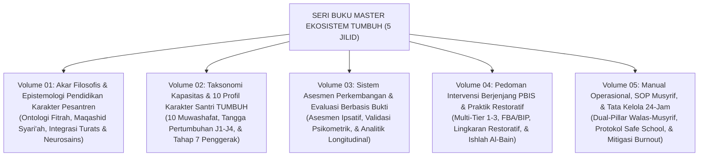

# SERI BUKU MASTER EKOSISTEM TUMBUH PESANTREN
## *Monograf Riset Akademis, Sintesis Epistemologis, & Panduan Tata Kelola Pengasuhan 24-Jam (5 Jilid Komprehensif)*

**Nomor Koleksi**: `BOOK-SERIES/MASTER-SET/2026/08`  
**Dewan Editor**: Dewan Keilmuan Ekosistem TUMBUH (24 Bidang Kepakaran)  
**Klasifikasi**: Seri Buku Monograf Akademis & Buku Teks Standar Pembinaan Karakter Pesantren  
**Repositori**: Ekosistem **TUMBUH** Pesantren

---

## 📖 PENGANTAR UMUM SERI BUKU

Seri Buku **Ekosistem TUMBUH Pesantren** adalah karya rujukan ilmiah-praktis lima jilid (5 Volumes) yang dirancang untuk mentransformasi ekosistem pendidikan pesantren tradisional dan modern menuju standar keunggulan peradaban berbasis bukti (*evidence-based adab education*). 

Seri ini memadukan kedalaman khazanah **Turats Islam** (*Ta'dib, Tazkiyatun Nafs, Qudwah Hasanah*) dengan konsensus **Sains Perilaku dan Neurosains Perkembangan Modern** (*SW-PBIS Multi-Tier, CASEL SEL, Self-Determination Theory, & Whole-School Restorative Justice*), dengan mengedepankan prinsip **Anti-Kekerasan Mutlak** (*Zero Physical & Emotional Violence*) dan **Triad Pertumbuhan Simbiotik** (Santri, Pendidik/Musyrif, dan Sistem Lembaga bertumbuh serempak).

---

## 🏛️ SITEMAP & NAVIGASI 5 JILID MONOGRAF UTAMA

---

## 📚 DESKRIPSI & SPESIFIKASI JILID

| Volume | Judul Monograf & Fokus Kajian | Domain Terkait | Berkas Utama |
| :---: | :--- | :--- | :---: |
| **VOL 01** | **Akar Filosofis & Epistemologi Pendidikan Karakter Pesantren** Membedah ontologi fitrah, epistemologi integratif Turats-Sains, 10 postulat filosofis, dan kritik atas feodalisme pendidikan. | `01 Philosophy` `02 Principles` | [Buka Volume 01](file:///c:/xampp/htdocs/tumbuh/BOOK-SERIES/Volume-01/Buku-Volume-01-Akar-Filosofis-dan-Epistemologi-TUMBUH.md) |
| **VOL 02** | **Taksonomi Kapasitas & 10 Profil Karakter Santri TUMBUH** Menguraikan 10 Muwashafat Adab, arsitektur kapasitas holistik, trajektori biososial-spiritual, dan progresi Jenjang J1–J4. | `03 Capacity` `04 Progression` | [Buka Volume 02](file:///c:/xampp/htdocs/tumbuh/BOOK-SERIES/Volume-02/Buku-Volume-02-Taksonomi-Kapasitas-dan-10-Profil-Karakter.md) |
| **VOL 03** | **Sistem Asesmen Perkembangan & Evaluasi Berbasis Bukti** Menjabarkan asesmen ipsatif non-ranking, instrumen psikometri tervalidasi, rater calibration, dan analitik pertumbuhan multi-sumber. | `05 Assessment` `SIMULASI` | [Buka Volume 03](file:///c:/xampp/htdocs/tumbuh/BOOK-SERIES/Volume-03/Buku-Volume-03-Sistem-Asesmen-Perkembangan-dan-Evaluasi.md) |
| **VOL 04** | **Pedoman Intervensi Berjenjang PBIS & Praktik Restoratif di Asrama** Protokol komprehensif PBIS Tier 1 (Universal), Tier 2 (Targeted/CICO), Tier 3 (Intensif/FBA), dan mediasi nirkekerasan Ishlah al-Bain. | `06 Intervention` `08 Integrated` | [Buka Volume 04](file:///c:/xampp/htdocs/tumbuh/BOOK-SERIES/Volume-04/Buku-Volume-04-Pedoman-Intervensi-PBIS-dan-Praktik-Restoratif.md) |
| **VOL 05** | **Manual Operasional, SOP Musyrif, dan Tata Kelola Pesantren Modern** Standard Operating Procedure 24-jam pengasuhan asrama & madrasah, dual-pillar handover, perlindungan anak, dan mitigasi kelelahan kerja. | `07 Implementation` `09 Programs` `10 Methods` `11 Tools` | [Buka Volume 05](file:///c:/xampp/htdocs/tumbuh/BOOK-SERIES/Volume-05/Buku-Volume-05-Manual-Operasional-SOP-dan-Tata-Kelola-Pesantren.md) |

---

## 🎯 KELOMPOK PENGGUNA SASARAN
1. **Pimpinan Pondok & Pengasuh Pesantren (Kiai/Nyai)**: Sebagai buku panduan arah kebijakan strategis (*Master Strategic Policy Guide*).
2. **Direktur Pengasuhan, Kepala Madrasah, & Walas**: Sebagai acuan integrasi kurikuler adab formal dan pembinaan asrama.
3. **Musyrif, Asatidz, & Guru BK**: Sebagai buku pegangan teknis intervensi harian (*Daily Practical Field Manual*).
4. **Peneliti, Akademisi Pendidikan Islam, & Pengambil Kebijakan (Kemenag)**: Sebagai model riset diseminasi pembaharuan tata kelola pesantren nusantara.
