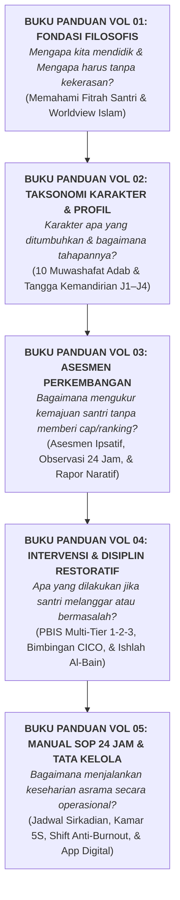

# SERI BUKU PANDUAN PRAKTIS EKOSISTEM TUMBUH PESANTREN
## *Pedoman Operasional, Filosofi Pengasuhan, & Panduan Tata Kelola 24-Jam (5 Jilid Buku Panduan Lapangan)*

---

**Nomor Koleksi**: `BOOK-SERIES/PANDUAN-SET/2026`  
**Dewan Editor**: Dewan Keilmuan & Pengasuhan Ekosistem TUMBUH  
**Klasifikasi**: Seri Buku Panduan Praktis & Pedoman Operasional Pembinaan Karakter Pesantren  
**Buku Induk Orientasi**: 🧭 **[PANDUAN INDUK: MENGENAL SISTEM TUMBUH DARI HULU KE HILIR](file:///c:/xampp/htdocs/tumbuh/BOOK-SERIES/PANDUAN-INDUK-EKOSISTEM-TUMBUH-DARI-HULU-KE-HILIR.md)**  

---

## 🌟 APA ITU SISTEM TUMBUH & MENGAPA IA LAHIR?

**Sistem TUMBUH** lahir sebagai jawaban atas kegelisahan para kiai, asatidz, dan wali santri terhadap metode pengasuhan pesantren yang masih mengandalkan hukuman fisik, bentakan, atau ronda malam ekstrem yang membuat santri tertekan dan musyrif kelelahan mental (*burnout*).

Sistem TUMBUH adalah **panduan pengasuhan karakter 24 jam** yang memadukan keluhuran **Turats Islam** (*Ta'dib, Qudwah Hasanah, Tazkiyatun Nafs*) dengan **Sains Perkembangan Anak Modern** (*SW-PBIS Multi-Tier, Neurosains Remaja, Keadilan Restoratif*).

### Makna Singkatan TUMBUH:
* **T** - *Tarbiyah Ruhiyyah*: Pengokohan akidah dan ibadah sejak dini.
* **U** - *Ukhuwah & Adab*: Saling menghargai tanpa kekerasan dan feodalisme.
* **M** - *Mutawaazin*: Keseimbangan antara zikir, pikir, fisik, dan tidur sehat (7 jam).
* **B** - *Barakah & Khidmah*: Pengabdian sukarela bagi umat.
* **U** - *Unggul & Mandiri*: Pengaturan diri (*Self-Regulation*) yang kokoh.
* **H** - *Hasanah (Qudwah)*: Menjadi teladan kebaikan nyata di masyarakat.

---

## 🗺️ PETA PERJALANAN 5 BUKU PANDUAN (DARI HULU KE HILIR)

Bagaimana 5 Buku Panduan ini membimbing pembaca langkah demi langkah dari awal sampai ujung?

---

## 📚 DAFTAR LENGKAP 5 JILID BUKU PANDUAN MASTER

| Jilid Panduan | Judul Resmi & Pertanyaan Kunci yang Dijawab | Peruntukan Pembaca | Tautan Berkas |
| :---: | :--- | :--- | :---: |
| **VOL 01** | **Akar Filosofis & Fondasi Nilai Pembinaan Karakter** *"Mengapa kita harus mengubah pola asuh punitif menuju keteladanan?"* | Kiai, Pimpinan Pondok, & Seluruh Asatidz | [Buka Buku Panduan Vol 01](file:///c:/xampp/htdocs/tumbuh/BOOK-SERIES/Volume-01/Buku-Volume-01-Akar-Filosofis-dan-Epistemologi-Pendidikan-Karakter-Pesantren.md) |
| **VOL 02** | **Taksonomi Karakter & Pembiasaan 10 Muwashafat Santri** *"Karakter apa yang dibentuk dan bagaimana tahapan kemandiriannya?"* | Wali Kelas, Musyrif Kamar, & Guru Adab | [Buka Buku Panduan Vol 02](file:///c:/xampp/htdocs/tumbuh/BOOK-SERIES/Volume-02/Buku-Volume-02-Taksonomi-Kapasitas-dan-10-Profil-Karakter-Santri-TUMBUH.md) |
| **VOL 03** | **Asesmen Perkembangan Karakter & Evaluasi Berbasis Bukti** *"Bagaimana cara menilai adab santri secara adil dan objektif?"* | Tim Asesmen, Musyrif, & Wali Kelas | [Buka Buku Panduan Vol 03](file:///c:/xampp/htdocs/tumbuh/BOOK-SERIES/Volume-03/Buku-Volume-03-Sistem-Asesmen-Perkembangan-dan-Evaluasi-Berbasis-Bukti.md) |
| **VOL 04** | **Intervensi Berjenjang PBIS & Disiplin Restoratif di Asrama** *"Bagaimana membimbing santri bermasalah dan memulihkan konflik?"* | Musyrif, Guru BK, & Tim Disiplin Pondok | [Buka Buku Panduan Vol 04](file:///c:/xampp/htdocs/tumbuh/BOOK-SERIES/Volume-04/Buku-Volume-04-Pedoman-Intervensi-Berjenjang-PBIS-dan-Praktik-Restoratif-di-Asrama.md) |
| **VOL 05** | **Manual Operasional, Standar SOP Musyrif, & Tata Kelola Asrama** *"Bagaimana jadwal teknis 24 jam dan SOP kerja musyrif di lapangan?"* | Musyrif Asrama, Staf Sanitasi, & Manajemen | [Buka Buku Panduan Vol 05](file:///c:/xampp/htdocs/tumbuh/BOOK-SERIES/Volume-05/Buku-Volume-05-Manual-Operasional-SOP-Musyrif-dan-Tata-Kelola-Pesantren-Modern.md) |

---

## 🧭 BAGAIMANA CARA MEMULAI?
1. **Baca Panduan Pengantar**: Mulailah dari **[PANDUAN INDUK: DARI HULU KE HILIR](file:///c:/xampp/htdocs/tumbuh/BOOK-SERIES/PANDUAN-INDUK-EKOSISTEM-TUMBUH-DARI-HULU-KE-HILIR.md)** untuk gambaran menyeluruh dalam 10 menit.
2. **Pahami Fondasi (Vol 1)**: Selaraskan hati dan cara pandang seluruh pengasuh pondok.
3. **Praktikkan SOP Harian (Vol 5 & Vol 2)**: Terapkan jadwal tidur sehat, kamar 5S, dan pembiasaan 10 Muwashafat.
4. **Jalankan Asesmen & Restoratif (Vol 3 & Vol 4)**: Pantau kemajuan santri dengan logbook dan selesaikan masalah dengan dialog damai (*Ishlah*).
