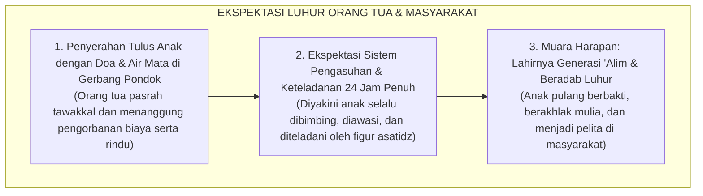
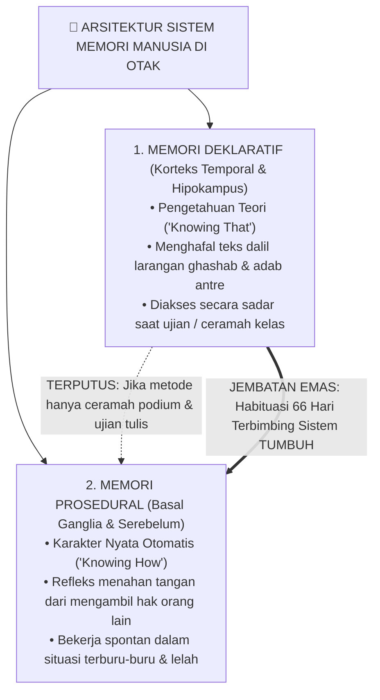
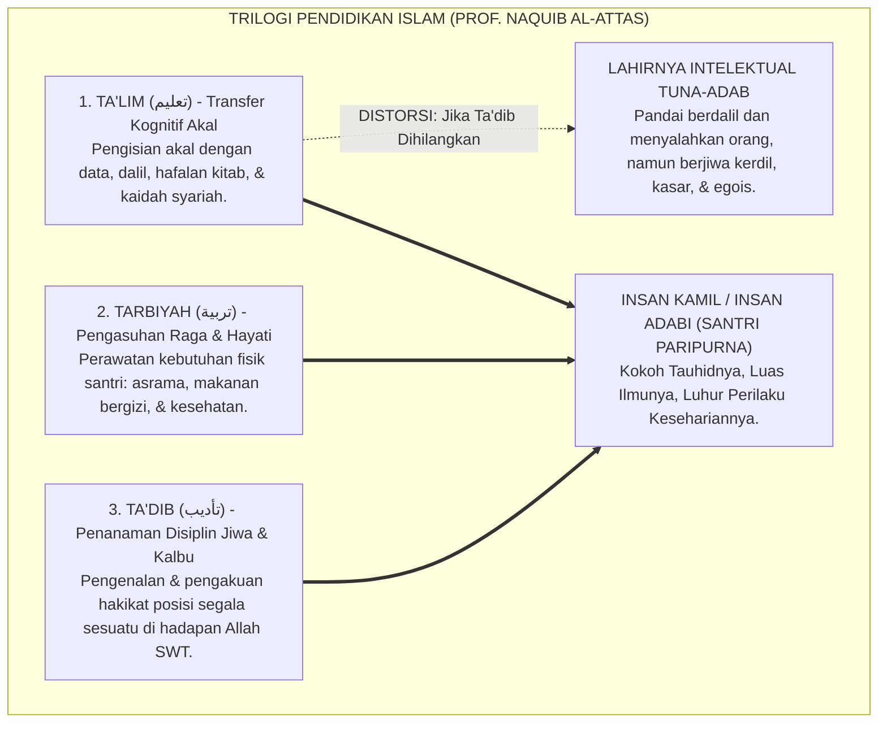
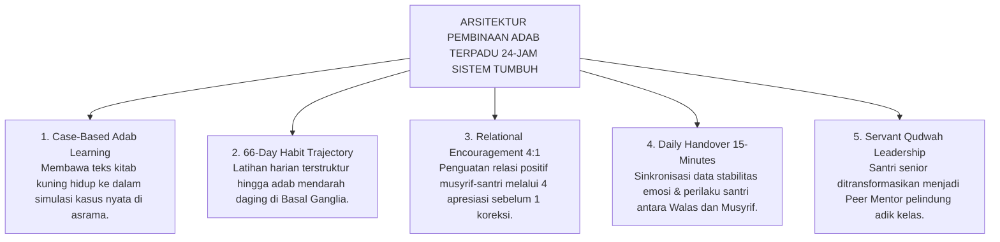

# SUB-BAB 1.1: ANOMALI PENDIDIKAN KARAKTER TRADISIONAL
## *Menyingkap Tabir Jurang Pemisah antara Hafalan Kitab Adab dan Realitas Perilaku Keseharian di Asrama*

**Kode Klasifikasi**: `BOOK-01/BAB-01/SUB-01/MONOGRAF-MASTER-CLARITY`  
**Disiplin Ilmu**: Fenomenologi Pendidikan Islam, Neurosains Kognitif Terapan, Sosiologi Pesantren, & Epistemologi Turats  
**Penanggung Jawab Keilmuan**: Dewan Pakar Ekosistem TUMBUH (*Master Author, Pakar Filosofi, Epistemologi Turats, & Neurosains Perkembangan*)

---

### I. Pintu Masuk: Air Mata di Balik Gerbang dan Tabir Paradoks Pesantren

Setiap awal tahun ajaran baru, sebuah pemandangan yang amat menyentuh kalbu selalu berulang di pelataran pondok-pondok pesantren di seluruh penjuru Nusantara. 

Ribuan orang tua berdiri dengan mata berkaca-kaca di bawah terik matahari atau gerimis senja, memeluk erat putra-putri tercinta mereka sebelum melangkah pulang. Tangan-tangan seorang ayah yang kasar karena kerja keras memegang pundak anak lelakinya seraya berbisik penuh harap: *"Belajarlah yang sungguh-sungguh di sini, Nak. Jadilah orang yang alim, mandiri, dan berakhlak mulia."* Sementara seorang ibu, dengan suara bergetar menahan tangis perpisahan, menyerahkan buah hatinya kepada kiai dan dewan pengasuh dengan satu keyakinan teguh: di balik gerbang suci pesantren, anaknya akan dijaga, dibimbing, dan ditempa menjadi pribadi yang santun, jujur, berjiwa bersih, serta menghiasi diri dengan kemuliaan akhlak nabawi.

Masyarakat menaruh harapan yang teramat tinggi pada institusi pesantren. Dinding-dinding asrama dipandang sebagai benteng pertahanan spiritual terakhir (*the last bastion of moral civilization*) yang mampu melindungi generasi muda dari arus deras dekadensi moral zaman modern. Di pesantrenlah orang tua meyakini anak-anak mereka akan belajar hidup teratur, menghargai sesama, dan mempraktikkan sunnah Rasulullah SAW dalam setiap tarikan napas selama 24 jam penuh.

<b>Gambar 1.1.1:</b> Rantai Ekspektasi Luhur Orang Tua saat Menyerahkan Anak ke Pondok Pesantren.

Bagan di atas menggambarkan **tiga mata rantai psikososial dan spiritual** yang menjadi landasan berdirinya institusi pesantren di mata masyarakat:

* **Kotak 1 (Penyerahan Tulus dengan Pengorbanan Total)**: Orang tua menyerahkan amanah terbesar dalam hidup mereka—anak kandung mereka—dengan keyakinan penuh bahwa lingkungan pondok adalah tempat terbaik untuk menyucikan jiwa anak.
* **Kotak 2 (Ekspektasi Pengasuhan 24 Jam)**: Publik meyakini bahwa pesantren adalah institusi total (*total institution*) di mana setiap detik waktu anak—mulai dari bangun tidur, makan, belajar di kelas madrasah, shalat berjamaah, hingga tidur kembali di ranjang asrama—selalu berada dalam radar pengasuhan dan keteladanan (*Qudwah Hasanah*) para pembina dewasa.
* **Kotak 3 (Muara Harapan Umat)**: Tujuan akhirnya sangat murni: mencetak generasi santri yang tidak hanya pintar membaca kitab kuning di atas kertas, tetapi memiliki integritas moral yang mendarah daging dalam pergaulan nyata.

---

Namun, tatkala masa orientasi santri baru usai dan tirai keseharian pondok dibuka apa adanya—bukan saat acara wisuda akbar yang megah atau kunjungan wali santri di akhir pekan, melainkan pada pukul dua dini hari di lorong-lorong asrama yang sunyi, di depan antrean kamar mandi yang sesak pada waktu subuh, atau di balik pintu-pintu bilik kamar santri yang tertutup rapat—kita kerap kali menjumpai sebuah kenyataan lapangan yang menghentak nurani:

> [!WARNING]
> ### 🔍 Potret Anomali Lapangan yang Menghentak Nurani:
> Di ruang kelas madrasah pada pagi hari, seorang santri mampu melantunkan bait-bait nadhom *Ta'lim al-Muta'allim* dengan sangat fasih, menghafal matan *Bidayatul Hidayah* karya Imam Al-Ghazali di luar kepala, dan meraih predikat nilai tertinggi (*Mumtaz*) dalam ujian tulis mata pelajaran adab.
> 
> Namun, hanya berselang beberapa menit setelah bel tanda usai pelajaran berbunyi, santri yang sama menampilkan pemandangan yang bertolak belakang di asrama:
> * Ia berlari kencang menyerobot antrean wudhu sambil menyikut kawannya yang bertubuh lebih kecil demi mendapatkan kran air terlebih dahulu.
> * Sepasang sandal milik teman sekamarnya dipakai tanpa izin (*ghashab*) untuk pergi ke kantin atau masjid, dan dibiarkan berserakan begitu saja saat selesai digunakan.
> * Gayung mandi disembunyikan di atas plafon kamar mandi atau di kolong lemari agar tidak bisa digunakan santri lain.
> * Pakaian kotor dibiarkan menumpuk berhari-hari di pojok kasur hingga menebarkan aroma tak sedap dan mengundang penyakit.
> * Di dalam bilik asrama pada malam hari, terdengar ejekan tajam yang merendahkan fisik temannya (*body shaming*), panggilan nama-nama hewan, hingga pengucilan sosial yang membuat santri yunior menangis tertekan di bawah selimutnya tanpa ada musyrif yang mendampingi.

<b>Gambar 1.1.2:</b> Diagram Jurang Pemisah antara Pembelajaran Kelas Madrasah dan Realitas Keseharian Asrama.

Memperhatikan kontras tajam pada diagram di atas, kita dapat membedah **tiga titik kritis masalah sistemik** dalam pesantren konvensional:

1. **Kutub Madrasah (Pukul 07.00 – 15.00 WIB)**:  
   Pada 8 jam ini, pendidikan berjalan sangat formal di ruang kelas. Santri duduk rapi, mendengarkan ceramah ustadz, dan menghafal matan kitab kuning. Evaluasi keberhasilan karakter dinilai semata-mata dari nilai angka di lembar ujian kertas (*Paper-and-Pencil Test*). Santri yang meraih nilai 100 langsung diberi label santri saleh, meskipun perilakunya di luar kelas belum pernah diobservasi secara sistematis.
2. **Kutub Asrama dan Keseharian (Pukul 15.00 – 07.00 WIB)**:  
   Mencakup 16 jam kehidupan santri (dua pertiga dari harinya). Di sinilah panggung kehidupan yang sesungguhnya berlangsung: saat santri lelah, lapar, harus berbagi kamar mandi, berebut kran wudhu, menata loker pakaian, dan berinteraksi di kamar tidur. Pada rentang waktu inilah dorongan egoisme, nafsu amarah, dan watak hewani anak diuji secara nyata. Sayangnya, pada 16 jam krusial ini, pendampingan pembina dewasa (*musyrif*) sering kali sangat minim atau bahkan kosong sama sekali.
3. **Mata Rantai yang Terputus (*Jurang Diskoneksi*)**:  
   Jurang pemisah di tengah bagan menunjukkan bahwa **tidak ada jembatan sistemik yang menghubungkan apa yang dipelajari santri di madrasah dengan apa yang ia lakukan di asrama**. Ilmu adab berhenti sebagai hafalan di kepala, tidak pernah dibimbing menjadi kebiasaan refleks motorik di tangan dan kaki santri saat berada di kamar asrama mereka.

---

### II. Menelusuri Akar Masalah: Mengapa Hafalan Teks Tidak Otomatis Menjadi Akhlak?

Untuk menjawab teka-teki besar di atas, kita tidak boleh tergesa-gesa menyalahkan santri dengan memberi cap "anak nakal", "bebal", atau "berwatak buruk". Jika sebuah anomali terjadi secara massal di puluhan lembaga, maka masalahnya bukan terletak pada individu santri, melainkan pada **kesalahan metodologis sistemik** dalam cara kita mendidik mereka.

Sains modern di bidang neurokognitif dan psikologi memori (merujuk pada riset fundamental Larry Squire[^1], John Anderson[^2], serta teori pemrosesan ganda Daniel Kahneman[^3]) memberikan penjelasan ilmiah yang sangat terang benderang mengapa hafalan dalil tidak dengan sendirinya melahirkan karakter adab. Otak manusia ternyata tidak menyimpan seluruh pengetahuan pada satu laci yang sama, melainkan membaginya ke dalam **dua sistem sirkuit saraf yang terpisah jauh secara anatomis**:

<b>Gambar 1.1.3:</b> Arsitektur Sistem Memori di Otak: Memori Deklaratif (Teori) vs Memori Prosedural (Praktik Refleks).

Dari pemetaan arsitektur memori di atas, terungkaplah rahasia biologis mengapa metode pengajaran adab konvensional kerap mengalami kegagalan fatal:

#### 1. Memori Deklaratif (*Declarative Memory* / *Knowing That*)
Memori deklaratif adalah sistem penyimpanan informasi yang diproses melalui *hipokampus* dan disimpan di lapisan luar otak (*neokorteks*, khususnya korteks temporal). Memori ini bertanggung jawab menyimpan fakta verbal, definisi hukum syariat, teks ayat Al-Qur'an, matan hadits, dan kaidah fikih.

Ciri khas memori deklaratif adalah **bekerja secara sadar, lambat, dan membutuhkan fokus nalar (*System 2 / Controlled Processing*)**. Ketika seorang santri duduk tenang di ruang kelas madrasah dan ditanya oleh gurunya: *"Sebutkan hukum memakai sandal kawan tanpa izin!"*, hipokampusnya akan mengais data hafalan dan mulutnya akan menjawab dengan lancar: *"Hukumnya haram, dan ghashab adalah perbuatan zalim."*

Namun, kelemahan biologis dari memori deklaratif adalah: **ia tidak memiliki koneksi saraf langsung ke otot penggerak tindakan spontan**. Tatkala santri sedang berada dalam situasi terburu-buru, mengalami kelelahan fisik setelah seharian belajar, atau dilanda dorongan emosi mendesak, sirkuit nalar sadar di neokorteks mengalami perlambatan (*cognitive overload*). Akibatnya, hafalan dalil yang tersimpan rapi di kepala tidak sempat dipanggil untuk mengendalikan gerak tangan dan kakinya.

#### 2. Memori Prosedural (*Procedural Memory* / *Knowing How*)
Sebaliknya, memori prosedural tersimpan di dalam sirkuit saraf bawah sadar (*subcortical network*), terutama di jaringan *Basal Ganglia*, *Striatum*, dan *Serebelum*. Di sinilah tempat bersemayamnya **karakter sejati, keterampilan kinestetik, dan kebiasaan refleks otomatis (*automatic habits*)**.

Memori prosedural bekerja dengan kecepatan kilat tanpa perlu berpikir panjang (*System 1 / Automatic Processing*). Memori ini tidak terbentuk lewat ceramah di atas podium atau membaca buku di meja belajar, melainkan **hanya bisa terbangun melalui latihan fisik nyata yang diulang-ulang secara konsisten dalam situasi keseharian**.

Manifestasi nyata dari memori prosedural yang telah matang adalah:
* Seorang santri yang sedang panik karena bangun terlambat saat adzan subuh telah berkumandang, secara refleks menahan kakinya saat melihat sandal temannya di depan pintu kamar, dan tetap tenang mencari sandalnya sendiri di rak tanpa tergoda untuk *ghashab*.
* Seorang santri yang melihat sampah berserakan di teras asrama secara spontan membungkuk memungutnya dan membuangnya ke tempat sampah, tanpa menunggu perintah musyrif dan tanpa mempedulikan apakah ada orang yang melihatnya.

> [!IMPORTANT]
> ### 🚗 Analogi Belajar Menyetir Mobil: Menjembatani Teori Menuju Refleks Tindakan
> Bayangkan seseorang yang ingin mahir mengemudikan mobil di jalan raya. Ia membeli buku panduan berkendara setebal 1.000 halaman, menghafal seluruh fungsi pedal gas, rem, kopling, tuas transmisi, dan seluruh rambu lalu lintas hingga meraih nilai 100 (*sempurna*) dalam ujian tulis.
> 
> Apakah orang tersebut langsung bisa kita lepaskan menyetir mobil di jalan raya yang padat dan macet tanpa pernah berlatih praktik di balik kemudi? **Tentu saja tidak!** Tatkala ada kendaraan lain yang tiba-tiba memotong jalurnya secara mendadak, hafalan teori di lembar ujiannya tidak akan sanggup menyelamatkannya. Otak sadarnya (*PFC*) membutuhkan waktu sepersekian detik untuk mengingat teori, sementara kakinya belum memiliki memori refleks (*muscle memory*) untuk menginjak pedal rem dalam hitungan milidetik.
> 
> Hal yang persis sama terjadi dalam pendidikan adab santri: **Menghafal 100 hadits tentang keutamaan sabar, amanah, dan persaudaraan tidak akan pernah otomatis melahirkan santri yang berakhlak mulia, kecuali jika nilai-nilai hadits tersebut dilatihkan secara konsisten, dipraktikkan berulang kali, didampingi langsung oleh musyrif yang hangat, dan dibiasakan di dalam denyut kehidupan asrama 24 jam.**

---

### III. Tragedi Hilangnya Hakikat Ta'dib: Menengok Kritik Epistemologis Turats

Kesenjangan biologis antara "tahu teori" dan "terampil mempraktikkan" ini bermuara pada krisis yang lebih mendalam di ranah filosofis. Filsuf dan pemikir pendidikan Islam terkemuka, **Prof. Dr. Syed Muhammad Naquib al-Attas**[^4], telah mengingatkan bahwa akar kejatuhan peradaban umat Islam berawal dari **kerancuan konseptual (*confusion of concepts*)** dalam membedakan tiga pilar pendidikan Islam:

<b>Gambar 1.1.4:</b> Struktur Tiga Ranah Pendidikan Islam dan Dampak Kehancuran Karakter Akibat Hilangnya Pilar Ta'dib.

Melalui kerangka trilogi di atas, Al-Attas membedah integrasi tiga pilar pendidikan Islam dan bencana peradaban yang terjadi tatkala pilar Ta'dib diabaikan:

1. **Ta'lim (تعليم)**: Merupakan proses transfer ilmu pengetahuan, fakta, data, dan pemahaman konsep syariat ke dalam daya nalar akal (*al-Quwwah al-Aqliyyah*). Di pesantren, Ta'lim terwujud dalam kegiatan membaca kitab kuning (*sorogan/bandongan*), mendengarkan ceramah ustadz di kelas, dan mengerjakan lembar ujian madrasah.
2. **Tarbiyah (تربية)**: Berakar dari kata *rabaa-yarbuu* yang berarti menumbuhkan, merawat, dan memelihara. Ranah ini berfokus pada pemenuhan kebutuhan raga (*al-Jasad*) dan naluri emosional santri, seperti penyediaan asrama yang layak, makanan bergizi, waktu istirahat yang cukup, dan perlindungan kesehatan fisik.
3. **Ta'dib (تأديب)**: Berakar dari kata *aduba-ya'dubu* yang berarti beradab, santun, dan disiplin spiritual. Ta'dib adalah **jantung dari seluruh pendidikan Islam**, yaitu proses penanaman adab ke dalam jiwa dan kalbu (*al-Qalb war-Ruh*) agar seseorang mengenali dan mengakui posisi segala sesuatu secara tepat dan adil di hadapan Allah SWT dan sesama makhluk.

| Ranah Pembinaan | Sasaran Manusia | Fokus Aktivitas di Pondok | Tolak Ukur Evaluasi | Output Karakter yang Terbentuk |
| :--- | :--- | :--- | :--- | :--- |
| **Ta'lim (تعليم)** | Daya Nalar Akal | Membaca kitab, ceramah ustadz, hafalan bait nadhom. | Nilai ujian tulis, hafalan lisan, syahadah formal. | Santri berwawasan luas, faham teks, cakap berdalil. |
| **Tarbiyah (تربية)** | Raga & Naluri Hayati | Penyediaan asrama, makanan bergizi, sarana tidur. | Kebugaran fisik, berat badan, terpenuhinya fasilitas. | Santri sehat, bugar, terawat kebutuhan raganya. |
| **Ta'dib (تأديب)** | Kalbu & Jiwa Spiritual | Habituasi perilaku, teladan *qudwah*, muhasabah 24 jam. | Refleks empati, kejujuran saat sendiri, ketertiban asrama. | **Insan Adabi**: Santri yang refleks perilakunya selaras dengan ridha Allah. |

> [!CAUTION]
> ### ⚠️ Bahaya Mereduksi Ta'dib Menjadi Sekadar Ta'lim:
> Ketika sebuah pesantren mereduksi kurikulum karakternya menjadi sekadar pengajaran *Ta'lim* (hafalan teks kitab dan ujian kertas semata), maka pesantren tersebut tanpa sadar sedang memproduksi **"Intelektual Agama yang Tuna-Adab"**:  
> Yaitu sosok manusia yang lisannya sangat lincah mengutip ayat suci dan hadits nabawi untuk menghakimi kesalahan orang lain, namun kalbunya hampa dari empati, jemarinya ringan menzalimi hak kawan, perilakunya egois di ruang publik, dan tidak memiliki rasa malu (*al-Haya'*) tatkala melanggar kehormatan sesama saudaranya.

---

### IV. Dinamika Panggung Belakang: Mengapa Santri Menjadi Santun di Madrasah tapi Liar di Asrama?

Tatkala proses *Ta'dib* tidak hadir mendampingi kehidupan santri di luar jam pelajaran kelas, kekosongan tersebut segera diisi oleh fenomena sosiologis yang sangat berbahaya: **Kepribadian Terbelah (*Split Personality / Nifaq Amali*)**.

Sosiolog ternama **Erving Goffman** (1959)[^5] dalam mahakaryanya *The Presentation of Self in Everyday Life* menguraikan bahwa di dalam sebuah institusi tertutup (*total institution*), individu cenderung membelah kehidupannya menjadi dua panggung sosial yang saling bertolak belakang:

<b>Gambar 1.1.5:</b> Dinamika Dua Panggung (Dramaturgi Sosiologis) dalam Keseharian Santri Pesantren.

Dinamika sosiologis di atas membongkar mekanisme bagaimana institusi asrama yang minim pendampingan dewasa secara sistemik menciptakan watak kemunafikan perilaku (*nifaq amali*):

1. **Panggung Depan (*Front Stage*)**:  
   Di ruang kelas madrasah saat ustadz mengajar, di serambi masjid saat shalat berjamaah, atau di ruang tamu ndalem saat sowan ke kiai, santri berada di bawah **sorotan tatapan figur otoritas tinggi**. Santri secara otomatis mengaktifkan mekanisme manajemen kesan (*impression management*). Mereka mengenakan "topeng kesantunan buatan": menundukkan kepala, berbicara dengan intonasi halus, dan menampilkan kepatuhan pasif. Namun, kepatuhan ini bersifat rapuh dan ekstrinsik: motif utamanya bukanlah kesadaran takwa kepada Allah, melainkan rasa takut dimarahi, keinginan menjaga gengsi sosial, atau demi mengamankan nilai kepribadian di raport.
2. **Panggung Belakang (*Back Stage*)**:  
   Di lorong asrama yang gelap, di bilik kamar tidur setelah jam malam, atau di antrean kamar mandi yang padat, figur otoritas dewasa tidak hadir mendampingi. Di ruang hampa inilah **topeng kesantunan dilepas secara serentak**. Santri mengekspresikan dorongan primitif yang selama ini tertekan: mereka saling merebut fasilitas, memakai barang teman tanpa izin (*ghashab*), melontarkan makian kotor, dan santri senior mulai memperbudak adik kelasnya.
3. **Kesenjangan Integritas (*Hypocrisy Loop*)**:  
   Panah bolak-balik di antara kedua panggung menggambarkan **lingkaran setan kemunafikan karakter**. Santri yang terbiasa hidup dalam dua standar ganda ini perlahan-lahan kehilangan integritas batin (*bashirah*). Mereka terbiasa menjadi manusia bertopeng: sangat alim dan santun tatkala ada yang mengawasi, namun berani berbuat zalim dan curang tatkala merasa tidak ada orang yang melihatnya.

---

### V. Wasiat Turats: Memadukan Ilmu dengan Amal Nyata

Kritik terhadap ilmu yang mandul dan hafalan yang tidak berbuah amal perbuatan ini sesungguhnya telah disuarakan dengan lantang oleh para ulama agung peradaban Islam sejak berabad-abad silam:

> [!NOTE]
> ### 📜 Peringatan Hujjatul Islam Imam Abu Hamid Al-Ghazali dalam *Ayyuhal Walad*:[^7]
> 
> $$\text{أَيُّهَا الْوَلَدُ، الْعِلْمُ بِلَا عَمَلٍ جُنُونٌ، وَالْعَمَلُ بِغَيْرِ عِلْمٍ لَا يَكُونُ. وَاعْلَمْ أَنَّ عِلْمًا لَا يُبْعِدُكَ الْيَوْمَ عَنِ الْمَعَاصِي، وَلَا يَحْمِلُكَ عَلَى الطَّاعَةِ، لَنْ يُبْعِدَكَ غَدًا عَنْ نَارِ جَهَنَّمَ}$$
> 
> **Artinya:**  
> *"Wahai anakku tercinta! Ilmu yang tidak diiringi dengan amal perbuatan nyata adalah suatu kegilaan, dan amal yang dilakukan tanpa landasan ilmu adalah kesia-siaan. Ketahuilah, sesungguhnya ilmu yang tidak mampu menjauhkan dirimu dari maksiat hari ini dan tidak mendorongmu untuk taat beribadah, niscaya ia tidak akan pernah mampu menyelamatkanmu dari jilatan api neraka di hari esok!"*

> [!NOTE]
> ### 📜 Pesan Hadhratusy Syaikh KH. M. Hasyim Asy'ari dalam *Adab al-'Alim wal Muta'allim*:[^8]
> 
> $$\text{قَالَ بَعْضُ السَّلَفِ: الْأَدَبُ فِي الْعَمَلِ عَلَامَةُ قَبُولِ الْعَمَلِ. وَقَالَ ابْنُ الْمُبَارَكِ: طَلَبْتُ الْأَدَبَ ثَلَاثِينَ سَنَةً، وَطَلَبْتُ الْعِلْمَ عِشْرِينَ سَنَةً، وَكَانُوا يَطْلُبُونَ الْأَدَبَ قَبْلَ الْعِلْمِ}$$
> 
> **Artinya:**  
> *"Ulama salaf menegaskan: 'Keberadaan adab di dalam suatu amal perbuatan adalah tanda diterimanya amal tersebut di sisi Allah.' Abdullah bin al-Mubarak menyatakan: 'Aku mendalami adab selama tiga puluh tahun, dan aku mempelajari ilmu syariat selama dua puluh tahun; dan sungguh para ulama terdahulu senantiasa menuntut adab terlebih dahulu sebelum mereka mulai menuntut ilmu.'"*

Seluruh mutiara Turats di atas menegaskan satu kebenaran yang tak terbantahkan: **Tolak ukur kemuliaan sebuah pesantren bukanlah dihitung dari berapa tebal kitab yang dikhatamkan santri, melainkan seberapa dalam nilai-nilai adab tersebut menjelma menjadi gerak refleks nyata saat santri makan, tidur, berbicara, dan memperlakukan sesama saudaranya.**

---

### VI. Solusi Sistemik TUMBUH: Meruntuhkan Sekat Madrasah dan Asrama 24-Jam

Menjawab kegagalan metodologis dan fenomena kepribadian terbelah di atas, **Sistem TUMBUH** merekayasa arsitektur pembinaan adab terpadu yang menghubungkan ruang kelas madrasah dan bilik asrama ke dalam **Satu Siklus Pengasuhan Simbiotik 24-Jam**:

<b>Gambar 1.1.6:</b> Lima Pilar Arsitektur Pembinaan Adab Terpadu 24-Jam Ekosistem TUMBUH.

Arsitektur sistemik di atas merekonstruksi seluruh ekosistem pesantren melalui lima pilar operasional:

1. **Case-Based Adab Learning (Pembelajaran Adab Berbasis Kasus Asrama)**:  
   Mengubah pengajaran adab di kelas madrasah dari sekadar memaknai teks secara pasif (*makna gandul*) menjadi diskusi dilema moral dan simulasi fisik nyata. Asatidz menyajikan skenario: *"Bagaimana adab antum saat sandal tertukar di subuh hari tanpa tergoda ghashab?"* Santri diajak memperagakan intonasi meminjam barang yang santun dan merapikan rak sandal, melatih memori kinestetik gerak tubuh.
2. **66-Day Habit Trajectory (Trajektori Habituasi 66 Hari)**:  
   Menerapkan peta jalan neuroplastisitas 66 hari: **Fase 1 (Inisiasi Hari 1–21)** di mana musyrif mendampingi 100% di titik transisi; **Fase 2 (Internalisasi Hari 22–45)** melalui sistem pasangan *Peer Buddy*; dan **Fase 3 (Otomatisasi Hari 46–66)** di mana adab telah berjalan otomatis atas dorongan kesadaran batin (*Muraqabatullah*).
3. **Relational Encouragement 4:1 (Rasio Apresiasi Positif 4:1)**:  
   Menghapus budaya bentakan dengan mewajibkan musyrif memberikan 4 apresiasi tulus atas usaha kebaikan santri sebelum melayangkan 1 teguran terarah (*Firm & Kind*).
4. **Daily Handover 15-Minutes (Protokol Serah-Terima Harian 15 Menit)**:  
   Menghubungkan Wali Kelas di sekolah dan Musyrif di asrama melalui pertukaran data dua arah via *Logbook PBIS* setiap pagi (06.45 WIB) dan sore (16.00 WIB), memastikan setiap santri yang lelah atau mengalami konflik kamar langsung tertangani secara terpadu.
5. **Servant Qudwah Leadership (Transformasi Kepemimpinan Santri)**:  
   Mencabut 100% wewenang menghukum fisik dari tangan santri senior dan mengubah perannya menjadi teladan (*Qudwah Hasanah*) dan kakak asuh (*Peer Mentors*) yang melindungi, membimbing, dan melayani adik kelasnya.

---

### VII. Sintesis Epistemologis Sub-Bab 1.1

Melalui rekonstruksi sistemik di atas, Sistem TUMBUH membuktikan bahwa **kegagalan pembentukan karakter di pesantren konvensional bukanlah karena kelemahan teks kitab adab, melainkan karena ketiadaan jembatan metodologis antara ruang kelas dan kamar tidur santri**. 

Dengan menyatukan Ta'lim di madrasah, Tarbiyah di asrama, dan Ta'dib dalam denyut kehidupan 24 jam, Sistem TUMBUH mengembalikan pesantren ke fungsi asasinya: rahim peradaban yang melahirkan santri berilmu luas, berjiwa bersih, dan luhur adab perilakunya di hadapan Allah dan manusia.

---

## 📌 Catatan Kaki & Rujukan Primer

[^1]: **Larry R. Squire**, "Memory systems of the brain: A brief history and current perspective", *Neurobiology of Learning and Memory*, Vol. 82, No. 3 (2004), hlm. 171–177; serta **Larry R. Squire & Eric R. Kandel**, *Memory: From Mind to Molecules* (New York: Scientific American Library, 1999).
[^2]: **John R. Anderson**, *The Architecture of Cognition* (Cambridge: Harvard University Press, 1983); serta *Rules of the Mind* (Hillsdale: Lawrence Erlbaum Associates, 1993).
[^3]: **Daniel Kahneman**, *Thinking, Fast and Slow* (New York: Farrar, Straus and Giroux, 2011), Bab 1: "Two Systems", hlm. 19–30.
[^4]: **Prof. Dr. Syed Muhammad Naquib al-Attas**, *The Concept of Education in Islam: A Framework for an Islamic Philosophy of Education* (Kuala Lumpur: International Institute of Islamic Thought and Civilization / ISTAC, 1980), hlm. 15–35; serta *Aims and Objectives of Islamic Education* (Jeddah: King Abdulaziz University, 1979).
[^5]: **Erving Goffman**, *The Presentation of Self in Everyday Life* (New York: Anchor Books / Doubleday, 1959), Bab III: "Regions and Region Behavior", hlm. 106–140.
[^6]: **B. Bradford Brown & Jim Larson**, "Peer relationships in adolescence", dalam R. M. Lerner & L. Steinberg (Eds.), *Handbook of Adolescent Psychology: Contextual Influences on Adolescent Development* (Hoboken: John Wiley & Sons, 2009), Vol. 2, hlm. 74–103.
[^7]: **Hujjatul Islam Imam Abu Hamid al-Ghazali**, *Ayyuhal Walad fi Nashihat at-Talamidz*, Tahqiq: Dr. Ahmad Ahmad Badawi (Kairo: Dar al-Qalam, 1986), hlm. 12–15.
[^8]: **Hadhratusy Syaikh KH. M. Hasyim Asy'ari**, *Adab al-'Alim wal Muta'allim fi ma Yahtaju Ilayhi al-Muta'allim fi Ahwal Ta'allumihi wa ma Yatawaqqafu 'alayhi al-Mu'allim fi Maqamat Ta'limihi* (Jombang: Maktabah at-Turats al-Islami, 1415 H), hlm. 9–12.
