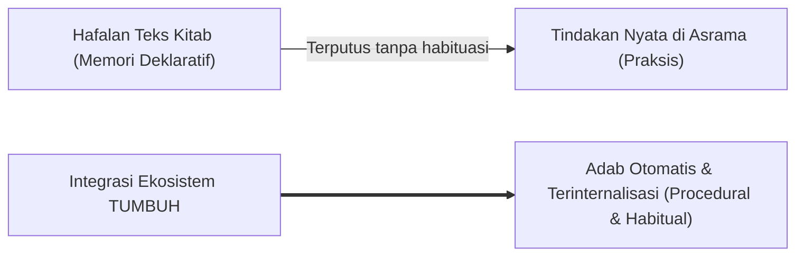

# SUB-BAB 1.1: ANOMALI PENDIDIKAN KARAKTER TRADISIONAL
## *Diskoneksi Struktural antara Penguasaan Teks Ritual dan Realisasi Adab dalam Kehidupan Asrama*

**Kode Modul**: `BOOK-01/BAB-01/SUB-01`  
**Kategori**: Analisis Kritis Patologi Pendidikan Pesantren  
**Fokus Keilmuan**: Psikologi Kognitif & Fenomenologi Pendidikan Pesantren

---

### 1. Hakikat Fenomena Diskoneksi Adab
Dalam lanskap pendidikan pesantren tradisional, kerap ditemukan paradoks yang memprihatinkan: seorang santri mampu menghafal bait-bait *Ta'lim al-Muta'allim* atau matan akhlak klasik dengan predikat *mumtaz* di dalam ruang kelas, namun di asrama ia menunjukkan perilaku tidak tertib, membuang sampah sembarangan, menyerobot antrean kamar mandi, atau berbicara kasar kepada teman sebaya.

Fenomena ini disebut sebagai **Diskoneksi Kognitif-Praksis (*Praxis-Cognition Disconnect*)**:
* Pengetahuan adab tersimpan hanya sebagai memori semantik verbal (*declarative knowledge*), bukan sebagai skema tindakan prosedural (*procedural moral schema*).
* Santri memandang teks kitab sebagai materi ujian kelulusan akademis, bukan sebagai panduan operasional hidup harian.

---

### 2. Akar Masalah: Didaktik Satu Arah & Ketiadaan Refleksi
Penyebab utama diskoneksi ini adalah metode pengajaran yang bersifat satu arah (*rote learning*):
1. **Minimnya Dialog & Kontekstualisasi**: Santri tidak diajak berdiskusi tentang bagaimana menerapkan konsep *tawadhu'* ketika berinteraksi di ruang makan asrama atau saat menghadapi perbedaan pendapat antarkamar.
2. **Ketiadaan Observasi Terpadu**: Ustadz pengajar di kelas tidak memiliki akses data perilaku santri di asrama, sehingga nilai rapor adab hanya didasarkan pada absensi kelas formal.
3. **Pemisahan Ruang**: Terjadinya dikotomi semu antara "dunia sekolah" (pagi–siang) dan "dunia asrama" (sore–malam).

---

### 3. Solusi Rekonstruktif Ekosistem TUMBUH
Ekosistem TUMBUH menjembatani jurang pemisah ini dengan menerapkan:
* **Halaqah Adab Kontekstual**: Pembelajaran adab berbasis studi kasus nyata di asrama (*situated learning*).
* **Dual-Pillar Handover**: Pertukaran catatan observasi harian antara wali kelas dan musyrif asrama melalui logbook terpadu.
* **Habituasi Terbimbing 24-Jam**: Setiap konsep adab langsung dipraktikkan dengan rasio penguatan positif 4:1.
