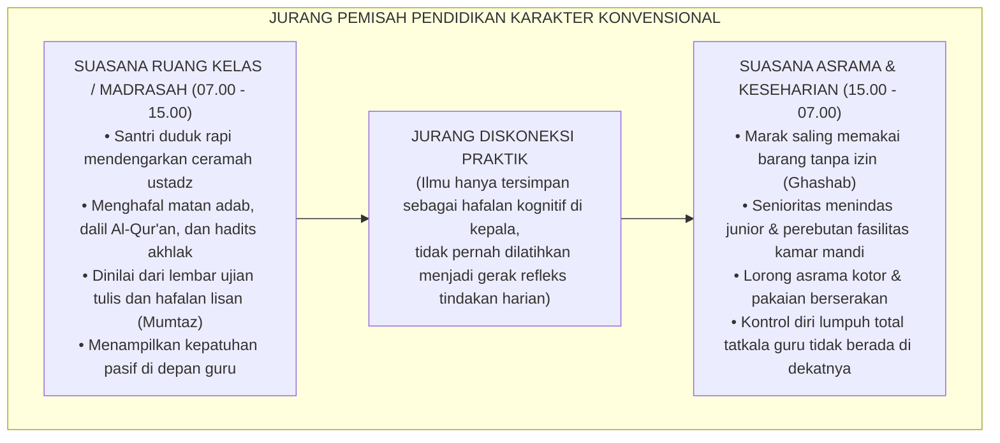
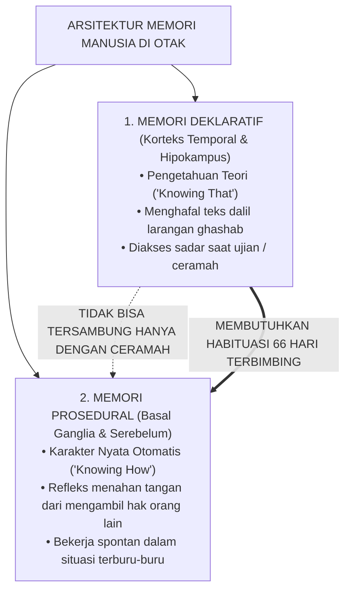
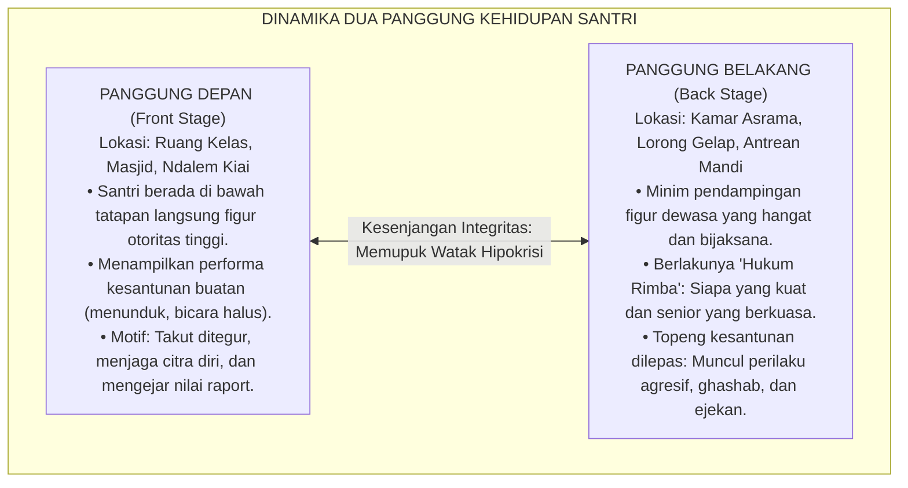
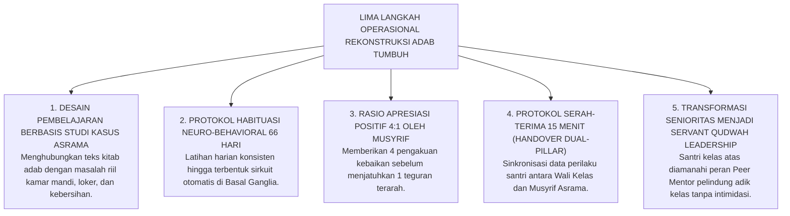

# SUB-BAB 1.1: ANOMALI PENDIDIKAN KARAKTER TRADISIONAL
## *Menyingkap Tabir Jurang Pemisah antara Hafalan Kitab Adab dan Realitas Perilaku Keseharian di Asrama*

**Kode Klasifikasi**: `BOOK-01/BAB-01/SUB-01/PANDUAN-INDUK`  
**Disiplin Ilmu**: Fenomenologi Pendidikan Islam, Sosiologi Pesantren, & Neurosains Kognitif Terapan  
**Penanggung Jawab Keilmuan**: Dewan Pakar Ekosistem TUMBUH (*Pakar Filosofi, Epistemologi Turats, & Psikologi Sosial Santri*)

---

### 1. Potret Nyata di Lapangan: Mengapa Santri Pintar Dalil Masih Gemar 'Ghashab'?

Di tengah kegelisahan zaman mengenai kemerosotan moral generasi muda, pesantren selalu dipandang sebagai benteng pertahanan terakhir (*the last bastion of moral civilization*) yang memelihara kemurnian akhlak. Para orang tua menitipkan buah hatinya ke pondok pesantren dengan sebuah keyakinan luhur: di balik dinding pesantren, anak-anak mereka akan dibimbing menjadi insan yang saleh, bertutur kata santun, berjiwa mandiri, dan berakhlak mulia.

Namun, jika kita berani masuk ke bilik-bilik asrama secara jujur, objektif, dan mengamati kehidupan santri selama 24 jam penuh tanpa rekayasa, kita kerap kali menemukan sebuah fenomena yang sangat ironis:

> [!WARNING]
> ### 🔍 Fenomena Anomali di Lapangan:
> Seorang santri mampu melantunkan bait-bait nadhom *Ta'lim al-Muta'allim* dengan irama yang merdu, menghafal kitab *Bidayatul Hidayah* karya Imam Al-Ghazali di luar kepala, serta memperoleh nilai tertinggi (*Mumtaz*) dalam ujian tulis mata pelajaran adab.
> 
> Akan tetapi, pemandangan yang bertolak belakang terjadi beberapa menit setelah bel tanda usai kelas berbunyi:
> * Santri yang sama berlari kencang menyerobot antrean wudhu dan mendorong temannya yang lebih kecil.
> * Sandal kawan sekamarnya dipakai tanpa izin (*ghashab*) untuk pergi ke kantin atau masjid.
> * Gayung mandi disembunyikan di atas plafon kamar mandi agar tidak dipakai orang lain.
> * Pakaian kotor dibiarkan menumpuk di pojok kamar hingga menimbulkan bau tak sedap.
> * Di dalam kamar, terlontar ejekan fisik (*body shaming*), panggilan dengan nama hewan, serta sindiran pedas yang membuat santri yunior menangis diam-diam di bawah selimutnya.

<b>Gambar 1.1.1:</b> Diagram Jurang Pemisah antara Pembelajaran Kelas Madrasah dan Realitas Keseharian Asrama.

Kesenjangan yang mencolok ini memicu tanda tanya besar bagi para kiai, asatidz, dan wali santri:  
*Mengapa ribuan jam pengajian kitab kuning, ratusan halaman hafalan dalil, dan suasana religius yang begitu kental belum sanggup mengikis dorongan primitif santri untuk berbuat zalim dan egois kepada temannya sendiri?*

Jawabannya sangat tegas: **Masalah ini bukan karena santri tersebut memiliki watak jahat bawaan lahir, melainkan karena sistem pendidikan kita selama ini terjebak dalam kesalahan metodologis yang mendasar—yaitu menyamakan antara *mengajarkan dalil adab* dengan *membentuk karakter adab*.**

---

### 2. Membedah Sains Kognitif: Mengapa Hafalan Tidak Otomatis Menjadi Karakter?

Untuk menemukan jalan keluar yang tuntas, kita harus memahami bagaimana otak manusia bekerja saat menerima, menyimpan, dan mengeluarkan suatu perilaku. Riset mutakhir dalam bidang neurosains kognitif dan psikologi memori[^1] membuktikan bahwa otak manusia membagi pengetahuan ke dalam dua laci ingatan yang memiliki jalur saraf (*neural pathways*) yang sama sekali berbeda:

<b>Gambar 1.1.2:</b> Arsitektur Sistem Memori di Otak: Memori Deklaratif (Teori) vs Memori Prosedural (Praktik Refleks).

#### A. Memori Deklaratif (Pengetahuan Teori / *Knowing That*)
* **Letak Sirkuit Otak**: Diproses di hipokampus dan disimpan di lapisan korteks serebral bagian temporal.
* **Karakteristik**: Berisi informasi verbal, hafalan teks, konsep hukum fikih, dalil ayat, dan kaidah adab.
* **Cara Kerja**: Memori ini membutuhkan proses berpikir sadar. Ketika santri ditanya dalam ujian: *"Apa hukum memakai sandal orang lain tanpa izin?"*, otak santri mengakses memori deklaratif dan menjawab lancar: *"Hukumnya ghashab, dan ghashab adalah perbuatan haram serta dosa besar."*
* **Kelemahan Fatal**: Memori deklaratif tidak memiliki kabel penggerak langsung ke otot tindakan spontan saat seseorang sedang berada di bawah tekanan emosi, kelelahan, atau situasi terburu-buru.

#### B. Memori Prosedural (Karakter Nyata & Gerak Otomatis / *Knowing How*)
* **Letak Sirkuit Otak**: Tertanam kuat di jaringan *Basal Ganglia*, *Striatum*, dan *Serebelum* (pusat kendali refleks bawah sadar).
* **Karakteristik**: Berisi kebiasaan otomatis, kontrol impuls emosional, dan reaksi spontan yang terjadi tanpa perlu berpikir panjang.
* **Contoh Nyata**: Refleks spontan seorang santri yang sedang terburu-buru mengejar adzan subuh: meskipun di depan pintu kamar berjejer sandal milik temannya yang menggiurkan, tangannya secara otomatis menahan diri dan kakinya tetap rela bertelanjang kaki mencari sandalnya sendiri. Inilah yang disebut **Adab Sejati**.

> [!IMPORTANT]
> ### 💡 Analogi Belajar Menyetir Mobil vs Belajar Adab:
> Bayangkan seseorang yang ingin mahir menyetir mobil. Ia membaca buku panduan otomotif setebal 1.000 halaman, menghafal seluruh fungsi pedal gas, rem, kopling, dan rambu lalu lintas hingga meraih nilai 100 dalam ujian tertulis.
> 
> Apakah orang tersebut langsung bisa mengemudikan mobil di jalan raya yang padat dan macet tanpa pernah berlatih praktik? **Tentu tidak!** Tatkala ada truk yang tiba-tiba memotong jalurnya, hafalan teori di bukunya tidak akan menyelamatkannya jika kakinya belum memiliki refleks otomatis (*muscle memory*) untuk menginjak rem dalam hitungan milidetik.
> 
> Hal yang persis sama terjadi pada pendidikan adab santri: **Menghafal 100 hadits tentang keutamaan sabar dan larangan ghashab tidak akan pernah otomatis melahirkan santri yang sabar dan jujur, kecuali jika nilai-nilai tersebut dilatihkan secara konsisten, dipraktikkan berulang kali, dan didampingi secara langsung dalam kehidupan nyata asrama selama 24 jam.**

---

### 3. Hilangnya Hakikat Ta'dib: Kritik Epistemologis atas Reduksi Menjadi Sekadar Ta'lim

Fenomena kegagalan pembentukan karakter ini telah dianalisis secara mendalam oleh pemikir pendidikan Islam kenamaan abad ini, **Prof. Dr. Syed Muhammad Naquib al-Attas**.[^2] Beliau menegaskan bahwa akar krisis peradaban umat Islam berawal dari hilangnya esensi **Ta'dib** dalam institusi pendidikan kita:

| Istilah Pendidikan Islam | Ranah Pembinaan | Fokus Sasaran | Hasil yang Diharapkan |
| :--- | :--- | :--- | :--- |
| **Ta'lim (تعليم)** | Intelektual & Kognitif | Akal Pikiran (*al-'Aql*) | Pemahaman materi, keluasan wawasan, dan kelulusan ujian akademik. |
| **Tarbiyah (تربية)** | Fisik, Emosi, & Mental | Jasmani & Nafsu (*al-Jasad wan-Nafs*) | Pemeliharaan kebutuhan hidup, kesehatan fisik, dan perkembangan potensi santri secara bertahap. |
| **Ta'dib (تأديب)** | Spiritual & Disiplin Karakter | Jiwa & Kalbu (*ar-Ruh wal-Qalb*) | Penanaman adab yang membuat santri mampu menempatkan segala sesuatu pada posisi yang tepat dan adil di hadapan Allah dan sesama makhluk. |

> [!CAUTION]
> ### ⚠️ Bahaya Reduksi Ta'dib Menjadi Sekadar Ta'lim:
> Ketika sebuah pesantren mereduksi kurikulum karakternya menjadi sekadar *Ta'lim* (mengajar dalil dan menguji hafalan), maka pesantren tersebut sesungguhnya sedang memproduksi **"Intelektual Adab yang Tuna-Adab"**:  
> Yaitu sosok santri yang sangat mahir mengkritik dan menyalahkan akhlak orang lain dengan dalil-dalil kitab kuning, namun dirinya sendiri rapuh dalam mengendalikan hawa nafsu, mudah berdusta saat terdesak, angkuh terhadap junior, dan tidak memiliki rasa malu (*Haya'*) tatkala melanggar norma sosial asrama.

---

### 4. Fenomena 'Dua Panggung': Mengapa Santri Menjadi Santun di Depan Kiai tapi Liar di Asrama?

Secara sosiologis (merujuk pada teori dramaturgi Erving Goffman[^3]), keterpisahan antara pengajaran madrasah dan kehidupan asrama memicu terbentuknya **Kepribadian Terbelah (*Split Personality*)** pada diri santri:

<b>Gambar 1.1.3:</b> Dinamika Dua Panggung (Dramaturgi Sosiologis) dalam Kehidupan Santri Pesantren.

#### Tiga Faktor Pemicu Rusaknya Panggung Belakang Asrama:
1. **Feodalisme Senioritas**: Doktrin salah kaprah yang mewajarkan santri kelas atas memperbudak adik kelasnya (misal: menyuruh mencuci pakaian, meminta jatah makanan, atau menyuruh memijat tanpa imbalan). Hal ini menanamkan trauma dan bibit dendam pada santri yunior, yang kelak akan mereka lampiaskan kembali ketika mereka naik kelas menjadi senior.
2. **Normalisasi Bahasa Kasar & Ejekan**: Percakapan yang berisi hinaan fisik atau umpatan dianggap sebagai tanda "keakraban pria". Akibatnya, rasa kepekaan nurani dan rasa malu (*al-Haya'*) perlahan-lahan mati.
3. **Tekanan Teman Sebaya (*Peer Conformity*)**: Santri yang mencoba hidup tertib, menjaga kebersihan, dan bertutur kata santun di kamar kerap kali dirundung dengan cap "sok alim" atau "sok suci", sehingga mereka akhirnya terpaksa ikut melanggar aturan agar tidak dikucilkan dari pergaulan kamar.

---

### 5. Menghidupkan Kembali Wasiat Emas Ulama Salaf

Kritik terhadap ilmu yang mandul dan tidak berbuah amal perbuatan sesungguhnya telah disuarakan dengan sangat lantang oleh para ulama agung peradaban Islam sejak berabad-abad yang lalu:

> [!NOTE]
> ### 📜 Peringatan Hujjatul Islam Imam Abu Hamid Al-Ghazali:[^4]
> 
> $$\text{أَيُّهَا الْوَلَدُ، الْعِلْمُ بِلَا عَمَلٍ جُنُونٌ، وَالْعَمَلُ بِغَيْرِ عِلْمٍ لَا يَكُونُ. وَاعْلَمْ أَنَّ عِلْمًا لَا يُبْعِدُكَ الْيَوْمَ عَنِ الْمَعَاصِي، وَلَا يَحْمِلُكَ عَلَى الطَّاعَةِ، لَنْ يُبْعِدَكَ غَدًا عَنْ نَارِ جَهَنَّمَ}$$
> 
> **Artinya:**  
> *"Wahai anakku! Ilmu tanpa amal adalah kegilaan, dan amal tanpa ilmu adalah kesia-siaan yang tak berwujud.*  
> *Ketahuilah, ilmu yang tidak mampu menjauhkanmu dari perbuatan maksiat pada hari ini, dan tidak mampu mendorongmu untuk taat beribadah, niscaya ia tidak akan mampu menyelamatkanmu dari siksa api neraka di hari esok!"*  
> *(Imam Al-Ghazali, Kitab Ayyuhal Walad, hlm. 12)*

> [!NOTE]
> ### 📜 Wasiat Hadhratusy Syaikh KH. M. Hasyim Asy'ari:[^5]
> 
> $$\text{قَالَ بَعْضُ السَّلَفِ: الْأَدَبُ فِي الْعَمَلِ عَلَامَةُ قَبُولِ الْعَمَلِ. وَقَالَ ابْنُ الْمُبَارَكِ: طَلَبْتُ الْأَدَبَ ثَلَاثِينَ سَنَةً، وَطَلَبْتُ الْعِلْمَ عِشْرِينَ سَنَةً، وَكَانُوا يَطْلُبُونَ الْأَدَبَ قَبْلَ الْعِلْمِ}$$
> 
> **Artinya:**  
> *"Sebagian ulama salaf menegaskan: 'Keberadaan adab di dalam suatu amal perbuatan adalah tanda diterimanya amal tersebut di sisi Allah.'*  
> *Ulama besar Abdullah bin al-Mubarak menyatakan: 'Aku mendalami adab selama 30 tahun, dan aku mempelajari ilmu agama selama 20 tahun; dan sungguh para ulama terdahulu selalu mempelajari adab terlebih dahulu sebelum mereka menuntut ilmu.'"*  
> *(KH. M. Hasyim Asy'ari, Kitab Adab al-'Alim wal Muta'allim, hlm. 9)*

> [!NOTE]
> ### 📜 Pesan Imam Malik bin Anas kepada Pemuda Quraisy:[^6]
> 
> $$\text{تَعَلَّمِ الْأَدَبَ قَبْلَ أَنْ تَتَعَلَّمَ الْعِلْمَ، فَإِنَّ الْعِلْمَ كَثِيرٌ وَالْأَدَبَ مِيزَانُهُ}$$
> 
> **Artinya:**  
> *"Pelajarilah adab sebelum engkau mempelajari ilmu! Karena sesungguhnya ilmu itu sangatlah banyak, sedangkan adab adalah timbangan penentunya."*  
> *(Diriwayatkan oleh Al-Khatib Al-Baghdadi dalam Al-Jami' li Akhlaq ar-Rawi wa Adab as-Sami')*

Wasiat-wasiat emas di atas menegaskan satu hal: **Tolak ukur kemuliaan sebuah pesantren bukan dihitung dari berapa tebal kitab yang dikhatamkan santri, melainkan seberapa dalam nilai-nilai adab tersebut menjelma menjadi akhlak nyata saat santri makan, tidur, berbicara, dan berinteraksi dengan sesama makhluk Allah.**

---

### 6. Panduan Praktis Ekosistem TUMBUH: Mengubah Dalil Menjadi Karakter Otomatis

Bagaimana cara meruntuhkan jurang pemisah ini secara konkret di pondok pesantren kita? Ekosistem **TUMBUH** merumuskan **Lima Langkah Operasional Pembinaan Adab Terpadu 24 Jam**:

<b>Gambar 1.1.4:</b> Lima Langkah Operasional Rekonstruksi Pembinaan Adab Terpadu 24-Jam Ekosistem TUMBUH.

#### Langkah 1: Membumikan Teks Kitab ke dalam Kasus Nyata Asrama
* **Praktik Lama**: Guru hanya membacakan kitab adab secara monolog, memaknainya dengan bahasa Jawa/Indonesia klasik, lalu menyuruh santri menghafalkannya untuk ujian tertulis.
* **Standar TUMBUH**: Setiap bab adab langsung dihubungkan dengan simulasi nyata. Misalnya, saat mengkaji hadits tentang *Hak Muslim atas Muslim Lainnya*, asatidz membuka sesi diskusi kasus: *"Bagaimana adab kita saat melihat jemuran teman jatuh ke tanah becek? Bagaimana cara meminjam setrika yang benar tanpa menimbulkan rasa tidak nyaman bagi pemiliknya?"*

#### Langkah 2: Menjalankan Siklus Pembiasaan 66 Hari (*66-Day Habit Loop*)
Berdasarkan riset neuroplastisitas kebiasaan (Lally et al., 2010), otak manusia membutuhkan rata-rata **66 hari pengulangan harian yang konsisten** untuk mengubah suatu tindakan sadar yang melelahkan menjadi karakter otomatis (*automatic habit*).
* **Fase 1 (Hari 1–21 - Inisiasi & Co-Regulation)**: Musyrif mendampingi santri secara intensif di setiap blok waktu (bangun tidur, shalat berjamaah, piket kamar, waktu makan).
* **Fase 2 (Hari 22–45 - Internalisasi Nilai)**: Pengawasan eksternal mulai dikurangi secara bertahap (*scaffolding decay*), santri mulai saling mengingatkan dalam kelompok kecil (*peer buddy*).
* **Fase 3 (Hari 46–66 - Otomatisasi Karakter)**: Adab telah tertanam menjadi refleks bawah sadar; santri menjalankan keteraturan asrama murni atas kesadaran batin (*Muraqabatullah*).

#### Langkah 3: Menerapkan Rasio Apresiasi 4:1 (Firm & Kind)
Sirkuit otak manusia lebih cepat belajar melalui penguatan positif ketimbang ancaman rasa takut. Musyrif diwajibkan menerapkan standar rasio **4 pengakuan kebaikan untuk setiap 1 teguran korektif**:
* Mengapresiasi santri yang merapikan sandalnya sendiri dengan tulus: *"Masya Allah, terima kasih Akhi sudah merapikan sandal di rak, lorong kamar jadi terlihat sangat asri dan rapi."*
* Ketika santri melakukan kekhilafan, teguran disampaikan dengan nada tenang (*Calm Presence*) tanpa membentak, lalu diajak menemukan solusi perbaikan logis.

#### Langkah 4: Protokol Serah-Terima 15 Menit (*Daily Handover Protocol*)
Untuk menghapus wilayah "panggung belakang", Wali Kelas di madrasah dan Musyrif di asrama bertemu selama 15 menit setiap pagi dan sore hari (didukung oleh *Logbook Digital PBIS*):
* Wali Kelas mengabarkan jika ada santri yang tampak murung atau kurang fokus saat belajar di kelas.
* Musyrif asrama menindaklanjutinya dengan mengajak santri tersebut mengobrol santai dari hati ke hati di malam hari sambil minum teh hangat.
* Tidak ada lagi santri yang merasa diabaikan atau luput dari pengayoman asatidz.

#### Langkah 5: Mengubah Santri Senior Menjadi Pengayom Teladan (*Peer Mentors*)
Pesantren mencabut seluruh wewenang penertiban fisik dari organisasi santri senior. Kehormatan santri senior diukur dari seberapa besar kepeduliannya dalam membimbing adik kelas:
* Santri senior ditugaskan menjadi *Kakak Asuh* yang menyambut santri baru dengan senyuman, membantu mengangkat koper, mengajarkan cara melipat baju, dan menemani santri yang rindu rumah (*homesick*).
* Siklus dendam antargenerasi terputus total dan berganti menjadi **iklim persaudaraan Islam (*Ukhuwah Islamiyyah*) yang hangat, aman, dan memuliakan fitrah.**

---

## 📌 Catatan Kaki & Rujukan Primer

[^1]: **Larry R. Squire**, "Memory systems of the brain: A brief history and current perspective", *Neurobiology of Learning and Memory*, Vol. 82, No. 3 (2004), hlm. 171–177; **John R. Anderson**, *The Architecture of Cognition* (Cambridge: Harvard University Press, 1983); serta **Phillippa Lally et al.**, "How are habits formed: Modelling habit formation in the real world", *European Journal of Social Psychology*, Vol. 40, No. 6 (2010), hlm. 998–1009.
[^2]: **Prof. Dr. Syed Muhammad Naquib al-Attas**, *The Concept of Education in Islam: A Framework for an Islamic Philosophy of Education* (Kuala Lumpur: ISTAC, 1980), hlm. 15–28; serta *Aims and Objectives of Islamic Education* (Jeddah: King Abdulaziz University, 1979).
[^3]: **Erving Goffman**, *The Presentation of Self in Everyday Life* (New York: Anchor Books / Doubleday, 1959), Bab III: "Regions and Region Behavior", hlm. 106–140.
[^4]: **Hujjatul Islam Imam Abu Hamid al-Ghazali**, *Ayyuhal Walad fi Nashihat at-Talamidz*, Tahqiq: Dr. Ahmad Ahmad Badawi (Kairo: Dar al-Qalam, 1986), hlm. 12–14.
[^5]: **Hadhratusy Syaikh KH. M. Hasyim Asy'ari**, *Adab al-'Alim wal Muta'allim fi ma Yahtaju Ilayhi al-Muta'allim fi Ahwal Ta'allumihi wa ma Yatawaqqafu 'alayhi al-Mu'allim fi Maqamat Ta'limihi* (Jombang: Maktabah at-Turats al-Islami, 1415 H), hlm. 9–11.
[^6]: **Al-Khatib Al-Baghdadi**, *Al-Jami' li Akhlaq ar-Rawi wa Adab as-Sami'*, Tahqiq: Dr. Mahmud ath-Thahhan (Riyadh: Maktabah al-Ma'arif, 1403 H), Juz I, hlm. 80.
