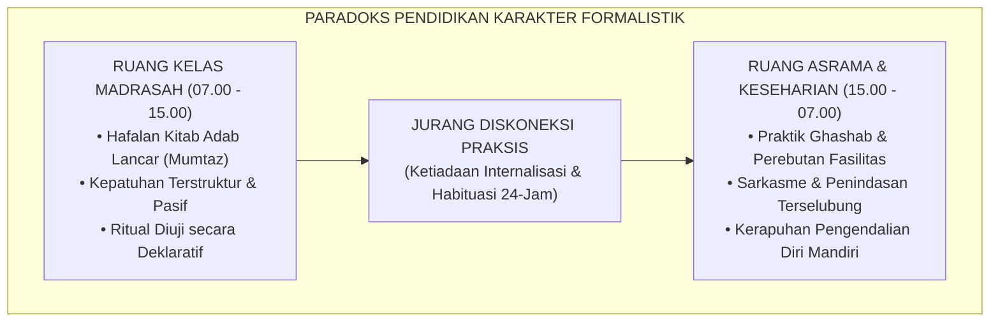
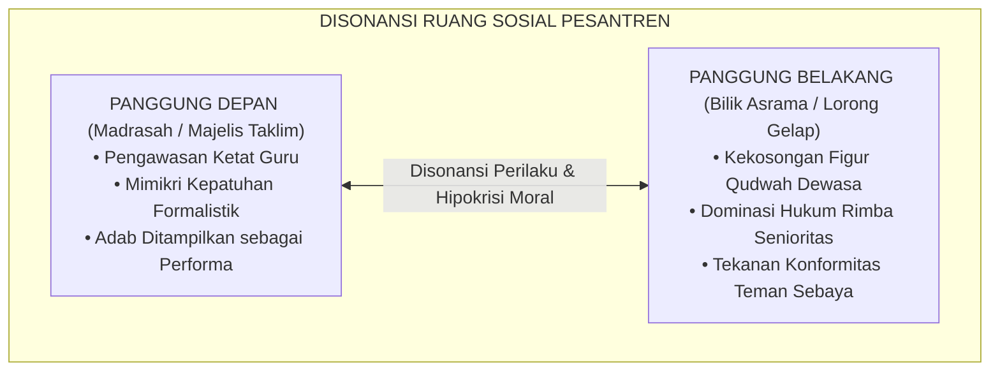
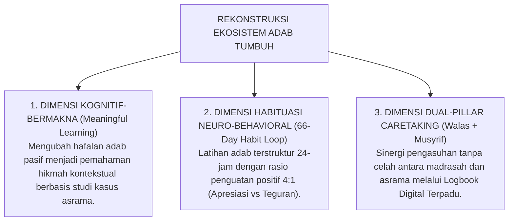

# SUB-BAB 1.1: ANOMALI PENDIDIKAN KARAKTER TRADISIONAL
## *Diskoneksi Struktural antara Penguasaan Teks Ritual dan Realisasi Adab dalam Kehidupan Asrama*

**Kode Klasifikasi**: `BOOK-01/BAB-01/SUB-01/MONOGRAF`  
**Disiplin Ilmu**: Fenomenologi Pendidikan Islam, Sosiologi Pesantren, & Psikologi Kognitif Moral  
**Dewan Pakar**: `pakar-filosofi-tumbuh`, `pakar-epistemologi-turats`, `pakar-psikologi-sosial-santri`

---

### 1. Prolegomena: Paradoks Kesalehan Formalistik di Ruang Pesantren

Di tengah gemuruh modernisasi dan krisis disorientasi moral global, pesantren kerap diposisikan sebagai benteng pertahanan terakhir (*the last bastion of moral civilization*) yang memelihara kemurnian akhlak generasi muda Islam. Namun, tatkala kita mengarahkan lensa observasi secara jujur, kritis, dan berjarak fenomenologis ke dalam kehidupan keseharian asrama, kita dihadapkan pada sebuah ironi yang mencolok: **jurang pemisah yang menganga antara penguasaan tekstual adab dan praksis moralitas keseharian (*the great divide between textual mastery and lived morality*)**.

Fenomena ini bukanlah kasuistik individual yang terisolasi, melainkan sebuah **anomali sistemik**. Seorang santri dapat melantunkan bait-bait *Ta'lim al-Muta'allim* karya Syekh Burhanuddin az-Zarnuji dengan intonasi sempurna, menghafal matan *Bidayat al-Hidayah* karya Hujjatul Islam Imam al-Ghazali di luar kepala, bahkan meraih nilai *mumtaz* dalam ujian lisan kitab akhlak. Akan tetapi, begitu bel tanda usai kelas berbunyi dan santri melangkahkan kaki keluar dari batas ruang madrasah menuju bilik asrama, terbentang pemandangan yang bertolak belakang secara diametral: antrean wudhu yang diserobot secara agresif, pakaian rekan sekamar yang dipakai tanpa izin (*ghashab*), sampah yang berserakan di lorong-lorong asrama, hingga ujaran sarkasme dan pelecehan verbal (*verbal bullying*) antarsantri yang dibiarkan tanpa teguran bermakna.



Kondisi paradoksal ini melahirkan pertanyaan epistemologis dan pedagogis yang sangat mendasar: *Mengapa transmisi teks-teks adab klasik yang sedemikian luhur gagal bermutasi menjadi watak dan karakter otomatis (*khuluq mu'tadah*) dalam perilaku nyata santri? Mengapa ribuan jam duduk bersila di depan para asatidz belum mampu mengikis dorongan primitif untuk bertindak zalim kepada sesama rekan asrama?*

---

### 2. Diagnosis Epistemologis: Kerapuhan Memori Deklaratif dalam Formasi Karakter

Untuk mengurai akar anomali ini, kita harus menelaah arsitektur kognisi manusia melalui perpaduan antara epistemologi Turats Islam dan psikologi kognitif modern. 

Dalam psikologi memori (merujuk pada karya fundamental Squire, 2004; Anderson, 1983), pengetahuan manusia terbagi secara tegas menjadi dua modalitas utama:
1. **Pengetahuan Deklaratif (*Declarative / Semantic Knowledge*)**: Pengetahuan tentang fakta, dalil, konsep, dan aturan yang dapat diungkapkan secara verbal (*knowing that*).
2. **Pengetahuan Prosedural (*Procedural / Behavioral Knowledge*)**: Pengetahuan tentang bagaimana suatu tindakan dijalankan secara otomatis melalui pembiasaan sirkuit motorik dan emosional (*knowing how*).

Pendidikan karakter konvensional di banyak pesantren terjebak dalam ilusi kognitif: mengira bahwa dengan mentransfer memori deklaratif (menghafal dalil, mendengarkan ceramah ustadz, mencatat makna gandul kitab), secara otomatis akan terbentuk skema prosedural adab dalam diri santri. 

```mermaid
graph LR
    Deklaratif["Pengetahuan Deklaratif (Teks Kitab)<br/>Tersimpan di Korteks Temporal<br/>'Tahu bahwa ghashab itu dosa'"] -- Ilusi Pedagogis --x Prosedural["Karakter Prosedural (Praksis Otomatis)<br/>Tersimpan di Sirkuit Basal Ganglia<br/>'Refleks menahan diri dari menyentuh barang orang lain'"]
    
    Deklaratif ==>|METODOLOGI HABITUASI TUMBUH (66 HARI)| Prosedural
```

Sebagaimana dianalisis secara tajam oleh Prof. Syed Muhammad Naquib al-Attas (1980) dalam *The Concept of Education in Islam*, distorsi ini berakar dari hilangnya esensi **Ta'dib**. Pengajaran agama tereduksi menjadi sekadar *Ta'lim* kognitif yang kering—mentransmisikan informasi tanpa proses penanaman adab (*inculcation of adab*) yang melibatkan penataan jiwa (*Tarbiyatun Nafs*) dan penyucian kalbu (*Tazkiyatul Qalb*). 

Ketika adab diajarkan murni sebagai ilmu spekulatif (*'ilm nazhari*) dan bukan sebagai laku spiritual-praktis (*'amal thariqi*), maka yang lahir adalah sosok "intelektual adab yang tuna-adab": manusia yang fasih mengkritik akhlak orang lain dengan dalil-dalil kitab kuning, namun rapuh dalam mengendalikan amarah dan egoismenya sendiri tatkala berinteraksi dengan sesama makhluk.

---

### 3. Kritik Sosiologis: Budaya Mimikri Moral dan Disonansi Ruang Asrama

Dari perspektif sosiologi pesantren (merujuk pada telaah kritis Clifford Geertz, 1960; Karel Steenbrink, 1984; serta analisis sosiologi moral Emile Durkheim, 1925), fenomena diskoneksi ini diperparah oleh terjadinya **Disonansi Ekologis (*Ecological Dissonance*)** antara sub-sistem madrasah dan sub-sistem asrama.

Di madrasah, santri berada di bawah pengawasan langsung figur otoritas guru (*ustadz*) yang memiliki wibawa keilmuan tinggi. Di ruang ini, santri menampilkan apa yang disebut oleh Erving Goffman (1959) dalam *The Presentation of Self in Everyday Life* sebagai **Front Stage Behavior (Perilaku Panggung Depan)**: santri mengenakan topeng kesantunan, menundukkan pandangan, berbicara dengan bahasa *krama inggil* yang halus, dan mematuhi seluruh tata tertib formal.

Namun, begitu santri berpindah ke asrama—yang sering kali kekurangan pendampingan musyrif profesional dan hanya diawasi secara sporadis—santri memasuki wilayah **Back Stage (Panggung Belakang)**. Di ruang panggung belakang inilah hierarki rimba yang sesungguhnya bekerja:
* **Hukum Mayoritas & Kekuatan Fisik**: Siapa yang lebih senior atau lebih kuat secara fisik berhak menguasai ranjang terbaik, memonopoli kamar mandi di jam sibuk, dan menyuruh santri junior mencuci pakaian.
* **Normalisasi Bahasa 'Keras'**: Penggunaan kata-kata umpatan dan candaan bernada merendahkan (*pejorative humor*) dianggap sebagai simbol keakraban atau maskulinitas kelompok, mengikis rasa malu (*al-Haya'*) yang diajarkan dalam hadits-hadits nabawi.
* **Konformitas Kelompok Sebaya (*Peer Conformity*)**: Santri yang mencoba istiqamah mempraktikkan adab luhur di kamar kerap kali dicap "sok suci", diasingkan dari pergaulan (*social ostracism*), atau menjadi sasaran ejekan kolektif, sehingga mereka terpaksa berkompromi dan melebur ke dalam budaya menyimpang kelompok demi bertahan hidup.



Kondisi ini memicu terbentuknya **kepribadian terbelah (*split personality*)** pada diri santri: mereka menjadi mahir memainkan peran ganda antara kepatuhan di hadapan kiai dan keliaran di belakang musyrif. Jika dibiarkan berakar selama bertahun-tahun masa mukim di pondok, pola ini akan terbawa hingga mereka dewasa dan menjadi benih hipokrisi moral di tengah masyarakat luas.

---

### 4. Hermeneutika Turats: Peringatan Keras Ulama Klasik tentang 'Ilmu Tanpa 'Amal

Fenomena kemerosotan adab di balik tameng penguasaan teks bukanlah problem baru dalam sejarah Islam. Para ulama *muhaqqiqin* terdahulu telah melayangkan kritik pedas terhadap bahaya intelektualisme agama yang steril dari amal perbuatan.

Hujjatul Islam Imam Abu Hamid al-Ghazali (w. 505 H) dalam risalah terkenalnya, *Ayyuhal Walad*, menuliskan teguran yang menggetarkan akal pikiran:

> $$\text{أَيُّهَا الْوَلَدُ، الْعِلْمُ بِلَا عَمَلٍ جُنُونٌ، وَالْعَمَلُ بِغَيْرِ عِلْمٍ لَا يَكُونُ. وَاعْلَمْ أَنَّ عِلْمًا لَا يُبْعِدُكَ الْيَوْمَ عَنِ الْمَعَاصِي، وَلَا يَحْمِلُكَ عَلَى الطَّاعَةِ، لَنْ يُبْعِدَكَ غَدًا عَنْ نَارِ جَهَنَّمَ}$$
> 
> *"Wahai anakku! Ilmu tanpa amal adalah kegilaan, dan amal tanpa ilmu adalah kesia-siaan yang tak berwujud. Ketahuilah, ilmu yang tidak menjauhkanmu dari maksiat pada hari ini, dan tidak mendorongmu untuk berbuat taat, niscaya tidak akan mampu menjauhkanmu dari api neraka Jahannam pada hari esok!"* (Al-Ghazali, *Ayyuhal Walad*, hlm. 12).

Peringatan serupa ditegaskan oleh ulama nusantara panutan umat, Khadimul 'Ilm Hadhratusy Syaikh KH. M. Hasyim Asy'ari (w. 1366 H) dalam mahakaryanya *Adab al-'Alim wal Muta'allim*:

> $$\text{قَالَ بَعْضُ السَّلَفِ: الْأَدَبُ فِي الْعَمَلِ عَلَامَةُ قَبُولِ الْعَمَلِ. وَقَالَ ابْنُ الْمُبَارَكِ: طَلَبْتُ الْأَدَبَ ثَلَاثِينَ سَنَةً، وَطَلَبْتُ الْعِلْمَ عِشْرِينَ سَنَةً، وَكَانُوا يَطْلُبُونَ الْأَدَبَ قَبْلَ الْعِلْمِ}$$
> 
> *"Sebagian ulama salaf berkata: 'Keberadaan adab dalam beramal adalah tanda diterimanya amal tersebut.' Abdullah bin al-Mubarak menyatakan: 'Aku mempelajari adab selama tiga puluh tahun, dan aku mempelajari ilmu selama dua puluh tahun; dan adalah para salaf senantiasa menuntut adab sebelum mereka menuntut ilmu.' "* (Hasyim Asy'ari, *Adab al-'Alim wal Muta'allim*, hlm. 9).

Ketika teks-teks klasik ini diabaikan esensi ruhaniyahnya dan hanya diperlakukan sebagai bahan hafalan ujian tanpa pendampingan praksis 24 jam, pesantren sesungguhnya sedang mengkhianati wasiat para muallif kitab itu sendiri.

---

### 5. Sintesis Rekonstruktif: Menjembatani Jurang melalui Ekosistem Terpadu TUMBUH

Menghadapi patologi diskoneksi struktural ini, pendekatan tambal sulam (*patchwork approaches*)—seperti sekadar menambah jam ceramah motivasi atau memperketat razia hukuman fisik—terbukti tidak pernah berhasil dan justru kontraproduktif. 

Yang dibutuhkan adalah **Rekonstruksi Ekosistem Menyeluruh** yang memadukan tiga dimensi pembelajaran transformatif:



1. **Transformasi dari Memori Deklaratif Menuju Skema Prosedural**:  
   Setiap konsep adab yang dipelajari di madrasah harus memiliki instrumen operasionalnya di asrama. Ketika santri belajar tentang adab *Ikhlas* dan *Ukhuwah*, pada hari yang sama musyrif di asrama memfasilitasi praktik pembagian tugas kebersihan kamar secara adil dan mengapresiasi santri yang berinisiatif menolong rekannya yang sakit.
2. **Eliminasi Dikotomi Madrasah vs Asrama**:  
   Melalui mekanisme **Sesi Serah Terima 15-Menit (*Daily Handover Protocol*)**, Wali Kelas dan Musyrif Asrama menyinkronkan data catatan perilaku santri setiap pagi dan sore hari. Tidak ada lagi ruang "panggung belakang" yang luput dari pengayoman, dan tidak ada lagi santri yang merasa tidak diperhatikan.
3. **Penciptaan Bi'ah Shalihah yang Berkeadilan**:  
   Menghapus budaya senioritas rimba dan menggantinya dengan sistem kepemimpinan melayani (*Servant Qudwah Leadership*). Santri senior diamanahi tugas sebagai mentor pembimbing adik kelas (*Peer Mentors*), di mana ukuran kehormatan seorang senior dinilai dari seberapa besar kasih sayang dan pengayoman yang ia berikan kepada santri yang paling lemah di kamarnya.

Dengan paradigma rekonstruktif ini, ekosistem **TUMBUH** memastikan bahwa adab bukan lagi sekadar teks mati yang dihafal di atas kertas ujian, melainkan nafas hidup, refleks moral bawah sadar, dan manifestasi nyata dari kesucian fitrah santri yang memancar dalam setiap helaan nafas kehidupan pesantren 24 jam.
