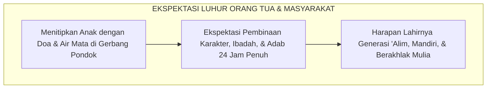
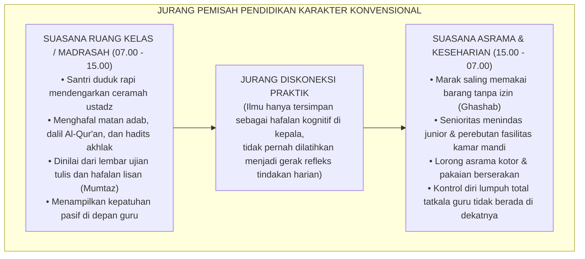
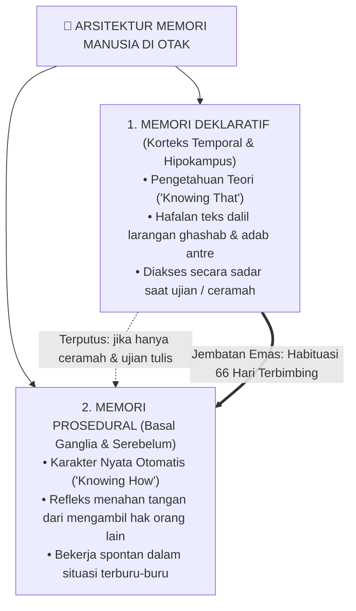
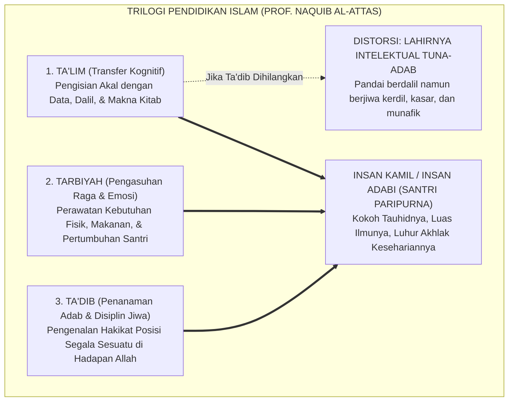
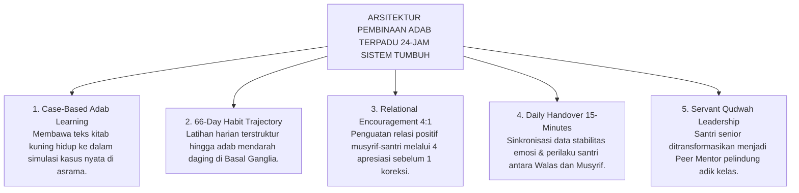

# SUB-BAB 1.1: ANOMALI PENDIDIKAN KARAKTER TRADISIONAL
## *Menyingkap Tabir Jurang Pemisah antara Hafalan Kitab Adab dan Realitas Perilaku Keseharian di Asrama*

**Kode Klasifikasi**: `BOOK-01/BAB-01/SUB-01/MONOGRAF-MASTER`  
**Disiplin Ilmu**: Fenomenologi Pendidikan Islam, Neurosains Kognitif Terapan, Sosiologi Pesantren, & Epistemologi Turats  
**Penanggung Jawab Keilmuan**: Dewan Pakar Ekosistem TUMBUH (*Master Author, Pakar Filosofi, Epistemologi Turats, & Neurosains Perkembangan*)

---

### I. Pintu Masuk: Air Mata di Balik Gerbang dan Tabir Paradoks Pesantren

Setiap awal tahun ajaran baru, sebuah pemandangan yang amat menyentuh kalbu selalu berulang di pelataran pondok-pondok pesantren di seluruh penjuru Nusantara. 

Ribuan orang tua berdiri dengan mata berkaca-kaca di bawah terik matahari atau gerimis senja, memeluk erat putra-putri tercinta mereka sebelum melangkah pulang. Tangan-tangan seorang ayah yang kasar karena kerja keras memegang pundak anak lelakinya seraya berbisik penuh harap: *"Belajarlah yang sungguh-sungguh di sini, Nak. Jadilah orang yang alim, mandiri, dan berakhlak mulia."* Sementara seorang ibu, dengan suara bergetar menahan tangis perpisahan, menyerahkan buah hatinya kepada kiai dan dewan pengasuh dengan satu keyakinan teguh: di balik gerbang suci pesantren, anaknya akan dijaga, dibimbing, dan ditempa menjadi pribadi yang santun, jujur, berjiwa bersih, serta menghiasi diri dengan kemuliaan akhlak nabawi.

Masyarakat menaruh harapan yang teramat tinggi pada pesantren. Dinding-dinding asrama dipandang sebagai benteng pertahanan spiritual terakhir (*the last bastion of moral civilization*) yang mampu melindungi generasi muda dari dekadensi moral zaman modern. Di pesantrenlah orang tua meyakini anak-anak mereka akan belajar hidup teratur, menghargai sesama, dan mempraktikkan sunnah Rasulullah SAW dalam setiap tarikan napas.

<b>Gambar 1.1.1:</b> Harapan dan Ekspektasi Luhur Orang Tua saat Menyerahkan Anak ke Pesantren.

Rangkaian alur pada bagan di atas mencerminkan **mata rantai psikososial dan spiritual** yang mendasari berdirinya pesantren di mata umat. Dimulai dari penyerahan anak secara tulus dengan linangan air mata dan pengorbanan nafkah yang berat, berlanjut pada keyakinan bahwa pesantren adalah institusi total yang tidak pernah tidur dalam mengawal akhlak selama 24 jam penuh, hingga bermuara pada harapan agung: lahirnya anak yang berbakti, mencium tangan orang tua dengan takzim, serta menjadi pelita penyejuk di tengah masyarakat.

---

Namun, tatkala masa orientasi santri baru usai dan tirai keseharian pondok dibuka apa adanya—bukan saat acara wisuda akbar yang megah atau kunjungan wali santri di akhir pekan, melainkan pada pukul dua dini hari di lorong-lorong asrama yang sunyi, di depan antrean kamar mandi yang sesak, atau di balik pintu-pintu kamar santri yang tertutup rapat—kita kerap kali menjumpai sebuah kenyataan lapangan yang menghentak nurani:

> [!WARNING]
> ### 🔍 Potret Kenyataan Lapangan yang Menghentak Nurani:
> Di ruang kelas madrasah pada pagi hari, seorang santri mampu melantunkan bait-bait nadhom *Ta'lim al-Muta'allim* dengan sangat fasih, menghafal matan *Bidayatul Hidayah* karya Imam Al-Ghazali di luar kepala, dan meraih predikat nilai tertinggi (*Mumtaz*) dalam ujian tulis mata pelajaran adab.
> 
> Namun, hanya berselang beberapa menit setelah bel tanda usai pelajaran berbunyi, santri yang sama menampilkan pemandangan yang bertolak belakang:
> * Ia berlari kencang menyerobot antrean wudhu sambil menyikut kawannya yang bertubuh lebih kecil demi mendapatkan kran air terlebih dahulu.
> * Sepasang sandal milik teman sekamarnya dipakai tanpa izin (*ghashab*) untuk pergi ke kantin atau masjid, dan dibiarkan berserakan begitu saja saat selesai digunakan.
> * Gayung mandi disembunyikan di atas plafon kamar mandi atau di kolong lemari agar tidak bisa digunakan santri lain.
> * Pakaian kotor dibiarkan menumpuk berhari-hari di pojok kasur hingga menebarkan aroma tak sedap dan mengundang penyakit.
> * Di dalam bilik asrama pada malam hari, terdengar ejekan tajam yang merendahkan fisik temannya (*body shaming*), panggilan nama-nama hewan, hingga pengucilan sosial yang membuat santri yunior menangis tertekan di bawah selimutnya tanpa ada musyrif yang mendampingi.

<b>Gambar 1.1.2:</b> Diagram Jurang Pemisah antara Pembelajaran Kelas Madrasah dan Realitas Keseharian Asrama.

Memperhatikan kontras tajam pada diagram di atas, kita dapat melihat dengan jelas **dua kutub realitas yang saling terisolasi**:
1. **Kutub Madrasah (07.00 – 15.00 WIB)**: Ruang kelas berjalan sangat teratur di bawah pengawasan langsung guru, di mana keberhasilan santri dinilai semata-mata dari lembar kertas ujian atau kelancaran hafalan lisan. Santri yang meraih nilai 100 langsung dianggap berakhlak mulia.
2. **Kutub Asrama (15.00 – 07.00 WIB)**: Mencakup 16 jam kehidupan nyata di mana nafsu dan dorongan egoisme anak diuji saat berebut kran air, antre mandi, mengurus loker, dan berinteraksi di kamar tidur—namun di wilayah inilah pendampingan musyrif dewasa justru sangat minim.
3. **Jurang Diskoneksi**: Menunjukkan terputusnya mata rantai metodologis. Ilmu adab terkunci sebagai konsep hafalan di kepala, tidak pernah dibimbing menjadi keterampilan motorik kinestetik di tangan dan kaki santri saat mereka berada di kamar tidur mereka.

---

### II. Menelusuri Akar Masalah: Mengapa Hafalan Teks Tidak Otomatis Menjadi Akhlak?

Untuk menjawab teka-teki besar di atas, kita tidak boleh tergesa-gesa menyalahkan santri dengan memberi label "anak nakal", "bebal", atau "berwatak buruk". Jika sebuah fenomena terjadi secara massal di puluhan lembaga, maka masalahnya bukan lagi pada individu anak, melainkan pada **kesalahan metodologis sistemik** dalam cara kita mendidik mereka.

Sains modern di bidang neurokognitif dan psikologi memori (merujuk pada riset fundamental Larry Squire[^1], John Anderson[^2], serta teori pemrosesan ganda Daniel Kahneman[^3]) memberikan penjelasan ilmiah yang sangat terang benderang mengapa hafalan dalil tidak dengan sendirinya melahirkan karakter adab. Otak manusia ternyata tidak menyimpan seluruh pengetahuan pada satu laci yang sama, melainkan membaginya ke dalam **dua sistem sirkuit saraf yang terpisah jauh**:

<b>Gambar 1.1.3:</b> Arsitektur Sistem Memori di Otak: Memori Deklaratif (Teori) vs Memori Prosedural (Praktik Refleks).

Dari pemetaan arsitektur memori di atas, terungkaplah rahasia biologis mengapa pengajaran adab tradisional kerap mengalami kebuntuan:

* **Memori Deklaratif (*Korteks Temporal & Hipokampus*)**: Menyimpan pengetahuan teoritis (*Knowing That*), dalil ayat, hadits, dan kaidah fikih. Sirkuit ini bekerja lambat dan membutuhkan nalar sadar (*System 2*). Ketika santri ditanya di kelas: *"Apa hukum ghashab sandal?"*, hipokampusnya membuka arsip memori teori dan santri menjawab lancar: *"Hukumnya haram."* Namun, memori deklaratif **tidak memiliki kabel langsung ke otot tindakan spontan**. Saat santri terburu-buru atau kelelahan, nalar sadar mengalami kelebihan beban (*cognitive overload*), sehingga hafalan dalil tidak sempat mencegah tangannya dari mengambil sandal kawan.
* **Memori Prosedural (*Basal Ganglia & Serebelum*)**: Menyimpan karakter nyata, kebiasaan otomatis (*habits*), dan keterampilan refleks (*Knowing How*). Sirkuit ini bekerja dalam hitungan milidetik di bawah sadar (*System 1*). Refleks seorang santri yang sedang terburu-buru mengejar adzan subuh untuk menahan kakinya dari memakai sandal teman yang berserakan di pintu kamar, dan tetap rela bertelanjang kaki mencari sandalnya sendiri di rak—adalah buah dari memori prosedural yang telah terlatih.
* **Jalur Terputus vs Jembatan Emas**: Garis putus-putus merah menegaskan bahwa ceramah di mimbar dan ujian tulis tidak akan pernah mampu menembus Basal Ganglia. Ceramah hanya mengisi memori deklaratif di kepala. Agar hafalan teori di kepala dapat tersambung menjadi gerak refleks otomatis di tangan dan kaki (garis ganda hijau), dibutuhkan **Jembatan Habituasi Terbimbing Selama 66 Hari Berturut-turut** melalui mekanisme plastisitas saraf (*Hebbian Plasticity*).

> [!IMPORTANT]
> ### 🚗 Analogi Belajar Menyetir Mobil: Menjembatani Teori Menuju Refleks Tindakan
> Bayangkan seseorang yang ingin mahir mengemudikan mobil di jalan raya. Ia membeli buku panduan berkendara setebal 1.000 halaman, menghafal seluruh fungsi pedal gas, rem, kopling, tuas transmisi, dan seluruh rambu lalu lintas hingga meraih nilai 100 (*sempurna*) dalam ujian tulis.
> 
> Apakah orang tersebut langsung bisa kita lepaskan menyetir mobil di jalan raya yang padat dan macet tanpa pernah berlatih praktik di balik kemudi? **Tentu saja tidak!** Tatkala ada kendaraan lain yang tiba-tiba memotong jalurnya secara mendadak, hafalan teori di lembar ujiannya tidak akan sanggup menyelamatkannya. Otak sadarnya (*PFC*) membutuhkan waktu sepersekian detik untuk mengingat teori, sementara kakinya belum memiliki memori refleks (*muscle memory*) untuk menginjak pedal rem dalam hitungan milidetik.
> 
> Hal yang persis sama terjadi dalam pendidikan adab santri: **Menghafal 100 hadits tentang keutamaan sabar, amanah, dan persaudaraan tidak akan pernah otomatis melahirkan santri yang berakhlak mulia, kecuali jika nilai-nilai hadits tersebut dilatihkan secara konsisten, dipraktikkan berulang kali, didampingi langsung oleh musyrif yang hangat, dan dibiasakan di dalam denyut kehidupan asrama 24 jam.**

---

### III. Tragedi Hilangnya Hakikat Ta'dib: Menengok Kritik Epistemologis Turats

Kesenjangan biologis antara "tahu teori" dan "terampil mempraktikkan" ini bermuara pada krisis yang lebih mendalam di ranah filosofis. Filsuf dan pemikir pendidikan Islam terkemuka, **Prof. Dr. Syed Muhammad Naquib al-Attas**[^4], telah mengingatkan bahwa akar kejatuhan peradaban umat Islam berawal dari **kerancuan konseptual (*confusion of concepts*)** dalam membedakan tiga pilar pendidikan Islam:

<b>Gambar 1.1.4:</b> Struktur Tiga Ranah Pendidikan Islam dan Dampak Kehancuran Karakter Akibat Hilangnya Pilar Ta'dib.

Melalui kerangka trilogi di atas, Al-Attas membedah integrasi tiga pilar pendidikan Islam dan bencana peradaban yang terjadi tatkala pilar Ta'dib diabaikan:
* **Ta'lim (تعليم)** berfokus pada transfer pengetahuan dan pengisian daya nalar akal (*al-'Aql*), terwujud dalam membaca kitab dan ujian madrasah.
* **Tarbiyah (تربية)** berakar dari kata *rabaa-yarbuu* (menumbuhkan dan merawat), berfokus pada pemenuhan kebutuhan raga (*al-Jasad*) seperti asrama, makanan bergizi, dan sarana fisik.
* **Ta'dib (تأديب)** adalah **jantung dari seluruh pendidikan Islam**, yaitu proses penanaman adab ke dalam jiwa santri (*ar-Ruh wal-Qalb*) agar ia mampu menempatkan segala sesuatu secara tepat dan adil di hadapan Allah SWT dan sesama makhluk.

Tatkala sebuah pesantren hanya memprioritaskan Ta'lim dan Tarbiyah namun **menghilangkan proses Ta'dib** di asrama (jalur distorsi merah), maka lahirlah *"Intelektual Agama yang Tuna-Adab"*: santri yang sangat mahir mendebat orang lain dengan dalil kitab, namun hatinya kerdil, perilakunya kasar, gemar merundung kawan, dan tidak memiliki rasa malu (*al-Haya'*). Sebaliknya, tatkala ketiga pilar dipadukan secara harmonis (jalur emas), lahirlah profil **Insan Kamil / Insan Adabi** yang kokoh tauhidnya, luas ilmunya, dan luhur akhlaknya.

| Ranah Pembinaan | Sasaran Manusia | Fokus Aktivitas di Pondok | Tolak Ukur Evaluasi | Output Karakter yang Terbentuk |
| :--- | :--- | :--- | :--- | :--- |
| **Ta'lim (تعليم)** | Daya Nalar Akal | Membaca kitab, ceramah ustadz, hafalan bait nadhom. | Nilai ujian tulis, hafalan lisan, syahadah formal. | Santri berwawasan luas, faham teks, cakap berdalil. |
| **Tarbiyah (تربية)** | Raga & Naluri Hayati | Penyediaan asrama, makanan bergizi, sarana tidur. | Kebugaran fisik, berat badan, terpenuhinya fasilitas. | Santri sehat, bugar, terawat kebutuhan raganya. |
| **Ta'dib (تأديب)** | Kalbu & Jiwa Spiritual | Habituasi perilaku, teladan *qudwah*, muhasabah 24 jam. | Refleks empati, kejujuran saat sendiri, ketertiban asrama. | **Insan Adabi**: Santri yang refleks perilakunya selaras dengan ridha Allah. |

---

### IV. Dinamika Panggung Belakang: Mengapa Santri Menjadi Santun di Madrasah tapi Liar di Asrama?

Tatkala proses *Ta'dib* tidak hadir mendampingi kehidupan santri di luar jam pelajaran kelas, kekosongan tersebut segera diisi oleh fenomena sosiologis yang sangat berbahaya: **Kepribadian Terbelah (*Split Personality / Nifaq Amali*)**.

Sosiolog ternama **Erving Goffman** (1959)[^5] dalam mahakaryanya *The Presentation of Self in Everyday Life* menguraikan bahwa di dalam sebuah institusi tertutup (*total institution*), individu cenderung membelah kehidupannya menjadi dua panggung sosial yang saling bertolak belakang:

<b>Gambar 1.1.5:</b> Dinamika Dua Panggung (Dramaturgi Sosiologis) dalam Keseharian Santri Pesantren.

Dinamika sosiologis di atas membongkar mekanisme bagaimana institusi asrama yang minim pendampingan dewasa secara sistemik menciptakan watak kemunafikan perilaku (*nifaq amali*):
* **Panggung Depan (*Front Stage*)**: Di kelas atau masjid di bawah tatapan figur otoritas tinggi, santri mengenakan topeng kesantunan dan kepatuhan pasif semata-mata karena takut ditegur atau demi menjaga reputasi nilai raport.
* **Panggung Belakang (*Back Stage*)**: Di bilik asrama malam hari saat asatidz pulang, ketiadaan figur pembina dewasa membuat topeng kesantunan dilepas seketika. Berlakulah hukum rimba: perebutan fasilitas, *ghashab*, makian kotor, dan senioritas feodal.
* **Kesenjangan Integritas (*Hypocrisy Loop*)**: Kesenjangan bolak-balik ini melatih santri memiliki standar ganda: sangat saleh di depan mata manusia, namun berani berbuat zalim saat merasa tidak ada yang melihatnya.

---

### V. Wasiat Turats: Memadukan Ilmu dengan Amal Nyata

Kritik terhadap ilmu yang mandul dan hafalan yang tidak berbuah amal perbuatan ini sesungguhnya telah disuarakan dengan lantang oleh para ulama agung peradaban Islam sejak berabad-abad silam:

> [!NOTE]
> ### 📜 Peringatan Hujjatul Islam Imam Abu Hamid Al-Ghazali dalam *Ayyuhal Walad*:[^7]
> 
> $$\text{أَيُّهَا الْوَلَدُ، الْعِلْمُ بِلَا عَمَلٍ جُنُونٌ، وَالْعَمَلُ بِغَيْرِ عِلْمٍ لَا يَكُونُ. وَاعْلَمْ أَنَّ عِلْمًا لَا يُبْعِدُكَ الْيَوْمَ عَنِ الْمَعَاصِي، وَلَا يَحْمِلُكَ عَلَى الطَّاعَةِ، لَنْ يُبْعِدَكَ غَدًا عَنْ نَارِ جَهَنَّمَ}$$
> 
> **Artinya:**  
> *"Wahai anakku tercinta! Ilmu yang tidak diiringi dengan amal perbuatan nyata adalah suatu kegilaan, dan amal yang dilakukan tanpa landasan ilmu adalah kesia-siaan. Ketahuilah, sesungguhnya ilmu yang tidak mampu menjauhkan dirimu dari maksiat hari ini dan tidak mendorongmu untuk taat beribadah, niscaya ia tidak akan pernah mampu menyelamatkanmu dari jilatan api neraka di hari esok!"*

> [!NOTE]
> ### 📜 Pesan Hadhratusy Syaikh KH. M. Hasyim Asy'ari dalam *Adab al-'Alim wal Muta'allim*:[^8]
> 
> $$\text{قَالَ بَعْضُ السَّلَفِ: الْأَدَبُ فِي الْعَمَلِ عَلَامَةُ قَبُولِ الْعَمَلِ. وَقَالَ ابْنُ الْمُبَارَكِ: طَلَبْتُ الْأَدَبَ ثَلَاثِينَ سَنَةً، وَطَلَبْتُ الْعِلْمَ عِشْرِينَ سَنَةً}$$
> 
> **Artinya:**  
> *"Ulama salaf menegaskan: 'Keberadaan adab di dalam suatu amal perbuatan adalah tanda diterimanya amal tersebut di sisi Allah.' Abdullah bin al-Mubarak menyatakan: 'Aku mendalami adab selama tiga puluh tahun, dan aku mempelajari ilmu syariat selama dua puluh tahun; dan sungguh para ulama terdahulu senantiasa menuntut adab terlebih dahulu sebelum mereka mulai menuntut ilmu.'"*

Seluruh mutiara Turats di atas menegaskan satu kebenaran yang tak terbantahkan: **Tolak ukur kemuliaan sebuah pesantren bukanlah dihitung dari berapa tebal kitab yang dikhatamkan santri, melainkan seberapa dalam nilai-nilai adab tersebut menjelma menjadi gerak refleks nyata saat santri makan, tidur, berbicara, dan memperlakukan sesama saudaranya.**

---

### VI. Solusi Sistemik TUMBUH: Meruntuhkan Sekat Madrasah dan Asrama 24-Jam

Menjawab kegagalan metodologis di atas, **Sistem TUMBUH** merekayasa arsitektur pembinaan adab terpadu yang menghubungkan ruang kelas madrasah dan bilik asrama ke dalam **Satu Siklus Pengasuhan Simbiotik 24-Jam**:

<b>Gambar 1.1.6:</b> Lima Pilar Arsitektur Pembinaan Adab Terpadu 24-Jam Ekosistem TUMBUH.

Arsitektur sistemik di atas merekonstruksi seluruh ekosistem:
1. **Case-Based Adab Learning**: Mengubah pengajaran adab di kelas madrasah dari sekadar memaknai teks secara pasif menjadi diskusi dilema moral dan simulasi fisik (cara antre wudhu yang adil, cara meminjam barang yang santun, dan merapikan sandal).
2. **66-Day Habit Trajectory**: Menerapkan peta jalan neuroplastisitas 66 hari (Inisiasi Hari 1–21, Internalisasi Hari 22–45, dan Otomatisasi Hari 46–66) agar adab berpindah dari memori deklaratif sadar menjadi memori prosedural bawah sadar.
3. **Relational Encouragement 4:1**: Menghapus budaya bentakan dengan membiasakan musyrif memberikan 4 apresiasi kebaikan atas usaha santri sebelum menyampaikan 1 teguran terarah (*Firm & Kind*).
4. **Daily Handover 15-Minutes**: Menghubungkan Wali Kelas dan Musyrif Asrama melalui pertukaran data dua arah via *Logbook PBIS* setiap pagi (06.45) dan sore (16.00), sehingga tidak ada santri yang luput dari pendampingan.
5. **Servant Qudwah Leadership**: Mencabut wewenang hukuman dari santri senior dan mengubah perannya menjadi teladan (*Qudwah Hasanah*) dan kakak asuh (*Peer Mentors*) yang melayani adik kelasnya.

---

### VII. Sintesis Epistemologis Sub-Bab 1.1

Melalui rekonstruksi di atas, Sistem TUMBUH membuktikan bahwa **kegagalan pembentukan karakter di pesantren konvensional bukanlah karena kelemahan teks kitab adab, melainkan karena ketiadaan jembatan sistemik antara ruang kelas dan kamar tidur santri**. 

Dengan menyatukan Ta'lim di madrasah, Tarbiyah di asrama, dan Ta'dib dalam denyut kehidupan 24 jam, Sistem TUMBUH mengembalikan pesantren ke fungsi asasinya: rahim peradaban yang melahirkan santri berilmu luas, berjiwa bersih, dan luhur adab perilakunya di hadapan Allah dan manusia.

---

## 📌 Catatan Kaki & Rujukan Primer

[^1]: **Larry R. Squire**, "Memory systems of the brain: A brief history and current perspective", *Neurobiology of Learning and Memory*, Vol. 82, No. 3 (2004), hlm. 171–177; serta **Larry R. Squire & Eric R. Kandel**, *Memory: From Mind to Molecules* (New York: Scientific American Library, 1999).
[^2]: **John R. Anderson**, *The Architecture of Cognition* (Cambridge: Harvard University Press, 1983); serta *Rules of the Mind* (Hillsdale: Lawrence Erlbaum Associates, 1993).
[^3]: **Daniel Kahneman**, *Thinking, Fast and Slow* (New York: Farrar, Straus and Giroux, 2011), Bab 1: "Two Systems", hlm. 19–30.
[^4]: **Prof. Dr. Syed Muhammad Naquib al-Attas**, *The Concept of Education in Islam: A Framework for an Islamic Philosophy of Education* (Kuala Lumpur: International Institute of Islamic Thought and Civilization / ISTAC, 1980), hlm. 15–35; serta *Aims and Objectives of Islamic Education* (Jeddah: King Abdulaziz University, 1979).
[^5]: **Erving Goffman**, *The Presentation of Self in Everyday Life* (New York: Anchor Books / Doubleday, 1959), Bab III: "Regions and Region Behavior", hlm. 106–140.
[^6]: **B. Bradford Brown & Jim Larson**, "Peer relationships in adolescence", dalam R. M. Lerner & L. Steinberg (Eds.), *Handbook of Adolescent Psychology: Contextual Influences on Adolescent Development* (Hoboken: John Wiley & Sons, 2009), Vol. 2, hlm. 74–103.
[^7]: **Hujjatul Islam Imam Abu Hamid al-Ghazali**, *Ayyuhal Walad fi Nashihat at-Talamidz*, Tahqiq: Dr. Ahmad Ahmad Badawi (Kairo: Dar al-Qalam, 1986), hlm. 12–15.
[^8]: **Hadhratusy Syaikh KH. M. Hasyim Asy'ari**, *Adab al-'Alim wal Muta'allim fi ma Yahtaju Ilayhi al-Muta'allim fi Ahwal Ta'allumihi wa ma Yatawaqqafu 'alayhi al-Mu'allim fi Maqamat Ta'limihi* (Jombang: Maktabah at-Turats al-Islami, 1415 H), hlm. 9–12.
