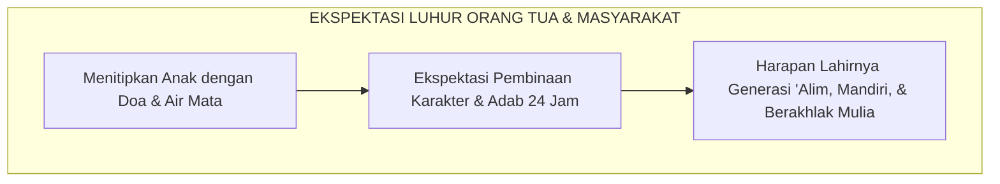
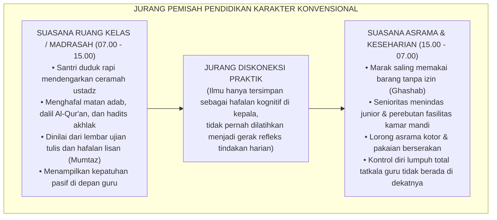
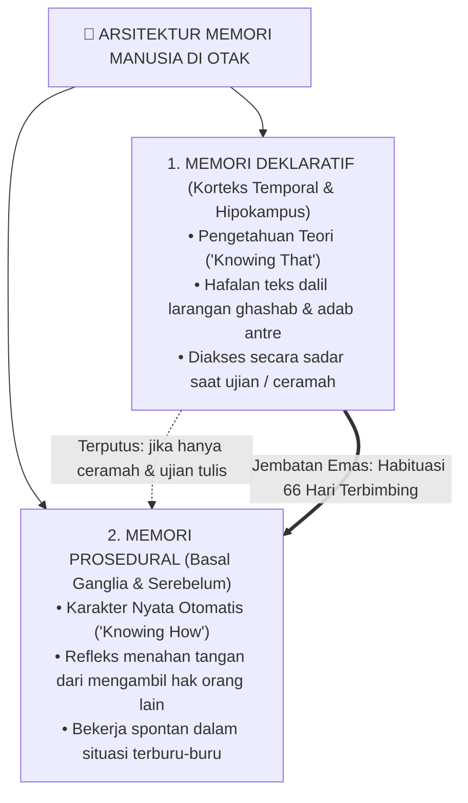
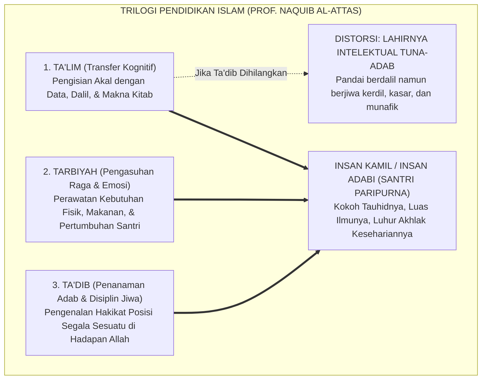
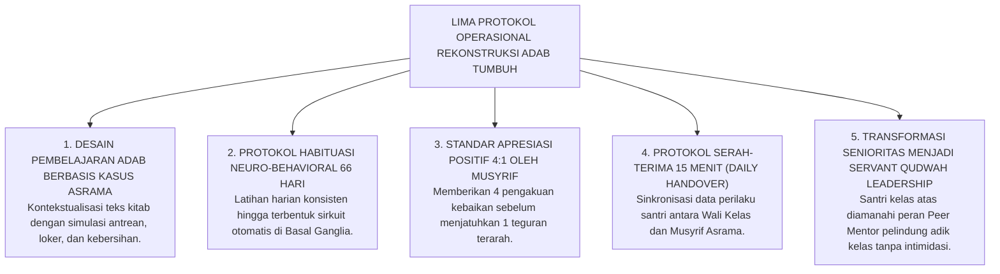
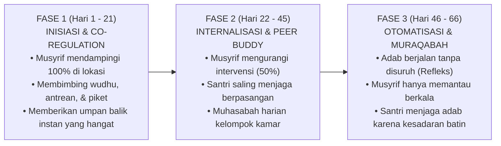
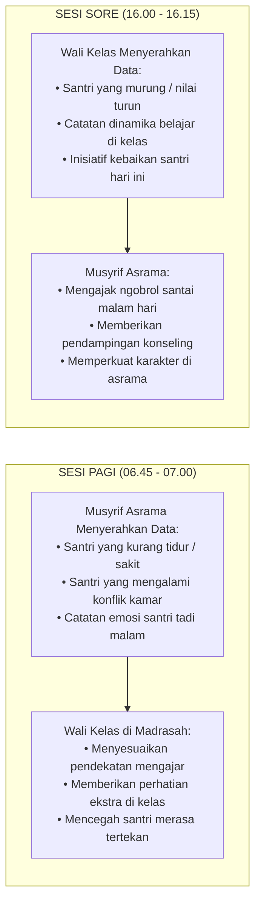

# SUB-BAB 1.1: ANOMALI PENDIDIKAN KARAKTER TRADISIONAL
## *Menyingkap Tabir Jurang Pemisah antara Hafalan Kitab Adab dan Realitas Perilaku Keseharian di Asrama*

**Kode Klasifikasi**: `BOOK-01/BAB-01/SUB-01/MONOGRAF-MASTER`  
**Disiplin Ilmu**: Fenomenologi Pendidikan Islam, Neurosains Kognitif Terapan, Sosiologi Pesantren, & Epistemologi Turats  
**Penanggung Jawab Keilmuan**: Dewan Pakar Ekosistem TUMBUH (*Master Author, Pakar Filosofi, Epistemologi Turats, & Neurosains Perkembangan*)

---

### I. Pintu Masuk: Air Mata di Balik Gerbang dan Tabir Paradoks Pesantren

Setiap awal tahun ajaran baru, sebuah pemandangan yang amat menyentuh kalbu selalu berulang di pelataran pondok-pondok pesantren di seluruh penjuru Nusantara. Ribuan orang tua berdiri dengan mata berkaca-kaca, memeluk erat putra-putri tercinta mereka sebelum melangkah pulang. Tangan-tangan seorang ayah yang kasar karena kerja keras mengusap kepala anak lelakinya seraya berbisik penuh harap: *"Belajarlah yang sungguh-sungguh di sini, Nak. Jadilah orang yang alim, mandiri, dan berakhlak mulia."* Sementara seorang ibu, dengan suara bergetar menahan tangis perpisahan, menyerahkan buah hatinya kepada kiai dan pengasuh dengan satu keyakinan teguh: di balik gerbang suci pesantren, anaknya akan dijaga, dibimbing, dan ditempa menjadi pribadi yang santun, jujur, berjiwa bersih, serta menghiasi diri dengan kemuliaan akhlak nabawi.

Masyarakat menaruh harapan yang teramat tinggi pada pesantren. Dinding-dinding asrama dipandang sebagai benteng pertahanan spiritual terakhir (*the last bastion of moral civilization*) yang mampu melindungi anak-anak dari dekadensi moral zaman modern.

<b>Gambar 1.1.1:</b> Harapan dan Ekspektasi Luhur Orang Tua saat Menyerahkan Anak ke Pesantren.

Namun, tatkala masa orientasi usai dan tirai keseharian pondok dibuka apa adanya—bukan saat acara wisuda akbar atau kunjungan wali santri, melainkan pada pukul dua dini hari di lorong-lorong asrama yang sunyi, di depan antrean kamar mandi yang sesak, atau di balik pintu-pintu kamar santri yang tertutup rapat—kita kerap kali menjumpai sebuah kenyataan lapangan yang menghentak nurani:

> [!WARNING]
> ### 🔍 Potret Kenyataan Lapangan yang Menghentak Nurani:
> Di ruang kelas madrasah, seorang santri mampu melantunkan bait-bait nadhom *Ta'lim al-Muta'allim* dengan sangat fasih, menghafal matan *Bidayatul Hidayah* karya Imam Al-Ghazali di luar kepala, dan meraih predikat nilai tertinggi (*Mumtaz*) dalam ujian tulis mata pelajaran adab.
> 
> Namun, hanya berselang beberapa menit setelah bel tanda usai pelajaran berbunyi, santri yang sama menampilkan pemandangan yang bertolak belakang:
> * Ia berlari kencang menyerobot antrean wudhu sambil menyikut kawannya yang bertubuh lebih kecil.
> * Sepasang sandal milik teman sekamarnya dipakai tanpa izin (*ghashab*) untuk pergi ke kantin atau masjid.
> * Gayung mandi disembunyikan di atas plafon kamar mandi agar tidak bisa digunakan santri lain.
> * Pakaian kotor dibiarkan menumpuk berhari-hari di pojok kamar hingga menebarkan aroma tak sedap.
> * Di dalam bilik asrama pada malam hari, terdengar ejekan tajam yang merendahkan fisik temannya (*body shaming*), panggilan nama hewan, hingga pengucilan sosial yang membuat santri yunior menangis tertekan di bawah selimutnya tanpa ada yang mendampingi.

<b>Gambar 1.1.2:</b> Diagram Jurang Pemisah antara Pembelajaran Kelas Madrasah dan Realitas Keseharian Asrama.

Pemandangan paradoksal ini menyisakan tanda tanya besar di benak para kiai, asatidz, dan pemerhati pendidikan: *Mengapa ribuan jam pengajian kitab kuning, ratusan halaman hafalan dalil, dan atmosfer keagamaan yang begitu pekat belum sanggup mengikis dorongan primitif santri untuk berbuat zalim dan egois kepada saudaranya sendiri? Di manakah letak mata rantai yang terputus dalam pendidikan karakter kita?*

---

### II. Menelusuri Akar Masalah: Mengapa Hafalan Teks Tidak Otomatis Menjadi Akhlak?

Untuk menjawab teka-teki besar di atas, kita tidak boleh tergesa-gesa menyalahkan santri dengan memberi label "anak nakal", "bebal", atau "berwatak buruk". Jika sebuah fenomena terjadi secara massal di puluhan lembaga, maka masalahnya bukan lagi pada individu anak, melainkan pada **kesalahan metodologis sistemik** dalam cara kita mendidik mereka.

Sains modern di bidang neurokognitif dan psikologi memori (merujuk pada riset Larry Squire[^1], John Anderson[^2], serta teori pemrosesan ganda Daniel Kahneman[^3]) memberikan penjelasan ilmiah yang sangat terang benderang mengapa hafalan dalil tidak dengan sendirinya melahirkan karakter adab. Otak manusia ternyata tidak menyimpan seluruh pengetahuan pada satu laci yang sama, melainkan membaginya ke dalam **dua sistem sirkuit saraf yang terpisah jauh**:

<b>Gambar 1.1.3:</b> Arsitektur Sistem Memori di Otak: Memori Deklaratif (Teori) vs Memori Prosedural (Praktik Refleks).

Pertama, **Memori Deklaratif (*Declarative Memory* / *Knowing That*)**. Memori ini diproses di *hipokampus* dan disimpan di lapisan luar otak (*korteks serebral*). Isinya adalah konsep verbal, teori hukum fikih, dalil-dalil ayat Al-Qur'an, dan matan hadits. Memori ini bersifat lambat dan membutuhkan proses berpikir sadar (*System 2*). Ketika seorang santri ditanya di ruang ujian: *"Apa hukum memakai sandal kawan tanpa izin?"*, otak santri mengakses memori deklaratif dan menjawab dengan sempurna: *"Hukumnya ghashab, dan ghashab adalah perbuatan haram serta berdosa besar."* Namun, memori deklaratif ini **tidak terhubung langsung dengan otot penggerak tindakan spontan**.

Kedua, **Memori Prosedural (*Procedural Memory* / *Knowing How*)**. Memori ini tertanam kokoh di sirkuit saraf bawah sadar (*Basal Ganglia* dan *Serebelum*). Di sinilah letak **karakter sejati dan kebiasaan otomatis (*habits*)**. Memori ini bekerja secepat kilat tanpa perlu berpikir panjang (*System 1*). Refleks seorang santri yang sedang terburu-buru mengejar adzan subuh untuk menahan kakinya agar tidak mengambil sandal temannya yang berserakan, lalu tetap rela bertelanjang kaki mencari sandalnya sendiri di rak—adalah buah dari memori prosedural yang telah terlatih.

> [!IMPORTANT]
> ### 🚗 Analogi Belajar Menyetir Mobil: Menjembatani Teori Menuju Refleks Tindakan
> Bayangkan seseorang yang ingin mahir mengemudikan mobil di jalan raya. Ia membeli buku panduan berkendara setebal 1.000 halaman, menghafal seluruh fungsi pedal gas, rem, kopling, tuas transmisi, dan seluruh rambu lalu lintas hingga meraih nilai 100 (*sempurna*) dalam ujian tulis.
> 
> Apakah orang tersebut langsung bisa kita lepaskan menyetir mobil di jalan raya yang padat dan macet tanpa pernah berlatih praktik di balik kemudi? **Tentu saja tidak!** Tatkala ada kendaraan lain yang tiba-tiba memotong jalurnya secara mendadak, hafalan teori di lembar ujiannya tidak akan sanggup menyelamatkannya. Otak sadarnya (*PFC*) membutuhkan waktu sepersekian detik untuk mengingat teori, sementara kakinya belum memiliki memori refleks (*muscle memory*) untuk menginjak pedal rem dalam hitungan milidetik.
> 
> Hal yang persis sama terjadi dalam pendidikan adab santri: **Menghafal 100 hadits tentang keutamaan sabar, amanah, dan persaudaraan tidak akan pernah otomatis melahirkan santri yang berakhlak mulia, kecuali jika nilai-nilai hadits tersebut dilatihkan secara konsisten, dipraktikkan berulang kali, didampingi langsung oleh musyrif yang hangat, dan dibiasakan di dalam denyut kehidupan asrama 24 jam.**

---

### III. Tragedi Hilangnya Hakikat Ta'dib: Menengok Kritik Epistemologis Turats

Kesenjangan biologis antara "tahu teori" dan "terampil mempraktikkan" ini bermuara pada krisis yang lebih mendalam di ranah filosofis. Filsuf dan pemikir pendidikan Islam terkemuka, **Prof. Dr. Syed Muhammad Naquib al-Attas**[^4], telah mengingatkan bahwa akar kejatuhan peradaban umat Islam berawal dari **kerancuan konseptual (*confusion of concepts*)** dalam membedakan tiga pilar pendidikan Islam:

<b>Gambar 1.1.4:</b> Struktur Tiga Ranah Pendidikan Islam dan Dampak Kehancuran Karakter Akibat Hilangnya Pilar Ta'dib.

Al-Attas menguraikan bahwa **Ta'lim (تعليم)** berfokus pada transfer pengetahuan dan kecerdasan akal nalar (*al-'Aql*); **Tarbiyah (تربية)** berfokus pada pemeliharaan fisik, kesehatan raga, dan pemenuhan kebutuhan biologis (*al-Jasad*); sedangkan **Ta'dib (تأديب)** adalah inti dari seluruh pendidikan Islam, yaitu proses penanaman adab ke dalam jiwa dan kalbu (*al-Qalb war-Ruh*) agar seseorang mampu menempatkan segala sesuatu pada posisinya yang benar dan adil di hadapan Allah dan sesama makhluk.

| Ranah Pembinaan | Sasaran Manusia | Fokus Aktivitas di Pondok | Tolak Ukur Evaluasi | Output Karakter yang Terbentuk |
| :--- | :--- | :--- | :--- | :--- |
| **Ta'lim (تعليم)** | Daya Nalar Akal | Membaca kitab, ceramah ustadz, hafalan bait nadhom. | Nilai ujian tulis, hafalan lisan, syahadah formal. | Santri berwawasan luas, faham teks, cakap berdalil. |
| **Tarbiyah (تربية)** | Raga & Naluri Hayati | Penyediaan asrama, makanan bergizi, sarana tidur. | Kebugaran fisik, berat badan, terpenuhinya fasilitas. | Santri sehat, bugar, terawat kebutuhan raganya. |
| **Ta'dib (تأديب)** | Kalbu & Jiwa Spiritual | Habituasi perilaku, teladan *qudwah*, muhasabah 24 jam. | Refleks empati, kejujuran saat sendiri, ketertiban asrama. | **Insan Adabi**: Santri yang refleks perilakunya selaras dengan ridha Allah. |

> [!CAUTION]
> ### ⚠️ Bahaya Mereduksi Ta'dib Menjadi Sekadar Ta'lim:
> Ketika sebuah pesantren mereduksi kurikulum karakternya menjadi sekadar pengajaran *Ta'lim* (hafalan teks kitab dan ujian kertas semata), maka pesantren tersebut tanpa sadar sedang memproduksi **"Intelektual Agama yang Tuna-Adab"**:  
> Yaitu sosok manusia yang lisannya sangat lincah mengutip ayat suci dan hadits nabawi untuk menghakimi kesalahan orang lain, namun kalbunya hampa dari empati, jemarinya ringan menzalimi hak kawan, perilakunya egois di ruang publik, dan tidak memiliki rasa malu (*al-Haya'*) tatkala melanggar kehormatan sesama saudaranya.

---

### IV. Dinamika Panggung Belakang: Mengapa Santri Menjadi Santun di Madrasah tapi Liar di Asrama?

Tatkala proses *Ta'dib* tidak hadir mendampingi kehidupan santri di luar jam pelajaran kelas, kekosongan tersebut segera diisi oleh fenomena sosiologis yang sangat berbahaya: **Kepribadian Terbelah (*Split Personality / Nifaq Amali*)**.

Sosiolog ternama **Erving Goffman** (1959)[^5] dalam mahakaryanya *The Presentation of Self in Everyday Life* menguraikan bahwa di dalam sebuah institusi tertutup (*total institution*), individu cenderung membelah kehidupannya menjadi dua panggung sosial yang saling bertolak belakang:

<b>Gambar 1.1.5:</b> Dinamika Dua Panggung (Dramaturgi Sosiologis) dalam Keseharian Santri Pesantren.

Di **Panggung Depan (*Front Stage*)**—seperti ruang kelas madrasah, serambi masjid, atau saat sowan ke ndalem kiai—santri berada di bawah tatapan langsung figur otoritas. Di panggung ini, santri mengenakan "topeng kesantunan": menundukkan pandangan, berbicara dengan bahasa krama yang sangat halus, dan duduk bersila dengan rapi. Namun, motif di balik kesantunan ini kerap kali bukanlah dorongan takwa yang tulus, melainkan motif kepatuhan pasif: takut ditegur, menjaga gengsi di depan guru, atau mengejar nilai kepribadian di raport.

Sebaliknya, di **Panggung Belakang (*Back Stage*)**—yaitu di lorong asrama yang temaram, di antrean kamar mandi, atau di dalam bilik kamar tidur saat larut malam—figur otoritas dewasa tidak hadir mendampingi. Di ruang hampa pengasuhan inilah topeng kesantunan dilepas seketika, dan berlakulah tiga hukum sosial yang merusak karakter santri:

1. **Feodalisme Senioritas Rimba**: Munculnya doktrin salah kaprah bahwa santri senior berhak memperbudak adik kelasnya (menyuruh mencuci baju, membelikan makanan di kantin, hingga menjadi pelampiasan kekesalan). Penindasan ini menanamkan trauma emosional pada santri yunior, yang kelak akan mereka balas kembali kepada adik kelas baru saat mereka naik tingkat.
2. **Normalisasi Bahasa Kasar**: Di dalam kamar, saling mengejek fisik (*body shaming*) dan memanggil dengan nama hewan dianggap sebagai simbol "keakraban pria". Santri yang berusaha menjaga lisannya justru dirundung dengan sebutan "sok alim", hingga akhirnya rasa malu (*al-Haya'*) perlahan-lahan terkikis.
3. **Tekanan Konformitas Teman Sebaya (*Peer Pressure*)**: Berdasarkan riset psikologi perkembangan remaja (Brown & Larson, 2009)[^6], kebutuhan untuk diterima oleh kawan sebaya jauh lebih dominan daripada kepatuhan pada aturan tertulis. Santri baru yang awalnya berkarakter baik terpaksa ikut melanggar aturan (ikut ghashab atau ikut membully kawan) semata-mata agar tidak dikucilkan (*social ostracism*) dari pergaulan kamarnya.

---

### V. Menghidupkan Kembali Wasiat Emas Ulama Salaf tentang Hakikat Adab

Kritik terhadap ilmu yang mandul dan hafalan yang tidak berbuah amal perbuatan ini sesungguhnya telah disuarakan dengan lantang oleh para ulama agung peradaban Islam sejak berabad-abad silam:

> [!NOTE]
> ### 📜 1. Peringatan Hujjatul Islam Imam Abu Hamid Al-Ghazali dalam *Ayyuhal Walad*:[^7]
> 
> $$\text{أَيُّهَا الْوَلَدُ، الْعِلْمُ بِلَا عَمَلٍ جُنُونٌ، وَالْعَمَلُ بِغَيْرِ عِلْمٍ لَا يَكُونُ. وَاعْلَمْ أَنَّ عِلْمًا لَا يُبْعِدُكَ الْيَوْمَ عَنِ الْمَعَاصِي، وَلَا يَحْمِلُكَ عَلَى الطَّاعَةِ، لَنْ يُبْعِدَكَ غَدًا عَنْ نَارِ جَهَنَّمَ، وَإِنْ لَمْ تَعْمَلِ الْيَوْمَ وَلَمْ تَتَدَارَكِ الْأَيَّامَ الْمَاضِيَةَ، تَقُولُ غَدًا يَوْمَ الْقِيَامَةِ: فَارْجِعْنَا نَعْمَلْ صَالِحًا، فَيُقَالُ: يَا أَحْمَقُ، أَنْتَ مِنْ هُنَاكَ تَجِيءُ!}$$
> 
> **Artinya:**  
> *"Wahai anakku tercinta! Ilmu yang tidak diiringi dengan amal perbuatan nyata adalah suatu kegilaan, dan amal yang dilakukan tanpa landasan ilmu adalah kesia-siaan yang tak berwujud.*  
> *Ketahuilah, sesungguhnya ilmu yang tidak mampu menjauhkan dirimu dari perbuatan maksiat pada hari ini, dan tidak sanggup mendorongmu untuk taat beribadah kepada Allah, niscaya ia tidak akan pernah mampu menyelamatkanmu dari jilatan api neraka Jahannam di hari esok!*  
> *Jika engkau tidak segera mengamalkan ilmumu hari ini dan tidak memperbaiki hari-harimu yang telah lalu, niscaya pada hari kiamat kelak engkau akan meratap memohon: 'Ya Tuhan kami, kembalikanlah kami ke dunia agar kami dapat beramal saleh!' Maka akan dikatakan kepadamu: 'Wahai orang yang bodoh, bukankah engkau baru saja datang dari sana?!'"*

> [!NOTE]
> ### 📜 2. Pesan Luhur Hadhratusy Syaikh KH. M. Hasyim Asy'ari dalam *Adab al-'Alim wal Muta'allim*:[^8]
> 
> $$\text{قَالَ بَعْضُ السَّلَفِ: الْأَدَبُ فِي الْعَمَلِ عَلَامَةُ قَبُولِ الْعَمَلِ. وَقَالَ ابْنُ الْمُبَارَكِ: طَلَبْتُ الْأَدَبَ ثَلَاثِينَ سَنَةً، وَطَلَبْتُ الْعِلْمَ عِشْرِينَ سَنَةً، وَكَانُوا يَطْلُبُونَ الْأَدَبَ قَبْلَ الْعِلْمِ. وَقَالَ الشَّافِعِيُّ رَحِمَهُ اللَّهُ: طَلَبِي لِلْأَدَبِ كَطَلَبِ الْمَرْأَةِ الْمُضِلَّةِ وَلَدَهَا لَيْسَ لَهَا غَيْرُهُ}$$
> 
> **Artinya:**  
> *"Sebagian ulama salaf menegaskan: 'Keberadaan adab di dalam suatu amal perbuatan adalah tanda diterimanya amal tersebut di sisi Allah Ta'ala.'*  
> *Ulama agung Abdullah bin al-Mubarak menyatakan: 'Aku mendalami adab selama tiga puluh tahun, dan aku mempelajari ilmu syariat selama dua puluh tahun; dan sungguh para ulama terdahulu senantiasa menuntut adab terlebih dahulu sebelum mereka mulai menuntut ilmu.'*  
> *Imam Asy-Syafi'i rahimahullah bertutur: 'Kesungguhanku dalam mencari adab laksana seorang ibu yang mencari anak tunggalnya yang hilang di tengah padang pasir, di mana ia tidak memiliki anak selainnya!'"*

> [!NOTE]
> ### 📜 3. Wasiat Imam Malik bin Anas kepada Pemuda Quraisy:[^9]
> 
> $$\text{تَعَلَّمِ الْأَدَبَ قَبْلَ أَنْ تَتَعَلَّمَ الْعِلْمَ، فَإِنَّ الْعِلْمَ كَثِيرٌ وَالْأَدَبَ مِيزَانُهُ}$$
> 
> **Artinya:**  
> *"Pelajarilah adab sebelum engkau mempelajari ilmu! Karena sesungguhnya ilmu itu sangatlah banyak, sedangkan adab adalah neraca timbangan yang menentukan nilainya."*

Seluruh mutiara Turats di atas menegaskan satu kebenaran yang tak terbantahkan: **Tolak ukur kemuliaan sebuah pesantren bukanlah dihitung dari berapa tebal kitab yang dikhatamkan santri, melainkan seberapa dalam nilai-nilai adab tersebut menjelma menjadi gerak refleks nyata saat santri makan, tidur, berbicara, dan memperlakukan sesama saudaranya.**

---

### VI. Panduan Praktis Ekosistem TUMBUH: Menjembatani Teori Menjadi Karakter Nyata

Bagaimana cara meruntuhkan jurang pemisah antara ruang kelas madrasah dan bilik asrama secara konkret di pondok pesantren kita? Ekosistem **TUMBUH** merumuskan **Lima Protokol Operasional Rekonstruksi Adab Terpadu 24-Jam**:

<b>Gambar 1.1.6:</b> Lima Protokol Operasional Rekonstruksi Pembinaan Adab Terpadu 24-Jam Ekosistem TUMBUH.

---

#### 1. Pembelajaran Adab Berbasis Kasus Nyata Asrama (*Case-Based Adab Learning*)
* **Praktik Lama**: Guru membaca kitab adab secara monolog, memaknainya kata per kata dengan metode *makna gandul*, lalu menyuruh santri menghafalkannya untuk ujian tertulis tanpa pernah mendiskusikan masalah sandal atau gayung di kamar mandi.
* **Standar Operasional TUMBUH**: Setiap bab adab langsung dihubungkan dengan **Dilema Kasus Nyata di Asrama**.
  * *Skenario Nyata*: Saat mengkaji bab *Hifzhul Mal* (Menjaga Harta Orang Lain), asatidz membuka ruang dialog reflektif:  
    *"Jika antum bangun kesiangan pukul 04.25 dan sandal antum terselip, sementara muadzin sudah mengumandangkan iqamah subuh, apa langkah beradab yang harus antum ambil tanpa menyentuh sandal kawan sekamar?"*
  * Santri diajak berdiskusi, merumuskan kesepakatan kamar, dan menandatangani komitmen bersama untuk saling menjaga hak milik pribadi.

---

#### 2. Siklus Pembiasaan Neuro-Behavioral 66 Hari (*66-Day Habit Loop*)
Berdasarkan riset neuroplastisitas kebiasaan (Lally et al., 2010)[^10], otak manusia membutuhkan rata-rata **66 hari pengulangan harian yang konsisten** agar suatu tindakan sadar yang melelahkan bermutasi menjadi kebiasaan refleks otomatis di *Basal Ganglia*.

Ekosistem TUMBUH membagi 66 hari pembiasaan karakter santri baru menjadi 3 fase terpadu:

<b>Gambar 1.1.7:</b> Tiga Fase Trajektori Habituasi Karakter 66 Hari Ekosistem TUMBUH.

* **Fase 1: Inisiasi & Regulasi Bersama (*Co-Regulation*, Hari 1–21)**:  
  Musyrif asrama hadir secara fisik di setiap titik transisi penting (pukul 04.00 saat bangun tidur, pukul 05.30 saat piket kamar, dan pukul 18.00 saat persiapan masjid) untuk memberikan teladan langsung, menata antrean dengan ramah, dan membetulkan kekeliruan santri dengan senyuman.
* **Fase 2: Internalisasi & Pendampingan Sebaya (*Peer Scaffolding*, Hari 22–45)**:  
  Musyrif mulai mengurangi pengawasan langsung secara bertahap. Santri dipasangkan dalam sistem *Peer Buddy* (dua santri saling menjaga dan mengingatkan). Evaluasi difokuskan pada muhasabah malam selama 10 menit sebelum tidur.
* **Fase 3: Otomatisasi & Pengawasan Diri (*Self-Regulation & Muraqabah*, Hari 46–66)**:  
  Sirkuit kebiasaan di otak telah terkonsolidasi. Perilaku merapikan tempat tidur, meletakkan sandal di rak, dan mengantre wudhu telah menjadi memori prosedural yang berjalan otomatis atas dorongan kesadaran batin (*Muraqabatullah*).

---

#### 3. Standar Rasio Apresiasi Relasional 4:1 (*Firm & Kind Discipline*)
Otak manusia memiliki bias negatif alami (*negativity bias*). Bentakan yang keras dan kemarahan yang meluap-luap hanya akan membakar amigdala anak, melumpuhkan nalar moralnya, dan melatihnya menjadi pribadi yang penakut atau pemberontak.

Oleh karena itu, Musyrif TUMBUH diwajibkan menerapkan **Rasio Emas 4 Apresiasi Kebaikan untuk Setiap 1 Teguran Terarah**:
* **Apresiasi Proses yang Tulus (*Relational Encouragement*)**:  
  * *"Masya Allah, Ustadz sangat menghargai ketertiban antum yang rela menunggu giliran wudhu dengan sabar tadi pagi. Itu adalah wujud nyata adab seorang penuntut ilmu."*
  * *"Terima kasih banyak Akhi Fulan sudah berinisiatif merapikan sandal di depan pintu asrama. Lorong kamar kita menjadi sangat indah dan nyaman dipandang."*
* **SOP Menegur Santri saat Khilaf (*Private & Restorative Correction*)**:  
  Musyrif tidak menegur di depan khalayak ramai. Musyrif memanggil santri secara pribadi, duduk sejajar, menatap matanya dengan penuh kasih sayang (*Calm Presence*), lalu mengajukan pertanyaan reflektif:  
  *"Akhi, tadi Ustadz perhatikan antum terburu-buru memakai sandal kawan sekamar tanpa izin. Mari kita renungkan bersama: apa yang dirasakan kawan antum saat ia mencari sandalnya? Bagaimana cara terbaik yang bisa antum lakukan untuk memperbaikinya sekarang?"*

---

#### 4. Protokol Serah-Terima Harian 15 Menit (*Daily Handover Protocol*)
Untuk menyatukan madrasah dan asrama menjadi satu ekosistem pengasuhan 24 jam yang utuh, pesantren menerapkan SOP wajib pertemuan singkat 15 menit antara Wali Kelas dan Musyrif Asrama:

<b>Gambar 1.1.8:</b> Alur Protokol Serah-Terima Harian 15 Menit (Handover) antara Wali Kelas dan Musyrif Asrama.

Didukung oleh aplikasi *Logbook Digital PBIS Pesantren*, seluruh data dinamika santri tersinkronisasi secara *real-time*. Tidak ada lagi santri yang terabaikan atau luput dari sentuhan kasih sayang para pendidik.

---

#### 5. Transformasi Senioritas Menjadi *Servant Qudwah Leadership*
Pesantren mencabut 100% hak penertiban fisik, pengadilan malam, dan wewenang menghukum dari tangan santri senior. Struktur kepengurusan santri dirombak total menjadi **Kader Kepemimpinan Melayani (*Servant Leadership*)**:

1. **Amanah sebagai Kakak Asuh (*Peer Mentors*)**:  
   Santri kelas atas diamanahi peran mulia sebagai pelindung dan pembimbing adik kelas: menyambut santri baru dengan senyuman hangat, membantu mengangkat koper, mengajarkan cara melipat baju, dan menemani santri yang sedang menangis rindu rumah (*homesick*).
2. **Definisi Wibawa Baru**:  
   Kehormatan seorang santri senior tidak lagi diukur dari seberapa keras ia membentak atau seberapa banyak adik kelas yang gemetar ketakutan di hadapannya, melainkan **seberapa besar rasa aman, kenyamanan, dan keteladanan ibadah (*Qudwah Hasanah*) yang ia pancarkan kepada santri yang paling lemah di lingkungannya.**

---

### VII. Muhasabah Jiwa: Menatap Masa Depan Santri Titipan Umat

Ketika keheningan malam menyelimuti bumi pesantren dan kita menatap wajah santri-santri yang sedang terlelap tidur di ranjang asrama mereka, tanyakanlah kepada lubuk hati nurani kita yang terdalam:

> [!NOTE]
> ### 🕊️ Renungan Nurani untuk Setiap Pendidik dan Pengasuh Pesantren:
> *"Anak-anak ini bukanlah kayu mati yang bisa dipahat dengan bentakan kasar dan pukulan rotan. Mereka adalah tunas-tunas fitrah yang suci, jiwa-jiwa mulia yang dititipkan oleh Allah dan jutaan orang tua ke tangan kita.*  
> 
> *Jika kita mendidik mereka hanya dengan hafalan dalil di kepala tanpa membimbing perilakunya di ranjang tidur, kita telah mengabaikan amanah Ta'dib.*  
> *Jika kita membiarkan kekerasan dan feodalisme merajai bilik asrama mereka, kita sesungguhnya sedang menyiapkan generasi masa depan yang rapuh jiwanya dan mahir bermuka dua.*  
> 
> *Mari kita satukan langkah: jembatani hafalan kitab kuning mereka dengan teladan kasih sayang nyata, bangun sirkuit adab mereka dengan pembiasaan yang sabar, dan jadikan pesantren kita sebagai taman peradaban Islam yang aman, hangat, serta memuliakan kemuliaan fitrah kemanusiaan mereka."*

---

## 📌 Catatan Kaki & Rujukan Primer

[^1]: **Larry R. Squire**, "Memory systems of the brain: A brief history and current perspective", *Neurobiology of Learning and Memory*, Vol. 82, No. 3 (2004), hlm. 171–177; serta **Larry R. Squire & Eric R. Kandel**, *Memory: From Mind to Molecules* (New York: Scientific American Library, 1999).
[^2]: **John R. Anderson**, *The Architecture of Cognition* (Cambridge: Harvard University Press, 1983); serta *Rules of the Mind* (Hillsdale: Lawrence Erlbaum Associates, 1993).
[^3]: **Daniel Kahneman**, *Thinking, Fast and Slow* (New York: Farrar, Straus and Giroux, 2011), Bab 1: "Two Systems", hlm. 19–30.
[^4]: **Prof. Dr. Syed Muhammad Naquib al-Attas**, *The Concept of Education in Islam: A Framework for an Islamic Philosophy of Education* (Kuala Lumpur: International Institute of Islamic Thought and Civilization / ISTAC, 1980), hlm. 15–35; serta *Aims and Objectives of Islamic Education* (Jeddah: King Abdulaziz University, 1979).
[^5]: **Erving Goffman**, *The Presentation of Self in Everyday Life* (New York: Anchor Books / Doubleday, 1959), Bab III: "Regions and Region Behavior", hlm. 106–140.
[^6]: **B. Bradford Brown & Jim Larson**, "Peer relationships in adolescence", dalam R. M. Lerner & L. Steinberg (Eds.), *Handbook of Adolescent Psychology: Contextual Influences on Adolescent Development* (Hoboken: John Wiley & Sons, 2009), Vol. 2, hlm. 74–103.
[^7]: **Hujjatul Islam Imam Abu Hamid al-Ghazali**, *Ayyuhal Walad fi Nashihat at-Talamidz*, Tahqiq: Dr. Ahmad Ahmad Badawi (Kairo: Dar al-Qalam, 1986), hlm. 12–15.
[^8]: **Hadhratusy Syaikh KH. M. Hasyim Asy'ari**, *Adab al-'Alim wal Muta'allim fi ma Yahtaju Ilayhi al-Muta'allim fi Ahwal Ta'allumihi wa ma Yatawaqqafu 'alayhi al-Mu'allim fi Maqamat Ta'limihi* (Jombang: Maktabah at-Turats al-Islami, 1415 H), hlm. 9–12.
[^9]: **Al-Khatib Al-Baghdadi**, *Al-Jami' li Akhlaq ar-Rawi wa Adab as-Sami'*, Tahqiq: Dr. Mahmud ath-Thahhan (Riyadh: Maktabah al-Ma'arif, 1403 H), Juz I, hlm. 80.
[^10]: **Phillippa Lally, Cornelia H. M. van Jaarsveld, Henry W. W. Potts, & Jane Wardle**, "How are habits formed: Modelling habit formation in the real world", *European Journal of Social Psychology*, Vol. 40, No. 6 (2010), hlm. 998–1009.
