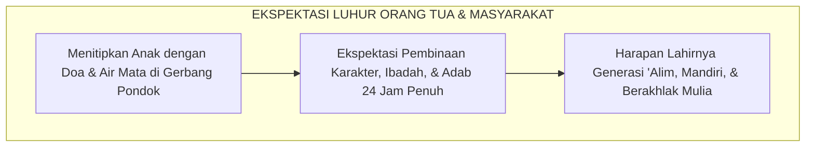
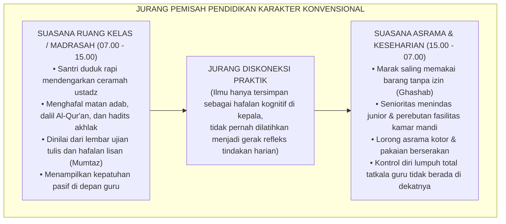
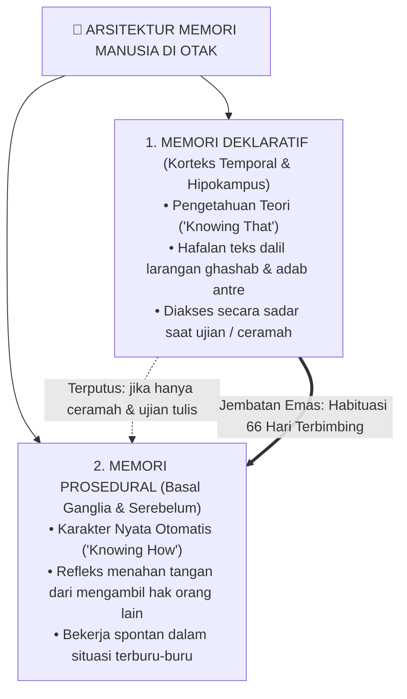
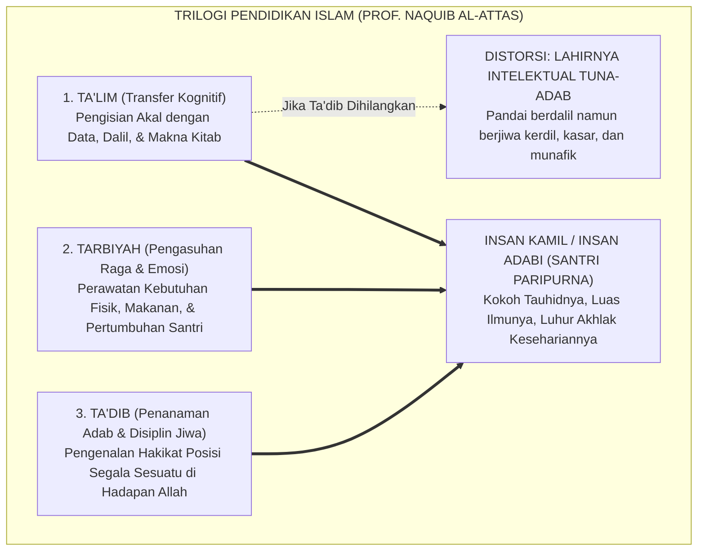
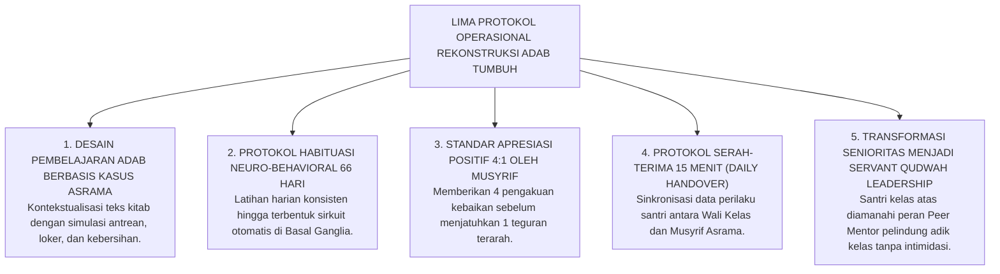
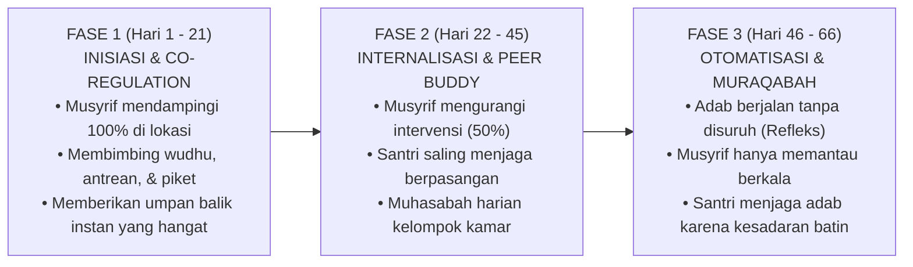
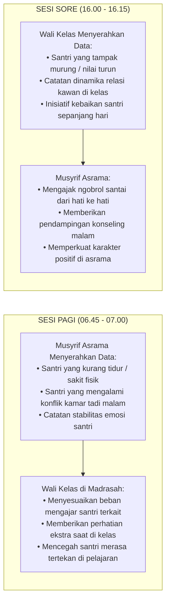

# SUB-BAB 1.1: ANOMALI PENDIDIKAN KARAKTER TRADISIONAL
## *Menyingkap Tabir Jurang Pemisah antara Hafalan Kitab Adab dan Realitas Perilaku Keseharian di Asrama*

**Kode Klasifikasi**: `BOOK-01/BAB-01/SUB-01/MONOGRAF-MASTER-COMPREHENSIVE`  
**Disiplin Ilmu**: Fenomenologi Pendidikan Islam, Neurosains Kognitif Terapan, Sosiologi Pesantren, & Epistemologi Turats  
**Penanggung Jawab Keilmuan**: Dewan Pakar Ekosistem TUMBUH (*Master Author, Pakar Filosofi, Epistemologi Turats, & Neurosains Perkembangan*)

---

### I. Pintu Masuk: Air Mata di Balik Gerbang dan Tabir Paradoks Pesantren

Setiap awal tahun ajaran baru, sebuah pemandangan yang amat menyentuh kalbu selalu berulang di pelataran pondok-pondok pesantren di seluruh penjuru Nusantara. 

Ribuan orang tua berdiri dengan mata berkaca-kaca di bawah terik matahari atau gerimis senja, memeluk erat putra-putri tercinta mereka sebelum melangkah pulang. Tangan-tangan seorang ayah yang kasar karena kerja keras memegang pundak anak lelakinya seraya berbisik penuh harap: *"Belajarlah yang sungguh-sungguh di sini, Nak. Jadilah orang yang alim, mandiri, dan berakhlak mulia."* Sementara seorang ibu, dengan suara bergetar menahan tangis perpisahan, menyerahkan buah hatinya kepada kiai dan dewan pengasuh dengan satu keyakinan teguh: di balik gerbang suci pesantren, anaknya akan dijaga, dibimbing, dan ditempa menjadi pribadi yang santun, jujur, berjiwa bersih, serta menghiasi diri dengan kemuliaan akhlak nabawi.

Masyarakat menaruh harapan yang teramat tinggi pada pesantren. Dinding-dinding asrama dipandang sebagai benteng pertahanan spiritual terakhir (*the last bastion of moral civilization*) yang mampu melindungi generasi muda dari dekadensi moral zaman modern. Di pesantrenlah orang tua meyakini anak-anak mereka akan belajar hidup teratur, menghargai sesama, dan mempraktikkan sunnah Rasulullah SAW dalam setiap tarikan napas.

<b>Gambar 1.1.1:</b> Harapan dan Ekspektasi Luhur Orang Tua saat Menyerahkan Anak ke Pesantren.

#### Penjelasan Komprehensif Bagan Harapan Umat (Gambar 1.1.1):
Bagan di atas menggambarkan **mata rantai psikososial dan spiritual** yang menjadi landasan utama berdirinya lembaga pesantren di mata masyarakat:

1. **Titik Awal (Penyerahan Fitrah Santri dengan Doa & Air Mata)**:  
   Orang tua menyerahkan aset paling berharga dalam hidup mereka—yakni anak kandung mereka—bukan semata-mata untuk mencari ijazah formal atau keterampilan vokasi, melainkan menyerahkan jiwa dan raga anak mereka untuk dibentuk fitrahnya. Ada pengorbanan finansial yang berat, penahanan rasa rindu yang menyiksa, dan kepasrahan tawakkal total kepada kiai dan ustadz.
2. **Titik Proses (Ekspektasi Pembinaan 24 Jam Penuh)**:  
   Masyarakat meyakini bahwa pesantren adalah institusi total (*total institution*) yang tidak pernah tidur dalam mengawal akhlak. Asumsi publik adalah: selama 24 jam penuh—dari bangun tidur, makan, belajar di kelas, shalat berjamaah, hingga tidur kembali—anak-anak mereka berada di bawah panduan keteladanan (*Qudwah Hasanah*) para pendidik yang berhati mulia.
3. **Titik Muara (Lahirnya Insan Beradab Luhur)**:  
   Harapan tertinggi orang tua adalah ketika anaknya pulang ke rumah saat liburan atau lulus kelak: anak tersebut mencium tangan orang tuanya dengan penuh takzim, shalat tepat waktu tanpa disuruh, bertutur kata santun, menjaga kebersihan diri, dan menjadi lentera penyejuk bagi keluarga dan masyarakat luas.

---

Namun, tatkala masa orientasi santri baru usai dan tirai keseharian pondok dibuka apa adanya—bukan saat acara wisuda akbar yang megah atau kunjungan wali santri di akhir pekan, melainkan pada pukul dua dini hari di lorong-lorong asrama yang sunyi, di depan antrean kamar mandi yang sesak, atau di balik pintu-pintu kamar santri yang tertutup rapat—kita kerap kali menjumpai sebuah kenyataan lapangan yang menghentak nurani:

> [!WARNING]
> ### 🔍 Potret Kenyataan Lapangan yang Menghentak Nurani:
> Di ruang kelas madrasah pada pagi hari, seorang santri mampu melantunkan bait-bait nadhom *Ta'lim al-Muta'allim* dengan sangat fasih, menghafal matan *Bidayatul Hidayah* karya Imam Al-Ghazali di luar kepala, dan meraih predikat nilai tertinggi (*Mumtaz*) dalam ujian tulis mata pelajaran adab.
> 
> Namun, hanya berselang beberapa menit setelah bel tanda usai pelajaran berbunyi, santri yang sama menampilkan pemandangan yang bertolak belakang:
> * Ia berlari kencang menyerobot antrean wudhu sambil menyikut kawannya yang bertubuh lebih kecil demi mendapatkan kran air terlebih dahulu.
> * Sepasang sandal milik teman sekamarnya dipakai tanpa izin (*ghashab*) untuk pergi ke kantin atau masjid, dan dibiarkan berserakan begitu saja saat selesai digunakan.
> * Gayung mandi disembunyikan di atas plafon kamar mandi atau di kolong lemari agar tidak bisa digunakan santri lain.
> * Pakaian kotor dibiarkan menumpuk berhari-hari di pojok kasur hingga menebarkan aroma tak sedap dan mengundang penyakit.
> * Di dalam bilik asrama pada malam hari, terdengar ejekan tajam yang merendahkan fisik temannya (*body shaming*), panggilan nama-nama hewan, hingga pengucilan sosial yang membuat santri yunior menangis tertekan di bawah selimutnya tanpa ada musyrif yang mendampingi.

<b>Gambar 1.1.2:</b> Diagram Jurang Pemisah antara Pembelajaran Kelas Madrasah dan Realitas Keseharian Asrama.

#### Penjelasan Komprehensif Diagram Jurang Pemisah (Gambar 1.1.2):
Bagan di atas membedah **dua kutub realitas yang saling bertolak belakang** dalam sistem pesantren konvensional:

1. **Kutub Ruang Kelas Madrasah (Pukul 07.00 – 15.00 WIB)**:  
   Pada blok waktu ini, seluruh mekanisme pendidikan diatur secara formal, terstruktur, dan berada di bawah pengawasan langsung guru. Santri duduk bersila rapi, membuka kitab kuning, mendengarkan uraian ustadz, dan menghafal matan adab. Evaluasi keberhasilan karakter dinilai semata-mata dari lembar jawaban ujian semester atau kelancaran setoran hafalan lisan. Santri yang memperoleh nilai angka 90 atau 100 langsung dilabeli sebagai santri berakhlak mulia (*Mumtaz*), meskipun perilakunya di luar kelas belum pernah diobservasi secara sistematis.
2. **Kutub Ruang Asrama dan Keseharian (Pukul 15.00 – 07.00 WIB)**:  
   Blok waktu ini mencakup 16 jam kehidupan santri (dua pertiga dari seluruh harinya). Di sinilah panggung kehidupan yang sesungguhnya berlangsung: saat santri harus berbagi kamar mandi, berebut kran wudhu, mengelola loker pakaian, mencuci baju, makan bersama, dan berinteraksi di dalam kamar tidur. Pada rentang waktu inilah dorongan egoisme, nafsu amarah, dan sifat hewani anak diuji. Sayangnya, di ranah inilah pendampingan musyrif dewasa sering kali sangat minim atau bahkan kosong sama sekali.
3. **Mata Rantai yang Terputus (*Jurang Diskoneksi Praktik*)**:  
   Jurang pemisah di tengah bagan menunjukkan bahwa **tidak ada jembatan metodologis yang menghubungkan antara apa yang dipelajari di madrasah dengan apa yang dipraktikkan di asrama**. Ilmu adab berhenti sebagai hafalan di laci nalar kepala, tidak pernah dibimbing menjadi keterampilan motorik kinestetik di tangan dan kaki santri saat mereka berada di bilik kamar tidur mereka.

---

### II. Menelusuri Akar Masalah: Mengapa Hafalan Teks Tidak Otomatis Menjadi Akhlak?

Untuk menjawab teka-teki besar di atas, kita tidak boleh tergesa-gesa menyalahkan santri dengan memberi label "anak nakal", "bebal", atau "berwatak buruk". Jika sebuah fenomena terjadi secara massal di puluhan lembaga, maka masalahnya bukan lagi pada individu anak, melainkan pada **kesalahan metodologis sistemik** dalam cara kita mendidik mereka.

Sains modern di bidang neurokognitif dan psikologi memori (merujuk pada riset fundamental Larry Squire[^1], John Anderson[^2], serta teori pemrosesan ganda Daniel Kahneman[^3]) memberikan penjelasan ilmiah yang sangat terang benderang mengapa hafalan dalil tidak dengan sendirinya melahirkan karakter adab. Otak manusia ternyata tidak menyimpan seluruh pengetahuan pada satu laci yang sama, melainkan membaginya ke dalam **dua sistem sirkuit saraf yang terpisah jauh**:

<b>Gambar 1.1.3:</b> Arsitektur Sistem Memori di Otak: Memori Deklaratif (Teori) vs Memori Prosedural (Praktik Refleks).

#### Penjelasan Komprehensif Arsitektur Memori Otak (Gambar 1.1.3):

Bagan arsitektur memori di atas menguraikan mekanisme biologis mengapa pengajaran adab konvensional kerap mengalami kegagalan fatal:

1. **Simpul Otak Induk (*The Master Brain Architecture*)**:  
   Otak manusia memiliki miliaran sel neuron yang terhubung dalam jaringan sinapsis. Ketika santri menerima informasi tentang adab, otak tidak langsung mengubahnya menjadi kebiasaan refleks, melainkan menyaring dan mendistribusikannya ke dua kompartemen sirkuit yang berbeda secara anatomis.
2. **Simpul 1: Memori Deklaratif (*Korteks Temporal & Hipokampus*)**:  
   * **Fungsi**: Menyimpan pengetahuan teoritis (*Knowing That*), konsep hukum fikih, definisi adab, dan teks hafalan Al-Qur'an serta hadits.
   * **Cara Kerja**: Memori ini bekerja secara sadar, lambat, dan membutuhkan konsentrasi nalar (*System 2 / Controlled Processing*). Ketika santri duduk di ruang kelas dan ditanya: *"Apa hukum ghashab sandal?"*, hipokampus bekerja membuka arsip memori teori, lalu mulut santri menjawab lancar: *"Haram, dan ghashab adalah perbuatan zalim."*
   * **Kelemahan Fatal**: Memori deklaratif **tidak memiliki kabel langsung ke otot penggerak tindakan spontan**. Tatkala santri sedang berada dalam situasi terburu-buru, kelelahan fisik, atau di bawah tekanan emosional, sirkuit nalar sadar di korteks prefrontal mengalami perlambatan (*cognitive overload*), sehingga hafalan teorinya tidak sempat dipanggil untuk menghentikan tangannya dari mengambil barang orang lain.
3. **Simpul 2: Memori Prosedural (*Basal Ganglia & Serebelum*)**:  
   * **Fungsi**: Menyimpan karakter nyata, kebiasaan otomatis (*habits*), dan keterampilan motorik kinestetik (*Knowing How*).
   * **Cara Kerja**: Bekerja dengan kecepatan milidetik di bawah sadar tanpa perlu berpikir panjang (*System 1 / Automatic Processing*).
   * **Manifestasi Nyata**: Refleks seorang santri yang sedang terburu-buru mengejar adzan subuh untuk menahan kakinya dari memakai sandal temannya yang berserakan di pintu kamar, dan tetap rela bertelanjang kaki mencari sandalnya sendiri di rak. Refleks ini dikendalikan oleh *Basal Ganglia* yang telah terlatih melalui pembiasaan berulang.
4. **Panah Putus-putus (*Jalur yang Terputus jika Hanya Ceramah*)**:  
   Garis putus-putus merah menegaskan bahwa **ceramah monolog di atas mimbar dan ujian tertulis di atas kertas tidak akan pernah mampu menembus Basal Ganglia**. Ceramah hanya mengisi memori deklaratif di kepala, namun membiarkan memori prosedural di tangan dan kaki santri tetap kosong dari latihan adab nyata.
5. **Panah Ganda Hijau (*Jembatan Emas Habituasi 66 Hari Terbimbing*)**:  
   Garis ganda hijau adalah solusi ilmiah Ekosistem TUMBUH: untuk menyambungkan hafalan teori di kepala menuju gerak refleks otomatis di tangan dan kaki, dibutuhkan **Proses Neuroplastisitas melalui Latihan Terbimbing Selama 66 Hari Berturut-turut** (*Hebbian Plasticity: neurons that fire together wire together*).

> [!IMPORTANT]
> ### 🚗 Analogi Belajar Menyetir Mobil: Menjembatani Teori Menuju Refleks Tindakan
> Bayangkan seseorang yang ingin mahir mengemudikan mobil di jalan raya. Ia membeli buku panduan berkendara setebal 1.000 halaman, menghafal seluruh fungsi pedal gas, rem, kopling, tuas transmisi, dan seluruh rambu lalu lintas hingga meraih nilai 100 (*sempurna*) dalam ujian tulis.
> 
> Apakah orang tersebut langsung bisa kita lepaskan menyetir mobil di jalan raya yang padat dan macet tanpa pernah berlatih praktik di balik kemudi? **Tentu saja tidak!** Tatkala ada kendaraan lain yang tiba-tiba memotong jalurnya secara mendadak, hafalan teori di lembar ujiannya tidak akan sanggup menyelamatkannya. Otak sadarnya (*PFC*) membutuhkan waktu sepersekian detik untuk mengingat teori, sementara kakinya belum memiliki memori refleks (*muscle memory*) untuk menginjak pedal rem dalam hitungan milidetik.
> 
> Hal yang persis sama terjadi dalam pendidikan adab santri: **Menghafal 100 hadits tentang keutamaan sabar, amanah, dan persaudaraan tidak akan pernah otomatis melahirkan santri yang berakhlak mulia, kecuali jika nilai-nilai hadits tersebut dilatihkan secara konsisten, dipraktikkan berulang kali, didampingi langsung oleh musyrif yang hangat, dan dibiasakan di dalam denyut kehidupan asrama 24 jam.**

---

### III. Tragedi Hilangnya Hakikat Ta'dib: Menengok Kritik Epistemologis Turats

Kesenjangan biologis antara "tahu teori" dan "terampil mempraktikkan" ini bermuara pada krisis yang lebih mendalam di ranah filosofis. Filsuf dan pemikir pendidikan Islam terkemuka, **Prof. Dr. Syed Muhammad Naquib al-Attas**[^4], telah mengingatkan bahwa akar kejatuhan peradaban umat Islam berawal dari **kerancuan konseptual (*confusion of concepts*)** dalam membedakan tiga pilar pendidikan Islam:

<b>Gambar 1.1.4:</b> Struktur Tiga Ranah Pendidikan Islam dan Dampak Kehancuran Karakter Akibat Hilangnya Pilar Ta'dib.

#### Penjelasan Komprehensif Trilogi Pendidikan Islam (Gambar 1.1.4):

Bagan di atas menjabarkan integrasi tiga pilar pendidikan Islam dan bencana peradaban yang terjadi tatkala pilar Ta'dib diabaikan:

1. **Pilar 1: Ta'lim (تعليم) - Pengisian Daya Nalar Akal (*al-'Aql*)**:  
   Ta'lim adalah proses pengajaran informasi, data kognitif, pemahaman teks syariat, dan penguasaan kaidah-kaidah keilmuan. Di pesantren, Ta'lim terwujud dalam kegiatan membaca kitab kuning (*sorogan/bandongan*), mendengarkan penjelasan ustadz di kelas madrasah, dan mengerjakan soal ujian tertulis.
2. **Pilar 2: Tarbiyah (تربية) - Pengasuhan Raga & Emosi (*al-Jasad*)**:  
   Tarbiyah berakar dari kata *rabaa-yarbuu* yang berarti menumbuhkan, merawat, dan memelihara. Ranah ini berfokus pada pemenuhan kebutuhan biologis santri: penyediaan asrama yang bersih, makanan bergizi, waktu tidur yang manusiawi, sarana olahraga, dan perlindungan kesehatan fisik agar santri tumbuh menjadi pemuda yang kuat dan sehat.
3. **Pilar 3: Ta'dib (تأديب) - Penanaman Disiplin Jiwa & Kalbu (*ar-Ruh wal-Qalb*)**:  
   Ta'dib berakar dari kata *aduba-ya'dubu* yang bermakna beradab, berdisiplin spiritual, dan berperangai luhur. Ta'dib adalah **jantung dari seluruh pendidikan Islam**, yaitu proses penanaman adab ke dalam jiwa santri agar ia mengenali hakikat kebenaran, menempatkan segala sesuatu pada posisinya yang tepat dan adil di hadapan Allah SWT, serta memperlakukan sesama makhluk dengan penuh kasih sayang dan penghormatan.
4. **Jalur Distorsi Merah (*Lahirnya Intelektual Tuna-Adab*)**:  
   Ketika sebuah pesantren hanya menjalankan *Ta'lim* (mengisi akal dengan hafalan dalil) dan *Tarbiyah* (memberi makan dan tempat tidur), namun **menghilangkan proses Ta'dib** (tidak mendampingi pembiasaan akhlak 24 jam di asrama), maka institusi tersebut akan melahirkan bencana sosial: yakni *"Intelektual Agama yang Tuna-Adab"*. Santri menjadi sosok yang sangat mahir mendebat dan menyalahkan orang lain dengan dalil-dalil kitab suci, namun jiwanya kerdil, perilakunya kasar, gemar merundung kawan, dan tidak memiliki rasa malu (*al-Haya'*) saat berbuat zalim.
5. **Jalur Integrasi Emas (*Insan Kamil / Insan Adabi*)**:  
   Tatkala Ta'lim, Tarbiyah, dan Ta'dib dipadukan secara harmonis dan simultan, barulah pesantren mampu melahirkan profil santri paripurna: santri yang kokoh tauhidnya, cemerlang intelektualnya, sehat raganya, dan luhur budi pekertinya di hadapan Allah dan manusia.

| Ranah Pembinaan | Sasaran Manusia | Fokus Aktivitas di Pondok | Tolak Ukur Evaluasi | Output Karakter yang Terbentuk |
| :--- | :--- | :--- | :--- | :--- |
| **Ta'lim (تعليم)** | Daya Nalar Akal | Membaca kitab, ceramah ustadz, hafalan bait nadhom. | Nilai ujian tulis, hafalan lisan, syahadah formal. | Santri berwawasan luas, faham teks, cakap berdalil. |
| **Tarbiyah (تربية)** | Raga & Naluri Hayati | Penyediaan asrama, makanan bergizi, sarana tidur. | Kebugaran fisik, berat badan, terpenuhinya fasilitas. | Santri sehat, bugar, terawat kebutuhan raganya. |
| **Ta'dib (تأديب)** | Kalbu & Jiwa Spiritual | Habituasi perilaku, teladan *qudwah*, muhasabah 24 jam. | Refleks empati, kejujuran saat sendiri, ketertiban asrama. | **Insan Adabi**: Santri yang refleks perilakunya selaras dengan ridha Allah. |

---

### IV. Dinamika Panggung Belakang: Mengapa Santri Menjadi Santun di Madrasah tapi Liar di Asrama?

Tatkala proses *Ta'dib* tidak hadir mendampingi kehidupan santri di luar jam pelajaran kelas, kekosongan tersebut segera diisi oleh fenomena sosiologis yang sangat berbahaya: **Kepribadian Terbelah (*Split Personality / Nifaq Amali*)**.

Sosiolog ternama **Erving Goffman** (1959)[^5] dalam mahakaryanya *The Presentation of Self in Everyday Life* menguraikan bahwa di dalam sebuah institusi tertutup (*total institution*), individu cenderung membelah kehidupannya menjadi dua panggung sosial yang saling bertolak belakang:

<b>Gambar 1.1.5:</b> Dinamika Dua Panggung (Dramaturgi Sosiologis) dalam Keseharian Santri Pesantren.

#### Penjelasan Komprehensif Dinamika Dua Panggung (Gambar 1.1.5):

Bagan di atas membongkar mekanisme sosiologis bagaimana institusi asrama yang tidak terkelola dengan baik secara sistemik menciptakan watak kemunafikan perilaku (*nifaq amali*) pada diri anak-anak kita:

1. **Analisis Panggung Depan (*Front Stage Dynamics*)**:  
   Di panggung depan (seperti ruang kelas madrasah saat ustadz mengajar, serambi masjid saat shalat berjamaah, atau ruang tamu ndalem saat sowan ke kiai), santri berada di bawah **sorotan tatapan figur otoritas tinggi (*surveillance of authority*)**. Santri secara otomatis mengaktifkan mekanisme manajemen kesan (*impression management*). Mereka mengenakan "topeng kesantunan buatan": menundukkan kepala, berbicara dengan intonasi halus, dan menampilkan kepatuhan pasif. Namun, kepatuhan ini bersifat rapuh dan ekstrinsik: motif utamanya bukanlah kesadaran takwa kepada Allah, melainkan rasa takut dimarahi, keinginan menjaga gengsi sosial, atau demi mengamankan nilai kepribadian di raport.
2. **Analisis Panggung Belakang (*Back Stage Dynamics*)**:  
   Di panggung belakang (seperti lorong asrama yang gelap, bilik kamar tidur setelah pukul 22.00 WIB, atau di antrean kamar mandi yang padat), figur otoritas dewasa tidak hadir mendampingi. Di ruang hampa inilah **topeng kesantunan dilepas secara serentak**. Santri mengekspresikan dorongan primitif yang selama ini tertekan: mereka saling merebut fasilitas, memakai barang teman tanpa izin (*ghashab*), melontarkan makian kotor, dan santri senior mulai memperbudak adik kelasnya.
3. **Analisis Panah Kesenjangan Integritas (*Hypocrisy Loop*)**:  
   Panah bolak-balik di antara kedua panggung menggambarkan **lingkaran setan kemunafikan karakter**. Santri yang terbiasa hidup dalam dua standar ganda ini perlahan-lahan kehilangan integritas batin (*bashirah*). Mereka terbiasa menjadi manusia bertopeng: sangat alim dan santun tatkala ada yang mengawasi, namun berani berbuat zalim dan curang tatkala merasa tidak ada orang yang melihatnya.

---

### V. Menghidupkan Kembali Wasiat Emas Ulama Salaf tentang Hakikat Adab

Kritik terhadap ilmu yang mandul dan hafalan yang tidak berbuah amal perbuatan ini sesungguhnya telah disuarakan dengan lantang oleh para ulama agung peradaban Islam sejak berabad-abad silam:

> [!NOTE]
> ### 📜 1. Peringatan Hujjatul Islam Imam Abu Hamid Al-Ghazali dalam *Ayyuhal Walad*:[^7]
> 
> $$\text{أَيُّهَا الْوَلَدُ، الْعِلْمُ بِلَا عَمَلٍ جُنُونٌ، وَالْعَمَلُ بِغَيْرِ عِلْمٍ لَا يَكُونُ. وَاعْلَمْ أَنَّ عِلْمًا لَا يُبْعِدُكَ الْيَوْمَ عَنِ الْمَعَاصِي، وَلَا يَحْمِلُكَ عَلَى الطَّاعَةِ، لَنْ يُبْعِدَكَ غَدًا عَنْ نَارِ جَهَنَّمَ، وَإِنْ لَمْ تَعْمَلِ الْيَوْمَ وَلَمْ تَتَدَارَكِ الْأَيَّامَ الْمَاضِيَةَ، تَقُولُ غَدًا يَوْمَ الْقِيَامَةِ: فَارْجِعْنَا نَعْمَلْ صَالِحًا، فَيُقَالُ: يَا أَحْمَقُ، أَنْتَ مِنْ هُنَاكَ تَجِيءُ!}$$
> 
> **Artinya:**  
> *"Wahai anakku tercinta! Ilmu yang tidak diiringi dengan amal perbuatan nyata adalah suatu kegilaan, dan amal yang dilakukan tanpa landasan ilmu adalah kesia-siaan yang tak berwujud.*  
> *Ketahuilah, sesungguhnya ilmu yang tidak mampu menjauhkan dirimu dari perbuatan maksiat pada hari ini, dan tidak sanggup mendorongmu untuk taat beribadah kepada Allah, niscaya ia tidak akan pernah mampu menyelamatkanmu dari jilatan api neraka Jahannam di hari esok!*  
> *Jika engkau tidak segera mengamalkan ilmumu hari ini dan tidak memperbaiki hari-harimu yang telah lalu, niscaya pada hari kiamat kelak engkau akan meratap memohon: 'Ya Tuhan kami, kembalikanlah kami ke dunia agar kami dapat beramal saleh!' Maka akan dikatakan kepadamu: 'Wahai orang yang bodoh, bukankah engkau baru saja datang dari sana?!'"*

> [!NOTE]
> ### 📜 2. Pesan Luhur Hadhratusy Syaikh KH. M. Hasyim Asy'ari dalam *Adab al-'Alim wal Muta'allim*:[^8]
> 
> $$\text{قَالَ بَعْضُ السَّلَفِ: الْأَدَبُ فِي الْعَمَلِ عَلَامَةُ قَبُولِ الْعَمَلِ. وَقَالَ ابْنُ الْمُبَارَكِ: طَلَبْتُ الْأَدَبَ ثَلَاثِينَ سَنَةً، وَطَلَبْتُ الْعِلْمَ عِشْرِينَ سَنَةً، وَكَانُوا يَطْلُبُونَ الْأَدَبَ قَبْلَ الْعِلْمِ. وَقَالَ الشَّافِعِيُّ رَحِمَهُ اللَّهُ: طَلَبِي لِلْأَدَبِ كَطَلَبِ الْمَرْأَةِ الْمُضِلَّةِ وَلَدَهَا لَيْسَ لَهَا غَيْرُهُ}$$
> 
> **Artinya:**  
> *"Sebagian ulama salaf menegaskan: 'Keberadaan adab di dalam suatu amal perbuatan adalah tanda diterimanya amal tersebut di sisi Allah Ta'ala.'*  
> *Ulama agung Abdullah bin al-Mubarak menyatakan: 'Aku mendalami adab selama tiga puluh tahun, dan aku mempelajari ilmu syariat selama dua puluh tahun; dan sungguh para ulama terdahulu senantiasa menuntut adab terlebih dahulu sebelum mereka mulai menuntut ilmu.'*  
> *Imam Asy-Syafi'i rahimahullah bertutur: 'Kesungguhanku dalam mencari adab laksana seorang ibu yang mencari anak tunggalnya yang hilang di tengah padang pasir, di mana ia tidak memiliki anak selainnya!'"*

> [!NOTE]
> ### 📜 3. Wasiat Imam Malik bin Anas kepada Pemuda Quraisy:[^9]
> 
> $$\text{تَعَلَّمِ الْأَدَبَ قَبْلَ أَنْ تَتَعَلَّمَ الْعِلْمَ، فَإِنَّ الْعِلْمَ كَثِيرٌ وَالْأَدَبَ مِيزَانُهُ}$$
> 
> **Artinya:**  
> *"Pelajarilah adab sebelum engkau mempelajari ilmu! Karena sesungguhnya ilmu itu sangatlah banyak, sedangkan adab adalah neraca timbangan yang menentukan nilainya."*

Seluruh mutiara Turats di atas menegaskan satu kebenaran yang tak terbantahkan: **Tolak ukur kemuliaan sebuah pesantren bukanlah dihitung dari berapa tebal kitab yang dikhatamkan santri, melainkan seberapa dalam nilai-nilai adab tersebut menjelma menjadi gerak refleks nyata saat santri makan, tidur, berbicara, dan memperlakukan sesama saudaranya.**

---

### VI. Panduan Praktis Ekosistem TUMBUH: Menjembatani Teori Menjadi Karakter Nyata

Bagaimana cara meruntuhkan jurang pemisah antara ruang kelas madrasah dan bilik asrama secara konkret di pondok pesantren kita? Ekosistem **TUMBUH** merumuskan **Lima Protokol Operasional Rekonstruksi Adab Terpadu 24-Jam**:

<b>Gambar 1.1.6:</b> Lima Protokol Operasional Rekonstruksi Pembinaan Adab Terpadu 24-Jam Ekosistem TUMBUH.

#### Penjelasan Komprehensif Arsitektur Lima Protokol TUMBUH (Gambar 1.1.6):
Bagan di atas merangkum **arsitektur intervensi multi-dimensi** yang dirancang oleh Ekosistem TUMBUH untuk mengintegrasikan pembelajaran kelas dengan pengasuhan asrama:
* **Protokol 1** merekonstruksi ranah kognitif di madrasah agar materi adab membumi pada realitas asrama.
* **Protokol 2** merekonstruksi ranah neurobiologis pembiasaan agar nilai adab tertanam di memori prosedural bawah sadar santri.
* **Protokol 3** merekonstruksi budaya komunikasi musyrif agar penertiban adab dijalankan dengan pendekatan kasih sayang (*Firm & Kind*).
* **Protokol 4** merekonstruksi struktur tata kelola lembaga agar Wali Kelas dan Musyrif bersinergi tanpa sekat.
* **Protokol 5** merekonstruksi struktur sosial antarsantri dengan mengubah senioritas feodal menjadi kader kepemimpinan teladan yang melayani.

---

#### 1. Pembelajaran Adab Berbasis Kasus Nyata Asrama (*Case-Based Adab Learning*)
Pendidikan adab di kelas madrasah tidak boleh lagi berhenti pada metode pembacaan pasif satu arah (*monolog*). Guru tidak hanya memaknai kata perkata teks kitab kuning (*makna gandul*), melainkan wajib membawa teks tersebut hidup ke dalam konteks keseharian santri.

* **Metodologi Diskusi Kasus (*Case-Study Dilemma*)**:  
  Setiap guru adab memulai materi pelajaran dengan menyajikan studi kasus nyata yang sering terjadi di asrama. Misalnya, saat membahas bab *Hifzhul Mal* (Menjaga Harta Milik Orang Lain), asatidz tidak langsung membacakan hadits ancaman neraka bagi pelaku ghashab, melainkan menyajikan skenario dilema:  
  *"Bayangkan antum bangun kesiangan pada pukul 04.25 WIB. Muadzin masjid sudah mengumandangkan iqamah subuh. Saat antum membuka pintu kamar, sandal jepit antum hilang terselip, sementara tepat di depan kaki antum berjejer sandal milik kawan sekamar yang sedang dipakai orang lain. Apa langkah beradab yang harus antum ambil tanpa menyentuh hak orang lain?"*
* **Latihan Role-Play & Simulasi Fisik**:  
  Santri diajak memperagakan langsung di depan kelas bagaimana cara meminjam barang yang benar, bagaimana intonasi suara yang santun saat meminta izin, bagaimana cara menolak pinjaman secara halus tanpa menyakiti hati kawan, dan bagaimana merapikan sandal di rak secara rapi. Dengan simulasi ini, otak santri tidak hanya merekam kata-kata, melainkan merekam memori kinestetik gerak tubuh.

---

#### 2. Siklus Pembiasaan Neuro-Behavioral 66 Hari (*66-Day Habit Loop*)
Berdasarkan riset neuroplastisitas pembentukan kebiasaan (Lally et al., 2010)[^10], otak manusia membutuhkan rata-rata **66 hari pengulangan harian yang konsisten** agar suatu tindakan sadar yang melelahkan bermutasi menjadi kebiasaan refleks otomatis di *Basal Ganglia*.

Ekosistem TUMBUH menyusun peta jalan pembiasaan karakter santri baru menjadi 3 fase terpadu yang didampingi secara presisi:

<b>Gambar 1.1.7:</b> Tiga Fase Trajektori Habituasi Karakter 66 Hari Ekosistem TUMBUH.

#### Penjelasan Komprehensif Tiga Fase Habituasi 66 Hari (Gambar 1.1.7):

Bagan di atas memetakan **trajektori evolusi karakter santri baru** dari kondisi awal yang canggung dan melelahkan hingga mencapai tingkat kemandirian adab yang mendarah-daging:

1. **Fase 1: Inisiasi & Regulasi Bersama (*Co-Regulation*, Hari 1–21)**:  
   * **Kondisi Otak Santri**: Otak santri baru mengalami disorientasi lingkungan, rindu keluarga (*homesick*), dan kelelahan adaptasi. Korteks Prefrontal (PFC) bekerja sangat keras untuk memproses jadwal harian yang padat.
   * **Tindakan Wajib Musyrif**: Musyrif hadir 100% secara fisik di setiap titik transisi (pukul 04.00 saat bangun tidur, pukul 05.30 saat piket kamar, dan pukul 18.00 saat persiapan ke masjid). Musyrif tidak sekadar meniup peluit dari kejauhan, melainkan berdiri di samping santri: merapikan barisan antrean dengan sapaan hangat, memperagakan cara melipat selimut yang rapi, dan membetulkan letak sandal yang miring seraya tersenyum ramah. Kehadiran musyrif berfungsi sebagai *penyangga eksternal* bagi kendali diri santri yang masih rapuh.
2. **Fase 2: Internalisasi & Pendampingan Sebaya (*Peer Scaffolding*, Hari 22–45)**:  
   * **Kondisi Otak Santri**: Jalur sinapsis kebiasaan mulai terbentuk di *Basal Ganglia*, namun masih rentan runtuh jika santri mengalami stres atau kelelahan.
   * **Tindakan Wajib Musyrif**: Musyrif mulai mengurangi intervensi langsung hingga 50% (*scaffolding decay*). Santri dipasangkan dalam sistem **Peer Buddy** (dua santri sekamar yang saling menjaga, mengingatkan waktu shalat, dan memeriksa kerapian loker bersama). Setiap malam pukul 21.00 WIB sebelum tidur, musyrif memimpin sesi **Muhasabah Lingkaran Kamar (*Restorative Bedtime Circle*)** selama 10 menit untuk saling mengapresiasi kebaikan kawan sekamar dan menyelesaikan perselisihan kecil sebelum terlelap.
3. **Fase 3: Otomatisasi & Pengawasan Diri (*Self-Regulation & Muraqabah*, Hari 46–66)**:  
   * **Kondisi Otak Santri**: Sirkuit saraf di *Basal Ganglia* telah terlapisi oleh mielin tebal (*myelination*). Perilaku adab telah menjadi refleks otomatis bawah sadar (*automatic habit*).
   * **Tindakan Wajib Musyrif**: Musyrif beralih peran menjadi *fasilitator pengamat*. Santri menjalankan seluruh keteraturan asrama (bangun sebelum subuh, menata sandal di rak, mengantre kran air dengan tertib, dan menjaga lisan) murni atas dorongan kesadaran batin (*Muraqabatullah*) tanpa perlu diawasi secara ketat.

---

#### 3. Standar Rasio Apresiasi Relasional 4:1 (*Firm & Kind Discipline*)
Sains otak membuktikan adanya bias negatif alami (*negativity bias*): satu bentakan kasar atau amarah yang meledak-ledak akan menghapus memori sepuluh nasihat baik sebelumnya, karena amigdala anak terkunci dalam status panik bertahan hidup (*fight-or-flight*).

Oleh karena itu, Ekosistem TUMBUH mewajibkan setiap pendidik dan musyrif menerapkan **Rasio Emas 4 Apresiasi Kebaikan untuk Setiap 1 Teguran Terarah**:

* **Apresiasi Proses yang Tulus (*Relational Encouragement*)**:  
  Musyrif tidak memuji fisik atau kecerdasan bawaan anak, melainkan memuji usaha nyata dan kemajuan adabnya:  
  * *"Masya Allah, Ustadz sangat menghargai kesabaran Akhi Fulan yang tetap tenang mengantre di kran wudhu tadi pagi tanpa menyerobot teman. Sikap antum adalah cermin penuntut ilmu yang beradab."*  
  * *"Terima kasih banyak Akhi Ahmad sudah berinisiatif merapikan sandal yang berserakan di depan pintu asrama. Lorong kamar kita menjadi sangat asri dan nyaman dipandang."*
* **SOP Menegur Santri saat Khilaf (*Private & Restorative Correction*)**:  
  Ketika santri melakukan pelanggaran adab, musyrif tidak boleh membentak atau mempermalukannya di depan teman sekamar. Musyrif memanggil santri secara pribadi, duduk sejajar berdua di tempat yang nyaman (*Calm Presence*), menatap matanya dengan penuh kasih sayang, dan mengajukan pertanyaan reflektif:  
  *"Akhi, tadi Ustadz perhatikan antum terburu-buru memakai sandal milik teman sekamar tanpa izin. Mari kita ingat kembali kesepakatan adab kamar kita: apa dampak perbuatan tadi bagi perasaan kawan antum saat ia mencari sandalnya? Menurut antum, bagaimana cara terbaik yang bisa antum lakukan sekarang untuk memperbaikinya dan memulihkan rasa nyaman kawan antum?"*

---

#### 4. Protokol Serah-Terima Harian 15 Menit (*Daily Handover Protocol*)
Untuk menyatukan madrasah dan asrama menjadi satu ekosistem pengasuhan 24 jam yang utuh, pesantren menerapkan SOP wajib pertemuan sinkronisasi 15 menit antara Wali Kelas dan Musyrif Asrama dua kali sehari:

<b>Gambar 1.1.8:</b> Alur Protokol Serah-Terima Harian 15 Menit (Handover) antara Wali Kelas dan Musyrif Asrama.

#### Penjelasan Komprehensif Alur Handover 15 Menit (Gambar 1.1.8):

Bagan di atas merinci **protokol komunikasi dua arah** yang menjembatani panggung madrasah dan panggung asrama:

1. **Sesi Pagi (Pukul 06.45 – 07.00 WIB - Sebelum Bel Masuk Madrasah)**:  
   * **Arah Informasi**: Dari Musyrif Asrama menuju Wali Kelas.
   * **Data yang Diserahkan**: Musyrif menyerahkan catatan ringkas melalui *Logbook PBIS*: santri yang semalam mengalami demam, santri yang tidur larut karena merindukan orang tua (*homesick*), atau santri yang sempat berselisih paham dengan teman sekamarnya.
   * **Aksi Wali Kelas**: Wali kelas menerima data tersebut dan menyesuaikan pendekatan pedagogisnya di kelas. Jika santri A sedang mengalami kesedihan mendalam, guru tidak akan langsung membentaknya saat ia tampak kurang konsentrasi, melainkan memberikan pendampingan yang hangat dan empatik.
2. **Sesi Sore (Pukul 16.00 – 16.15 WIB - Saat Jam Pulang Madrasah)**:  
   * **Arah Informasi**: Dari Wali Kelas menuju Musyrif Asrama.
   * **Data yang Diserahkan**: Wali kelas menyampaikan dinamika belajar santri sepanjang hari: santri yang tampak murung, santri yang nilainya anjlok drastis, atau sebaliknya inisiatif kebaikan luar biasa yang ditunjukkan oleh santri tertentu.
   * **Aksi Musyrif Asrama**: Musyrif menindaklanjuti data tersebut pada malam hari. Musyrif mengajak santri yang sedang murung mengobrol santai sambil minum teh hangat di serambi asrama, mendengarkan keluh kesahnya, dan memberikan bimbingan spiritual yang menenteramkan hatinya.

---

#### 5. Transformasi Senioritas Menjadi *Servant Qudwah Leadership*
Pesantren mencabut 100% hak penertiban fisik, pengadilan malam, dan wewenang menghukum dari tangan santri senior. Struktur kepengurusan santri dirombak total dari sistem feodal menjadi **Kader Kepemimpinan Melayani (*Servant Leadership*)**:

* **Amanah sebagai Kakak Asuh (*Peer Mentors*)**:  
  Santri kelas atas tidak lagi bertindak sebagai "polisi kamar", melainkan diamanahi peran mulia sebagai pelindung dan pembimbing adik kelas: menyambut santri baru dengan senyuman hangat, membantu membawakan koper, mengajarkan cara melipat pakaian yang rapi, membantu mengajari hafalan nadhom kitab, dan menemani santri baru yang sedang menangis rindu rumah (*homesick*).
* **Definisi Kehormatan Baru**:  
  Ukuran wibawa seorang santri senior tidak lagi diukur dari seberapa keras suaranya membentak atau seberapa banyak adik kelas yang gemetar ketakutan di hadapannya, melainkan **seberapa besar rasa aman, kenyamanan, kehangatan, dan keteladanan ibadah (*Qudwah Hasanah*) yang ia pancarkan kepada santri yang paling lemah di lingkungannya.**

---

### VII. Muhasabah Jiwa: Menatap Masa Depan Santri Titipan Umat

Ketika keheningan malam menyelimuti bumi pesantren dan kita menatap wajah santri-santri yang sedang terlelap tidur di ranjang asrama mereka, tanyakanlah kepada lubuk hati nurani kita yang terdalam:

> [!NOTE]
> ### 🕊️ Renungan Nurani untuk Setiap Pendidik dan Pengasuh Pesantren:
> *"Anak-anak ini bukanlah kayu mati yang bisa dipahat dengan bentakan kasar dan pukulan rotan. Mereka adalah tunas-tunas fitrah yang suci, jiwa-jiwa mulia yang dititipkan oleh Allah dan jutaan orang tua ke tangan kita.*  
> 
> *Jika kita mendidik mereka hanya dengan hafalan dalil di kepala tanpa membimbing perilakunya di ranjang tidur, kita telah mengabaikan amanah Ta'dib.*  
> *Jika kita membiarkan kekerasan dan feodalisme merajai bilik asrama mereka, kita sesungguhnya sedang menyiapkan generasi masa depan yang rapuh jiwanya dan mahir bermuka dua.*  
> 
> *Mari kita satukan langkah: jembatani hafalan kitab kuning mereka dengan teladan kasih sayang nyata, bangun sirkuit adab mereka dengan pembiasaan yang sabar, dan jadikan pesantren kita sebagai taman peradaban Islam yang aman, hangat, serta memuliakan kemuliaan fitrah kemanusiaan mereka."*

---

## 📌 Catatan Kaki & Rujukan Primer

[^1]: **Larry R. Squire**, "Memory systems of the brain: A brief history and current perspective", *Neurobiology of Learning and Memory*, Vol. 82, No. 3 (2004), hlm. 171–177; serta **Larry R. Squire & Eric R. Kandel**, *Memory: From Mind to Molecules* (New York: Scientific American Library, 1999).
[^2]: **John R. Anderson**, *The Architecture of Cognition* (Cambridge: Harvard University Press, 1983); serta *Rules of the Mind* (Hillsdale: Lawrence Erlbaum Associates, 1993).
[^3]: **Daniel Kahneman**, *Thinking, Fast and Slow* (New York: Farrar, Straus and Giroux, 2011), Bab 1: "Two Systems", hlm. 19–30.
[^4]: **Prof. Dr. Syed Muhammad Naquib al-Attas**, *The Concept of Education in Islam: A Framework for an Islamic Philosophy of Education* (Kuala Lumpur: International Institute of Islamic Thought and Civilization / ISTAC, 1980), hlm. 15–35; serta *Aims and Objectives of Islamic Education* (Jeddah: King Abdulaziz University, 1979).
[^5]: **Erving Goffman**, *The Presentation of Self in Everyday Life* (New York: Anchor Books / Doubleday, 1959), Bab III: "Regions and Region Behavior", hlm. 106–140.
[^6]: **B. Bradford Brown & Jim Larson**, "Peer relationships in adolescence", dalam R. M. Lerner & L. Steinberg (Eds.), *Handbook of Adolescent Psychology: Contextual Influences on Adolescent Development* (Hoboken: John Wiley & Sons, 2009), Vol. 2, hlm. 74–103.
[^7]: **Hujjatul Islam Imam Abu Hamid al-Ghazali**, *Ayyuhal Walad fi Nashihat at-Talamidz*, Tahqiq: Dr. Ahmad Ahmad Badawi (Kairo: Dar al-Qalam, 1986), hlm. 12–15.
[^8]: **Hadhratusy Syaikh KH. M. Hasyim Asy'ari**, *Adab al-'Alim wal Muta'allim fi ma Yahtaju Ilayhi al-Muta'allim fi Ahwal Ta'allumihi wa ma Yatawaqqafu 'alayhi al-Mu'allim fi Maqamat Ta'limihi* (Jombang: Maktabah at-Turats al-Islami, 1415 H), hlm. 9–12.
[^9]: **Al-Khatib Al-Baghdadi**, *Al-Jami' li Akhlaq ar-Rawi wa Adab as-Sami'*, Tahqiq: Dr. Mahmud ath-Thahhan (Riyadh: Maktabah al-Ma'arif, 1403 H), Juz I, hlm. 80.
[^10]: **Phillippa Lally, Cornelia H. M. van Jaarsveld, Henry W. W. Potts, & Jane Wardle**, "How are habits formed: Modelling habit formation in the real world", *European Journal of Social Psychology*, Vol. 40, No. 6 (2010), hlm. 998–1009.
