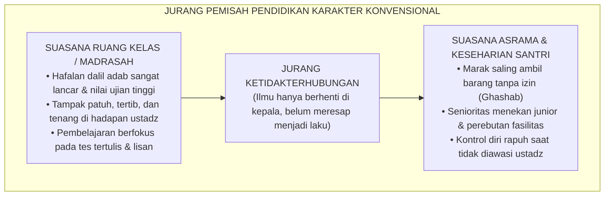
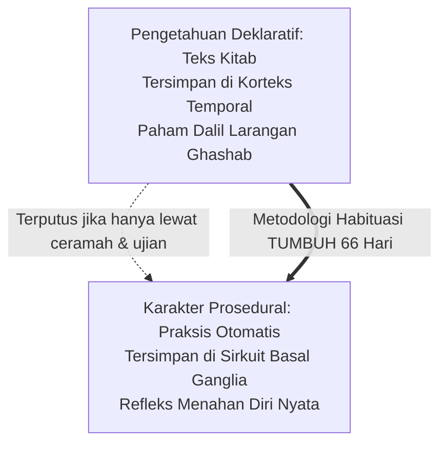
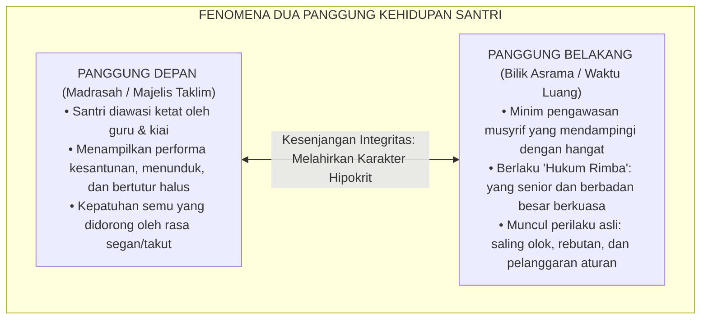
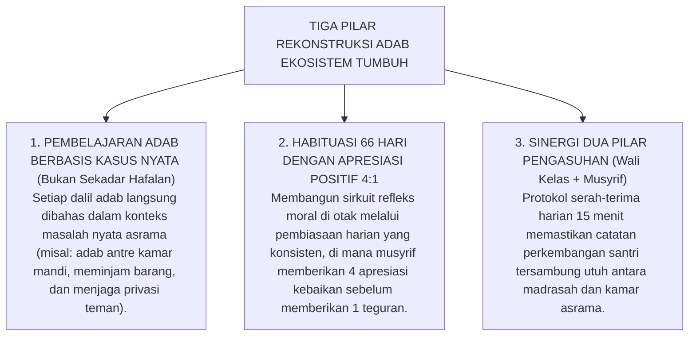

# SUB-BAB 1.1: ANOMALI PENDIDIKAN KARAKTER TRADISIONAL
## *Menyingkap Tabir Jurang Pemisah antara Hafalan Kitab Adab dan Realitas Perilaku Keseharian di Asrama*

**Kode Klasifikasi**: `BOOK-01/BAB-01/SUB-01/MONOGRAF`  
**Disiplin Ilmu**: Fenomenologi Pendidikan Islam, Sosiologi Pesantren, & Neurosains Kognitif Moral  
**Dewan Penanggung Jawab**: `pakar-filosofi-tumbuh`, `pakar-epistemologi-turats`, `pakar-psikologi-sosial-santri`

---

### 1. Potret Nyata di Lapangan: Mengapa Santri Hafal Kitab Masih Gemar 'Ghashab'?

Di tengah kegelisahan masyarakat modern terhadap kemerosotan moral generasi muda, pesantren selalu dipandang sebagai oase peradaban dan benteng pertahanan akhlak yang paling kokoh. Harapan para orang tua begitu tinggi: ketika menitipkan anak ke pondok pesantren, mereka membayangkan anaknya akan tumbuh menjadi pribadi yang santun, tertib, berbakti, dan berakhlak mulia. 

Namun, jika kita berani membuka pintu asrama secara jujur dan melihat realitas apa adanya, kita sering kali mendapati sebuah ironi yang membingungkan:

> [!WARNING]
> **Paradoks Nyata Pendidikan Karakter Pesantren:**  
> Seorang santri dapat melantunkan bait-bait nazham *Ta'lim al-Muta'allim* dengan sangat fasih, menghafal teks *Bidayatul Hidayah* di luar kepala, dan meraih nilai 100 (*Mumtaz*) dalam ujian kitab akhlak. Akan tetapi, begitu keluar dari ruang kelas menuju asrama, santri yang sama tidak segan-segan menyerobot antrean wudhu, mengambil sandal kawan tanpa izin (*ghashab*), menyembunyikan gayung mandi orang lain, mengotori lorong kamar, hingga melontarkan ejekan verbal yang menyakitkan kepada temannya.

Kesenjangan ini melahirkan pertanyaan mendasar: **Mengapa ilmu adab yang dipelajari selama bertahun-tahun seolah menguap begitu saja saat santri berada di luar pengawasan guru?** 

Jawabannya bukan karena santri tersebut "berbakat jahat", melainkan karena sistem pendidikan kita selama ini terjebak pada metode pengajaran yang keliru: **menganggap bahwa mengajarkan dalil adab sama dengan membentuk karakter adab.**

---

### 2. Mengapa Hafalan Tidak Otomatis Menjadi Karakter?

Untuk memahami akar masalah ini, kita perlu membedah cara otak manusia menyimpan dan memproses informasi. Riset neurosains dan psikologi kognitif (Squire, 2004; Anderson, 1983) membuktikan bahwa otak manusia membagi pengetahuan ke dalam dua laci ingatan yang bekerja dengan cara sangat berbeda:

#### A. Memori Deklaratif (Pengetahuan Teori / *Knowing That*)
* **Letak di Otak**: Disimpan di lobus temporal dan korteks serebral.
* **Karakteristik**: Berisi kumpulan fakta, hafalan teks, hukum fiqh, dan dalil-dalil agama.
* **Cara Mengakses**: Diingat secara sadar ketika ada pertanyaan ujian atau saat diminta berceramah.
* **Contoh Santri**: Santri tahu dan hafal dalil bahwa *"Mengambil barang orang lain tanpa izin itu haram dan dosa besar."*

#### B. Memori Prosedural (Pengetahuan Praktik & Kebiasaan Otomatis / *Knowing How*)
* **Letak di Otak**: Tertanam di jaringan saraf *Basal Ganglia* dan *Serebelum*.
* **Karakteristik**: Berisi gerakan refleks bawah sadar, reaksi emosi spontan, dan pola perilaku harian.
* **Cara Mengakses**: Berjalan otomatis tanpa perlu dipikirkan lama.
* **Contoh Santri**: Refleks spontan untuk menahan tangan dari menyentuh sandal orang lain meskipun sedang terburu-buru ke masjid.

> [!IMPORTANT]
> **Letak Kesalahan Fatal Pembinaan Konvensional:**  
> Kebanyakan pesantren hanya membina **Memori Deklaratif** (menambah jam hafalan kitab, memperbanyak ceramah, menguji hafalan matan), lalu berharap secara ajaib hafalan tersebut akan berubah sendiri menjadi **Memori Prosedural** (karakter otomatis). Padahal, jembatan yang menghubungkan kedua memori ini bukanlah *ceramah*, melainkan **habituasi terstruktur, pengulangan berulang, pendampingan nyata, dan teladan langsung selama 24 jam.**

Inilah yang dijelaskan oleh pemikir pendidikan Islam terkemuka, Prof. Dr. Syed Muhammad Naquib al-Attas. Beliau mengingatkan bahwa krisis umat berakar dari hilangnya **Ta'dib** (penanaman adab dan penataan jiwa) yang terdegradasi menjadi sekadar **Ta'lim** (transfer informasi dan pengetahuan belaka). Ketika adab hanya diajarkan sebagai wacana teori, yang lahir adalah santri yang pandai berdebat tentang dalil akhlak, tetapi miskin keteladanan dalam bersikap.

---

### 3. Fenomena 'Dua Wajah' Santri: Santun di Depan Kiai, Liar di Belakang Musyrif

Secara sosiologis, pemisahan antara materi kelas dan dinamika asrama menciptakan fenomena **Dua Panggung Kehidupan** (meminjam teori sosiologi Erving Goffman):

#### Tiga Pemicu Rusaknya Karakter di Panggung Belakang:
1. **Feodalisme Senioritas**: Doktrin keliru bahwa santri senior berhak memperlakukan adik kelas sesuka hati (misal: menyuruh mencuci pakaian atau memijat tanpa imbalan). Hal ini merusak rasa persaudaraan (*Ukhuwah*) dan menanamkan bibit dendam yang akan dilampiaskan kembali saat santri junior naik tingkat.
2. **Normalisasi Bahasa Kasar**: Obrolan bernada ejekan fisik atau panggilan buruk dianggap sebagai candaan biasa antar-teman, sehingga mengikis sifat malu (*al-Haya'*) dan kelembutan hati.
3. **Tekanan Teman Sebaya (*Peer Pressure*)**: Santri yang mencoba hidup tertib dan menjaga adab sering kali diejek sebagai anak yang "sok alim" atau "sok suci", sehingga mereka akhirnya memilih ikut melanggar aturan demi bisa diterima dalam pergaulan asrama.

---

### 4. Menelaah Wasiat Ulama Salaf: Ilmu yang Tidak Menjadi Amal adalah Bencana

Kritik terhadap ilmu yang hanya tersimpan di lisan tanpa menyentuh hati bukanlah hal baru. Para ulama besar terdahulu telah memberikan peringatan yang sangat tegas:

> [!NOTE]
> ### 📜 Peringatan Imam Al-Ghazali dalam Risalah *Ayyuhal Walad*:
> 
> $$\text{أَيُّهَا الْوَلَدُ، الْعِلْمُ بِلَا عَمَلٍ جُنُونٌ، وَالْعَمَلُ بِغَيْرِ عِلْمٍ لَا يَكُونُ. وَاعْلَمْ أَنَّ عِلْمًا لَا يُبْعِدُكَ الْيَوْمَ عَنِ الْمَعَاصِي، وَلَا يَحْمِلُكَ عَلَى الطَّاعَةِ، لَنْ يُبْعِدَكَ غَدًا عَنْ نَارِ جَهَنَّمَ}$$
> 
> **Artinya:**  
> *"Wahai anakku! Ilmu tanpa amal adalah kegilaan, dan amal tanpa ilmu adalah kesia-siaan. Ketahuilah, ilmu yang tidak mampu menjauhkanmu dari perbuatan maksiat pada hari ini, dan tidak mendorongmu untuk taat beribadah, niscaya tidak akan mampu menyelamatkanmu dari siksa api neraka di hari esok!"*  
> *(Imam Abu Hamid Al-Ghazali, Kitab Ayyuhal Walad, hlm. 12)*

> [!NOTE]
> ### 📜 Nasihat Hadhratusy Syaikh KH. M. Hasyim Asy'ari dalam *Adab al-'Alim wal Muta'allim*:
> 
> $$\text{قَالَ بَعْضُ السَّلَفِ: الْأَدَبُ فِي الْعَمَلِ عَلَامَةُ قَبُولِ الْعَمَلِ. وَقَالَ ابْنُ الْمُبَارَكِ: طَلَبْتُ الْأَدَبَ ثَلَاثِينَ سَنَةً، وَطَلَبْتُ الْعِلْمَ عِشْرِينَ سَنَةً، وَكَانُوا يَطْلُبُونَ الْأَدَبَ قَبْلَ الْعِلْمِ}$$
> 
> **Artinya:**  
> *"Sebagian ulama salaf menegaskan: 'Keberadaan adab di dalam suatu amal perbuatan adalah tanda diterimanya amal tersebut di sisi Allah.' Ulama besar Abdullah bin al-Mubarak berkata: 'Aku mendalami adab selama 30 tahun, dan aku mempelajari ilmu agama selama 20 tahun; dan sungguh para ulama terdahulu selalu mempelajari adab terlebih dahulu sebelum menuntut ilmu.'"*  
> *(KH. M. Hasyim Asy'ari, Kitab Adab al-'Alim wal Muta'allim, hlm. 9)*

Kutipan-kutipan di atas mempertegas bahwa keberhasilan sebuah pesantren tidak diukur dari berapa banyak halaman kitab yang dikhatamkan santri, melainkan **seberapa dalam nilai-nilai adab tersebut menjelma menjadi akhlak nyata saat santri makan, tidur, berbicara, dan bergaul dengan sesamanya.**

---

### 5. Jalan Keluar Ekosistem TUMBUH: Mengubah Dalil Menjadi Karakter Otomatis

Untuk meruntuhkan jurang pemisah ini, Ekosistem **TUMBUH** merancang rekonstruksi pembinaan menyeluruh yang mengintegrasikan ruang kelas dengan kehidupan asrama secara padu:

1. **Membumikan Teori ke Praktik Harian**:  
   Ketika santri mempelajari bab *Amanah* di madrasah, di hari yang sama musyrif di asrama memberikan simulasi dan latihan nyata: santri dilatih menandai barang milik pribadi, menghormati loker teman, dan mempraktikkan izin sebelum meminjam barang.
2. **Mengubah Peran Musyrif: Dari 'Polisi Kamar' Menjadi 'Qudwah & Pembimbing'**:  
   Musyrif tidak lagi bertugas sekadar mencari-cari kesalahan santri dengan rotan atau poin pelanggaran, melainkan menjadi figur teladan yang hadir menyapa, mendengarkan keluh kesah, serta mengapresiasi setiap inisiatif kebaikan santri sekecil apa pun.
3. **Membangun Budaya Saling Mengayomi (*Servant Leadership*)**:  
   Senioritas feodal dihapus total. Santri kelas atas tidak lagi dilayani, melainkan dilatih menjadi pengayom (*Peer Mentors*) yang bertanggung jawab membantu adik kelas yang rindu rumah (*homesick*), mengajarkan cara merapikan tempat tidur, dan menjadi teladan dalam shalat berjamaah.

Dengan pendekatan ini, adab tidak lagi menjadi beban hafalan di atas kertas ujian, melainkan bertransformasi menjadi **identitas diri yang memancar secara alami, penuh keikhlasan, dan melekat seumur hidup**.
