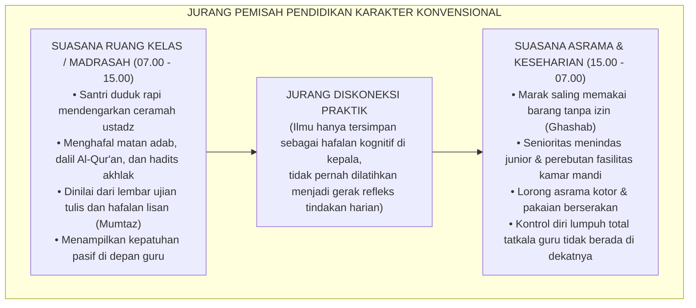
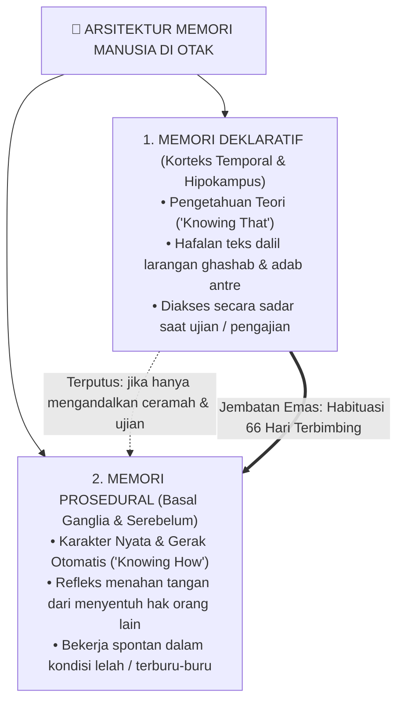
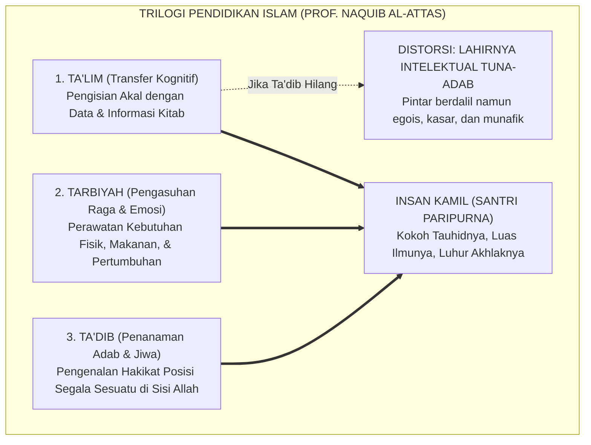
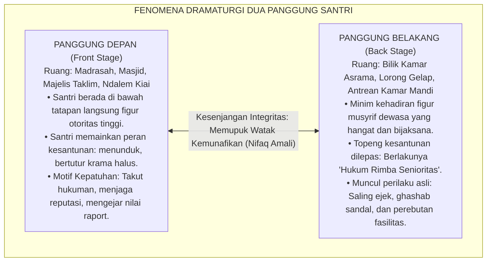
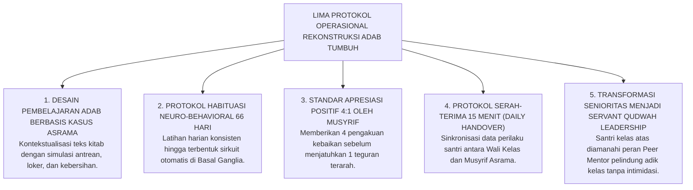
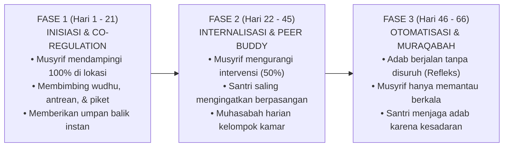
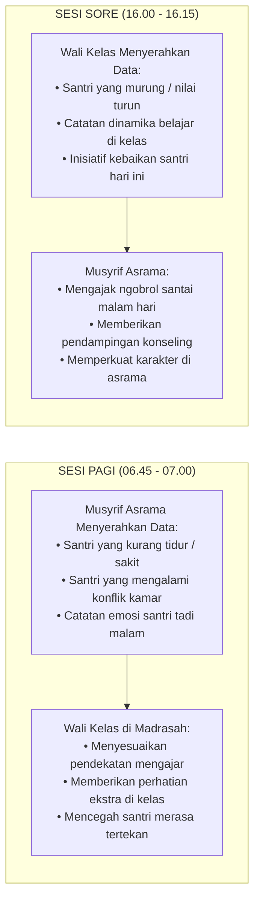

# SUB-BAB 1.1: ANOMALI PENDIDIKAN KARAKTER TRADISIONAL
## *Menyingkap Tabir Jurang Pemisah antara Hafalan Kitab Adab dan Realitas Perilaku Keseharian di Asrama*

**Kode Klasifikasi**: `BOOK-01/BAB-01/SUB-01/PANDUAN-INDUK-KOMPREHENSIF`  
**Disiplin Ilmu**: Fenomenologi Pendidikan Islam, Sosiologi Pesantren, Neurosains Kognitif Terapan, & Epistemologi Turats  
**Penanggung Jawab Keilmuan**: Dewan Pakar Ekosistem TUMBUH (*Pakar Filosofi, Epistemologi Turats, Neurosains Perkembangan, & Arsitektur PBIS*)

---

### 1. Pintu Masuk: Paradoks Kesalehan Formalistik di Ruang Pesantren

Di tengah kegelisahan masyarakat modern terhadap krisis disorientasi moral generasi muda, pesantren selalu diposisikan sebagai oase peradaban dan benteng pertahanan spiritual terakhir (*the last bastion of moral civilization*). Para orang tua menitipkan anak-anak mereka ke pondok pesantren dengan sebuah ekspektasi luhur: di balik tembok asrama, anak-anak mereka akan bertransformasi menjadi pribadi yang saleh, bertutur kata santun, berjiwa mandiri, berbakti kepada orang tua, dan menghiasi diri dengan kemuliaan akhlak nabawi.

Namun, tatkala kita memasuki lorong-lorong asrama secara jujur, objektif, dan mengamati kehidupan santri selama 24 jam penuh tanpa rekayasa protokoler, kita kerap kali dihadapkan pada kenyataan lapangan yang sangat membingungkan:

> [!WARNING]
> ### 🔍 Potret Paradoksal di Lapangan:
> Seorang santri mampu melantunkan bait-bait nadhom *Ta'lim al-Muta'allim* dengan intonasi fasih, menghafal matan *Bidayatul Hidayah* karya Hujjatul Islam Imam Al-Ghazali di luar kepala, serta meraih nilai 100 (*Mumtaz*) dalam ujian tulis mata pelajaran adab.
> 
> Akan tetapi, pemandangan yang bertolak belakang secara dramatis terjadi hanya beberapa saat setelah bel tanda usai pelajaran berbunyi:
> 1. **Perebutan Fasilitas & Agresi Fisik**: Santri yang sama berlari kencang menyerobot antrean wudhu masjid, menyikut kawan yang lebih kecil, dan berebut gayung mandi dengan nada suara tinggi.
> 2. **Budaya Mengambil Hak Orang (*Ghashab*)**: Sandal, sajadah, sarung, hingga ember kawan sekamar dipakai tanpa izin (*ghashab*) dengan dalih keliru: *"Di pondok, semua barang adalah milik bersama."*
> 3. **Penyembunyian Barang & Egoisme**: Fasilitas umum seperti gayung atau sabun disembunyikan di atas plafon kamar mandi atau di kolong lemari agar tidak bisa dimanfaatkan santri lain.
> 4. **Kebersihan yang Terabaikan**: Pakaian kotor dibiarkan menumpuk berhari-hari di pojok ranjang hingga menebarkan aroma tidak sedap, sisa makanan berserakan di teras kamar, dan sampah plastik dibuang sembarangan di balik jendela.
> 5. **Kekerasan Verbal Terselubung**: Di dalam bilik asrama pada malam hari, terlontar ejekan fisik (*body shaming*), panggilan nama hewan, sarkasme tajam, hingga pengucilan sosial yang membuat santri yunior menangis tertekan di bawah selimutnya tanpa ada musyrif yang mendampingi.

<b>Gambar 1.1.1:</b> Diagram Jurang Pemisah antara Pembelajaran Kelas Madrasah dan Realitas Keseharian Asrama.

Kondisi anomali ini melahirkan pertanyaan epistemologis dan pedagogis yang sangat mendasar bagi para kiai, asatidz, dan pengelola lembaga pendidikan Islam:  
*Mengapa ribuan jam pengajian kitab kuning, ratusan bait nadhom adab yang dihafal, dan atmosfer religius pesantren yang sedemikian kental belum sanggup mengikis dorongan primitif santri untuk berbuat zalim, egois, dan kasar kepada saudaranya sendiri? Mengapa ilmu yang dipelajari di madrasah seolah menguap tanpa bekas begitu santri melangkahkan kaki masuk ke dalam bilik kamar tidur mereka?*

Jawabannya sangat tegas dan ilmiah: **Anomali ini bukan disebabkan oleh fitrah santri yang rusak atau watak anak yang "berbakat jahat", melainkan karena sistem pendidikan karakter kita selama ini terjebak dalam kesalahan metodologis fatal—yaitu menyamakan antara *mengajarkan teks dalil adab* dengan *membentuk refleks karakter adab*.**

---

### 2. Membedah Sains Kognitif: Mengapa Hafalan Teks Tidak Otomatis Menjadi Akhlak?

Untuk mengurai akar kebuntuan ini secara tuntas, kita harus menelaah bagaimana otak manusia memproses, mengonsolidasikan, dan mengeksekusi suatu informasi menjadi perilaku nyata. 

Dalam disiplin neurosains kognitif dan psikologi memori (merujuk pada riset fundamental Larry Squire[^1], John Anderson[^2], serta teori pemrosesan ganda Daniel Kahneman[^3]), otak manusia tidak menyimpan seluruh pengetahuan di satu tempat yang sama. Otak membagi sistem memori ke dalam dua kompartemen sirkuit saraf yang bekerja dengan logika dan mekanisme yang bertolak belakang:

<b>Gambar 1.1.2:</b> Arsitektur Sistem Memori di Otak: Memori Deklaratif (Teori) vs Memori Prosedural (Praktik Refleks).

#### A. Memori Deklaratif (*Declarative / Semantic Memory* - "Knowing That")
* **Lokasi Sirkuit di Otak**: Diproses melalui *Hipokampus* dan disimpan di lapisan *Neokorteks* (terutama korteks temporal dan prefrontal).
* **Hakikat & Sifat**: Merupakan memori sadar yang berisi fakta verbal, hafalan dalil Al-Qur'an, matan hadits, definisi hukum fikih, dan kaidah-kaidah moral.
* **Mekanisme Akses**: Memori ini bekerja lambat dan menuntut konsentrasi nalar sadar (*System 2 / Controlled Processing*). Ketika seorang santri ditanya oleh gurunya: *"Sebutkan dalil larangan ghashab dan ancaman hukumannya!"*, santri akan mengaktifkan hipokampusnya, mengingat kembali hafalan kitab, dan menjawab dengan lancar: *"Nabi SAW bersabda bahwa barang siapa mengambil sejengkal tanah secara zalim, Allah akan mengalungkannya dengan tujuh lapis bumi."*
* **Keterbatasan Biologis**: Memori deklaratif tidak terhubung secara otomatis ke sistem motorik penggerak tubuh saat santri berada di bawah tekanan emosi, kelelahan, ketergesa-gesaan, atau dorongan instingtif.

#### B. Memori Prosedural (*Procedural / Behavioral Memory* - "Knowing How")
* **Lokasi Sirkuit di Otak**: Tertanam kokoh di sirkuit saraf bawah sadar (*Subcortical Network*), khususnya *Basal Ganglia*, *Striatum*, dan *Serebelum*.
* **Hakikat & Sifat**: Merupakan memori bawah sadar yang mengendalikan refleks otomatis, kebiasaan harian (*habits*), dan respons motorik cepat tanpa perlu berpikir panjang (*System 1 / Automatic Processing*).
* **Manifestasi Nyata pada Santri**: 
  * Santri yang sedang terburu-buru mengejar adzan subuh yang berkumandang, secara refleks menahan kakinya untuk tidak memakai sandal kawan yang terletak persis di depan pintu kamarnya, lalu tetap tenang bertelanjang kaki mencari sandalnya sendiri di rak.
  * Santri yang melihat sampah plastik di lorong kamar secara spontan membungkukkan badan dan memungutnya ke tempat sampah tanpa menunggu perintah musyrif dan tanpa mengharapkan pujian siapa pun.

> [!IMPORTANT]
> ### 🚗 Analogi Komparatif: Belajar Teori Otomotif vs Keterampilan Menyetir Nyata
> Bayangkan seseorang yang ingin mahir menyemudikan mobil di jalan raya. Ia membaca buku panduan teknik mengemudi setebal 1.000 halaman, menghafal seluruh fungsi pedal gas, rem, kopling, persneling, sudut kemudi, serta seluruh rambu lalu lintas hingga berhasil meraih nilai 100 (*sempurna*) dalam ujian tertulis di kantor kepolisian.
> 
> Pertanyaannya: **Apakah orang tersebut bisa langsung kita lepaskan mengemudikan mobil di jalan raya yang padat dan macet tanpa pernah berlatih praktik di balik kemudi?**
> 
> Tentu saja tidak! Tatkala ada kendaraan lain yang tiba-tiba memotong jalurnya secara mendadak, hafalan teori di lembar ujiannya tidak akan sanggup menyelamatkannya. Otak sadarnya (*PFC*) membutuhkan waktu sepersekian detik untuk berpikir, sementara tubuhnya belum memiliki memori prosedural (*muscle memory*) di kakinya untuk menginjak pedal rem dalam hitungan milidetik.
> 
> Hal yang persis sama terjadi dalam pendidikan karakter santri: **Menghafal 100 hadits tentang keutamaan sabar, amanah, dan persaudaraan tidak akan pernah otomatis melahirkan santri yang berakhlak mulia, kecuali jika nilai-nilai tersebut dilatihkan secara nyata, diulang-ulang secara konsisten, didampingi langsung oleh musyrif, dan dipraktikkan dalam kehidupan asrama 24 jam.**

---

### 3. Hilangnya Hakikat Ta'dib: Kritik Epistemologis atas Reduksi Menjadi Sekadar Ta'lim

Krisis diskoneksi ini bukanlah sekadar problem psikologi modern, melainkan berakar dari distorsi filosofis yang telah menimpa dunia pendidikan Islam selama berabad-abad. Sebagaimana dianalisis secara tajam oleh filsuf dan sejarawan pendidikan Islam terkemuka, **Prof. Dr. Syed Muhammad Naquib al-Attas**[^4], peradaban Islam mengalami kemunduran tatkala terjadi kerancuan konseptual (*confusion of concepts*) dalam memaknai tiga pilar pendidikan Islam:

<b>Gambar 1.1.3:</b> Perbedaan Struktur Tiga Ranah Pendidikan Islam dan Dampak Hilangnya Pilar Ta'dib.

#### Rincian Perbedaan Tiga Ranah Pembinaan:

| Ranah Pembinaan | Terminologi Turats | Sasaran Utama Manusia | Instrumen Evaluasi | Output Karakter yang Dihasilkan |
| :--- | :--- | :--- | :--- | :--- |
| **Pengajaran Ilmu** | **Ta'lim (تعليم)** | Daya Nalar Akal (*al-Quwwah al-Aqliyyah*) | Ujian tulis, tes lisan, hafalan bait nadhom. | Santri berwawasan luas, faham teks, menguasai dalil fiqhiyyah. |
| **Pengasuhan Fisik** | **Tarbiyah (تربية)** | Raga & Nafsu Biologis (*al-Jasad wan-Nafs*) | Pengukuran gizi, kesehatan, jam tidur, fasilitas kamar. | Santri sehat, bugar, terawat kebutuhan fisik dan emosinya. |
| **Penanaman Adab** | **Ta'dib (تأديب)** | Kalbu & Jiwa (*al-Qalb war-Ruh*) | Observasi perilaku harian, kepekaan empati, integritas 24 jam. | **Insan Adabi**: Santri yang refleks perilakunya selaras dengan ridha Allah. |

> [!CAUTION]
> ### ⚠️ Bahaya Fatal Reduksi Ta'dib Menjadi Sekadar Ta'lim:
> Tatkala sebuah pesantren mereduksi kurikulum akhlaknya menjadi sekadar pengajaran *Ta'lim* (hafalan kitab dan ujian teori), maka pesantren tersebut sesungguhnya sedang memproduksi **"Intelektual Agama yang Tuna-Adab"**:  
> Yaitu sosok manusia yang lisannya sangat fasih mengutip ayat dan hadits untuk menghakimi kesalahan orang lain, namun kalbunya buta dari rasa empati, tangannya gemar berbuat zalim, perilakunya egois di ruang publik, dan tidak memiliki rasa malu (*Haya'*) tatkala melanggar norma kehormatan saudaranya sendiri.

---

### 4. Sosiologi Asrama: Fenomena 'Dua Panggung' dan Munculnya Kepribadian Terbelah

Mengapa santri bisa tampak sangat santun, menunduk takzim, dan patuh di hadapan kiai atau guru madrasah, namun mendadak berubah menjadi sosok yang liar, agresif, dan pembangkang saat berada di kamar asrama?

Sosiolog ternama **Erving Goffman** (1959)[^5] dalam mahakaryanya *The Presentation of Self in Everyday Life* merumuskan teori dramaturgi yang menjelaskan bahwa manusia dalam suatu institusi total (*total institution*) cenderung membelah kehidupannya menjadi dua panggung sosial:

<b>Gambar 1.1.4:</b> Dinamika Dua Panggung (Dramaturgi Sosiologis) dalam Kehidupan Santri Pesantren.

#### Tiga Penyakit Sosial yang Merusak Panggung Belakang Asrama:

1. **Feodalisme Senioritas Rimba**:  
   Adanya doktrin keliru yang diwariskan turun-temurun bahwa *"Santri senior adalah raja kecil yang berhak dilayani oleh adik kelasnya."* Santri baru dipaksa mencuci pakaian senior, membelikan makanan di kantin, membersihkan kasur senior, hingga menjadi sasaran pelampiasan amarah saat senior mengalami stres. Praktik penindasan ini menanamkan luka batin (*trauma emosional*) dan bibit dendam pada santri yunior, yang kelak akan mereka balas kembali kepada santri baru berikutnya tatkala mereka naik tingkat.
2. **Normalisasi Bahasa Kasar & Ejekan (*Pejorative Humor*)**:  
   Di dalam kamar asrama, penggunaan kata-kata kotor, hinaan fisik, dan candaan bernada seksual kerap dianggap sebagai simbol "keakraban pria sejati". Santri yang tidak ikut mengumpat dianggap kaku atau tidak asyik. Kebiasaan ini secara perlahan mengikis rasa malu (*al-Haya'*) dan mematikan kelembutan hati yang menjadi inti dari akhlak Islam.
3. **Tekanan Konformitas Teman Sebaya (*Peer Group Conformity*)**:  
   Berdasarkan psikologi sosial remaja (Brown & Larson, 2009)[^6], kebutuhan remaja untuk diterima oleh kelompok sebayanya (*peer acceptance*) jauh lebih kuat daripada kepatuhan terhadap aturan formal. Tatkala seorang santri yang saleh mencoba istiqamah menjaga adab di kamar, ia kerap kali dirundung dengan julukan *"sok alim"*, *"anak mami"*, atau *"sok suci"*, sehingga demi bertahan hidup dan terhindar dari pengucilan sosial (*social ostracism*), santri tersebut akhirnya terpaksa berkompromi dan ikut melanggar aturan bersama kawan-kawannya.

---

### 5. Menghidupkan Kembali Wasiat Emas Ulama Salaf tentang Bahaya Ilmu yang Mandul

Kritik tajam terhadap fenomena ilmu yang hanya berhenti di tenggorokan tanpa pernah meresap menjadi amal kebajikan bukanlah hal baru. Para ulama *muhaqqiqin* terdahulu telah melayangkan peringatan keras mengenai bahaya formalisme agama:

> [!NOTE]
> ### 📜 1. Wasiat Hujjatul Islam Imam Abu Hamid Al-Ghazali dalam *Ayyuhal Walad*:[^7]
> 
> $$\text{أَيُّهَا الْوَلَدُ، الْعِلْمُ بِلَا عَمَلٍ جُنُونٌ، وَالْعَمَلُ بِغَيْرِ عِلْمٍ لَا يَكُونُ. وَاعْلَمْ أَنَّ عِلْمًا لَا يُبْعِدُكَ الْيَوْمَ عَنِ الْمَعَاصِي، وَلَا يَحْمِلُكَ عَلَى الطَّاعَةِ، لَنْ يُبْعِدَكَ غَدًا عَنْ نَارِ جَهَنَّمَ، وَإِنْ لَمْ تَعْمَلِ الْيَوْمَ وَلَمْ تَتَدَارَكِ الْأَيَّامَ الْمَاضِيَةَ، تَقُولُ غَدًا يَوْمَ الْقِيَامَةِ: فَارْجِعْنَا نَعْمَلْ صَالِحًا، فَيُقَالُ: يَا أَحْمَقُ، أَنْتَ مِنْ هُنَاكَ تَجِيءُ!}$$
> 
> **Artinya:**  
> *"Wahai anakku! Ilmu tanpa amal adalah kegilaan, dan amal tanpa ilmu adalah kesia-siaan yang tak berwujud.*  
> *Ketahuilah, sesungguhnya ilmu yang tidak mampu menjauhkanmu dari perbuatan maksiat pada hari ini, dan tidak sanggup mendorongmu untuk taat beribadah, niscaya ia tidak akan pernah mampu menyelamatkanmu dari jilatan api neraka Jahannam di hari esok!*  
> *Jika engkau tidak segera mengamalkan ilmumu hari ini dan tidak memperbaiki hari-harimu yang telah lalu, niscaya pada hari kiamat kelak engkau akan meratap: 'Ya Tuhan kami, kembalikanlah kami ke dunia agar kami dapat beramal saleh!' Maka akan dikatakan kepadamu: 'Wahai orang yang bodoh, bukankah engkau baru saja datang dari sana?!'"*

> [!NOTE]
> ### 📜 2. Nasihat Hadhratusy Syaikh KH. M. Hasyim Asy'ari dalam *Adab al-'Alim wal Muta'allim*:[^8]
> 
> $$\text{قَالَ بَعْضُ السَّلَفِ: الْأَدَبُ فِي الْعَمَلِ عَلَامَةُ قَبُولِ الْعَمَلِ. وَقَالَ ابْنُ الْمُبَارَكِ: طَلَبْتُ الْأَدَبَ ثَلَاثِينَ سَنَةً، وَطَلَبْتُ الْعِلْمَ عِشْرِينَ سَنَةً، وَكَانُوا يَطْلُبُونَ الْأَدَبَ قَبْلَ الْعِلْمِ. وَقَالَ الشَّافِعِيُّ رَحِمَهُ اللَّهُ: طَلَبِي لِلْأَدَبِ كَطَلَبِ الْمَرْأَةِ الْمُضِلَّةِ وَلَدَهَا لَيْسَ لَهَا غَيْرُهُ}$$
> 
> **Artinya:**  
> *"Sebagian ulama salaf menegaskan: 'Keberadaan adab di dalam suatu amal perbuatan adalah tanda diterimanya amal tersebut di sisi Allah.'*  
> *Ulama besar Abdullah bin al-Mubarak menyatakan: 'Aku mendalami adab selama tiga puluh tahun, dan aku mempelajari ilmu syariat selama dua puluh tahun; dan sungguh para ulama terdahulu senantiasa menuntut adab terlebih dahulu sebelum mereka mulai menuntut ilmu.'*  
> *Imam Asy-Syafi'i rahimahullah bertutur: 'Kesungguhanku dalam mencari adab laksana seorang ibu yang mencari anak tunggalnya yang hilang, di mana ia tidak memiliki anak selainnya!'"*

> [!NOTE]
> ### 📜 3. Pesan Emas Imam Malik bin Anas kepada Pemuda Quraisy:[^9]
> 
> $$\text{تَعَلَّمِ الْأَدَبَ قَبْلَ أَنْ تَتَعَلَّمَ الْعِلْمَ، فَإِنَّ الْعِلْمَ كَثِيرٌ وَالْأَدَبَ مِيزَانُهُ}$$
> 
> **Artinya:**  
> *"Pelajarilah adab sebelum engkau mempelajari ilmu! Karena sesungguhnya ilmu itu sangatlah banyak, sedangkan adab adalah neraca timbangan yang menentukan nilainya."*

Seluruh mutiara Turats di atas memberikan satu kesimpulan tegas: **Kemuliaan sebuah lembaga pesantren tidak pernah ditentukan oleh seberapa banyak santri yang mampu menghafal matan kitab kuning secara verbal, melainkan seberapa dalam nilai-nilai adab tersebut mendarah-daging menjadi watak dan karakter otomatis saat santri berinteraksi di tengah masyarakat.**

---

### 6. Panduan Praktis Ekosistem TUMBUH: Protokol 5 Langkah Mengubah Dalil Menjadi Karakter Otomatis

Bagaimana cara meruntuhkan jurang pemisah antara ruang kelas dan kamar tidur santri secara konkret dan terukur di pesantren kita? Ekosistem **TUMBUH** merumuskan **Lima Protokol Operasional Pembinaan Adab Terpadu 24 Jam**:

<b>Gambar 1.1.5:</b> Lima Protokol Operasional Rekonstruksi Pembinaan Adab Terpadu 24-Jam Ekosistem TUMBUH.

---

#### PROTOKOL 1: Membumikan Teks Kitab ke dalam Kasus Nyata Asrama (*Case-Based Adab Learning*)
* **Praktik Tradisional yang Ditinggalkan**: Guru membacakan kitab adab secara monolog, memaknainya kata per kata dengan metode *makna gandul*, lalu menyuruh santri menghafalkannya untuk ujian tertulis tanpa pernah menghubungkannya dengan masalah kamar mandi atau jemuran asrama.
* **Standar Operasional TUMBUH**: Setiap bab adab wajib dikaitkan dengan **Dilema Kasus Nyata Asrama**.
  * *Contoh Penerapan*: Saat mengkaji bab *Hifzhul Mal* (Menjaga Harta Milik Orang Lain), asatidz tidak hanya menerangkan hukum ghashab secara fikih, melainkan memfasilitasi simulasi kelompok:  
    *"Jika antum bangun kesiangan dan sandal antum hilang, sementara adzan subuh tinggal 2 menit lagi, apa langkah beradab yang harus antum ambil tanpa menyentuh sandal milik kawan sekamar?"*
  * Santri diajak mendiskusikan alternatif solusi, merumuskan kesepakatan kamar, dan menandatangani pakta integritas adab barang milik pribadi.

---

#### PROTOKOL 2: Siklus Habituasi Neuro-Behavioral 66 Hari (*66-Day Habit Loop*)
Riset mutakhir dalam plastisitas otak (Lally et al., 2010)[^10] membuktikan bahwa pembentukan suatu kebiasaan baru (*habit formation*) membutuhkan waktu rata-rata **66 hari pengulangan harian yang konsisten** agar jalur sinapsis saraf di *Basal Ganglia* terbentuk sempurna.

Ekosistem TUMBUH membagi masa 66 hari pembiasaan karakter santri baru menjadi 3 fase terstruktur:

<b>Gambar 1.1.6:</b> Tiga Fase Trajektori Habituasi Karakter 66 Hari Ekosistem TUMBUH.

* **Fase 1: Inisiasi & Regulasi Bersama (*Co-Regulation*, Hari 1–21)**:  
  Musyrif asrama hadir secara fisik di setiap titik transisi krusial (pukul 04.00 saat bangun tidur, pukul 05.30 saat piket kamar, dan pukul 18.00 saat persiapan masjid) untuk memberikan teladan langsung, merapikan antrean secara tenang, dan membetulkan kekeliruan santri dengan senyuman hangat.
* **Fase 2: Internalisasi & Pendampingan Sebaya (*Peer Scaffolding*, Hari 22–45)**:  
  Musyrif mulai melonggarkan pengawasan langsung (*scaffolding decay*). Santri dipasangkan dalam sistem *Peer Buddy* (dua santri saling menjaga dan mengingatkan). Evaluasi difokuskan pada muhasabah malam selama 10 menit sebelum tidur.
* **Fase 3: Otomatisasi & Pengawasan Diri (*Self-Regulation & Muraqabah*, Hari 46–66)**:  
  Sirkuit kebiasaan di otak telah terbentuk. Perilaku merapikan tempat tidur, meletakkan sandal di rak, dan mengantre wudhu telah bermutasi menjadi memori prosedural yang berjalan secara otomatis tanpa perlu diawasi secara ketat oleh musyrif.

---

#### PROTOKOL 3: Standar Apresiasi Relasional 4:1 (*Firm & Kind Discipline*)
Otak manusia memiliki bias negatif (*negativity bias*): teguran yang kasar dan bentakan akan memicu amigdala terkunci dalam status *fight-or-flight*, mematikan nalar moral anak.

Oleh karena itu, Ekosistem TUMBUH mewajibkan setiap pendidik dan musyrif menerapkan **Rasio Emas 4 Apresiasi Kebaikan untuk Setiap 1 Teguran Terarah**:
* **Bentuk Apresiasi yang Dianjurkan (Apresiasi Proses, Bukan Pujian Fisik)**:  
  * *"Masya Allah, Ustadz sangat menghargai ketertiban antum yang rela menunggu giliran wudhu dengan sabar tadi pagi. Itu adalah wujud nyata adab seorang penuntut ilmu."*
  * *"Terima kasih banyak Akhi Fulan sudah berinisiatif menyapu lorong kamar yang kotor tanpa disuruh. Semoga Allah memberkahi langkah antum."*
* **Cara Menegur saat Santri Khilaf (*Calm & Restorative Feedback*)**:  
  Musyrif tidak membentak atau mencaci di depan umum. Musyrif mengajak santri berbicara empat mata di tempat yang nyaman (*Private Correction*), menatap matanya dengan penuh kasih sayang, dan mengajukan pertanyaan reflektif:  
  *"Akhi, tadi Ustadz perhatikan antum terburu-buru mengambil sandal kawan sekamar. Mari kita ingat kembali kesepakatan adab kamar kita: apa dampak perbuatan tadi bagi kenyamanan teman antum? Bagaimana cara antum memperbaikinya sekarang?"*

---

#### PROTOKOL 4: Protokol Serah-Terima Harian 15 Menit (*Daily Handover Protocol*)
Untuk meruntuhkan jurang pemisah antara madrasah (panggung depan) dan asrama (panggung belakang), pesantren menerapkan SOP wajib pertemuan singkat 15 menit antara Wali Kelas dan Musyrif Asrama:

<b>Gambar 1.1.7:</b> Alur Protokol Serah-Terima Harian 15 Menit (Handover) antara Wali Kelas dan Musyrif Asrama.

Didukung oleh aplikasi *Logbook Digital PBIS Pesantren*, tidak ada lagi santri yang mengalami kesulitan emosional yang luput dari radar perhatian pendidik. Lingkungan madrasah dan asrama tersambung menjadi satu kesatuan ekosistem pengasuhan 24 jam yang utuh.

---

#### PROTOKOL 5: Transformasi Senioritas Menjadi *Servant Qudwah Leadership*
Pesantren menghapus secara mutlak segala bentuk hak yudisial, pengadilan malam, dan wewenang penertiban fisik dari tangan santri senior. Struktur kepengurusan santri dirombak total dari sistem feodal menjadi **Kader Kepemimpinan Melayani (*Servant Leadership*)**:

1. **Peran sebagai Kakak Asuh (*Peer Mentors*)**:  
   Santri kelas atas diamanahi peran kehormatan sebagai pendamping adik kelas: menyambut santri baru dengan senyuman hangat, membantu membawakan tas bawaan, mengajarkan cara mencuci pakaian yang benar, dan menemani santri yang sedang menangis rindu rumah (*homesick*).
2. **Kriteria Kehormatan Baru**:  
   Ukuran wibawa seorang santri senior tidak lagi diukur dari seberapa keras suaranya membentak atau seberapa banyak adik kelas yang takut padanya, melainkan **seberapa besar rasa aman, kasih sayang, dan keteladanan ibadah (*Qudwah Hasanah*) yang ia berikan kepada santri yang paling lemah di asramanya.**

---

### 7. Rangkuman & Epilog Sub-Bab 1.1

Melalui pemahaman sains kognitif, pelurusan epistemologi Turats, dan penerapan 5 protokol operasional di atas, Ekosistem **TUMBUH** membuktikan bahwa krisis karakter di pesantren memiliki jalan keluar yang pasti dan terukur:

1. **Mengubah Paradigma**: Adab bukan sekadar materi hafalan kognitif untuk lulus ujian (*Ta'lim*), melainkan pembentukan watak luhur dan pembersihan jiwa (*Ta'dib & Tazkiyah*).
2. **Membangun Memori Prosedural**: Dalil-dalil suci yang dipelajari di ruang kelas dijembatani menuju gerak refleks nyata di asrama melalui **Siklus Habituasi 66 Hari** yang terstruktur.
3. **Menyinkronkan Dua Panggung**: Jurang antara madrasah dan asrama ditutup melalui kemitraan erat **Wali Kelas dan Musyrif**, didukung oleh penghapusan feodalisme senioritas menuju budaya **Ukhuwah Islamiyyah yang saling memuliakan**.

Dengan langkah rekonstruksi yang menyeluruh ini, pesantren akan kembali tampil sebagai mercusuar peradaban Islam yang sejati: melahirkan generasi santri yang tidak hanya cemerlang otaknya dan fasih lisannya, melainkan juga lembut hatinya, luhur pekertinya, dan memancarkan rahmat bagi seluruh alam semesta (*Rahmatan lil 'Alamin*).

---

## 📌 Catatan Kaki & Rujukan Primer

[^1]: **Larry R. Squire**, "Memory systems of the brain: A brief history and current perspective", *Neurobiology of Learning and Memory*, Vol. 82, No. 3 (2004), hlm. 171–177; serta **Larry R. Squire & Eric R. Kandel**, *Memory: From Mind to Molecules* (New York: Scientific American Library, 1999).
[^2]: **John R. Anderson**, *The Architecture of Cognition* (Cambridge: Harvard University Press, 1983); serta *Rules of the Mind* (Hillsdale: Lawrence Erlbaum Associates, 1993).
[^3]: **Daniel Kahneman**, *Thinking, Fast and Slow* (New York: Farrar, Straus and Giroux, 2011), Bab 1: "Two Systems", hlm. 19–30.
[^4]: **Prof. Dr. Syed Muhammad Naquib al-Attas**, *The Concept of Education in Islam: A Framework for an Islamic Philosophy of Education* (Kuala Lumpur: International Institute of Islamic Thought and Civilization / ISTAC, 1980), hlm. 15–35; serta *Aims and Objectives of Islamic Education* (Jeddah: King Abdulaziz University, 1979).
[^5]: **Erving Goffman**, *The Presentation of Self in Everyday Life* (New York: Anchor Books / Doubleday, 1959), Bab III: "Regions and Region Behavior", hlm. 106–140.
[^6]: **B. Bradford Brown & Jim Larson**, "Peer relationships in adolescence", dalam R. M. Lerner & L. Steinberg (Eds.), *Handbook of Adolescent Psychology: Contextual Influences on Adolescent Development* (Hoboken: John Wiley & Sons, 2009), Vol. 2, hlm. 74–103.
[^7]: **Hujjatul Islam Imam Abu Hamid al-Ghazali**, *Ayyuhal Walad fi Nashihat at-Talamidz*, Tahqiq: Dr. Ahmad Ahmad Badawi (Kairo: Dar al-Qalam, 1986), hlm. 12–15.
[^8]: **Hadhratusy Syaikh KH. M. Hasyim Asy'ari**, *Adab al-'Alim wal Muta'allim fi ma Yahtaju Ilayhi al-Muta'allim fi Ahwal Ta'allumihi wa ma Yatawaqqafu 'alayhi al-Mu'allim fi Maqamat Ta'limihi* (Jombang: Maktabah at-Turats al-Islami, 1415 H), hlm. 9–12.
[^9]: **Al-Khatib Al-Baghdadi**, *Al-Jami' li Akhlaq ar-Rawi wa Adab as-Sami'*, Tahqiq: Dr. Mahmud ath-Thahhan (Riyadh: Maktabah al-Ma'arif, 1403 H), Juz I, hlm. 80.
[^10]: **Phillippa Lally, Cornelia H. M. van Jaarsveld, Henry W. W. Potts, & Jane Wardle**, "How are habits formed: Modelling habit formation in the real world", *European Journal of Social Psychology*, Vol. 40, No. 6 (2010), hlm. 998–1009.
