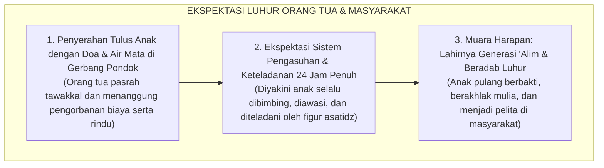
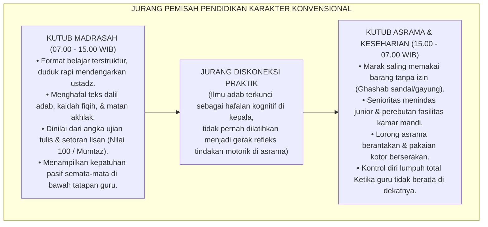
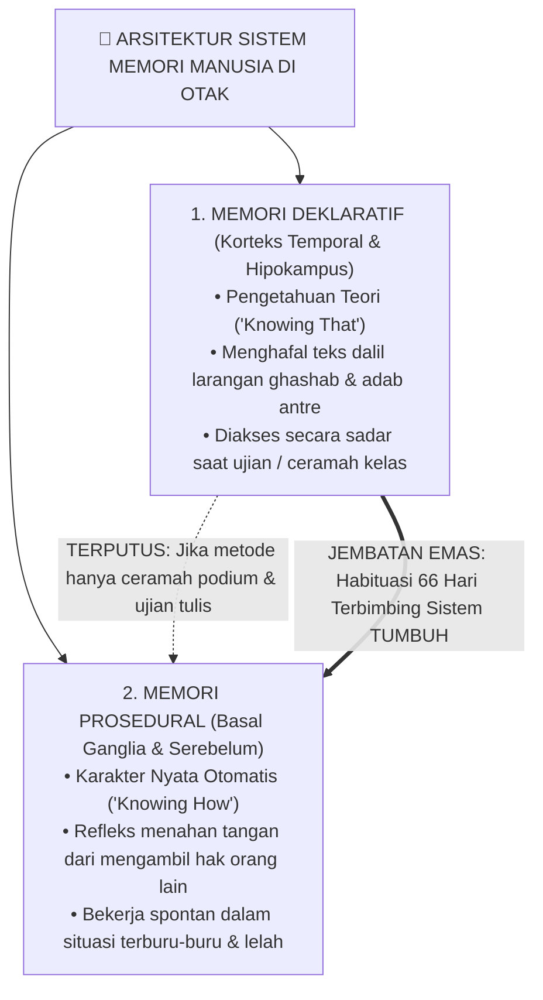
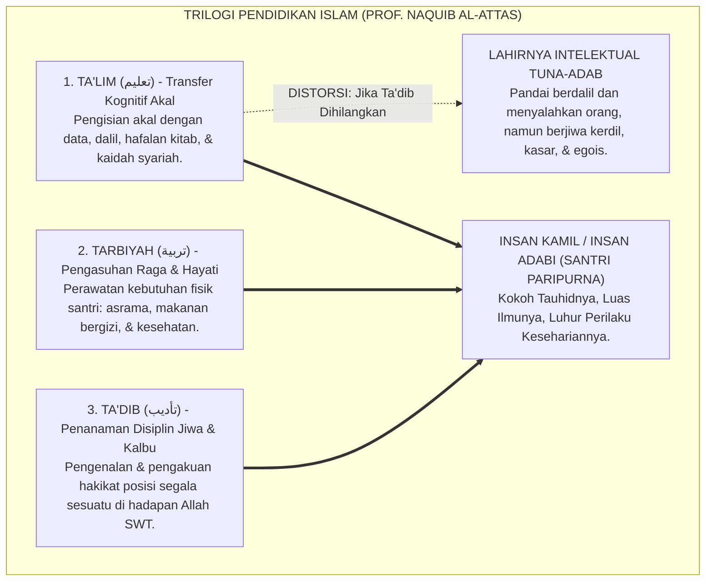
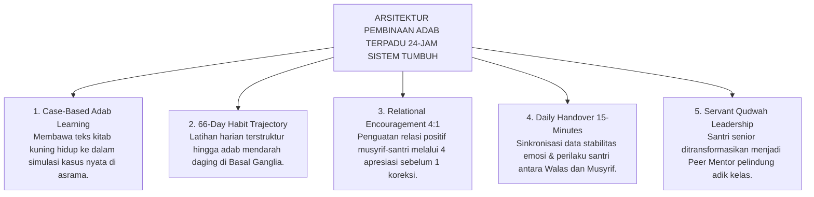

# ANOMALI PENDIDIKAN KARAKTER TRADISIONAL

---
### Air Mata di Balik Gerbang dan Tabir Paradoks Pesantren

Setiap awal tahun ajaran baru, sebuah pemandangan yang amat menyentuh kalbu selalu berulang di pelataran pondok-pondok pesantren di seluruh penjuru Nusantara.

Ribuan orang tua berdiri dengan mata berkaca-kaca di bawah terik matahari atau gerimis senja, memeluk erat putra-putri tercinta mereka sebelum melangkah pulang. Tangan seorang ayah yang kasar karena kerja keras memegang pundak anak lelakinya seraya berbisik penuh harap: *"Belajarlah yang sungguh-sungguh di sini, Nak. Jadilah orang yang alim, mandiri, dan berakhlak mulia."* Sementara seorang ibu, dengan suara bergetar menahan tangis perpisahan, menyerahkan buah hatinya kepada kiai dan dewan pengasuh dengan satu keyakinan teguh: di balik gerbang suci pesantren, anaknya akan dijaga, dibimbing, dan ditempa menjadi pribadi yang santun, jujur, berjiwa bersih, serta menghiasi diri dengan kemuliaan akhlak nabawi.

Masyarakat menaruh harapan yang teramat tinggi pada pesantren. Dinding-dinding asrama dipandang sebagai benteng pertahanan moral terakhir yang mampu melindungi generasi muda dari dekadensi zaman. Di pesantrenlah orang tua meyakini anak-anak mereka akan belajar hidup teratur, menghargai sesama, dan mempraktikkan sunnah Rasulullah SAW dalam setiap tarikan napas selama 24 jam penuh.

<b>Gambar 1.1.1:</b> Rantai Ekspektasi Luhur Orang Tua saat Menyerahkan Anak ke Pondok Pesantren.

Bagan di atas merangkum impian agung setiap orang tua: anak dititipkan dengan linangan air mata, diyakini akan dikawal akhlaknya siang dan malam oleh para guru teladan, hingga kelak pulang ke rumah membawa mahkota adab dan ilmu yang menyejukkan hati keluarga.

---

Namun, apa yang sebenarnya terjadi Ketika masa orientasi usai dan tirai keseharian pondok dibuka apa adanya? 

Bukan saat acara wisuda akbar yang megah, bukan pula saat kunjungan wali santri di akhir pekan, melainkan pada pukul dua dini hari di lorong asrama yang sunyi, di depan antrean kamar mandi yang sesak saat subuh, atau di balik pintu kamar santri yang tertutup rapat—kita kerap kali menjumpai kenyataan lapangan yang menghentak nurani:

> [!WARNING]
> ### 🔍 Potret Anomali yang Menghentak Nurani:
> Di ruang kelas madrasah pada pagi hari, seorang santri mampu melantunkan bait-bait nadhom *Ta'lim al-Muta'allim* dengan sangat fasih, menghafal matan *Bidayatul Hidayah* di luar kepala, dan meraih nilai 100 (*Mumtaz*) dalam ujian tulis mata pelajaran adab.
> 
> Namun, hanya berselang beberapa menit setelah bel tanda usai pelajaran berbunyi, santri yang sama menampilkan pemandangan yang bertolak belakang di asrama:
> * Ia berlari kencang menyerobot antrean wudhu sambil menyikut kawannya yang bertubuh lebih kecil demi mendapatkan kran air terlebih dahulu.
> * Sepasang sandal milik teman sekamarnya dipakai tanpa izin (*ghashab*) untuk pergi ke kantin, lalu dibiarkan berserakan begitu saja saat selesai digunakan.
> * Gayung mandi disembunyikan di atas plafon kamar mandi atau di kolong kasur agar tidak bisa dipakai santri lain.
> * Pakaian kotor menumpuk berhari-hari di pojok ranjang hingga menebarkan aroma tak sedap.
> * Di dalam bilik asrama pada malam hari, terdengar ejekan yang merendahkan fisik kawan, panggilan nama hewan, hingga pengucilan sosial yang membuat santri yunior menangis tertekan di bawah selimutnya tanpa ada musyrif yang mendampingi.

<b>Gambar 1.1.2:</b> Diagram Jurang Pemisah antara Pembelajaran Kelas Madrasah dan Realitas Keseharian Asrama.

Mengapa jurang pemisah di atas bisa terjadi? 

Di ruang madrasah (07.00–15.00 WIB), santri dinilai semata-mata dari kertas ujian. Siapa yang hafal teks dalil, ia langsung dicap berakhlak mulia. Namun di asrama (15.00–07.00 WIB)—yaitu 16 jam kehidupan nyata saat anak lelah, lapar, berebut kamar mandi, dan harus menata ego di kamar tidur—pendampingan guru justru lenyap. Akibatnya, ilmu adab terkunci mati di kepala sebagai teori hafalan, tanpa pernah tersambung menjadi gerak refleks di tangan dan kaki santri saat mereka bergaul dengan kawannya.

---

### Menelusuri Akar Masalah: Mengapa Hafalan Teks Tidak Otomatis Menjadi Akhlak?

Ketika melihat santri berperilaku buruk di asrama, reaksi spontan sebagian pendidik adalah menyalahkan si anak: *"Dasar anak nakal!", "Bebal!", "Tidak punya adab!"*

Namun, jika fenomena ini terjadi serentak di puluhan pondok pesantren, apakah adil jika kita terus menyalahkan anak? Tentu tidak. Masalah sebenarnya terletak pada **kesalahan cara kita mendidik mereka**.

Sains modern di bidang neurosains kognitif memberikan jawaban yang sangat jernih[^1] serta arsitektur kognisi Anderson[^2]. Otak manusia ternyata tidak menyimpan pengetahuan dalam satu laci yang sama, melainkan membaginya ke dalam **dua sirkuit saraf yang terpisah jauh**:

<b>Gambar 1.1.3:</b> Arsitektur Sistem Memori di Otak: Memori Deklaratif (Teori) vs Memori Prosedural (Praktik Refleks).

Sirkuit pertama adalah **Memori Deklaratif (*Korteks Temporal & Hipokampus*)**—tempat tersimpannya teori (*Knowing That*), hafalan nadhom, ayat, dan kaidah fiqih. Sirkuit ini bekerja lambat dan butuh konsentrasi sadar[^3]. Ketika santri ditanya guru di kelas: *"Apa hukum ghashab sandal?"*, hipokampusnya membuka arsip memori dan ia menjawab lancar: *"Haram dan zalim."* Namun, memori deklaratif **tidak memiliki kabel langsung ke otot tindakan spontan**. Saat santri terburu-buru atau kelelahan, nalar sadar mengalami kelebihan beban, sehingga hafalan dalil di kepala tidak sempat mencegah tangannya dari mengambil sandal kawan!

Sirkuit kedua adalah **Memori Prosedural (*Basal Ganglia & Serebelum*)**—tempat bersemayamnya karakter sejati (*Knowing How*). Sirkuit ini bekerja secepat kilat di bawah sadar. Refleks seorang santri yang sedang panik terlambat shalat subuh, namun tetap rela bertelanjang kaki mencari sandalnya sendiri di rak tanpa tergoda memakai sandal temannya—adalah buah dari memori prosedural yang telah terlatih.

> [!IMPORTANT]
> ### 🚗 Analogi Belajar Menyetir Mobil:
> Bayangkan seseorang yang ingin mahir mengemudikan mobil. Ia membaca buku panduan setebal seribu halaman dan menghafal seluruh rambu lalu lintas hingga mendapat nilai 100 sempurna dalam ujian tulis.
> 
> Apakah orang tersebut langsung bisa kita lepas menyetir di jalan raya yang padat dan macet? **Tentu tidak!** Ketika ada motor yang memotong jalurnya secara tiba-tiba, hafalan teori di lembar ujian tidak akan sanggup menyelamatkannya. Otak sadarnya butuh waktu berpikir, sementara kakinya belum memiliki refleks otot untuk menginjak rem dalam hitungan milidetik.
> 
> Hal yang persis sama terjadi pada santri kita: **Menghafal 100 hadits tentang adab tidak akan pernah otomatis melahirkan anak yang berakhlak mulia, kecuali jika adab tersebut dilatihkan secara fisik, didampingi pembina yang hangat, dan dibiasakan berulang-ulang di asrama selama 66 hari berturut-turut hingga mendarah daging.**

---

### Tragedi Hilangnya Hakikat Ta'dib: Kritik Epistemologis Turats

Kesenjangan biologis antara "tahu teori" dan "refleks beramal" ini berakar dari krisis filosofis yang telah lama diperingatkan oleh pemikir pendidikan Islam terkemuka, **Prof. Dr. Syed Muhammad Naquib al-Attas**[^4]. Beliau menyingkap terjadinya kerancuan mendasar dalam memahami tiga pilar pendidikan Islam:

<b>Gambar 1.1.4:</b> Struktur Tiga Ranah Pendidikan Islam dan Dampak Kehancuran Karakter Akibat Hilangnya Pilar Ta'dib.

Al-Attas menjelaskan bahwa pendidikan Islam bertumpu pada tiga ranah yang utuh:
* **Ta'lim (تعليم)** mengasah daya nalar akal melalui transfer ilmu kitab kuning dan ujian madrasah.
* **Tarbiyah (تربية)** merawat fisik dan raga santri melalui penyediaan asrama, makanan, dan sarana hidup.
* **Ta'dib (تأديب)** adalah **jantungnya**, yaitu proses penanaman adab ke dalam kalbu dan jiwa agar santri mampu menempatkan segala sesuatu secara adil di hadapan Allah dan sesama manusia.

Ketika pesantren hanya sibuk dengan *Ta'lim* (mengejar hafalan teks) dan *Tarbiyah* (membangun gedung asrama), namun **mengabaikan proses Ta'dib** di keseharian asrama, maka lahirlah sosok yang sangat berbahaya: *"Intelektual Agama yang Tuna-Adab"*. Yaitu santri yang sangat mahir mendebat dan menyalahkan orang lain dengan dalil kitab, namun hatinya kasar, perilakunya zalim, gemar merundung adik kelas, dan tidak memiliki rasa malu (*al-Haya'*).

| Ranah Pembinaan | Sasaran Manusia | Fokus Aktivitas di Pondok | Tolak Ukur Evaluasi | Output Karakter yang Terbentuk |
| :--- | :--- | :--- | :--- | :--- |
| **Ta'lim (تعليم)** | Daya Nalar Akal | Membaca kitab, ceramah ustadz, hafalan bait nadhom. | Nilai ujian tulis, hafalan lisan, syahadah formal. | Santri berwawasan luas, faham teks, cakap berdalil. |
| **Tarbiyah (تربية)** | Raga & Naluri Hayati | Penyediaan asrama, makanan bergizi, sarana tidur. | Kebugaran fisik, berat badan, terpenuhinya fasilitas. | Santri sehat, bugar, terawat kebutuhan raganya. |
| **Ta'dib (تأديب)** | Kalbu & Jiwa Spiritual | Habituasi perilaku, teladan *qudwah*, pendampingan 24 jam. | Refleks empati, kejujuran saat sendiri, ketertiban asrama. | **Insan Adabi**: Santri yang refleks perilakunya selaras dengan ridha Allah. |

---

### Dinamika Panggung Belakang: Mengapa Santri Menjadi Santun di Madrasah tapi Liar di Asrama?

Ketiadaan proses *Ta'dib* yang mendampingi santri di asrama melahirkan fenomena sosiologis yang sangat memprihatinkan: **Kepribadian Terbelah (*Split Personality / Nifaq Amali*)**.

Sosiolog **Erving Goffman**[^5] dalam riset klasiknya menguraikan bahwa di dalam sebuah institusi tertutup, manusia cenderung membelah kehidupannya menjadi dua panggung yang saling bertolak belakang:

<b>Gambar 1.1.5:</b> Dinamika Dua Panggung (Dramaturgi Sosiologis) dalam Keseharian Santri Pesantren.

Panggung kehidupan santri terbelah secara ekstrem:
* **Di Panggung Depan (*Front Stage*)**: Di kelas atau masjid di bawah tatapan guru, santri mengenakan topeng kesantunan buatan sebagaimana analisis Goffman[^5] dan relasi sebaya Brown[^6]. Mereka menunduk takzim dan berbicara halus semata-mata karena takut ditegur atau demi nilai raport.
* **Di Panggung Belakang (*Back Stage*)**: Di bilik asrama malam hari saat guru pulang, topeng kesantunan dilepas seketika. Berlakulah hukum rimba: perebutan fasilitas, *ghashab*, makian kotor, dan senioritas menindas junior.

Kebiasaan hidup dalam standar ganda ini melatih santri menjadi munafik secara perilaku (*nifaq amali*): sangat santun saat diawasi, namun berani berbuat zalim saat merasa tidak ada yang melihatnya.

---

### Wasiat Turats: Memadukan Ilmu dengan Amal Nyata

Kritik terhadap ilmu yang mandul dan hafalan yang tidak berbuah amal perbuatan ini sesungguhnya telah disuarakan dengan lantang oleh para ulama agung peradaban Islam sejak berabad-abad silam:

> [!NOTE]
> ### 📜 Peringatan Hujjatul Islam Imam Abu Hamid Al-Ghazali dalam *Ayyuhal Walad*:[^7]
> 
> $$\text{أَيُّهَا الْوَلَدُ، الْعِلْمُ بِلَا عَمَلٍ جُنُونٌ، وَالْعَمَلُ بِغَيْرِ عِلْمٍ لَا يَكُونُ. وَاعْلَمْ أَنَّ عِلْمًا لَا يُبْعِدُكَ الْيَوْمَ عَنِ الْمَعَاصِي، وَلَا يَحْمِلُكَ عَلَى الطَّاعَةِ، لَنْ يُبْعِدَكَ غَدًا عَنْ نَارِ جَهَنَّمَ}$$
> 
> **Artinya:**  
> *"Wahai anakku tercinta! Ilmu yang tidak diiringi dengan amal nyata adalah suatu kegilaan, dan amal tanpa ilmu adalah kesia-siaan. Ketahuilah, sesungguhnya ilmu yang tidak mampu menjauhkan dirimu dari maksiat hari ini dan tidak mendorongmu untuk taat beribadah, niscaya ia tidak akan pernah mampu menyelamatkanmu dari jilatan api neraka di hari esok!"*

> [!NOTE]
> ### 📜 Pesan Hadhratusy Syaikh KH. M. Hasyim Asy'ari dalam *Adab al-'Alim wal Muta'allim*:[^8]
> 
> $$\text{قَالَ بَعْضُ السَّلَفِ: الْأَدَبُ فِي الْعَمَلِ عَلَامَةُ قَبُولِ الْعَمَلِ. وَقَالَ ابْنُ الْمُبَارَكِ: طَلَبْتُ الْأَدَبَ ثَلَاثِينَ سَنَةً، وَطَلَبْتُ الْعِلْمَ عِشْرِينَ سَنَةً، وَكَانُوا يَطْلُبُونَ الْأَدَبَ قَبْلَ الْعِلْمِ}$$
> 
> **Artinya:**  
> *"Ulama salaf menegaskan: 'Keberadaan adab di dalam suatu amal adalah tanda diterimanya amal tersebut di sisi Allah.' Abdullah bin al-Mubarak menyatakan: 'Aku mendalami adab selama tiga puluh tahun, dan aku mempelajari ilmu syariat selama dua puluh tahun; dan sungguh para ulama terdahulu senantiasa menuntut adab terlebih dahulu sebelum mereka mulai menuntut ilmu.'"*

Ulama terdahulu tidak pernah menilai kealiman seseorang dari tebalnya kitab yang ia bawa, melainkan dari seberapa luhur akhlaknya saat berbicara, makan, tidur, dan memperlakukan sesamanya.

---

### Solusi Sistemik TUMBUH: Meruntuhkan Sekat Madrasah dan Asrama 24-Jam

Menjawab kebuntuan metodologis di atas, **Sistem TUMBUH** merekayasa arsitektur pembinaan terpadu yang menghubungkan madrasah dan asrama ke dalam **Satu Ekosistem Pengasuhan 24-Jam**:

<b>Gambar 1.1.6:</b> Lima Pilar Arsitektur Pembinaan Adab Terpadu 24-Jam Ekosistem TUMBUH.

Kelima pilar sistemik ini bekerja serempak di lapangan:
1. **Case-Based Adab Learning**: Pelajaran adab di kelas madrasah diubah dari sekadar memaknai teks pasif menjadi simulasi kasus nyata di asrama (misalnya memperagakan langsung cara meminjam barang yang santun atau cara antre wudhu saat terburu-buru).
2. **66-Day Habit Trajectory**: Menerapkan pendampingan pembiasaan selama 66 hari berturut-turut agar nilai adab berpindah dari memori hafalan kepala menuju gerak refleks bawah sadar di tangan dan kaki santri.
3. **Relational Encouragement 4:1**: Musyrif dibiasakan memberikan 4 apresiasi tulus atas usaha kebaikan santri sebelum melayangkan 1 teguran terarah (*Firm & Kind*).
4. **Daily Handover 15-Minutes**: Wali Kelas di sekolah dan Musyrif di asrama bertemu rutin setiap pagi dan sore untuk saling menyinkronkan data perkembangan emosi santri, sehingga tidak ada anak yang luput dari perhatian.
5. **Servant Qudwah Leadership**: Wewenang menghukum fisik dicabut total dari santri senior dan peran mereka diubah menjadi **Kakak Asuh (*Peer Mentors*)** yang melayani dan melindungi adik kelasnya.

---

## 📌 Catatan Kaki & Rujukan Primer

[^1]: **Larry R. Squire**, "Memory systems of the brain: A brief history and current perspective", *Neurobiology of Learning and Memory*, Vol. 82, No. 3 (2004), hlm. 171–177; serta **Larry R. Squire & Eric R. Kandel**, *Memory: From Mind to Molecules* (New York: Scientific American Library, 1999).
[^2]: **John R. Anderson**, *The Architecture of Cognition* (Cambridge: Harvard University Press, 1983); serta *Rules of the Mind* (Hillsdale: Lawrence Erlbaum Associates, 1993).
[^3]: **Daniel Kahneman**, *Thinking, Fast and Slow* (New York: Farrar, Straus and Giroux, 2011), Bab 1: "Two Systems", hlm. 19–30.
[^4]: **Prof. Dr. Syed Muhammad Naquib al-Attas**, *The Concept of Education in Islam: A Framework for an Islamic Philosophy of Education* (Kuala Lumpur: International Institute of Islamic Thought and Civilization / ISTAC, 1980), hlm. 15–35; serta *Aims and Objectives of Islamic Education* (Jeddah: King Abdulaziz University, 1979).
[^5]: **Erving Goffman**, *The Presentation of Self in Everyday Life* (New York: Anchor Books / Doubleday, 1959), Bab III: "Regions and Region Behavior", hlm. 106–140.
[^6]: **B. Bradford Brown & Jim Larson**, "Peer relationships in adolescence", dalam R. M. Lerner & L. Steinberg (Eds.), *Handbook of Adolescent Psychology: Contextual Influences on Adolescent Development* (Hoboken: John Wiley & Sons, 2009), Vol. 2, hlm. 74–103.
[^7]: **Hujjatul Islam Imam Abu Hamid al-Ghazali**, *Ayyuhal Walad fi Nashihat at-Talamidz*, Tahqiq: Dr. Ahmad Ahmad Badawi (Kairo: Dar al-Qalam, 1986), hlm. 12–15.
[^8]: **Hadhratusy Syaikh KH. M. Hasyim Asy'ari**, *Adab al-'Alim wal Muta'allim fi ma Yahtaju Ilayhi al-Muta'allim fi Ahwal Ta'allumihi wa ma Yatawaqqafu 'alayhi al-Mu'allim fi Maqamat Ta'limihi* (Jombang: Maktabah at-Turats al-Islami, 1415 H), hlm. 9–12.
