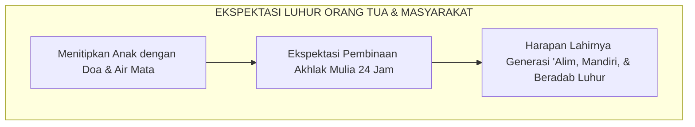
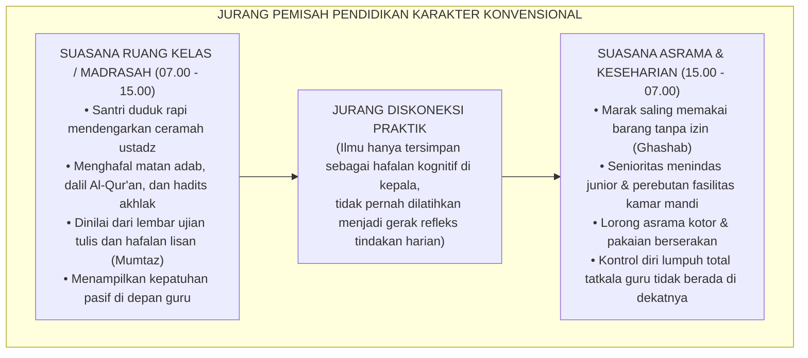
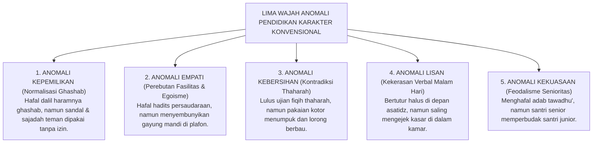
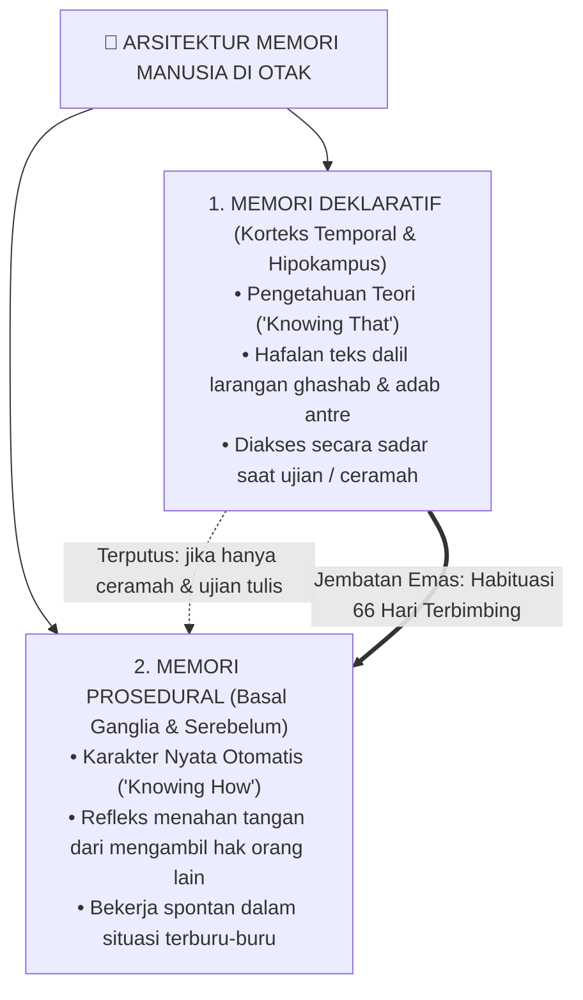
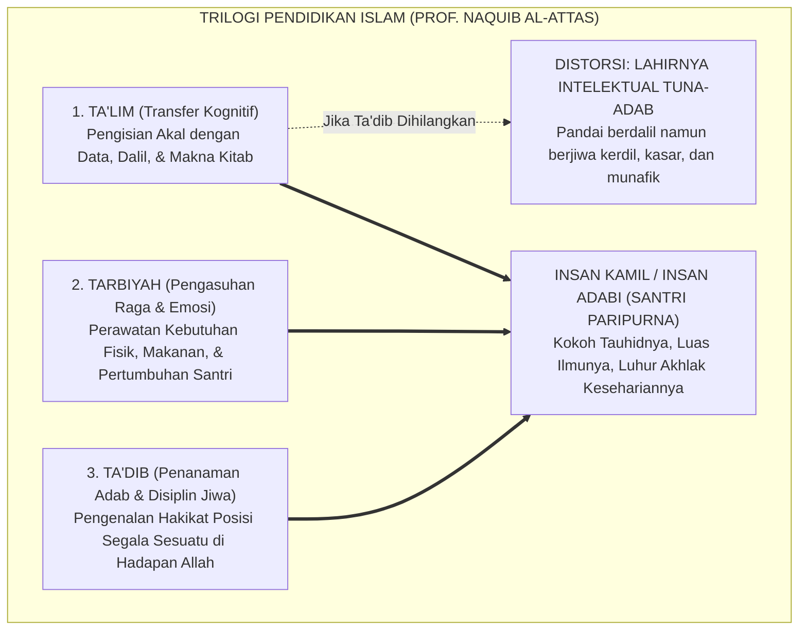
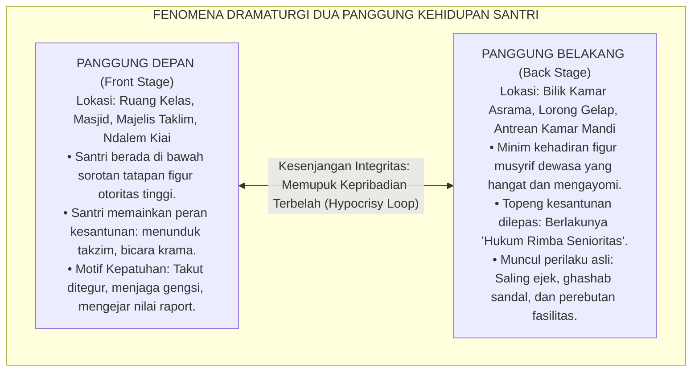
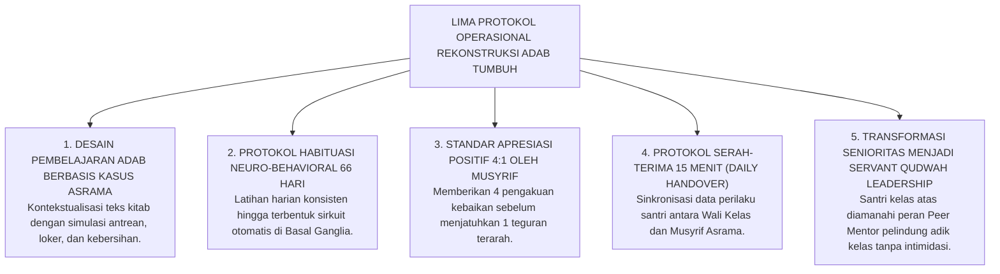
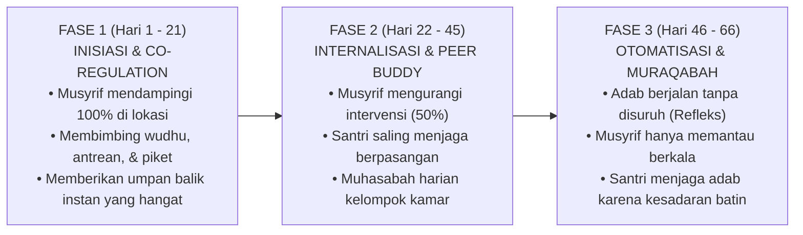
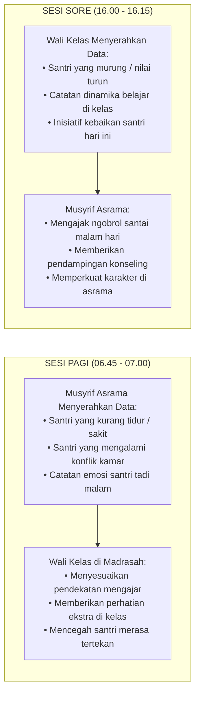

# SUB-BAB 1.1: ANOMALI PENDIDIKAN KARAKTER TRADISIONAL
## *Menyingkap Tabir Jurang Pemisah antara Hafalan Kitab Adab dan Realitas Perilaku Keseharian di Asrama*

**Kode Klasifikasi**: `BOOK-01/BAB-01/SUB-01/PANDUAN-INDUK-MONOGRAF`  
**Disiplin Ilmu**: Fenomenologi Pendidikan Islam, Sosiologi Pesantren, Neurosains Kognitif Terapan, & Epistemologi Turats  
**Penanggung Jawab Keilmuan**: Dewan Pakar Ekosistem TUMBUH (*Begawan Literasi, Pakar Filosofi, Epistemologi Turats, & Neurosains Perkembangan*)

---

### 1. Prolog & Refleksi: Air Mata di Balik Gerbang Pesantren

Setiap awal tahun ajaran baru, sebuah pemandangan yang amat menyentuh kalbu selalu berulang di pelataran pondok-pondok pesantren di seluruh penjuru Nusantara. 

Ribuan orang tua berdiri di bawah terik matahari atau gerimis senja, memeluk erat putra-putri tercinta mereka dengan linangan air mata. Tangan-tangan seorang ayah yang kasar karena kerja keras mengusap kepala anak lelakinya, seraya berbisik penuh harap: *"Belajarlah yang sungguh-sungguh di sini, Nak. Jadilah orang yang alim, berbakti, dan berakhlak mulia."* Sementara seorang ibu, dengan suara bergetar menahan tangis perpisahan, menyerahkan buah hatinya kepada pengasuh pesantren seraya melangitkan doa: di balik gerbang suci ini, anaknya akan dibimbing, dijaga, dan ditempa menjadi pribadi yang jujur, santun, mandiri, dan mencintai Allah serta Rasul-Nya.

Pesantren adalah benteng harapan umat. Masyarakat memandang dinding-dinding pondok pesantren sebagai ruang suci yang steril dari dekadensi moral zaman modern (*the last bastion of moral civilization*).

<b>Gambar 1.1.1:</b> Harapan dan Ekspektasi Luhur Orang Tua saat Memasuki Gerbang Pesantren.

Namun, jika kita berani melangkah masuk lebih dalam—bukan hanya saat acara wisuda akbar atau kunjungan wali santri, melainkan pada pukul dua dini hari di lorong-lorong asrama yang gelap, di depan pintu kamar mandi saat antrean memanjang, atau di balik pintu kamar yang tertutup rapat—kita kerap kali mendapati sebuah realitas yang membuat hati kita tersentak perih:

> [!WARNING]
> ### 🔍 Potret Kenyataan yang Memilukan Hati:
> Mengapa ada seorang santri yang hafal ratusan bait nadhom adab di luar kepala, fasih membaca kitab kuning, dan meraih nilai tertinggi (*Mumtaz*) di kelas madrasah... namun tatkala melangkah keluar dari kelas:
> * Ia dengan enteng mengambil sandal kawannya tanpa izin (*ghashab*), menyembunyikan gayung mandi di atas plafon demi kepentingan pribadinya, dan menyerobot antrean wudhu sambil mendorong temannya yang bertubuh lebih kecil?
> * Mengapa di dalam bilik asrama pada malam hari, terdengar ejekan tajam yang merendahkan fisik temannya (*body shaming*), panggilan nama-nama hewan yang melukai hati, atau tatapan mata santri baru yang menangis diam-diam di bawah selimut karena merasa terasing, tertekan, dan diperlakukan semena-mena oleh seniornya?

<b>Gambar 1.1.2:</b> Diagram Jurang Pemisah antara Pembelajaran Kelas Madrasah dan Realitas Keseharian Asrama.

Pertanyaan ini bukan untuk mencela atau merendahkan martabat pesantren yang kita cintai bersama. Pertanyaan ini adalah sebuah **undangan untuk bermuhasabah secara jujur, mendalam, dan berani**:  
*Mengapa ribuan jam pengajian kitab, hafalan ayat suci, dan atmosfer religius yang begitu kental belum sanggup mengikis dorongan primitif santri untuk berbuat zalim kepada saudaranya sendiri? Di manakah letak mata rantai yang terputus dalam pendidikan karakter kita selama ini?*

Jawabannya sangat terang benderang: **Masalah ini bukan karena anak-anak kita terlahir dengan watak jahat, melainkan karena sistem pendidikan kita selama ini terjebak dalam ilusi metodologis yang keliru—yaitu menyamakan antara *mengajarkan dalil adab* dengan *membentuk refleks karakter adab*.**

---

### 2. Membedah Anatomi Anomali: Lima Wajah Kesenjangan di Bilik Asrama

Untuk menyembuhkan suatu penyakit, seorang dokter harus berani mendiagnosa gejalanya secara teliti tanpa ada yang ditutup-tutupi. Di lapangan pesantren konvensional, kesenjangan antara hafalan kitab dan perilaku nyata termanifestasi ke dalam **Lima Wajah Anomali**:

<b>Gambar 1.1.3:</b> Lima Wajah Anomali Perilaku yang Kerap Ditemukan dalam Keseharian Asrama.

#### 1. Anomali Kepemilikan: Normalisasi Budaya *Ghashab*
Santri mempelajari dalam kitab fikih bahwa mengambil barang milik orang lain tanpa keridhaannya—meskipun hanya sebatang jarum atau sepasang sandal jepit—adalah perbuatan haram dan dosa. Namun di asrama, berkembang pembenaran kolektif yang sangat keliru: *"Di pondok, sandal dan sarung adalah milik bersama."* Santri yang kehilangan sandalnya merasa berhak mengambil sandal orang lain, menciptakan rantai pencurian terselubung yang merusak rasa aman dan integritas diri sejak usia dini.

#### 2. Anomali Empati: Egoisme dan Perebutan Fasilitas
Setiap hari santri diajarkan hadits agung: *"Tidak beriman salah seorang di antara kalian hingga ia mencintai saudaranya sebagaimana ia mencintai dirinya sendiri."* Namun saat bel adzan berbunyi, hadits tersebut menguap seketika. Terjadi perebutan kran wudhu, serobot-menyerobot antrean, hingga praktik menyembunyikan gayung mandi di plafon asrama agar santri lain tidak bisa menggunakannya. Ketiadaan sistem yang mendampingi latihan antre membuat dorongan hewani santri (*Nafs Ammarah*) mengalahkan nalar ilmunya.

#### 3. Anomali Kebersihan: Kontradiksi Teori *Thaharah*
Santri mampu menuliskan secara rinci jenis-jenis najis, syarat sah wudhu, dan rukun mandi besar di atas lembar ujian madrasah. Namun di dalam bilik tidur mereka, kasur dibiarkan berdebu, pakaian basah digantung bertumpuk hingga berjamur, dan sampah makanan diselipkan di kolong ranjang. Mengapa pemahaman fikih bersuci (*Thaharah*) gagal menjelma menjadi budaya bersih (*Nazhafah*)? Karena fikih hanya diajarkan sebagai syarat sah ritual ibadah, bukan sebagai gaya hidup spiritual yang dilatihkan setiap pagi.

#### 4. Anomali Lisan: Ejekan Kasar dan Matinya Rasa Malu (*al-Haya'*)
Di hadapan pengasuh atau guru madrasah, santri menampilkan performa tutur kata krama yang amat santun dan suara yang lirih merendah. Namun ketika pintu kamar tertutup pada malam hari dan asatidz telah pulang ke rumah masing-masing, bahasa yang digunakan berubah 180 derajat: celaan fisik, hinaan nama orang tua, umpatan kotor, dan sarkasme tajam menjadi menu percakapan harian. Hati nurani santri mengalami desensitisasi (kebal rasa) karena menganggap kekasaran lisan sebagai simbol keakraban pria.

#### 5. Anomali Kekuasaan: Perpeloncoan Berkedok Penempaan Mental
Santri kelas atas yang telah menghafal kitab-kitab adab justru mempraktikkan feodalisme rimba terhadap adik kelasnya: menyuruh santri baru mencuci pakaian kotor senior, menyuruh memijat hingga larut malam tanpa upah, memalak jatah kiriman uang, hingga melakukan sidang malam yang disertai pembentakan massal. Doktrin salah kaprah ini terus diwariskan turun-temurun dengan alasan "agar santri baru memiliki mental baja", padahal hakikatnya adalah penularan luka batin dan pelampiasan dendam masa lalu.

---

### 3. Membedah Sains Kognitif: Mengapa Nasihat dan Hafalan Berhenti di Tenggorokan?

Mengapa ribuan nasihat yang disampaikan di mimbar masjid dan hafalan bait kitab adab yang diulang ratusan kali seolah tidak berdaya menghentikan anomali-anomali di atas?

Untuk menjawabnya, kita harus memahami arsitektur kerja otak manusia. Riset mutakhir dalam bidang neurosains kognitif dan psikologi memori (Larry Squire[^1], John Anderson[^2], serta Daniel Kahneman[^3]) membuktikan bahwa otak manusia memproses pengetahuan ke dalam **dua sirkuit saraf (*neural pathways*) yang terpisah secara anatomis dan fungsional**:

<b>Gambar 1.1.4:</b> Arsitektur Sistem Memori di Otak: Memori Deklaratif (Teori) vs Memori Prosedural (Praktik Refleks).

#### A. Memori Deklaratif (*Declarative / Semantic Memory* - "Knowing That")
* **Lokasi Sirkuit di Otak**: Diproses melalui *Hipokampus* dan disimpan di lapisan luar otak (*Neokorteks*, terutama korteks temporal).
* **Hakikat & Sifat**: Merupakan memori nalar sadar (*System 2 / Controlled Processing*) yang menyimpan informasi verbal, hafalan matan kitab, dalil Al-Qur'an, hadits, dan kaidah fikih.
* **Cara Kerja**: Memori ini membutuhkan waktu berpikir dan konsentrasi sadar. Ketika santri duduk di ruang kelas dan ditanya: *"Apa hukum ghashab sandal?"*, hipokampusnya bekerja membuka memori teori, lalu mulutnya menjawab lancar: *"Haram, dan termasuk dosa menzalimi hak muslim."*
* **Kelemahan Fatal**: Memori deklaratif **tidak memiliki jalur kabel langsung ke otot tindakan spontan**. Saat santri mengalami kelelahan fisik, tergesa-gesa mengejar waktu shalat, atau berada dalam tekanan emosi, memori deklaratif di neokorteks akan mengalami perlambatan akses (*cognitive load overload*).

#### B. Memori Prosedural (*Procedural / Behavioral Memory* - "Knowing How")
* **Lokasi Sirkuit di Otak**: Tertanam jauh di dalam sirkuit bawah sadar (*Subcortical System*), yaitu *Basal Ganglia*, *Striatum*, dan *Serebelum*.
* **Hakikat & Sifat**: Merupakan memori kebiasaan otomatis (*System 1 / Automatic Processing*) yang mengendalikan gerak refleks tubuh tanpa perlu berpikir panjang.
* **Manifestasi Nyata Adab**: 
  * Santri yang sedang berlari kencang karena terlambat bangun subuh, secara otomatis menahan kakinya saat melihat sandal milik temannya di depan pintu, lalu dengan tenang tetap bertelanjang kaki mencari sandalnya sendiri di rak.
  * Santri yang melihat tetesan air wudhu menggenangi lantai teras masjid secara spontan mengambil kain pel dan mengeringkannya tanpa menunggu diperintah musyrif dan tanpa melihat apakah ada orang yang memujinya.

> [!IMPORTANT]
> ### 🚗 Analogi Nyata: Belajar Menyetir Mobil 1.000 Halaman Teori vs Refleks Mengemudi
> Bayangkan seseorang yang ingin mahir mengemudikan mobil di jalan raya. Ia membeli buku manual otomotif setebal 1.000 halaman, menghafal fungsi seluruh pedal gas, rem, kopling, tuas transmisi, dan aturan rambu lalu lintas hingga berhasil meraih nilai 100 (*sempurna*) dalam ujian teori SIM.
> 
> Apakah orang tersebut langsung bisa kita minta mengemudikan mobil di tengah jalan tol yang padat dan melaju kencang? **Tentu saja tidak!** Tatkala ada sepeda motor yang mendadak memotong jalurnya secara tiba-tiba, hafalan teori di lembar ujiannya tidak akan sanggup menyelamatkannya. Otak sadarnya (*PFC*) membutuhkan waktu sepersekian detik untuk berpikir, sedangkan kakinya belum memiliki memori prosedural (*muscle memory*) untuk menginjak pedal rem dalam hitungan milidetik.
> 
> Hal yang persis sama terjadi pada pembinaan santri: **Menghafal 100 hadits adab tidak akan pernah otomatis melahirkan santri yang beradab luhur, kecuali jika nilai-nilai hadits tersebut dilatihkan secara konsisten, dipraktikkan berulang kali, didampingi langsung oleh musyrif yang hangat, dan dibiasakan di dalam denyut kehidupan asrama 24 jam.**

---

### 4. Kritik Epistemologi Turats: Tragedi Mereduksi Ta'dib Menjadi Sekadar Ta'lim

Krisis diskoneksi ini sesungguhnya telah dipetakan secara sangat jernih oleh filsuf dan sejarawan pendidikan Islam kontemporer, **Prof. Dr. Syed Muhammad Naquib al-Attas**[^4]. Beliau menjelaskan bahwa kemunduran umat Islam berakar dari **kerancuan epistemologis (*confusion of concepts*)** dalam membedakan tiga pilar pendidikan Islam:

<b>Gambar 1.1.5:</b> Struktur Tiga Ranah Pendidikan Islam dan Dampak Kehancuran Karakter Akibat Hilangnya Pilar Ta'dib.

#### Matriks Perbandingan Tiga Ranah Pendidikan Islam:

| Ranah Pembinaan | Terminologi Turats | Dimensi Manusia | Fokus Aktivitas | Tolak Ukur Evaluasi | Output Karakter yang Terbentuk |
| :--- | :--- | :--- | :--- | :--- | :--- |
| **Pengajaran Akal** | **Ta'lim (تعليم)** | Nalar Intelektual (*al-'Aql*) | Membaca kitab, ceramah, ujian tulis, menghafal dalil. | Nilai angka raport, kelulusan ujian semester, syahadah. | Santri berwawasan luas, faham teks, cakap berdebat dalil. |
| **Pengasuhan Raga** | **Tarbiyah (تربية)** | Fisik & Naluri Hayati (*al-Jasad*) | Penyediaan asrama, makanan bergizi, kesehatan, sarana olahraga. | Kebugaran fisik, berat badan seimbang, fasilitas terpenuhi. | Santri tumbuh sehat, kuat raganya, terpenuhi hak biologisnya. |
| **Penanaman Adab** | **Ta'dib (تأديب)** | Kalbu & Jiwa Spiritual (*ar-Ruh wal-Qalb*) | Habituasi perilaku, muhasabah, teladan *qudwah*, ketertiban 24 jam. | Refleks empati, kejujuran saat sendiri, kebersihan kamar, keikhlasan. | **Insan Adabi**: Santri yang setiap gerak anggota tubuhnya meletakkan sesuatu pada tempatnya. |

> [!CAUTION]
> ### ⚠️ Bahaya Besar Mereduksi Ta'dib Menjadi Sekadar Ta'lim:
> Ketika sebuah pondok pesantren mengerdilkan kurikulum akhlaknya menjadi sekadar pengajaran *Ta'lim* (hafalan teks kitab dan ujian kertas), maka pesantren tersebut tanpa sadar sedang memproduksi **"Intelektual Agama yang Tuna-Adab"**:  
> Yaitu sosok manusia yang lisannya sangat lincah mengutip ayat suci dan hadits nabawi untuk menghakimi kesalahan orang lain, namun kalbunya hampa dari empati, jemarinya ringan menzalimi hak kawan, perilakunya egois di ruang publik, dan tidak memiliki rasa malu (*al-Haya'*) tatkala melanggar kehormatan sesama hamba Allah.

---

### 5. Sosiologi Asrama: Fenomena 'Dua Panggung' dan Kepribadian Terbelah

Secara sosiologis, keterpisahan antara ruang madrasah dan bilik asrama melahirkan fenomena psikososial yang sangat berbahaya: **Kepribadian Terbelah (*Split Personality / Nifaq Amali*)** pada diri santri.

Merujuk pada teori dramaturgi sosiolog **Erving Goffman** (1959)[^5] dalam *The Presentation of Self in Everyday Life*, santri di dalam institusi berasrama (*total institution*) cenderung membagi kehidupannya menjadi dua panggung pertunjukan yang saling bertolak belakang:

<b>Gambar 1.1.6:</b> Dinamika Dua Panggung (Dramaturgi Sosiologis) dalam Keseharian Santri Pesantren.

#### Tiga Jebakan Sosial yang Merusak Panggung Belakang Asrama:

1. **Feodalisme Senioritas Rimba**:  
   Adanya pewarisan dendam antargenerasi. Santri junior yang diperlakukan kasar oleh seniornya menyimpan luka batin (*trauma emosional*). Ketika mereka naik ke kelas atas, mereka melampiaskan kembali dendam tersebut kepada adik kelas baru dengan dalih "menegakkan tradisi penempaan mental".
2. **Normalisasi Bahasa Kasar & Pejoratif**:  
   Di dalam kamar, ejekan verbal dan kata-kata kotor dianggap sebagai tanda "keakraban sejati". Santri yang berusaha menjaga lisan santun kerap dirundung dengan cap "sok alim". Akibatnya, kepekaan nurani perlahan-lahan tumpul.
3. **Tekanan Konformitas Teman Sebaya (*Peer Group Pressure*)**:  
   Berdasarkan riset psikologi perkembangan remaja (Brown & Larson, 2009)[^6], dorongan untuk diterima oleh kelompok sebaya jauh lebih kuat daripada kepatuhan terhadap aturan tertulis. Santri yang awalnya memiliki adab baik terpaksa ikut melanggar aturan (seperti ikut ghashab atau ikut membully teman sekamar) semata-mata karena takut dikucilkan (*social ostracism*).

---

### 6. Menghidupkan Kembali Suluh Turats: Wasiat Emas Guru-Guru Peradaban Islam

Kritik terhadap ilmu yang mandul dan hafalan yang tidak berbuah amal perbuatan bukanlah hal baru dalam sejarah Islam. Para ulama *muhaqqiqin* terdahulu telah memperingatkan bahaya ini dengan kalimat-kalimat yang mengguncang kesadaran kalbu:

> [!NOTE]
> ### 📜 1. Wasiat Menggugah Hujjatul Islam Imam Abu Hamid Al-Ghazali dalam *Ayyuhal Walad*:[^7]
> 
> $$\text{أَيُّهَا الْوَلَدُ، الْعِلْمُ بِلَا عَمَلٍ جُنُونٌ، وَالْعَمَلُ بِغَيْرِ عِلْمٍ لَا يَكُونُ. وَاعْلَمْ أَنَّ عِلْمًا لَا يُبْعِدُكَ الْيَوْمَ عَنِ الْمَعَاصِي، وَلَا يَحْمِلُكَ عَلَى الطَّاعَةِ، لَنْ يُبْعِدَكَ غَدًا عَنْ نَارِ جَهَنَّمَ، وَإِنْ لَمْ تَعْمَلِ الْيَوْمَ وَلَمْ تَتَدَارَكِ الْأَيَّامَ الْمَاضِيَةَ، تَقُولُ غَدًا يَوْمَ الْقِيَامَةِ: فَارْجِعْنَا نَعْمَلْ صَالِحًا، فَيُقَالُ: يَا أَحْمَقُ، أَنْتَ مِنْ هُنَاكَ تَجِيءُ!}$$
> 
> **Artinya:**  
> *"Wahai anakku tercinta! Ilmu yang tidak diiringi dengan amal perbuatan nyata adalah suatu kegilaan, dan amal yang dilakukan tanpa landasan ilmu adalah kesia-siaan yang tak berwujud.*  
> *Ketahuilah, sesungguhnya ilmu yang tidak mampu menjauhkan dirimu dari perbuatan maksiat pada hari ini, dan tidak sanggup mendorongmu untuk taat beribadah kepada Allah, niscaya ia tidak akan pernah mampu menyelamatkanmu dari jilatan api neraka Jahannam di hari esok!*  
> *Jika engkau tidak segera mengamalkan ilmumu hari ini dan tidak memperbaiki hari-harimu yang telah lalu, niscaya pada hari kiamat kelak engkau akan meratap memohon: 'Ya Tuhan kami, kembalikanlah kami ke dunia agar kami dapat beramal saleh!' Maka akan dikatakan kepadamu: 'Wahai orang yang bodoh, bukankah engkau baru saja datang dari sana?!'"*

> [!NOTE]
> ### 📜 2. Pesan Luhur Hadhratusy Syaikh KH. M. Hasyim Asy'ari dalam *Adab al-'Alim wal Muta'allim*:[^8]
> 
> $$\text{قَالَ بَعْضُ السَّلَفِ: الْأَدَبُ فِي الْعَمَلِ عَلَامَةُ قَبُولِ الْعَمَلِ. وَقَالَ ابْنُ الْمُبَارَكِ: طَلَبْتُ الْأَدَبَ ثَلَاثِينَ سَنَةً، وَطَلَبْتُ الْعِلْمَ عِشْرِينَ سَنَةً، وَكَانُوا يَطْلُبُونَ الْأَدَبَ قَبْلَ الْعِلْمِ. وَقَالَ الشَّافِعِيُّ رَحِمَهُ اللَّهُ: طَلَبِي لِلْأَدَبِ كَطَلَبِ الْمَرْأَةِ الْمُضِلَّةِ وَلَدَهَا لَيْسَ لَهَا غَيْرُهُ}$$
> 
> **Artinya:**  
> *"Sebagian ulama salaf menegaskan: 'Keberadaan adab di dalam suatu amal perbuatan adalah tanda diterimanya amal tersebut di sisi Allah Ta'ala.'*  
> *Ulama agung Abdullah bin al-Mubarak menyatakan: 'Aku mendalami adab selama tiga puluh tahun, dan aku mempelajari ilmu syariat selama dua puluh tahun; dan sungguh para ulama terdahulu senantiasa menuntut adab terlebih dahulu sebelum mereka mulai menuntut ilmu.'*  
> *Imam Asy-Syafi'i rahimahullah bertutur: 'Kesungguhanku dalam mencari adab laksana seorang ibu yang mencari anak tunggalnya yang hilang di tengah padang pasir, di mana ia tidak memiliki anak selainnya!'"*

> [!NOTE]
> ### 📜 3. Pesan Emas Imam Malik bin Anas kepada Pemuda Quraisy:[^9]
> 
> $$\text{تَعَلَّمِ الْأَدَبَ قَبْلَ أَنْ تَتَعَلَّمَ الْعِلْمَ، فَإِنَّ الْعِلْمَ كَثِيرٌ وَالْأَدَبَ مِيزَانُهُ}$$
> 
> **Artinya:**  
> *"Pelajarilah adab sebelum engkau mempelajari ilmu! Karena sesungguhnya ilmu itu sangatlah banyak, sedangkan adab adalah neraca timbangan yang menentukan nilainya."*

Mutiara Turats di atas menegaskan hakikat abadi: **Tolak ukur kemuliaan sebuah pesantren bukanlah dihitung dari berapa banyak lembar kitab yang dikhatamkan santri, melainkan seberapa dalam nilai-nilai adab tersebut menjelma menjadi gerak refleks nyata saat santri makan, tidur, berbicara, dan memperlakukan sesama saudaranya.**

---

### 7. Panduan Praktis Ekosistem TUMBUH: Lima Protokol Operasional Pengasuhan Terpadu 24-Jam

Bagaimana cara meruntuhkan jurang pemisah ini secara konkret, ilmiah, dan terukur di pondok pesantren kita? Ekosistem **TUMBUH** merumuskan **Lima Protokol Operasional Rekonstruksi Adab Terpadu 24-Jam**:

<b>Gambar 1.1.7:</b> Lima Protokol Operasional Rekonstruksi Pembinaan Adab Terpadu 24-Jam Ekosistem TUMBUH.

---

#### PROTOKOL 1: Membumikan Teks Kitab ke dalam Kasus Nyata Asrama (*Case-Based Adab Learning*)
* **Praktik Lama**: Guru membaca kitab adab secara monolog, santri menulis makna gandul di bawah teks Arab, lalu menghafalkannya untuk ujian tertulis tanpa pernah mendiskusikan realitas sandal atau gayung di kamar mandi.
* **Standar Operasional TUMBUH**: Setiap bab adab wajib dihubungkan dengan **Dilema Kasus Nyata di Asrama**.
  * *Skenario Diskusi Kelas*: Saat mengkaji bab *Hifzhul Mal* (Menjaga Harta Orang Lain), asatidz membuka sesi simulasi:  
    *"Jika antum bangun kesiangan pukul 04.25 dan sandal antum terselip, sementara muadzin sudah mengumandangkan iqamah subuh, apa tindakan beradab yang harus antum ambil tanpa menyentuh sandal kawan sekamar?"*
  * Santri diajak mendiskusikan solusi nyata, menetapkan kesepakatan kamar, dan merumuskan komitmen bersama.

---

#### PROTOKOL 2: Siklus Habituasi Neuro-Behavioral 66 Hari (*66-Day Habit Loop*)
Berdasarkan riset neuroplastisitas kebiasaan (Lally et al., 2010)[^10], otak manusia membutuhkan rata-rata **66 hari pengulangan harian yang konsisten** agar suatu tindakan sadar yang melelahkan bermutasi menjadi kebiasaan refleks di *Basal Ganglia*.

Ekosistem TUMBUH membagi 66 hari adaptasi santri baru menjadi 3 fase terpadu:

<b>Gambar 1.1.8:</b> Tiga Fase Trajektori Habituasi Karakter 66 Hari Ekosistem TUMBUH.

* **Fase 1: Inisiasi & Regulasi Bersama (*Co-Regulation*, Hari 1–21)**:  
  Musyrif asrama hadir secara fisik di setiap titik transisi penting (pukul 04.00 saat bangun tidur, pukul 05.30 saat piket kamar, dan pukul 18.00 saat persiapan masjid) untuk memberikan teladan langsung, menata antrean dengan ramah, dan membetulkan kekeliruan santri dengan senyuman.
* **Fase 2: Internalisasi & Pendampingan Sebaya (*Peer Scaffolding*, Hari 22–45)**:  
  Musyrif mulai mengurangi pengawasan langsung secara bertahap. Santri dipasangkan dalam sistem *Peer Buddy* (dua santri saling menjaga dan mengingatkan). Evaluasi difokuskan pada muhasabah malam selama 10 menit sebelum tidur.
* **Fase 3: Otomatisasi & Pengawasan Diri (*Self-Regulation & Muraqabah*, Hari 46–66)**:  
  Sirkuit kebiasaan di otak telah terkonsolidasi. Perilaku merapikan tempat tidur, meletakkan sandal di rak, dan mengantre wudhu telah menjadi memori prosedural yang berjalan otomatis atas dorongan kesadaran batin (*Muraqabatullah*).

---

#### PROTOKOL 3: Standar Apresiasi Relasional 4:1 (*Firm & Kind Discipline*)
Otak manusia memiliki kecenderungan alami untuk lebih mengingat hal negatif (*negativity bias*). Bentakan yang keras dan kemarahan yang meluap-luap hanya akan membakar amigdala anak, melumpuhkan nalar moralnya, dan melatihnya menjadi penakut atau pemberontak.

Oleh karena itu, Musyrif TUMBUH diwajibkan menerapkan **Rasio Emas 4 Apresiasi Kebaikan untuk Setiap 1 Teguran Terarah**:
* **Contoh Apresiasi Proses (*Relational Encouragement*)**:  
  * *"Masya Allah, Ustadz sangat menghargai ketertiban antum yang rela menunggu giliran wudhu dengan sabar tadi pagi. Itu adalah wujud nyata adab seorang penuntut ilmu."*
  * *"Terima kasih banyak Akhi Fulan sudah berinisiatif merapikan sandal di depan pintu asrama. Lorong kamar kita menjadi sangat indah dan nyaman dipandang."*
* **SOP Menegur Santri saat Khilaf (*Private & Restorative Correction*)**:  
  Musyrif tidak menegur di depan khalayak ramai. Musyrif memanggil santri secara pribadi, duduk sejajar, menatap matanya dengan penuh kasih sayang (*Calm Presence*), lalu mengajukan pertanyaan reflektif:  
  *"Akhi, tadi Ustadz perhatikan antum terburu-buru memakai sandal kawan sekamar tanpa izin. Mari kita renungkan bersama: apa yang dirasakan kawan antum saat ia mencari sandalnya? Bagaimana cara terbaik yang bisa antum lakukan untuk memperbaikinya sekarang?"*

---

#### PROTOKOL 4: Protokol Serah-Terima Harian 15 Menit (*Daily Handover Protocol*)
Untuk menutup jurang antara madrasah (panggung depan) dan asrama (panggung belakang), pesantren menerapkan SOP wajib pertemuan singkat 15 menit antara Wali Kelas dan Musyrif Asrama:

<b>Gambar 1.1.9:</b> Alur Protokol Serah-Terima Harian 15 Menit (Handover) antara Wali Kelas dan Musyrif Asrama.

Didukung oleh aplikasi *Logbook Digital PBIS Pesantren*, seluruh data dinamika perilaku santri tersinkronisasi secara *real-time*. Tidak ada lagi santri yang terabaikan atau luput dari sentuhan kasih sayang para pendidik.

---

#### PROTOKOL 5: Transformasi Senioritas Menjadi *Servant Qudwah Leadership*
Pesantren mencabut 100% hak penertiban fisik, pengadilan malam, dan wewenang menghukum dari tangan santri senior. Struktur kepengurusan santri dirombak total menjadi **Kader Kepemimpinan Melayani (*Servant Leadership*)**:

1. **Amanah sebagai Kakak Asuh (*Peer Mentors*)**:  
   Santri kelas atas diamanahi peran mulia sebagai pelindung dan pembimbing adik kelas: menyambut santri baru dengan senyuman hangat, membantu mengangkat koper, mengajarkan cara melipat baju, dan menemani santri yang sedang menangis rindu rumah (*homesick*).
2. **Definisi Wibawa Baru**:  
   Kehormatan seorang santri senior tidak lagi diukur dari seberapa keras ia membentak atau seberapa banyak adik kelas yang gemetar ketakutan di hadapannya, melainkan **seberapa besar rasa aman, kenyamanan, dan keteladanan ibadah (*Qudwah Hasanah*) yang ia pancarkan kepada santri yang paling lemah di lingkungannya.**

---

### 8. Muhasabah Penutup: Menatap Masa Depan Santri Kita

Ketika kita memandang wajah santri-santri yang sedang terlelap tidur di bilik asrama mereka di keheningan malam, tanyakanlah kepada lubuk hati nurani kita yang terdalam:

> [!NOTE]
> ### 🕊️ Renungan Jiwa untuk Setiap Pendidik Pesantren:
> *"Anak-anak ini bukanlah kayu mati yang bisa dipahat dengan bentakan kasar dan pukulan rotan. Mereka adalah tunas-tunas fitrah yang suci, jiwa-jiwa mulia yang dititipkan oleh Allah dan jutaan orang tua ke tangan kita.*  
> 
> *Jika kita mendidik mereka hanya dengan hafalan dalil di kepala tanpa membimbing perilakunya di ranjang tidur, kita telah mengkhianati amanah Ta'dib.*  
> *Jika kita membiarkan kekerasan dan feodalisme merajai asrama mereka, kita sedang menyiapkan generasi masa depan yang rapuh dan mahir bermuka dua.*  
> 
> *Mari kita satukan langkah: jembatani hafalan kitab kuning mereka dengan teladan kasih sayang nyata, bangun sirkuit adab mereka dengan pembiasaan yang sabar, dan jadikan pesantren kita sebagai taman peradaban Islam yang aman, hangat, dan memuliakan fitrah kemanusiaan mereka."*

---

## 📌 Catatan Kaki & Rujukan Primer

[^1]: **Larry R. Squire**, "Memory systems of the brain: A brief history and current perspective", *Neurobiology of Learning and Memory*, Vol. 82, No. 3 (2004), hlm. 171–177; serta **Larry R. Squire & Eric R. Kandel**, *Memory: From Mind to Molecules* (New York: Scientific American Library, 1999).
[^2]: **John R. Anderson**, *The Architecture of Cognition* (Cambridge: Harvard University Press, 1983); serta *Rules of the Mind* (Hillsdale: Lawrence Erlbaum Associates, 1993).
[^3]: **Daniel Kahneman**, *Thinking, Fast and Slow* (New York: Farrar, Straus and Giroux, 2011), Bab 1: "Two Systems", hlm. 19–30.
[^4]: **Prof. Dr. Syed Muhammad Naquib al-Attas**, *The Concept of Education in Islam: A Framework for an Islamic Philosophy of Education* (Kuala Lumpur: International Institute of Islamic Thought and Civilization / ISTAC, 1980), hlm. 15–35; serta *Aims and Objectives of Islamic Education* (Jeddah: King Abdulaziz University, 1979).
[^5]: **Erving Goffman**, *The Presentation of Self in Everyday Life* (New York: Anchor Books / Doubleday, 1959), Bab III: "Regions and Region Behavior", hlm. 106–140.
[^6]: **B. Bradford Brown & Jim Larson**, "Peer relationships in adolescence", dalam R. M. Lerner & L. Steinberg (Eds.), *Handbook of Adolescent Psychology: Contextual Influences on Adolescent Development* (Hoboken: John Wiley & Sons, 2009), Vol. 2, hlm. 74–103.
[^7]: **Hujjatul Islam Imam Abu Hamid al-Ghazali**, *Ayyuhal Walad fi Nashihat at-Talamidz*, Tahqiq: Dr. Ahmad Ahmad Badawi (Kairo: Dar al-Qalam, 1986), hlm. 12–15.
[^8]: **Hadhratusy Syaikh KH. M. Hasyim Asy'ari**, *Adab al-'Alim wal Muta'allim fi ma Yahtaju Ilayhi al-Muta'allim fi Ahwal Ta'allumihi wa ma Yatawaqqafu 'alayhi al-Mu'allim fi Maqamat Ta'limihi* (Jombang: Maktabah at-Turats al-Islami, 1415 H), hlm. 9–12.
[^9]: **Al-Khatib Al-Baghdadi**, *Al-Jami' li Akhlaq ar-Rawi wa Adab as-Sami'*, Tahqiq: Dr. Mahmud ath-Thahhan (Riyadh: Maktabah al-Ma'arif, 1403 H), Juz I, hlm. 80.
[^10]: **Phillippa Lally, Cornelia H. M. van Jaarsveld, Henry W. W. Potts, & Jane Wardle**, "How are habits formed: Modelling habit formation in the real world", *European Journal of Social Psychology*, Vol. 40, No. 6 (2010), hlm. 998–1009.
