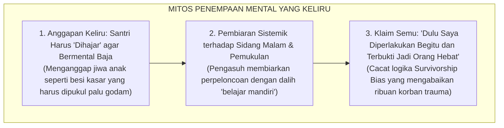
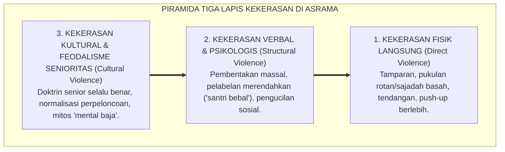
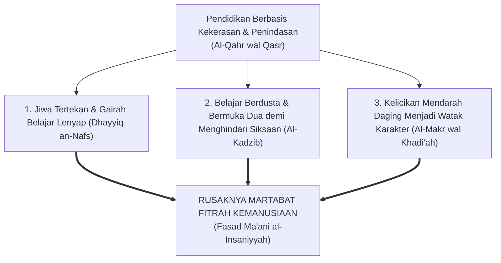
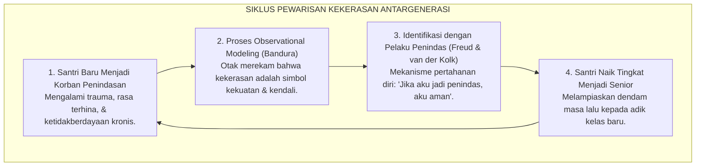
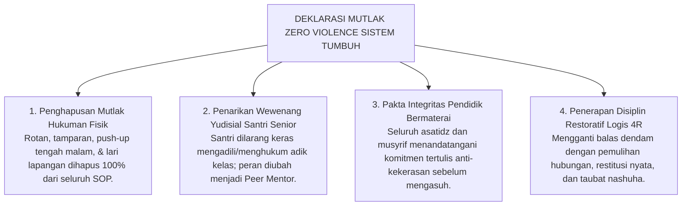

# SUB-BAB 1.2: FENOMENOLOGI KEKERASAN & SENIORITAS FEODAL
## *Membongkar Mitos 'Penempaan Mental Baja', Meluruskan Residu Tradisi, dan Menegakkan Martabat Kemanusiaan Santri*

**Kode Klasifikasi**: `BOOK-01/BAB-01/SUB-02/MONOGRAF-MASTER-CLARITY`  
**Disiplin Ilmu**: Sosiologi Kekerasan Pendidikan, Psikologi Trauma Perkembangan, Hukum Perlindungan Anak, & Epistemologi Turats  
**Penanggung Jawab Keilmuan**: Dewan Pakar Ekosistem TUMBUH (*Master Author, Pakar Perlindungan Anak, Epistemologi Turats, & Disiplin Positif*)

---

### I. Pintu Masuk: Jeritan Sunyi di Bilik Asrama Malam Hari

Tatkala lonceng malam berdentang menandakan jam tidur dan lampu-lampu utama pesantren mulai dipadamkan, sebuah dunia yang sunyi dan mencekam kerap kali baru saja dimulai bagi sebagian anak-anak kita.

Di balik pintu-pintu bilik yang terkunci rapat, di sudut lorong jemuran yang gelap, atau di aula serbaguna yang tersembunyi dari pantauan para kiai, sekelompok santri baru dikumpulkan dalam suasana penuh ketegangan. Mata mereka dipaksa menatap lantai, tubuh mereka gemetar menahan dingin dan kantuk, sementara suara bentakan keras dari santri senior menggelegar memecah kesunyian malam. Satu per satu kesalahan kecil—seperti peci yang miring, keterlambatan beberapa detik saat antrean makan, atau tatapan mata yang dianggap "kurang menunduk"—diadili layaknya kejahatan besar di hadapan mahkamah rimba.

Hukuman pun dijatuhkan tanpa ampun: tamparan di pipi, pukulan sajadah basah yang menyengat kulit, tendangan di tulang kering, *push-up* dengan ujung jari hingga otot tangan gemetar kehabisan daya, hingga kewajiban mencuci tumpukan pakaian kotor senior sebelum fajar menyingsing.

<b>Gambar 1.2.1:</b> Mitos Keliru 'Penempaan Mental Baja' yang Melanggengkan Kekerasan Antargenerasi.

Rangkaian skema pada bagan di atas membongkar **tiga jebakan rasionalisasi semu** yang selama puluhan tahun membelenggu sebagian pengelola dan santri senior di lingkungan pesantren:

1. **Premis Awal yang Keliru (*Santri Harus Dihajar agar Kuat*)**:  
   Banyak pendidik salah mengartikan ketangguhan jiwa (*resilience*). Mereka beranggapan bahwa jiwa anak ibarat bongkahan besi kasar yang harus dipukul dengan palu godam agar terbentuk menjadi pedang tajam. Padahal secara fitrah biologis dan psikologis, jiwa manusia bukanlah besi mati, melainkan **benih tanaman hidup yang rapuh**: ia membutuhkan air keteladanan yang sejuk, sinar kasih sayang yang hangat, dan tanah aturan yang konsisten untuk bertumbuh kokoh. Pukulan fisik dan bentakan tidak pernah membentuk pedang, melainkan meremukkan benih fitrah tersebut hingga mati sebelum sempat berbuah.
2. **Proses Normalisasi (*Pembiaran Sistemik Perpeloncoan*)**:  
   Karena diyakini sebagai "metode pendidikan", tindakan kekerasan verbal dan fisik tidak lagi dianggap sebagai pelanggaran moral. Pengasuh membiarkan santri senior melakukan sidang malam, membentak adik kelas, dan memberikan hukuman fisik yang membahayakan kesehatan, dengan dalih *"biar mereka belajar mandiri dan merasakan kerasnya hidup"*.
3. **Klaim Kebanggaan Semu (*Survivorship Bias*)**:  
   Para pelaku kekerasan selalu membela diri dengan ucapan: *"Dulu waktu saya masih baru, saya dihajar lebih parah dari ini, dan buktinya sekarang saya jadi orang sukses dan bermental baja!"* Ini adalah cacat logika berpikir (*logical fallacy*). Mereka yang "sukses" bertahan bukanlah bukti bahwa kekerasan itu benar; keberhasilan mereka terjadi *terlepas dari* trauma yang mereka terima, sementara ribuan santri lainnya yang jiwanya hancur, trauma seumur hidup, atau memutuskan keluar dari pesantren (*drop out*) tidak pernah dihitung dalam statistik.

---

### II. Anatomi Fenomenologis: Membedah Tiga Lapis Piramida Kekerasan

Kekerasan di lingkungan pendidikan berasrama jarang sekali muncul secara tiba-tiba sebagai letupan acak. Ia menyusup secara halus, terlembaga, dan dilindungi oleh kebiasaan turun-temurun. Sosiolog perdamaian dunia **Johan Galtung** (1969; 1990)[^1] merumuskan bahwa kekerasan selalu bekerja dalam struktur piramida tiga lapis yang saling mengunci:

<b>Gambar 1.2.2:</b> Piramida Tiga Lapis Kekerasan Kultural, Struktural, dan Fisik di Lingkungan Asrama.

Struktur piramida di atas menguraikan bagaimana kekerasan di asrama bekerja dari fondasi tak kasat mata hingga meletup menjadi tragedi fisik:

1. **Lapis Dasar (Kekerasan Kultural / *Cultural Violence*)**:  
   Merupakan fondasi paling bawah yang menopang seluruh bangunan kekerasan. Berisi norma budaya yang terdistorsi, mitos feodal, dan doktrin keliru seperti *"Senioritas adalah kasta kekuasaan"*, *"Junior tidak punya hak bicara"*, atau *"Kekerasan adalah tradisi pondok"*. Kebudayaan ini mencuci otak santri sejak hari pertama bahwa rasa takut dan intimidasi adalah instrumen kepatuhan yang sah.
2. **Lapis Tengah (Kekerasan Struktural & Psikologis / *Structural & Emotional Violence*)**:  
   Merupakan tata kelola kelembagaan yang membiarkan terjadinya ruang hampa pengawasan (*power vacuum*) pada malam hari. Wewenang penertiban diserahkan secara liar kepada santri senior tanpa SOP tertulis dan tanpa pengawasan musyrif dewasa. Di lapisan ini terjadi kekerasan non-fisik yang merusak jiwa: pembentakan massal di aula, pemberian julukan yang merendahkan (*"santri bebal/sampah"*), pemaksaan mencuci pakaian senior tanpa upah, dan pengucilan sosial kolektif.
3. **Lapis Puncak (Kekerasan Fisik Langsung / *Direct Physical Violence*)**:  
   Merupakan ujung runcing piramida yang kasat mata dan meletup saat emosi penindas tidak lagi terkendali: pemukulan dengan tangan kosong, ayunan rotan, cambukan sajadah basah, tendangan di tulang kering, hingga hukuman fisik ekstrem di luar batas daya tahan tubuh anak. Tragedi luka berat atau kematian santri yang mencoreng nama pesantren di media massa hanyalah letupan puncak gunung es dari piramida kultural dan struktural di bawahnya yang tidak pernah dibenahi.

> [!CAUTION]
> ### ⚠️ Ilusi Ketangguhan Mental vs Kenyataan Trauma:
> Ketika seorang santri yang sering dipukul tampak "tenang dan tidak melawan", para pengasuh yang keliru menganggap anak tersebut telah berhasil ditempa menjadi "pria bermental baja". 
> 
> Padahal riset psikiatri modern membuktikan bahwa ketenangan tersebut bukanlah ketangguhan (*resilience*), melainkan **Kelumpuhan Respons Adaptif (*Learned Helplessness*) dan Disosiasi Emosional (*Emotional Numbing*)**: yaitu kondisi psikologis ketika jiwa anak telah patah arang, mematikan kepekaan perasaannya, dan menyerah total pada kepedihan hidup.

---

### III. Suluh Epistemologis Turats: Peringatan Keras Ibnu Khaldun dalam *Al-Muqaddimah*

Jauh berabad-abad sebelum para pakar psikologi modern menerbitkan jurnal-jurnal tentang trauma anak, sosiolog, sejarawan, dan filsuf teragung peradaban Islam, **Al-Allamah Abdurrahman Ibnu Khaldun (732–808 H / 1332–1406 M)**, telah melayangkan kritik epistemologis yang paling tajam dalam karya monumentalnya *Al-Muqaddimah*.

Dalam pasal khusus yang berjudul *Fashl fi Anna asy-Syiddata 'ala al-Muta'allimin Mudhirrun bihim* (Fasal bahwa Sikap Keras dan Kasar terhadap Murid Membawa Kerusakan Fatal bagi Jiwa Mereka), Ibnu Khaldun menuliskan analisis psikososial yang amat memukau:

> [!NOTE]
> ### 📜 Diagnosa Tajam Sosiolog Muslim Ibnu Khaldun dalam *Al-Muqaddimah*:[^2]
> 
> $$\text{مَنْ كَانَ مَرْبَاهُ بِالْقَهْرِ وَالْقَسْرِ مِنْ الْمُتَعَلِّمِينَ أَوْ الْمَمَالِيكِ أَوْ الْخَدَمِ، سَطَا بِهِ الْقَهْرُ، وَضَيَّقَ عَلَى النَّفْسِ فِي انْبِسَاطِهَا، وَذَهَبَ بِنَشَاطِهَا، وَدَعَاهُ إِلَى الْكَسَلِ، وَحَمَلَهُ عَلَى الْكَذِبِ وَالْخُبْثِ، وَهُوَ التَّظَاهُرُ بِغَيْرِ مَا فِي ضَمِيرِهِ خَوْفًا مِنْ انْبِسَاطِ الْأَيْدِي بِالْقَهْرِ عَلَيْهِ، وَعَلَّمَهُ الْمَكْرَ وَالْخَدِيعَةَ لِذَلِكَ، وَصَارَتْ لَهُ هَذِهِ عَادَةً وَخُلُقًا، وَفَسَدَتْ مَعَانِي الْإِنْسَانِيَّةِ الَّتِي لَهُ}$$
> 
> **Artinya:**  
> *"Barang siapa yang pola asuh dan pendidikannya ditegakkan di atas dasar kekerasan, pemaksaan, dan penindasan—baik ia seorang penuntut ilmu, budak, maupun pelayan—maka kekerasan itu akan menguasai jiwanya, menyempitkan kelapangan hatinya, melenyapkan gairah dan semangat belajarnya, menjerumuskannya ke dalam kemalasan, dan **mendorongnya untuk terbiasa berdusta serta bersikap curang**.*  
> *Yaitu ia terpaksa menampakkan sikap pura-pura patuh yang bertolak belakang dengan isi hatinya semata-mata karena takut dipukul. Kekerasan itulah yang mengajarinya tipu daya dan kelicikan, hingga akhirnya kepalsuan tersebut mendarah-daging menjadi watak dan karakternya; **dan pada puncaknya, hancurlah seluruh nilai-nilai fitrah kemanusiaannya!**"*  
> *(Ibnu Khaldun, Kitab Al-Muqaddimah, Bab Pendidikan Murid, hlm. 540)*

<b>Gambar 1.2.3:</b> Rantai Kehancuran Karakter Santri Akibat Metode Kekerasan Menurut Ibnu Khaldun.

Empat tahapan pembusukan karakter pada diagram di atas merinci bagaimana kekerasan (*Al-Qahr wal Qasr*) secara sistematis menghancurkan fitrah kemanusiaan:
* **Tahap 1 (*Dhayyiq an-Nafs*)**: Jiwa anak tertekan, hatinya sempit, dan semangat belajarnya mati karena terkuras untuk menahan rasa takut.
* **Tahap 2 (*Al-Kadzib wal Khubts*)**: Anak belajar berdusta dan merekayasa alasan demi menyelamatkan raga dari pukulan fisik.
* **Tahap 3 (*Al-Makr wal Khadi'ah*)**: Kebohongan mendarah daging menjadi watak kelicikan: santri terbiasa bersikap manis di depan kiai namun licik di belakang layar.
* **Tahap 4 (*Fasad Ma'ani al-Insaniyyah*)**: Rusaknya seluruh kemuliaan fitrah kemanusiaan—keikhlasan, kejujuran, dan empati mati total di dalam dada santri.

---

### IV. Neurosains Trauma & Siklus Pewarisan Dendam Antargenerasi

Mengapa seorang santri yang dahulunya menangis tersiksa saat ditindas oleh seniornya, beberapa tahun kemudian justru menjelma menjadi sosok senior yang jauh lebih kejam kepada adik kelas barunya?

Sains modern memberikan penjelasan yang sangat presisi melalui perpaduan teori pembelajaran sosial dan neurobiologi trauma:

<b>Gambar 1.2.4:</b> Siklus Transmisi Kekerasan Antargenerasi (*Cycle of Violence*) di Asrama Pesantren.

Siklus transmisi kekerasan pada bagan melingkar di atas membongkar mekanisme bagaimana rantai dendam berputar antargenerasi:
1. **Santri Yunior sebagai Korban**: Mengalami rasa terhina dan ketidakberdayaan kronis yang terekam di amigdala otak bawah sadarnya.
2. **Proses Peniruan Model (*Albert Bandura, 1973*)[^3]**: Otak merekam pesan bahwa kekerasan adalah bahasa kekuasaan yang sah untuk menertibkan orang lain.
3. **Identifikasi dengan Penindas (*Bessel van der Kolk, 2014*)[^4]**: Korban mengembangkan ilusi pertahanan diri: *"Agar aku tidak disakiti lagi, aku harus menjadi orang yang menyakiti."*
4. **Senior Menjadi Pelaku Baru**: Dendam masa lalu meledak keluar saat naik tingkat, melipatgandakan kekejaman kepada generasi berikutnya dan memutar kembali lingkaran setan perpeloncoan.

---

### V. Tinjauan Syar'i & Payung Hukum: Kezaliman Berkedok Pendidikan

Banyak pengasuh dan pengurus santri yang belum menyadari bahwa memukul, menampar, membentak massal, dan memperpelonco anak di asrama adalah **kezaliman syar'i yang diharamkan secara mutlak oleh Rasulullah SAW** sekaligus **tindak pidana murni (*criminal offense*)** di mata hukum positif negara:

> [!NOTE]
> ### 📜 Larangan Tegas Rasulullah SAW Menyakiti Fisik dan Wajah Anak:
> 
> $$\text{إِذَا ضَرَبَ أَحَدُكُمْ فَلْيَجْتَنِبِ الْوَجْهَ، فَإِنَّ اللَّهَ خَلَقَ آدَمَ عَلَى صُورَتِهِ}$$
> 
> **Artinya:**  
> *"Jika salah seorang di antara kalian terpaksa memukul, maka jauhilah memukul wajah! Karena sesungguhnya Allah menciptakan Adam menurut rupa-Nya (memuliakan martabat fisiknya)."*  
> *(HR. Bukhari no. 2559 dan Muslim no. 2612)*

Rasulullah SAW—teladan agung seluruh pendidik—sepanjang hayatnya **tidak pernah sekalipun memukul anak kecil, pembantu, maupun pelayan beliau**. Sayyidah Aisyah RA bersaksi: *"Rasulullah SAW tidak pernah memukul sesuatu pun dengan tangannya, tidak pernah memukul wanita, dan tidak pernah memukul pembantu."* (HR. Muslim no. 2328).

| Instrumen Hukum | Pasal & Klausul Kunci | Konsekuensi Hukum di Pesantren |
| :--- | :--- | :--- |
| **UU No. 35 Tahun 2014 tentang Perlindungan Anak**[^5] | **Pasal 54 Ayat (1)**: *Anak di dalam dan di lingkungan satuan pendidikan wajib mendapatkan perlindungan dari tindak kekerasan fisik, psikis, kejahatan seksual, dan tindak kejahatan lainnya.* | Segala bentuk pemukulan di asrama/kelas diancam pidana penjara maksimal 3 tahun 6 bulan dan denda hingga Rp 72 juta (Pasal 80). |
| **UU No. 18 Tahun 2019 tentang Pesantren** | **Pasal 8 & 9**: Penyelenggaraan pesantren berasaskan kemaslahatan, keadilan, non-diskriminasi, dan perlindungan hak asasi santri. | Pesantren yang membiarkan kekerasan terancam sanksi administratif hingga pencabutan izin operasional lembaga. |
| **PMA Kemenag No. 73 Tahun 2022**[^6] | Regulasi Pencegahan dan Penanganan Kekerasan Seksual & Perundungan di Satuan Pendidikan Kementerian Agama. | Kewajiban membentuk Satgas Anti-Kekerasan independen dan SOP penanganan ramah anak. |

---

### VI. Solusi Sistemik TUMBUH: Arsitektur Ekosistem Nol Kekerasan (*Zero Violence Policy*)

Menjawab panggilan syariat, tuntutan sains perkembangan, dan amanah hukum ini, **Sistem TUMBUH** merekayasa arsitektur perlindungan santri dan tata kelola asrama melalui **Empat Pilar Deklarasi Nol Kekerasan**:

<b>Gambar 1.2.5:</b> Empat Pilar Deklarasi Mutlak Nol Kekerasan (*Zero Tolerance Policy*) Ekosistem TUMBUH.

Kerangka empat pilar di atas mereformasi tata kelola pesantren secara menyeluruh:
1. **Penghapusan Mutlak Hukuman Fisik**: Menghapus 100% rotan, tamparan, dan push-up malam dari seluruh SOP pesantren, menegaskan bahwa tubuh santri adalah amanah suci yang wajib dilindungi.
2. **Penarikan Wewenang Yudisial Senior**: Membubarkan pengadilan malam santri dan mengalihkan peran senior menjadi **Kakak Asuh (*Peer Mentors*)** yang melindungi dan melayani adik kelasnya.
3. **Pakta Integritas Pendidik Bermaterai**: Setiap kiai, guru madrasah, dan musyrif menandatangani komitmen tertulis anti-kekerasan berkonsekuensi hukum.
4. **Disiplin Restoratif 4R**: Menyelesaikan pelanggaran melalui konsekuensi logis yang:
   * **Related (Terkait)**: Konsekuensi berhubungan langsung dengan jenis pelanggaran (misal: santri yang merusak lemari temannya bertanggung jawab memperbaikinya).
   * **Respectful (Santun)**: Dijalankan dengan intonasi tenang (*Calm Presence*) tanpa mencaci atau mempermalukan martabat anak di depan umum.
   * **Reasonable (Masuk Akal)**: Beban konsekuensi terukur proporsional sesuai usia dan tidak membahayakan kesehatan fisik/mental santri.
   * **Restorative (Memulihkan Relasi)**: Memulihkan hubungan persaudaraan (*Ishlah al-Bain*) dengan meminta maaf secara tulus dan melakukan restitusi nyata kepada korban yang dirugikan.

---

### VII. Sintesis Sosiologis Sub-Bab 1.2

Melalui pembongkaran fenomenologis ini, Sistem TUMBUH menegaskan bahwa **kekerasan dan feodalisme bukanlah tradisi luhur pesantren, melainkan residu kejahilan yang menyusup ke dalam institusi pendidikan**.

Dengan menegakkan kebijakan *Zero Violence* dan sistem Disiplin Restoratif 4R, Sistem TUMBUH mentransformasikan asrama pesantren dari ruang penuh teror dan rasa takut menjadi **Bi'ah Shalihah**: lingkungan hidup yang aman, memuliakan martabat kemanusiaan santri, dan meneladani kelembutan kasih sayang Rasulullah SAW secara paripurna.

---

## 📌 Catatan Kaki & Rujukan Primer

[^1]: **Johan Galtung**, "Violence, Peace, and Peace Research", *Journal of Peace Research*, Vol. 6, No. 3 (1969), hlm. 167–191; serta "Cultural Violence", *Journal of Peace Research*, Vol. 27, No. 3 (1990), hlm. 291–305.
[^2]: **Al-Allamah Abdurrahman Ibnu Khaldun**, *Al-Muqaddimah*, Tahqiq: Dr. Darwis al-Juwaini (Beirut: Dar al-Fikr, t.th.), Fashl 40: *Fashl fi Anna asy-Syiddata 'ala al-Muta'allimin Mudhirrun bihim*, hlm. 540–542.
[^3]: **Albert Bandura**, *Aggression: A Social Learning Analysis* (Englewood Cliffs: Prentice-Hall, 1973); serta **Cathy Spatz Widom**, "The cycle of violence", *Science*, Vol. 244, No. 4901 (1989), hlm. 160–166.
[^4]: **Bessel van der Kolk**, *The Body Keeps the Score: Brain, Mind, and Body in the Healing of Trauma* (New York: Viking Penguin, 2014), hlm. 105–124; serta **Vincent J. Felitti et al.**, "Relationship of childhood abuse and household dysfunction to many of the leading causes of death in adults: The Adverse Childhood Experiences (ACE) Study", *American Journal of Preventive Medicine*, Vol. 14, No. 4 (1998), hlm. 245–258.
[^5]: **Republik Indonesia**, *Undang-Undang Nomor 35 Tahun 2014 tentang Perubahan atas UU Nomor 23 Tahun 2002 tentang Perlindungan Anak*, Lembaran Negara RI Tahun 2014 No. 297.
[^6]: **Kementerian Agama Republik Indonesia**, *Peraturan Menteri Agama (PMA) Nomor 73 Tahun 2022 tentang Pencegahan dan Penanganan Kekerasan Seksual di Satuan Pendidikan pada Kementerian Agama*; serta **Republik Indonesia**, *Undang-Undang Nomor 18 Tahun 2019 tentang Pesantren*.
