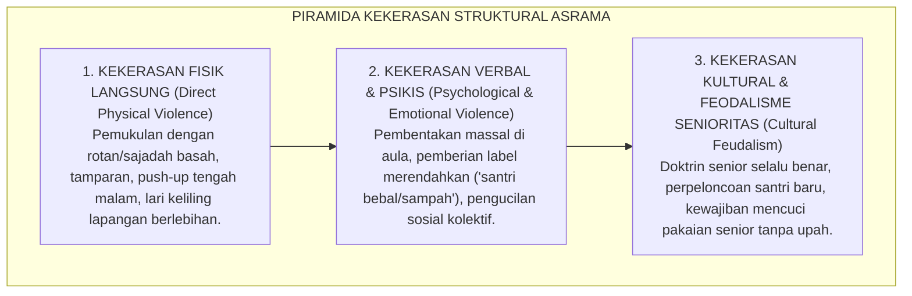
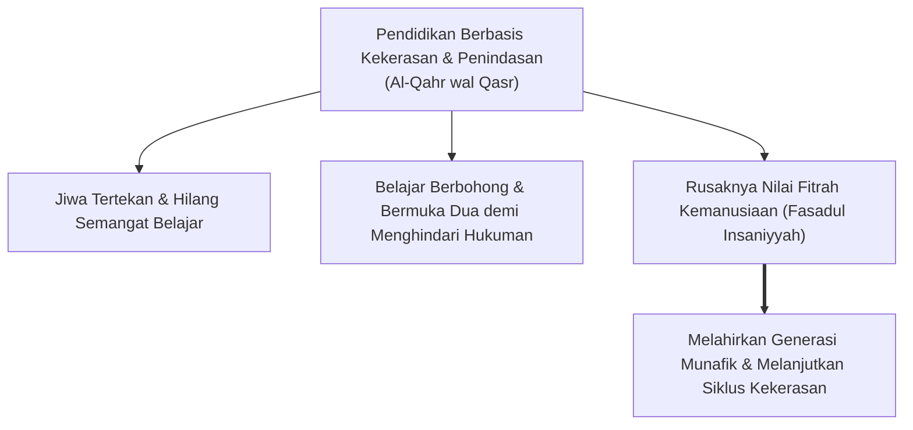
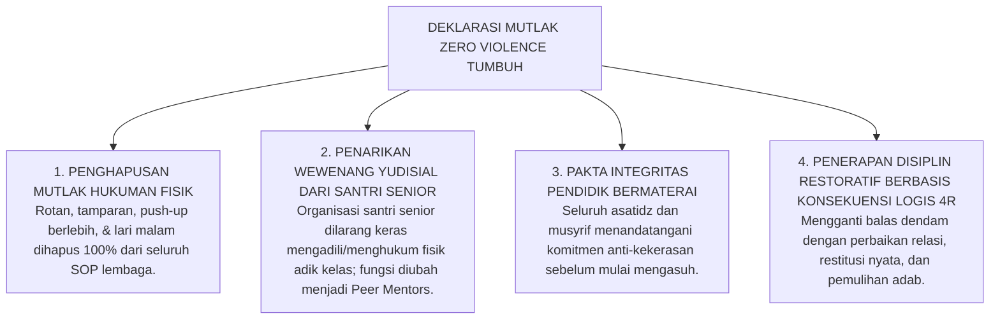

# SUB-BAB 1.2: FENOMENOLOGI KEKERASAN & SENIORITAS FEODAL
## *Dekonstruksi Budaya Penertiban Fisik, Intimidasi Verbal, dan Perpeloncoan Berdalih 'Pembentukan Mental'*

**Kode Klasifikasi**: `BOOK-01/BAB-01/SUB-02/MONOGRAF`  
**Disiplin Ilmu**: Sosiologi Kekerasan Pendidikan, Kriminologi Perkembangan, & Epistemologi Turats  
**Dewan Pakar**: `pakar-perlindungan-anak-dan-advokasi-santri`, `pakar-epistemologi-turats`, `pakar-disiplin-positif`

---

### 1. Anatomi Fenomenologis: Normalisasi Kekerasan dalam Bilik Pesantren

Kekerasan di institusi pendidikan berasrama sering kali hadir bukan dalam rupa kriminalitas vulgar yang langsung tampak di permukaan, melainkan menyusup secara halus dan terlembaga dalam bentuk **Kekerasan Struktural dan Kultural (*Structural & Cultural Violence*)**—sebagaimana dirumuskan oleh sosiolog perdamaian Johan Galtung (1969; 1990). Dalam ekosistem yang terdistorsi, tindakan agresi fisik dan psikologis tidak lagi dipandang sebagai pelanggaran norma kemanusiaan, melainkan mengalami sakralisasi semu dan dirasionalisasi sebagai bagian tak terpisahkan dari ritual "penempaan karakter" (*character forging*).

Fenomenologi kekerasan di pesantren memperlihatkan tipologi tiga lapis penindasan yang saling mengunci:

<b>Gambar 1.2.1:</b> Piramida Tiga Lapis Kekerasan Struktural dan Kultural di Asrama Pesantren.

Praktik-praktik ini kerap dilegitimasi dengan dalih bahwa tradisi pondok sejak dahulu memang "keras" dan bahwa mereka yang bertahan dari perlakuan tersebut akan lahir sebagai "pejuang tangguh bermental baja". Namun, ketika kita membongkar mitos ini dengan analisis psikologi trauma (*trauma studies*) dan sosiologi kritis, kita menemukan bahwa apa yang diklaim sebagai "ketangguhan mental" hakikatnya adalah **disosiasi emosional (*emotional dissociation*) dan matinya kepekaan nurani (*desensitization of empathy*)**.

---

### 2. Kritik Epistemologis Turats: Peringatan Tajam Ibnu Khaldun

Jauh sebelum para psikolog modern meneliti dampak buruk hukuman fisik terhadap anak, sosiolog dan filsuf sejarah teragung peradaban Islam, **Al-Allamah Abdurrahman Ibnu Khaldun (732–808 H / 1332–1406 M)** dalam karya monumentalnya *Al-Muqaddimah* (khususnya pada pasal *Fashl fi Anna asy-Syiddata 'ala al-Muta'allimin Mudhirrun bihim* / Fasal bahwa Sikap Keras terhadap Murid Membawa Kerusakan Fatal bagi Mereka), telah melayangkan kritik epistemologis yang sangat telak:

> [!NOTE]
> ### 📜 Kritik Tajam Sosiolog Muslim Ibnu Khaldun dalam *Al-Muqaddimah*:[^2]
> 
> $$\text{مَنْ كَانَ مَرْبَاهُ بِالْقَهْرِ وَالْقَسْرِ مِنْ الْمُتَعَلِّمِينَ أَوْ الْمَمَالِيكِ أَوْ الْخَدَمِ، سَطَا بِهِ الْقَهْرُ، وَضَيَّقَ عَلَى النَّفْسِ فِي انْبِسَاطِهَا، وَذَهَبَ بِنَشَاطِهَا، وَدَعَاهُ إِلَى الْكَسَلِ، وَحَمَلَهُ عَلَى الْكَذِبِ وَالْخُبْثِ، وَهُوَ التَّظَاهُرُ بِغَيْرِ مَا فِي ضَمِيرِهِ خَوْفًا مِنْ انْبِسَاطِ الْأَيْدِي بِالْقَهْرِ عَلَيْهِ، وَعَلَّمَهُ الْمَكْرَ وَالْخَدِيعَةَ لِذَلِكَ، وَصَارَتْ لَهُ هَذِهِ عَادَةً وَخُلُقًا، وَفَسَدَتْ مَعَانِي الْإِنْسَانِيَّةِ الَّتِي لَهُ}$$
> 
> **Artinya:**  
> *"Barang siapa yang dididik dengan cara kekerasan, pemaksaan, dan penindasan—baik ia seorang penuntut ilmu, hamba sahaya, maupun pelayan—maka kekerasan itu akan menguasai jiwanya, mematikan kelapangan hatinya, melenyapkan semangat belajarnya, menjerumuskannya ke dalam kemalasan, dan **mendorongnya untuk terbiasa berbohong serta bersikap curang**.*  
> *Yaitu ia terpaksa menampakkan sikap pura-pura patuh yang berbeda dengan isi hatinya semata-mata karena takut disiksa. Kekerasan itulah yang mengajarkannya tipu daya dan kelicikan, hingga akhirnya kepalsuan tersebut menjadi watak dan karakternya; **dan pada puncaknya, rusaklah seluruh kemuliaan fitrah kemanusiaannya!**"*  
> *(Ibnu Khaldun, Al-Muqaddimah, Bab 'Sikap Keras terhadap Murid Merusak Jiwa Mereka', hlm. 540)*

Peringatan Ibnu Khaldun di atas adalah diagnosa paling tajam dalam sejarah pendidikan Islam. Beliau membuktikan bahwa kekerasan tidak pernah melahirkan ketaatan yang tulus; sebaliknya, kekerasan justru menjadi **"sekolah kelicikan"** yang melatih anak menjadi pembohong ulung demi menghindari hukuman.

<b>Gambar 1.2.2:</b> Alur Kerusakan Jiwa Santri Akibat Penindasan Fisik Menurut Ibnu Khaldun.

---

### 3. Konsensus Neurosains & Siklus Transmisi Kekerasan Antargenerasi

Sintesis antara Turats Ibnu Khaldun dan konsensus sains kontemporer memperkuat kepastian ilmiah ini. Riset internasional dalam ranah *Adverse Childhood Experiences* (ACEs Study oleh Felitti et al., 1998; Felitti & Anda, 2010) serta kajian transmisi kekerasan antargenerasi (*Intergenerational Transmission of Violence* oleh Cathy Spatz Widom, 1989; Bandura, 1973[^3]) mengungkap tiga temuan fundamental:

1. **Modeling Teori Pembelajaran Sosial (*Social Learning Theory*)**:  
   Albert Bandura membuktikan bahwa manusia belajar perilaku sosial paling dominan melalui observasi dan imitasi model (*observational modeling*). Tatkala seorang santri junior melihat ustadz atau santri senior menegakkan aturan dengan tamparan atau bentakan, pesan bawah sadar (*implicit cognitive schema*) yang tertanam di otaknya bukanlah "aku harus disiplin", melainkan: *"Kekerasan adalah alat yang sah dan efektif untuk mengontrol orang lain yang lebih lemah dariku."*
2. **Identifikasi dengan Pelaku Penindas (*Identification with the Aggressor*)**:  
   Dalam psikoanalisis dan psikiatri anak (Freud, 1936; van der Kolk, 2014 dalam *The Body Keeps the Score*[^4]), santri yang menjadi korban penindasan sering kali mengembangkan mekanisme pertahanan diri bawah sadar dengan cara mengidentifikasi diri mereka sebagai calon penindas masa depan. Rasa terhina, takut, dan tak berdaya saat yunior dikompensasi secara psikologis ketika mereka naik ke kelas senior dengan melipatgandakan kekejaman kepada yunior baru. Inilah yang melanggengkan lingkaran setan perpeloncoan antarangktan selama puluhan tahun.
3. **Hiper-Reaktivitas Amigdala & Gangguan Regulasi Afek**:  
   Paparan bentakan dan ancaman fisik kronis di asrama mengubah morfologi otak remaja: volume materi abu-abu di amigdala mengalami hipertrofi fungsional yang membuat anak selalu berada dalam status siaga tinggi (*hypervigilance*), mudah tersinggung, agresif impulsif, dan mengalami kesulitan konsentrasi saat belajar kitab suci.

---

### 4. Payung Hukum Nasional & Internasional: Pelanggaran Pidana Berdalih Disiplin

Banyak pengasuh pesantren yang belum menyadari bahwa penertiban dengan kekerasan fisik dan verbal tidak hanya bertentangan secara diametral dengan syariat Islam, namun juga merupakan **tindak pidana murni (*criminal offense*)** di mata hukum positif Indonesia dan instrumen hak asasi manusia internasional:

| Instrumen Hukum | Pasal & Klausul Kunci | Implikasi Hukum di Pesantren |
| :--- | :--- | :--- |
| **UU No. 35 Tahun 2014 tentang Perlindungan Anak**[^5] | **Pasal 54 Ayat (1)**: *Anak di dalam dan di lingkungan satuan pendidikan wajib mendapatkan perlindungan dari tindak kekerasan fisik, psikis, kejahatan seksual, dan kejahatan lainnya yang dilakukan oleh pendidik, tenaga kependidikan, sesama peserta didik, dan/atau pihak lain.* | Segala bentuk pemukulan di asrama/kelas diancam pidana penjara maksimal 3 tahun 6 bulan dan/atau denda Rp 72 juta (Pasal 80). |
| **UU No. 18 Tahun 2019 tentang Pesantren** | **Pasal 8 & 9**: Mengamanahkan penyelenggaraan pesantren berasaskan kemaslahatan, keadilan, non-diskriminasi, dan perlindungan hak asasi santri. | Pesantren yang membiarkan kekerasan terancam pencabutan izin operasional dan sanksi administratif kelembagaan. |
| **PMA Kemenag No. 73 Tahun 2022**[^6] | Regulasi Pencegahan dan Penanganan Kekerasan Seksual & Perundungan di Satuan Pendidikan Kementerian Agama. | Kewajiban membentuk Satgas Perlindungan Santri independen dan SOP penanganan ramah anak. |
| **Konvensi Hak Anak PBB (UN CRC 1989)** | **Pasal 19 & 28 Ayat (2)**: Negara wajib melindungi anak dari segala bentuk kekerasan dan menjamin disiplin sekolah ditegakkan dengan menghormati martabat kemanusiaan anak. | Indonesia terikat secara internasional untuk mengeliminasi hukuman fisik (*corporal punishment*) di seluruh lembaga pendidikan. |

---

### 5. Komitmen Ekosistem TUMBUH: Deklarasi Nol Kekerasan (Zero Tolerance Policy)

Menghadapi kenyataan sejarah, dalil syar'i, temuan neurosains, dan kepatuhan hukum ini, Ekosistem **TUMBUH** menetapkan sikap kelembagaan yang tidak dapat ditawar-tawar (*non-negotiable commitment*):

<b>Gambar 1.2.3:</b> Empat Pilar Deklarasi Mutlak Nol Kekerasan (Zero Violence) Ekosistem TUMBUH.

Dengan langkah berani dan terstruktur ini, pesantren membebaskan dirinya dari belenggu feodalisme masa lalu dan kembali memancarkan wajah aslinya yang agung: sebagai taman peradaban nabawi yang menumbuhkan tunas-tunas ulama berjiwa merdeka, berakhlak mulia, dan berhati lembut penuh welas asih.

---

## 📌 Catatan Kaki & Rujukan Primer

[^1]: **Johan Galtung**, "Violence, Peace, and Peace Research", *Journal of Peace Research*, Vol. 6, No. 3 (1969), hlm. 167–191; serta "Cultural Violence", *Journal of Peace Research*, Vol. 27, No. 3 (1990), hlm. 291–305.
[^2]: **Al-Allamah Abdurrahman Ibnu Khaldun**, *Al-Muqaddimah*, Tahqiq: Dr. Darwis al-Juwaini (Beirut: Dar al-Fikr, t.th.), Fashl 40: *Fashl fi Anna asy-Syiddata 'ala al-Muta'allimin Mudhirrun bihim*, hlm. 540–542.
[^3]: **Albert Bandura**, *Aggression: A Social Learning Analysis* (Englewood Cliffs: Prentice-Hall, 1973); serta **Cathy Spatz Widom**, "The cycle of violence", *Science*, Vol. 244, No. 4901 (1989), hlm. 160–166.
[^4]: **Bessel van der Kolk**, *The Body Keeps the Score: Brain, Mind, and Body in the Healing of Trauma* (New York: Viking Penguin, 2014), hlm. 105–124.
[^5]: **Republik Indonesia**, *Undang-Undang Nomor 35 Tahun 2014 tentang Perubahan atas UU Nomor 23 Tahun 2002 tentang Perlindungan Anak*, Lembaran Negara RI Tahun 2014 No. 297.
[^6]: **Kementerian Agama Republik Indonesia**, *Peraturan Menteri Agama (PMA) Nomor 73 Tahun 2022 tentang Pencegahan dan Penanganan Kekerasan Seksual di Satuan Pendidikan pada Kementerian Agama*.
