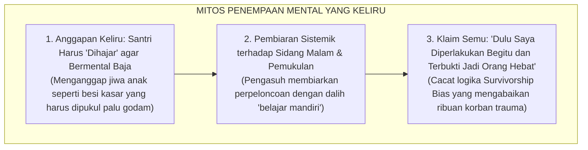
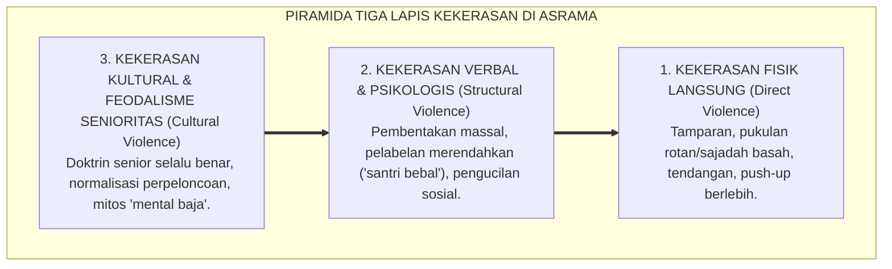
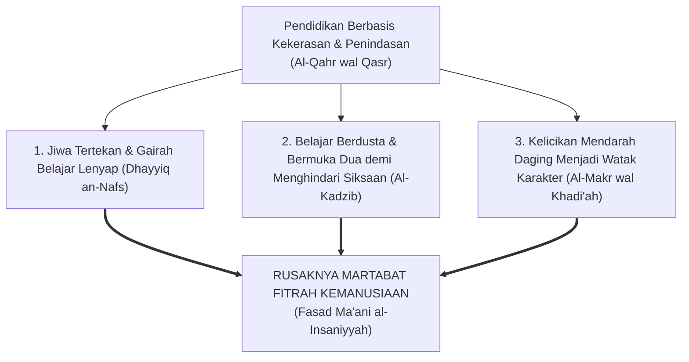
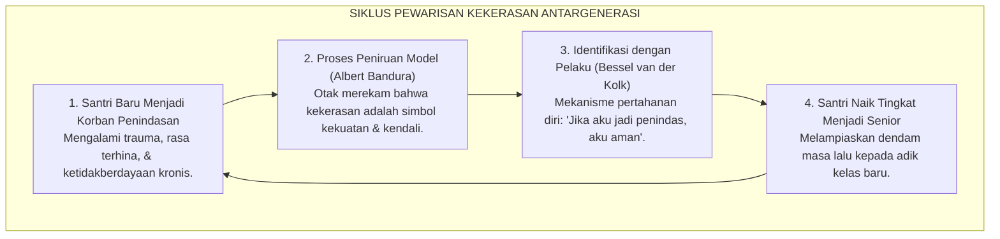
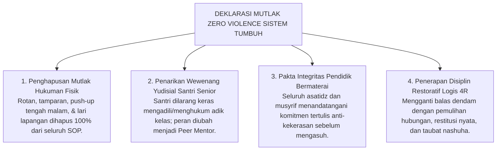

# PANDUAN OPERASIONAL 1.2: FENOMENOLOGI KEKERASAN & SENIORITAS FEODAL

---

### 🧭 PETA POSISI PANDUAN DALAM SISTEM TUMBUH (DARI HULU KE HILIR)
* **Posisi Arsitektur**: `HULU EKOSISTEM (Akar Filosofis, Fitrah al-Munazzalah, & Worldview Islam)`
* **Peruntukan Pengguna**: Pimpinan Pesantren, Pengasuh Pondok, Kepala Madrasah, & Dewan Asatidz
* **Fokus Panduan**: Membangun cara pandang pengasuhan berbasis fitrah kesucian dan keteladanan nyata (Qudwah Hasanah), mengeliminasi tradisi kekerasan fisik dan feodalisme asrama.
* **Hasil Akhir yang Dituju**: Terwujudnya santri berkarakter *Insan Adabi* yang mandiri, musyrif yang mengasuh dengan kasih sayang tanpa *burnout*, dan pesantren yang aman berbasis data (*Safe Boarding School*).

---

### 🎯 Mengapa Panduan Ini Ada & Masalah Nyata yang Dipecahkan
1. **Latar Masalah di Lapangan**: Sering kali pengasuhan di pesantren berjalan tanpa SOP yang jelas atau terjebak dalam pola reaktif—menunggu santri berbuat salah baru dihukum dengan emosional.
2. **Solusi Sistem TUMBUH**: Panduan ini memberikan langkah preventif dan terstruktur agar setiap pembiasaan adab berjalan terencana, konsisten, dan terukur.
3. **Sasaran Perubahan**: Memastikan nilai-nilai Islam menyatu dalam perilaku harian santri melalui keteladanan nyata (*Qudwah Hasanah*).

---

---

### 🎯 Tujuan & Manfaat Panduan
Panduan ini dirancang sebagai petunjuk operasional terapan agar pendidik dan musyrif dapat:
1. Menjalankan pembinaan adab santri dengan pendekatan kasih sayang (*Rahmah*) dan ketegasan yang mendidik (*Firm & Kind*).
2. Menghindari cara-cara kekerasan fisik, bentakan verbal, maupun hukuman yang mempermalukan santri.
3. Menciptakan suasana asrama dan kelas yang aman, tertib, dan menumbuhkan kesadaran diri (*Bi'ah Shalihah*).

---

### 💡 Intisari Cepat (3 Menit Memahami Esensi)
* **Kunci Pengasuhan**: Karakter santri tumbuh melalui keteladanan nyata (*Qudwah Hasanah*), komunikasi empatik, dan pembiasaan terstruktur 24 jam.
* **Tindakan Utama**: Terapkan panduan langkah demi langkah di bawah ini secara konsisten, pantau perkembangan santri secara objektif, dan berikan apresiasi atas setiap perbaikan diri yang mereka capai.
* **Prinsip Disiplin**: Fokus pada pemulihan hubungan dan tanggung jawab nyata (*Restoratif*), bukan sekadar melampiaskan amarah atau menghukum.

---

### 📖 Uraian Panduan & Langkah Aksi Lapangan

---

### Jeritan Sunyi di Bilik Asrama Malam Hari

Ketika lonceng malam berdentang menandakan jam tidur dan lampu-lampu utama pesantren mulai dipadamkan, sebuah dunia yang sunyi dan mencekam kerap kali baru saja dimulai bagi sebagian anak-anak kita.

Di balik pintu-pintu bilik yang terkunci rapat, di sudut lorong jemuran yang gelap, atau di aula yang tersembunyi dari pantauan para kiai, sekelompok santri baru dikumpulkan dalam suasana penuh ketegangan. Mata mereka dipaksa menatap lantai, tubuh mereka gemetar menahan dingin dan kantuk, sementara suara bentakan keras dari santri senior menggelegar memecah kesunyian malam. Satu per satu kesalahan kecil—seperti peci yang miring, terlambat beberapa detik saat antre makan, atau tatapan mata yang dianggap "kurang menunduk"—diadili layaknya kejahatan besar di hadapan mahkamah rimba.

Hukuman pun dijatuhkan tanpa ampun: tamparan di pipi, pukulan sajadah basah yang menyengat kulit, tendangan di tulang kering, *push-up* dengan ujung jari hingga otot tangan gemetar kehabisan daya, hingga kewajiban mencuci tumpukan pakaian kotor senior sebelum fajar menyingsing.

<b>Gambar 1.2.1:</b> Mitos Keliru 'Penempaan Mental Baja' yang Melanggengkan Kekerasan Antargenerasi.

Bagan di atas membongkar alasan klise yang selalu diulang-ulang oleh para pelaku kekerasan di asrama. Mereka berdalih bahwa anak harus *"dihajar"* agar bermental baja. Mereka mengklaim: *"Dulu saya juga dipukul dan sekarang terbukti jadi orang hebat!"* 

Ini adalah cacat logika yang fatal. Jiwa anak bukanlah besi mati yang harus dihantam palu godam, melainkan **benih tanaman hidup yang rapuh**: ia butuh air keteladanan yang sejuk dan tanah aturan yang adil untuk bertumbuh kokoh. Pukulan fisik tidak pernah menciptakan kesatria bermental baja; pukulan hanya menciptakan dua tipe manusia yang terluka: **jiwa yang patah arang dan penakut**, atau **calon penindas baru yang menyimpan dendam membara**.

---

### Anatomi Fenomenologis: Membedah Tiga Lapis Piramida Kekerasan

Kekerasan di pesantren tidak pernah muncul tiba-tiba. Ia menyusup secara halus melalui budaya turun-temurun. Sosiolog perdamaian dunia **Johan Galtung**[^1] merumuskan bahwa kekerasan selalu bekerja dalam struktur piramida tiga lapis:

<b>Gambar 1.2.2:</b> Piramida Tiga Lapis Kekerasan Kultural, Struktural, dan Fisik di Lingkungan Asrama.

Piramida di atas menunjukkan mengapa kasus kekerasan fisik sulit diberantas jika kita hanya menghukum pelakunya tanpa membongkar akarnya:
* **Lapis Dasar (Kekerasan Kultural)**: Berisi doktrin beracun seperti *"Senior selalu benar"*, *"Junior wajib tunduk tanpa syarat"*, dan anggapan bahwa perpeloncoan adalah tradisi wajib.
* **Lapis Tengah (Kekerasan Struktural)**: Sistem asrama yang membiarkan ruang hampa pengawasan malam hari, di mana santri senior bebas membentak massal, mencaci maki dengan nama binatang, dan memaksa adik kelas mencuci bajunya.
* **Lapis Puncak (Kekerasan Fisik Langsung)**: Letupan akhir berupa tamparan, tendangan, dan pemukulan. Tragedi santri luka berat atau meninggal yang viral di media massa hanyalah letupan puncak gunung es dari budaya feodal di bawahnya yang dibiarkan bertahun-tahun.

---

### Suluh Epistemologis Turats: Peringatan Keras Ibnu Khaldun dalam *Al-Muqaddimah*

Jauh berabad-abad sebelum ilmu psikologi modern lahir, sosiolog teragung peradaban Islam, **Ibnu Khaldun (1332–1406 M)**[^2], telah menuliskan peringatan keras dalam *Al-Muqaddimah* pada bab khusus bertajuk *Kekerasan terhadap Pelajar Membawa Kerusakan Fatal bagi Jiwa Mereka*:

> [!NOTE]
> ### 📜 Diagnosa Tajam Sosiolog Muslim Ibnu Khaldun dalam *Al-Muqaddimah*:[^2]
> 
> $$\text{مَنْ كَانَ مَرْبَاهُ بِالْقَهْرِ وَالْقَسْرِ مِنْ الْمُتَعَلِّمِينَ أَوْ الْمَمَالِيكِ أَوْ الْخَدَمِ، سَطَا بِهِ الْقَهْرُ، وَضَيَّقَ عَلَى النَّفْسِ فِي انْبِسَاطِهَا، وَذَهَبَ بِنَشَاطِهَا، وَدَعَاهُ إِلَى الْكَسَلِ، وَحَمَلَهُ عَلَى الْكَذِبِ وَالْخُبْثِ، وَهُوَ التَّظَاهُرُ بِغَيْرِ مَا فِي ضَمِيرِهِ خَوْفًا مِنْ انْبِسَاطِ الْأَيْدِي بِالْقَهْرِ عَلَيْهِ، وَعَلَّمَهُ الْمَكْرَ وَالْخَدِيعَةَ لِذَلِكَ، وَصَارَتْ لَهُ هَذِهِ عَادَةً وَخُلُقًا، وَفَسَدَتْ مَعَانِي الْإِنْسَانِيَّةِ الَّتِي لَهُ}$$
> 
> **Artinya:**  
> *"Barang siapa yang pola asuh dan pendidikannya ditegakkan di atas dasar kekerasan, pemaksaan, dan penindasan—maka kekerasan itu akan menguasai jiwanya, menyempitkan hatinya, melenyapkan semangat belajarnya, dan **mendorongnya untuk terbiasa berdusta serta bersikap curang**.*  
> *Ia terpaksa berpura-pura patuh semata-mata karena takut dipukul. Kekerasan itulah yang mengajarinya tipu daya dan kelicikan, hingga akhirnya kepalsuan tersebut mendarah-daging menjadi karakternya; **dan pada puncaknya, hancurlah seluruh fitrah kemanusiaannya!**"*

<b>Gambar 1.2.3:</b> Rantai Kehancuran Karakter Santri Akibat Metode Kekerasan Menurut Ibnu Khaldun.

Ibnu Khaldun membedah secara gamblang bagaimana kekerasan merusak anak dalam empat tahap: awalnya semangat belajar anak mati (*Dhayyiq an-Nafs*), lalu anak belajar berdusta demi menghindari pukulan (*Al-Kadzib*), kebohongan itu berubah menjadi kelicikan mendarah daging (*Al-Makr*), hingga akhirnya seluruh fitrah kemuliaan jiwanya hancur total (*Fasad Ma'ani al-Insaniyyah*).

---

### Neurosains Trauma & Siklus Pewarisan Dendam Antargenerasi

Mengapa santri yang waktu yunior menangis tersiksa saat ditindas, beberapa tahun kemudian justru menjadi senior yang paling kejam kepada adik kelas barunya?

Sains psikologi trauma[^3][^4] membongkar lingkaran setan ini:

<b>Gambar 1.2.4:</b> Siklus Transmisi Kekerasan Antargenerasi (*Cycle of Violence*) di Asrama Pesantren.

Ketika seorang anak terus-menerus ditindas, otaknya merekam pesan bahwa *"satu-satunya cara agar tidak disakiti di dunia ini adalah dengan menjadi orang yang menyakiti"*. Begitu ia naik kelas menjadi senior, amigdala otaknya melampiaskan seluruh dendam masa lalu kepada santri baru yang tidak bersalah. Lingkaran setan ini akan terus berputar turun-temurun kecuali jika sistem pesantren memutusnya dengan tegas.

---

### Tinjauan Syar'i & Payung Hukum: Kezaliman Berkedok Pendidikan

Banyak yang lupa bahwa memukul wajah, menampar, dan menyiksa fisik anak adalah **kezaliman syar'i yang diharamkan mutlak oleh Rasulullah SAW** sekaligus **tindak pidana murni di mata hukum negara**:

> [!NOTE]
> ### 📜 Larangan Tegas Rasulullah SAW Menyakiti Fisik Anak:
> 
> $$\text{إِذَا ضَرَبَ أَحَدُكُمْ فَلْيَجْتَنِبِ الْوَجْهَ، فَإِنَّ اللَّهَ خَلَقَ آدَمَ عَلَى صُورَتِهِ}$$
> 
> **Artinya:**  
> *"Jika salah seorang di antara kalian terpaksa memukul, maka jauhilah memukul wajah! Karena sesungguhnya Allah memuliakan martabat fisik manusia."*  
> *(HR. Bukhari no. 2559 dan Muslim no. 2612)*

Rasulullah SAW—teladan agung umat manusia—sepanjang hayatnya **tidak pernah sekalipun memukul anak kecil, pembantu, maupun murid beliau** (HR. Muslim no. 2328).

Secara hukum positif di Indonesia, **UU No. 35 Tahun 2014 tentang Perlindungan Anak (Pasal 54 & 80)**[^5] serta **PMA Kemenag No. 73 Tahun 2022**[^6] menegaskan bahwa segala bentuk kekerasan fisik dan psikis di lingkungan pendidikan diancam pidana penjara hingga 3 tahun 6 bulan dan sanksi pencabutan izin operasional lembaga.

---

### Solusi Sistemik TUMBUH: Arsitektur Ekosistem Nol Kekerasan (*Zero Violence Policy*)

Menjawab amanah syariat dan hukum ini, **Sistem TUMBUH** merekayasa arsitektur perlindungan asrama melalui **Empat Pilar Deklarasi Nol Kekerasan**:

<b>Gambar 1.2.5:</b> Empat Pilar Deklarasi Mutlak Nol Kekerasan (*Zero Tolerance Policy*) Ekosistem TUMBUH.

Langkah konkret Sistem TUMBUH di lapangan:
1. **Hapus Hukuman Fisik 100%**: Menghilangkan seluruh rotan dan hukuman fisik tengah malam dari seluruh tata tertib.
2. **Ubah Peran Senior Jadi Kakak Asuh (*Peer Mentors*)**: Membubarkan sidang malam senior dan mengalihkan tugas senior untuk membimbing dan melindungi adik kelasnya.
3. **Pakta Integritas Pendidik**: Seluruh guru dan pembina menandatangani komitmen tertulis anti-kekerasan yang mengikat secara hukum.
4. **Disiplin Restoratif 4R**: Pelanggaran diselesaikan dengan konsekuensi logis: **Related** (terkait langsung dengan kesalahan), **Respectful** (santun tanpa mencaci), **Reasonable** (masuk akal sesuai usia), dan **Restorative** (memulihkan persaudaraan melalui mekanisme saling memaafkan dan ganti rugi nyata).

---

## 📌 Catatan Kaki & Rujukan Primer

[^1]: **Johan Galtung**, "Violence, Peace, and Peace Research", *Journal of Peace Research*, Vol. 6, No. 3 (1969), hlm. 167–191; serta "Cultural Violence", *Journal of Peace Research*, Vol. 27, No. 3 (1990), hlm. 291–305.
[^2]: **Al-Allamah Abdurrahman Ibnu Khaldun**, *Al-Muqaddimah*, Tahqiq: Dr. Darwis al-Juwaini (Beirut: Dar al-Fikr, t.th.), Fashl 40: *Fashl fi Anna asy-Syiddata 'ala al-Muta'allimin Mudhirrun bihim*, hlm. 540–542.
[^3]: **Albert Bandura**, *Aggression: A Social Learning Analysis* (Englewood Cliffs: Prentice-Hall, 1973); serta **Cathy Spatz Widom**, "The cycle of violence", *Science*, Vol. 244, No. 4901 (1989), hlm. 160–166.
[^4]: **Bessel van der Kolk**, *The Body Keeps the Score: Brain, Mind, and Body in the Healing of Trauma* (New York: Viking Penguin, 2014), hlm. 105–124; serta **Vincent J. Felitti et al.**, "Relationship of childhood abuse and household dysfunction to many of the leading causes of death in adults: The Adverse Childhood Experiences (ACE) Study", *American Journal of Preventive Medicine*, Vol. 14, No. 4 (1998), hlm. 245–258.
[^5]: **Republik Indonesia**, *Undang-Undang Nomor 35 Tahun 2014 tentang Perubahan atas UU Nomor 23 Tahun 2002 tentang Perlindungan Anak*, Lembaran Negara RI Tahun 2014 No. 297.
[^6]: **Kementerian Agama Republik Indonesia**, *Peraturan Menteri Agama (PMA) Nomor 73 Tahun 2022 tentang Pencegahan dan Penanganan Kekerasan Seksual di Satuan Pendidikan pada Kementerian Agama*; serta **Republik Indonesia**, *Undang-Undang Nomor 18 Tahun 2019 tentang Pesantren*.
