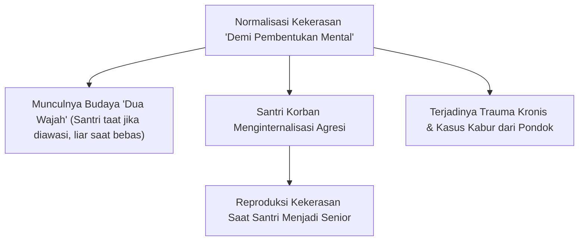

# SUB-BAB 1.2: FENOMENOLOGI KEKERASAN & SENIORITAS FEODAL
## *Dekonstruksi Budaya Penertiban Fisik, Intimidasi Verbal, dan Perpeloncoan Berdalih 'Pembentukan Mental'*

**Kode Modul**: `BOOK-01/BAB-01/SUB-02`  
**Kategori**: Patologi Disiplin Pesantren  
**Fokus Keilmuan**: Sosiologi Pendidikan & Kriminologi Perkembangan

---

### 1. Realitas Kekerasan dalam Pengasuhan Asrama
Salah satu tantangan terberat dunia pesantren adalah masih adanya residu praktik penegakan disiplin berbasis kekerasan:
* **Kekerasan Fisik**: Penggunaan rotan, tamparan, push-up berlebihan tengah malam, atau tindakan fisik lain sebagai hukuman pelanggaran disiplin.
* **Kekerasan Verbal & Psikis**: Pembentakan di depan khalayak (*public humiliation*), pemberian julukan merendahkan, dan intimidasi psikologis.
* **Senioritas Menindas**: Penyerahan wewenang penegakan hukum kepada organisasi santri senior tanpa SOP baku dan tanpa pengawasan musyrif, yang berujung pada tradisi perpeloncoan antargenerasi.

---

### 2. Mitos Keliru: "Kekerasan Membentuk Ketangguhan"
Tinjauan sosiologis dan psikologis membuktikan bahwa mitos "kekerasan membentuk mental pejuang" adalah kekeliruan fatal:
1. **Ketangguhan Semu vs Kerapuhan Batin**: Kekerasan tidak melahirkan ketangguhan (*resilience*), melainkan melahirkan mati rasa emosional (*emotional numbing*) dan kecemasan tersembunyi.
2. **Kepatuhan Berbasis Teror**: Santri mematuhi aturan bukan karena mencintai adab, melainkan karena takut rasa sakit. Ketika sumber ketakutan hilang, kontrol diri musnah.
3. **Merusak Hubungan Guru-Santri**: Tercipta jurang ketakutan dan kebencian terpendam terhadap musyrif dan institusi pondok.

---

### 3. Deklarasi Mutlak Ekosistem TUMBUH: Zero Violence
Ekosistem TUMBUH melarang keras segala bentuk kekerasan fisik dan psikis dalam seluruh tingkatan:
* Menghapus seluruh instrumen hukuman fisik dari SOP pondok.
* Menarik wewenang penghakiman fisik dari organisasi santri senior.
* Mengganti paradigma hukuman dengan **Disiplin Restoratif** dan **Konsekuensi Logis 4R**.
