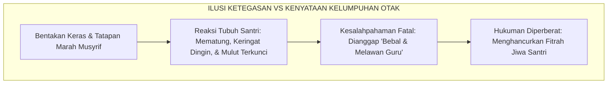
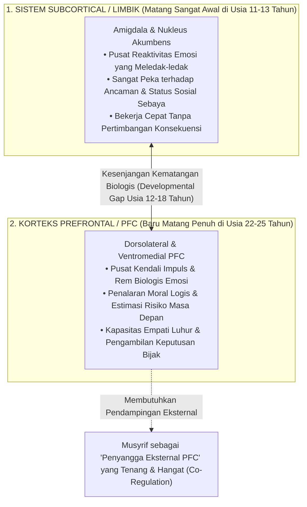
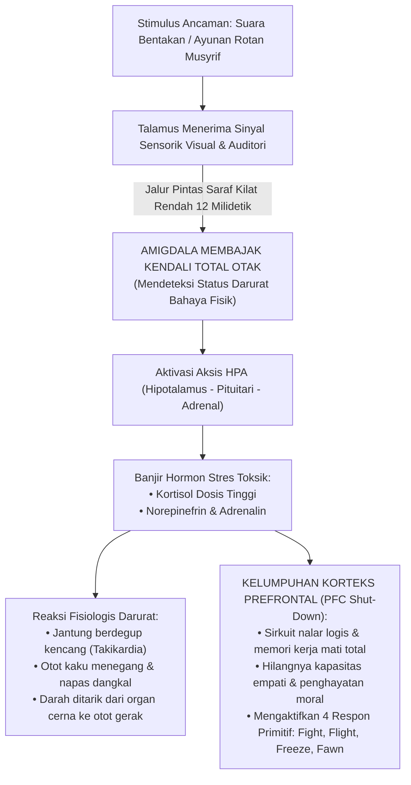
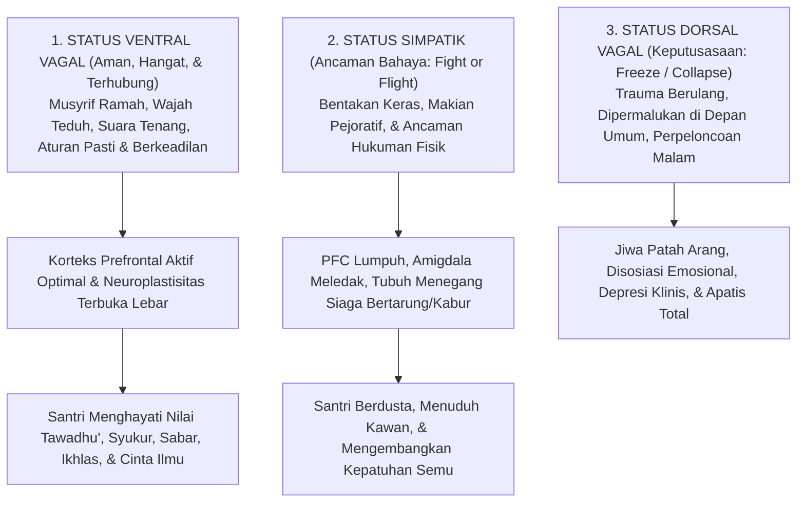
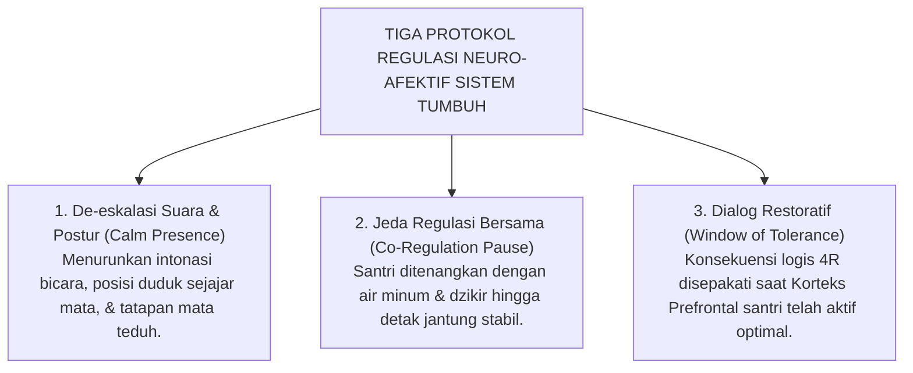

# SUB-BAB 1.3: DAMPAK NEUROBIOLOGIS TRAUMA & KELUMPUHAN PFC
## *Mekanisme Pembajakan Amigdala, Disregulasi Hormon Kortisol, dan Kerusakan Sirkuit Regulasi Moral Otak Remaja*

**Kode Klasifikasi**: `BOOK-01/BAB-01/SUB-03/MONOGRAF-MASTER`  
**Disiplin Ilmu**: Neurosains Kognitif Terapan, Neurobiologi Trauma, Teori Polivagal, & Epistemologi Turats  
**Penanggung Jawab Keilmuan**: Dewan Pakar Ekosistem TUMBUH (*Master Author, Pakar Neurosains Perkembangan, Disiplin Positif, & Bimbingan Konseling*)

---

### I. Pintu Masuk: Ketika Bentakan Menghancurkan Pintu Nalar Anak

Bayangkan sebuah peristiwa yang kerap terjadi di pelataran asrama pondok pada suatu sore:

Seorang santri berusia tiga belas tahun—sebut saja namanya Zaid—berdiri mematung di depan serambi kamar. Keringat dingin mengucur deras di keningnya, kedua tangannya gemetar hebat meremas ujung bajunya, dan tatapan matanya kosong terkunci ke lantai. Tepat di hadapannya, seorang pengurus asrama berdiri menjulang dengan urat leher menegang, melontarkan bentakan keras dengan suara menggelegar yang memekakkan telinga karena Zaid terlambat lima menit menghadiri jadwal halaqah Al-Qur'an.

*"Kenapa kamu terlambat?! Mana adabmu?! Jawab ustadz!"* bentak sang pengurus dengan mata melotot tajam.

Namun, semakin keras suara bentakan itu menghujam, Zaid justru semakin membisu seribu bahasa. Mulutnya terkunci rapat, tubuhnya mematung layaknya patung batu, dan air matanya menetes tanpa suara. Melihat sikap Zaid yang tidak merespons, sang pengurus semakin tersulut amarahnya dan menganggap Zaid sedang *"menantang otoritas guru"* atau *"berwatak bebal dan keras kepala"*.

Hukuman tambahan pun dijatuhkan: Zaid disuruh berdiri dengan satu kaki sambil menjewer kedua telinganya di depan seluruh santri yang lalu-lalang menuju masjid.

<b>Gambar 1.3.1:</b> Kesalahpahaman Fatal dalam Penertiban Asrama: Menafsirkan Kelumpuhan Saraf Otak sebagai Pembangkangan Moral.

Rangkaian peristiwa tragis pada bagan di atas mencerminkan **ketidaktahuan fatal para pendidik mengenai cara kerja otak manusia**. Sikap membisu dan mematungnya Zaid bukanlah bentuk kesombongan atau pembangkangan; secara biologis, detik itu otak Zaid sedang mengalami **Kelumpuhan Total Sistem Nalar Sadar (*Prefrontal Cortex Shut-Down*)** akibat ledakan rasa takut yang ekstrem. Memaksa anak berpikir logis saat otaknya dibajak oleh rasa panik sama mustahilnya dengan menyuruh seseorang bernyanyi merdu saat lehernya sedang dicekik!

---

### II. Neuroanatomi Otak Remaja: Asinkroni Maturasi Dua Sistem Saraf

Untuk memahami mengapa anak-anak usia pesantren (12–18 tahun) sangat rentan terhadap bentakan dan ancaman fisik, kita harus menengok temuan fundamental dalam neurosains perkembangan (*Developmental Cognitive Neuroscience*).

Riset pencitraan otak resonansi magnetik (*fMRI*) selama puluhan tahun (Giedd et al., 1999; Blakemore, 2012; Steinberg, 2008)[^1] membuktikan bahwa otak remaja berada dalam kondisi **Ketidakseimbangan Kematangan Biologis (*Developmental Asynchrony / Dual-Systems Model*)**:

<b>Gambar 1.3.2:</b> Model Dual-Systems: Kesenjangan Maturasi antara Sistem Limbik dan Korteks Prefrontal Otak Remaja.

Peta neuroanatomi di atas menjelaskan ketimpangan biologis yang terjadi di dalam tempurung kepala setiap santri remaja:
1. **Sistem Limbik (*Amigdala & Nukleus Akumbens*)**: Telah matang sempurna sejak awal masa pubertas. Komponen ini adalah mesin pacu emosi yang sangat bertenaga: memicu sensitivitas tinggi terhadap rasa malu, dorongan penerimaan kawan sebaya, dan respons cepat terhadap ancaman bahaya.
2. **Korteks Prefrontal (*Prefrontal Cortex / PFC*)**: Merupakan sistem kendali, rem moral, dan pusat pertimbangan logis (*Executive Functions*). Sirkuit rumit ini **baru akan mencapai kematangan biologis sempurna pada usia 22 hingga 25 tahun**.
3. **Kesenjangan Perkembangan (*The Developmental Gap*)**: Usia santri MTs dan MA (12–18 tahun) adalah fase di mana mesin pacu emosi mereka telah berkekuatan mobil balap, namun pedal rem kendali diri mereka masih sekelas rem sepeda ontel!
4. **Peran Vital Musyrif sebagai *External Brain Scaffolding***: Konsekuensi saintifiknya sangat terang: **santri remaja belum memiliki rem biologis internal yang matang**. Ketika mereka melakukan kekhilafan adab, mereka tidak membutuhkan palu bentakan yang menghancurkan, melainkan membutuhkan kehadiran musyrif dewasa yang tenang, teduh, dan penuh wibawa kasih sayang (*Firm & Kind*) yang berfungsi sebagai penyangga eksternal bagi otak depan mereka yang sedang berproses matang.

---

### III. Kaskade Neurokimia Trauma: Pembajakan Amigdala & Kerusakan Toksik Kortisol

Tatkala seorang santri yang sedang dalam fase perkembangan rapuh dihadapkan pada ancaman penegakan disiplin yang keras—seperti dibentak dengan suara menggelegar, ditatap dengan mata melotot penuh amarah, atau diayuni rotan—otak santri secara instan memicu reaksi darurat biologis yang disebut oleh Daniel Goleman (1995)[^2] sebagai **Pembajakan Amigdala (*Amygdala Hijack*)**:

<b>Gambar 1.3.3:</b> Kaskade Neurokimia Pembajakan Amigdala dan Kelumpuhan Jalur Nalar Moral (PFC Shut-Down).

Bagan alur kaskade neurokimia di atas mengungkap rentetan reaksi kimiawi destruktif yang melumpuhkan akal sehat santri dalam hitungan sepersekian detik:

1. **Jalur Pintas Kilat 12 Milidetik (*The Low Road*)**:  
   Sinyal bentakan ustadz ditangkap oleh telinga dan mata, lalu dikirim ke talamus. Talamus langsung melempar sinyal tersebut ke amigdala melalui jalur cepat (*low road*) hanya dalam tempo 12 milidetik—dua kali lebih cepat daripada sinyal yang dikirim ke korteks nalar sadar (*high road* yang butuh waktu 30–40 milidetik). Akibatnya, amigdala mengambil alih kemudi otak sebelum santri sempat menyadari apa yang sebenarnya terjadi!
2. **Aktivasi Aksis HPA (*Hypothalamic-Pituitary-Adrenal Axis*)**:  
   Amigdala memerintahkan hipotalamus untuk melepaskan hormon *Corticotropin-Releasing Factor* (CRF), memicu kelenjar pituitari melepaskan *Adrenocorticotropic Hormone* (ACTH), yang seketika memerintahkan kelenjar adrenal membanjiri aliran darah santri dengan **Kortisol dan Adrenalin dosis tinggi**.
3. **Mekanisme Kelumpuhan PFC (*Prefrontal Cortex Shut-Down*)**:  
   Banjir kortisol konsentrasi tinggi merusak fungsi reseptor dopamin dan glutamat di neokorteks. Pintu nalar logis dan pertimbangan moral di Korteks Prefrontal (PFC) **padam secara seketika (*black-out*)**. Santri kehilangan kemampuan untuk menyerap nasihat agama, tidak mampu merangkai kata pembelaan, dan terjerumus ke dalam empat respons hewani primitif pertahanan diri:
   * **Fight (Melawan)**: Santri membantah dengan tatapan dendam atau menjadi agresif memukul kawan yang lebih lemah.
   * **Flight (Kabur)**: Santri melarikan diri dari asrama (*minggat*) atau bersembunyi di toilet saat jam pelajaran.
   * **Freeze (Membeku)**: Santri mematung kaku, mulut terkunci, dan pikiran hampa (*seperti kasus Zaid*).
   * **Fawn (Pura-pura Patuh)**: Santri mengangguk-angguk pasrah dan menjilat musyrif semata-mata agar siksaan segera berakhir.

Sebagaimana dibuktikan oleh neurosaintis **Robert Sapolsky** (2017) dalam karyanya *Behave* dan pakar psikiatri anak **Bruce Perry** (2006) dalam *The Boy Who Was Raised as a Dog*[^3], paparan stres toksik yang berulang di lingkungan asrama menyebabkan dua kerusakan fisik permanen pada otak santri:
* **Penyusutan Volume Hipokampus**: Hormon kortisol kronis membunuh sel-sel neuron di area CA3 hipokampus, menyebabkan penyusutan volume memori hingga 10–15%. Akibatnya, santri yang sering dibentak dan dihukum fisik mengalami kemerosotan drastis dalam daya ingat dan kehilangan kemampuan menghafal Al-Qur'an dan matan kitab!
* **Hipertrofi Amigdala**: Amigdala anak membesar dan menjadi hiper-reaktif. Santri terkunci dalam status siaga bahaya konstan (*hyper-vigilance state*), mengalami insomnia, mudah cemas, mimpi buruk, dan selalu curiga kepada orang lain.

---

### IV. Teori Polivagal Stephen Porges: Mengapa Rasa Aman adalah Syarat Mutlak Lahirnya Adab

Kajian mutakhir dalam neurofisiologi klinis melalui **Teori Polivagal (*Polyvagal Theory*)** yang dikembangkan oleh **Prof. Stephen Porges** (2011; 2017)[^4] membuktikan bahwa sistem saraf otonom manusia beroperasi dalam hierarki evolusioner tiga tingkatan:

<b>Gambar 1.3.4:</b> Hubungan Status Sistem Saraf Polivagal terhadap Terbuka atau Tertutupnya Kapasitas Penghayatan Adab Santri.

Bagan hierarki saraf polivagal di atas memberikan bukti ilmiah yang tak terbantahkan mengenai kondisi fisik tubuh santri:

| Status Sistem Saraf | Jalur Saraf Utama | Kondisi Batin Santri | Manifestasi Perilaku Keseharian di Pondok | Kapasitas Menyerap Adab |
| :--- | :--- | :--- | :--- | :---: |
| **1. Ventral Vagal Complex (VVC)** | *Myelinated Vagus Nerve* (Sistem Keterlibatan Sosial / *Social Engagement*) | **Rasa Aman & Diterima (*Safe & Connected*)**: Jiwa santri tenang, merasa dihargai, dan percaya pada gurunya. | Tatapan mata teduh, suara santun, kooperatif, empati tinggi, dan jujur mengakui kesalahan. | **OPTIMAL (100%)** Nilai adab menembus kalbu dan menjadi karakter mendarah daging. |
| **2. Sympathetic Nervous System (SNS)** | *Sympathetic Chain* (Mobilisasi Pertahanan Diri / *Mobilization*) | **Terancam Bahaya (*Fight or Flight*)**: Amigdala membara, merasa diserang dan terpojok. | Berdusta demi selamat, menyalahkan teman sekamar, agresif, atau kabur dari pondok. | **TERHAMBAT (0%)** Kepatuhan mekanis palsu semata-mata demi menghindari rasa sakit raga. |
| **3. Dorsal Vagal Complex (DVC)** | *Unmyelinated Vagus Nerve* (Imobilisasi Primitif / *Freeze / Shutdown*) | **Putus Asa & Pasrah (*Collapse / Dissociation*)**: Jiwa mati rasa, putus asa dari pertolongan. | Wajah datar tanpa emosi, mengompol, menarik diri dari pergaulan, dan depresi berat. | **LUMPUH TOTAL (-100%)** Kehancuran mental, kognitif, dan spiritual anak. |

---

### V. Integrasi Turats: Hubungan Ketenangan Qalbu (*Thuma'ninah*) dan Cahaya Akal (*Nural Fahm*)

Temuan mutakhir neurosains di atas sesungguhnya mengonfirmasi apa yang telah dirumuskan dengan sangat anggun oleh para ulama agung Turats Islam sejak lebih dari seribu tahun yang lalu.

Ulama tasawuf dan pakar jiwa Islam ternama, **Imam Al-Harits al-Muhasibi (w. 243 H / 857 M)** dalam kitab monumentalnya *Adab an-Nufus* telah meletakkan kaidah psikospiritual yang agung:

> [!NOTE]
> ### 📜 Kaidah Emas Imam Al-Harits al-Muhasibi dalam *Adab an-Nufus*:[^5]
> 
> $$\text{إِذَا اسْتَوْلَى الْخَوْفُ الْمُفْرِطُ أَوِ الْغَضَبُ عَلَى النَّفْسِ، عَشِيَ بَصَرُ الْعَقْلِ، وَغَابَتِ الْحِكْمَةُ، وَلَمْ يَبْقَ لِلصَّاحِبِ مَسْلَكٌ إِلَى مَعْرِفَةِ حَقِيقَةِ الْأَدَبِ، وَإِنَّمَا يَنْبُتُ الْأَدَبُ فِي قَلْبٍ سَكَنَتْ رَوْعَتُهُ، وَاطْمَأَنَّتْ سَرِيرَتُهُ}$$
> 
> **Artinya:**  
> *"Tatkala rasa takut yang berlebihan (*al-Khawf al-Mufarith*) atau amarah yang membara telah menguasai jiwa seseorang, maka **butalah pandangan mata hatinya (*'Asyiya Basharul 'Aql*)**, sirnalah hikmah kebijaksanaan darinya, dan tertutuplah seluruh jalannya untuk mengenali hakikat adab yang sejati.*  
> *Ketahuilah, sesungguhnya adab itu hanyalah akan mampu bersemi dan bertumbuh di dalam **kalbu yang telah reda dari rasa takut yang mencekam dan telah tenteram batinnya (*Thuma'ninah*)**."*  
> *(Imam Al-Harits al-Muhasibi, Kitab Adab an-Nufus, Fashl fi Thuma'ninatil Qalbi, hlm. 48)*

Pernyataan Al-Muhasibi di abad ke-3 Hijriyah ini adalah rumusan orisinal konsep *Ventral Vagal Safe State*: **Ketenangan jiwa (*Thuma'ninah*) adalah prasyarat spiritual dan biologis yang mutlak agar cahaya akal (*Nural Fahm / PFC*) dapat menyerap dan memancarkan kemuliaan adab.**

---

### VI. Solusi Sistemik TUMBUH: Arsitektur Regulasi Neuro-Afektif Berbasis Rasa Aman

Berpijak pada hukum biologis dan tuntunan Turats ini, **Sistem TUMBUH** menetapkan bahwa **penciptaan rasa aman (*Safety First*) adalah syarat mutlak seluruh proses pendidikan adab**. Sistem TUMBUH merumuskan **Tiga Protokol Regulasi Neuro-Afektif** yang wajib dijalankan oleh seluruh pembina santri:

<b>Gambar 1.3.5:</b> Tiga Protokol Regulasi Neuro-Afektif Ekosistem TUMBUH dalam Penanganan Pelanggaran Santri.

Penerapan protokol sistemik di atas menjamin bahwa:
1. **De-eskalasi Suara & Postur**: Musyrif menggunakan frekuensi suara rendah (*low vocal pitch*) dan kontak mata penuh kasih (*compassionate gaze*) yang secara langsung mengaktifkan saraf kranial ke-10 (*vagus nerve*) santri untuk meredakan amigdala.
2. **Jeda Regulasi Bersama**: Menghentikan interogasi saat santri panik, memberikan ruang tenang (*Calm-Down Space*), dan memandu dzikir penenteram kalbu hingga detak jantung berada di bawah 85 bpm.
3. **Dialog Restoratif pada Jendela Kesiapan Otak**: Memulai muhasabah dan penyepakatan konsekuensi logis 4R hanya saat gelombang otak santri telah kembali tenang, memastikan bahwa nilai adab tersimpan dalam memori episodik jangka panjang (*long-term memory*).

---

### VII. Sintesis Neuro-Edukasi Sub-Bab 1.3

Sistem TUMBUH meletakkan temuan neurosains ini sebagai pilar fundamental: **kita tidak bisa menuntut kemuliaan adab dari santri yang otaknya sedang berjuang bertahan hidup dari rasa takut**.

Dengan menjamin terciptanya lingkungan asrama yang stabil, hangat, dan menenangkan (*Ventral Vagal Safe Climate*), Sistem TUMBUH membuka gerbang neuroplastisitas santri secara maksimal, memungkinkan mereka menyerap hafalan Al-Qur'an dengan jernih, mengasah penalaran nalar moral, dan memancarkan keluhuran adab nabawi atas dasar ketenteraman batin (*Thuma'ninah*).

---

## 📌 Catatan Kaki & Rujukan Primer

[^1]: **Jay N. Giedd et al.**, "Brain development during childhood and adolescence: a longitudinal MRI study", *Nature Neuroscience*, Vol. 2, No. 10 (1999), hlm. 861–863; **Sarah-Jayne Blakemore**, "Development of the social brain in adolescence", *Journal of the Royal Society of Medicine*, Vol. 105, No. 3 (2012), hlm. 111–116; serta **Laurence Steinberg**, "A social neuroscience perspective on adolescent risk-taking", *Developmental Review*, Vol. 28, No. 1 (2008), hlm. 78–106.
[^2]: **Daniel Goleman**, *Emotional Intelligence: Why It Can Matter More Than IQ* (New York: Bantam Books, 1995), Bab 2: "Anatomy of an Emotional Hijacking", hlm. 13–29.
[^3]: **Robert M. Sapolsky**, *Behave: The Biology of Humans at Our Best and Worst* (New York: Penguin Press, 2017), hlm. 95–136; serta **Bruce D. Perry & Maia Szalavitz**, *The Boy Who Was Raised as a Dog: And Other Stories from a Child Psychiatrist's Notebook* (New York: Basic Books, 2006), hlm. 45–78.
[^4]: **Stephen W. Porges**, *The Polyvagal Theory: Neurophysiological Foundations of Emotions, Attachment, Communication, and Self-regulation* (New York: W. W. Norton & Company, 2011), hlm. 133–164; serta *The Pocket Guide to the Polyvagal Theory: The Transformative Power of Feeling Safe* (New York: W. W. Norton, 2017).
[^5]: **Imam Al-Harits al-Muhasibi**, *Adab an-Nufus*, Tahqiq: Dr. Abdul Qadir Ahmad 'Atha (Kairo & Beirut: Dar al-Kutub al-Ilmiyyah, 1986), Bab 'Fashl fi Thuma'ninatil Qalbi wa Nuri Fahmil Aql', hlm. 48–51.
