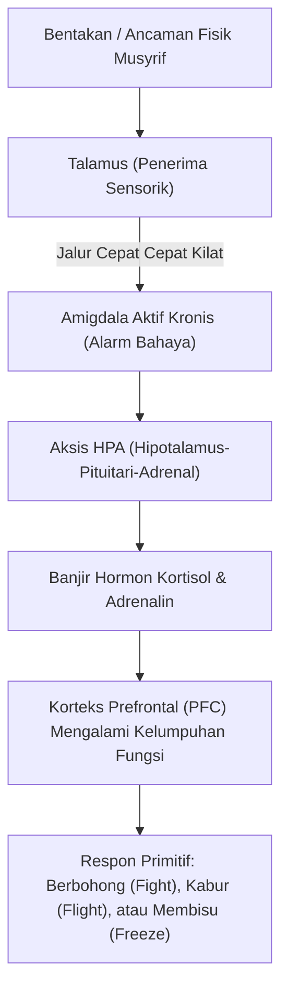

# SUB-BAB 1.3: DAMPAK NEUROBIOLOGIS TRAUMA & KELUMPUHAN PFC
## *Mekanisme Pembajakan Amigdala, Disregulasi Hormon Kortisol, dan Kerusakan Sirkuit Regulasi Moral Otak Remaja*

**Kode Modul**: `BOOK-01/BAB-01/SUB-03`  
**Kategori**: Landasan Neurosains Perkembangan  
**Fokus Keilmuan**: Neurobiologi Kognitif & Psikiatri Anak

---

### 1. Neurobiologi Respon Ancaman di Otak Santri
Ketika seorang santri mengalami bentakan, ancaman fisik, atau dipermalukan di depan umum, otak meresponsnya melalui jalur bawah sadar (*subcortical pathway*) yang sangat cepat:

---

### 2. Tiga Kerusakan Neurologis Akibat Pendekatan Teror
1. **Atrofi Hipokampus & Kerusakan Memori**: Paparan kortisol kronis merusak dendrit pada neuron hipokampus, menurunkan kapasitas santri dalam menghafal Al-Qur'an dan memahami kitab kuning.
2. **Kelumpuhan Korteks Prefrontal Dorsolateral (dlPFC)**: dlPFC adalah pusat pertimbangan etis, perencanaan logis, dan pengendalian impuls. Ketika dlPFC terhambat oleh amigdala yang terpicu, santri secara biologis **tidak mampu** melakukan refleksi moral.
3. **Desensitisasi Sirkuit Empati (*Anterior Insula & ACC*)**: Santri yang sering mengalami kekerasan akan mengalami penurunan sensitivitas empati, membuat mereka lebih mudah melakukan perundungan (*bullying*) terhadap teman yang lebih lemah.

---

### 3. Lingkungan Belajar yang Aman Secara Neurobiologis (*Brain-Safe Bi'ah*)
Pendidikan karakter hanya dapat berhasil jika otak santri berada dalam kondisi **Regulasi Parasimpatis (*Rest and Digest / Social Engagement System*)**:
* Suara musyrif yang tenang dan tegas (*Firm & Kind*).
* Tatapan mata yang mengayomi dan penuh penghargaan.
* Kepastian aturan yang adil dan konsisten tanpa ancaman kekerasan.
