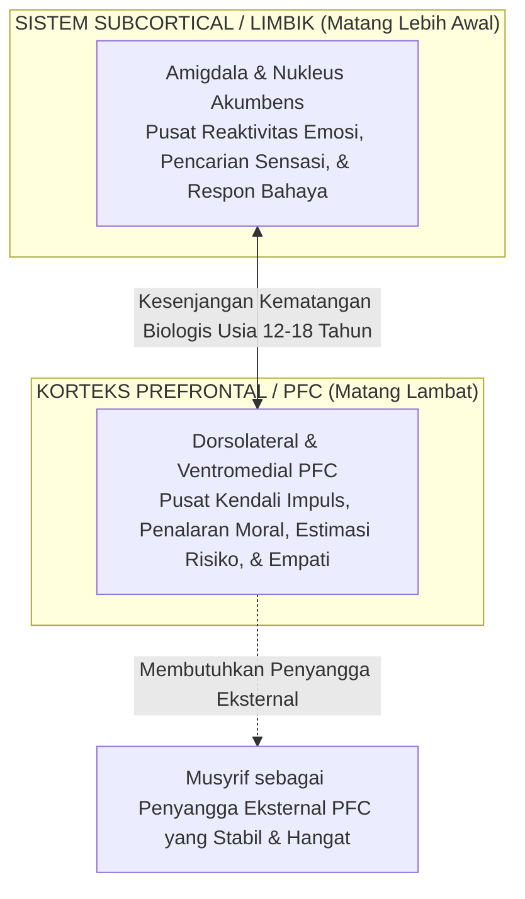
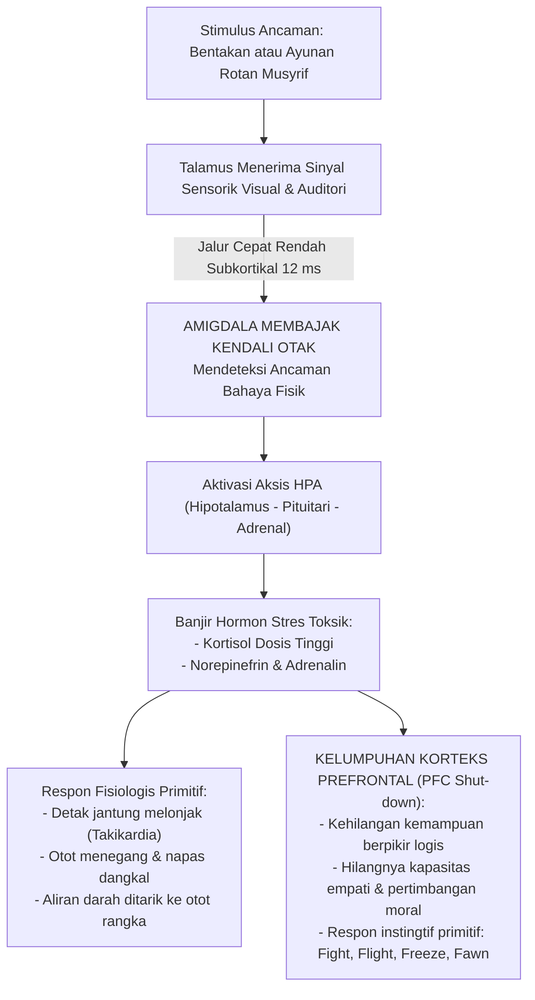
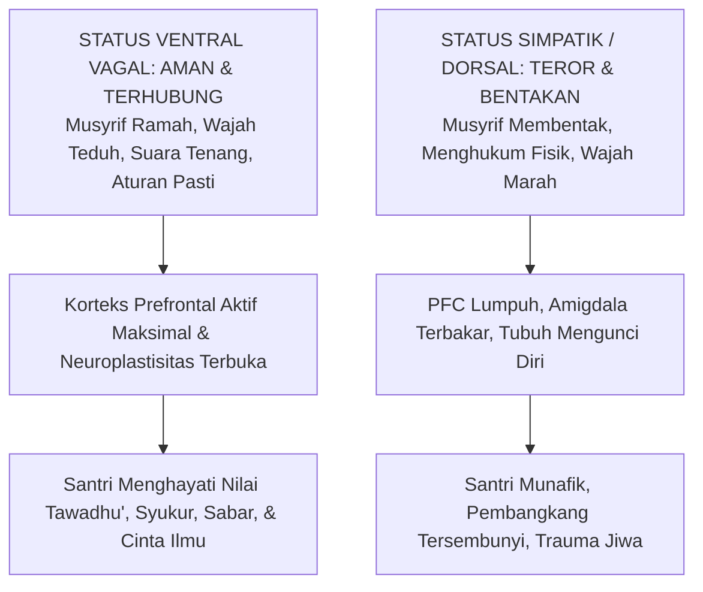

# SUB-BAB 1.3: DAMPAK NEUROBIOLOGIS TRAUMA & KELUMPUHAN PFC
## *Mekanisme Pembajakan Amigdala, Disregulasi Hormon Kortisol, dan Kerusakan Sirkuit Regulasi Moral Otak Remaja*

**Kode Klasifikasi**: `BOOK-01/BAB-01/SUB-03/MONOGRAF`  
**Disiplin Ilmu**: Neurosains Kognitif, Neurobiologi Trauma, & Psikologi Perkembangan Moral  
**Dewan Pakar**: `pakar-neurosains-perkembangan`, `pakar-psikologi-belajar`, `pakar-disiplin-positif`

---

### 1. Neuroanatomi Otak Remaja: Rentang Kerentanan dan Potensi Plastisitas

Masa remaja (usia 12–18 tahun)—yang merupakan usia mayoritas santri di tingkat MTs dan MA—adalah periode perkembangan otak yang paling dinamis sekaligus paling rentan setelah masa bayi (*critical neurodevelopmental window*). Berdasarkan penelitian neuroimaging fMRI (Giedd et al., 1999; Blakemore, 2012; Steinberg, 2008), otak remaja mengalami rekonstruksi besar-besaran yang ditandai oleh fenomena **asinkroni maturasi otak (*developmental mismatch / dual-systems model*)**:

1. **Sistem Limbik (Amigdala & Ventral Striatum)** telah matang sempurna sejak awal pubertas, memicu dorongan emosional yang intens, kepekaan tinggi terhadap penerimaan teman sebaya, serta reaktivitas spontan terhadap rangsangan lingkungan.
2. **Korteks Prefrontal (*Prefrontal Cortex / PFC*)**—terutama bagian *Dorsolateral Prefrontal Cortex* (dlPFC) yang mengatur fungsi eksekutif dan *Ventromedial Prefrontal Cortex* (vmPFC) yang mengatur pertimbangan etika moral—baru akan mencapai kematangan penuh pada usia pertengahan 20-an.

Konsekuensi biologis dari ketimpangan ini adalah: **santri remaja belum memiliki rem biologis internal yang sempurna**. Ketika mereka melakukan kesalahan adab, itu bukanlah bukti bahwa mereka "berjiwa jahat", melainkan cerminan dari sistem kendali diri yang sedang bertumbuh dan membutuhkan *scaffolding* (penyangga eksternal) berupa bimbingan musyrif yang tenang, penuh kasih sayang, dan konsisten (*Firm & Kind*).

---

### 2. Kaskade Neurokimia Trauma: Pembajakan Amigdala & Aksis HPA

Tatkala seorang santri yang sedang dalam fase perkembangan rapuh ini dihadapkan pada ancaman penegakan disiplin yang keras—seperti dibentak dengan suara menggelegar, ditatap dengan mata penuh amarah, atau dipukul secara fisik—otak santri secara otomatis memicu reaksi darurat biologis yang disebut oleh Daniel Goleman (1995) sebagai **Pembajakan Amigdala (*Amygdala Hijack*)**.

Mekanisme kaskade neurokimia ini berlangsung dalam hitungan milidetik melalui jalur saraf:

Sebagaimana dibuktikan oleh neurosaintis Robert Sapolsky (2017) dalam karyanya *Behave: The Biology of Humans at Our Best and Worst* dan Bruce Perry (2006) dalam *The Boy Who Was Raised as a Dog*, banjir hormon kortisol kronis akibat ancaman yang berulang di lingkungan tempat tinggal (asrama) menghasilkan dampak kerusakan patologis yang permanen:
* **Neurotoksisitas pada Hipokampus**: Kortisol berkepanjangan menyebabkan kematian neuron di area CA3 hipokampus, mengakibatkan penyusutan volume hipokampus hingga 10–15%. Akibatnya, kapasitas memori kerja (*working memory*) dan konsolidasi hafalan Al-Qur'an santri menurun drastis.
* **Desensitisasi Reseptor Glukokortikoid**: Otak santri terkunci dalam status siaga bahaya konstan (*hyper-arousal state*), membuat mereka mengalami insomnia di asrama, kecemasan kronis (*generalized anxiety*), dan mimpi buruk berulang.

---

### 3. Teori Polivagal Stephen Porges: Mengapa Rasa Aman adalah Syarat Mutlak Adab

Kajian mutakhir dalam neurofisiologi klinis melalui **Teori Polivagal (*Polyvagal Theory*)** yang dikembangkan oleh Prof. Stephen Porges (2011; 2017) menjelaskan bahwa sistem saraf otonom manusia beroperasi dalam hierarki filogenetik tiga tingkat:

| Status Sistem Saraf | Jalur Saraf Utama | Kondisi Psikologis Santri | Manifestasi Perilaku di Asrama | Kemungkinan Belajar Adab |
| :--- | :--- | :--- | :--- | :---: |
| **1. Ventral Vagal Complex (VVC)** | *Myelinated Vagus Nerve* (Sistem Keterlibatan Sosial / *Social Engagement System*) | **Rasa Aman & Terhubung (*Safe & Connected*)**: Santri merasa diterima, dihargai, dan tenang. | Tatapan mata hangat, intonasi suara bersahabat, kooperatif, empati tinggi, siap mendengarkan nasihat. | **OPTIMAL (100%)** Adab diserap ke dalam kalbu dan menjadi karakter sadar. |
| **2. Sympathetic Nervous System (SNS)** | *Sympathetic Chain* (Mobilisasi Pertahanan Diri / *Mobilization*) | **Terancam Bahaya (*Fight or Flight*)**: Amigdala aktif, santri merasa diserang dan tidak berdaya. | Berbohong, menyalahkan orang lain, agresif membela diri, atau kabur dari asrama pondok. | **TERHAMBAT (0%)** Kepatuhan hanya pura-pura demi menghindari sakit. |
| **3. Dorsal Vagal Complex (DVC)** | *Unmyelinated Vagus Nerve* (Imobilisasi / *Freeze / Shutdown*) | **Putus Asa & Pasrah Total (*Collapse / Dissociation*)**: Santri mengalami trauma tak berdaya. | Wajah tanpa ekspresi (datar), apatis, mengompol, menarik diri dari pergaulan, depresi klinis. | **LUMPUH TOTAL (-100%)** Kerusakan fungsi mental dan spiritual. |

Teori Polivagal memberikan bukti saintifik yang tak terbantahkan: **adab dan akhlak mulia hanya dapat tumbuh subur tatkala sistem saraf santri berada dalam status *Ventral Vagal (Safe & Social)***. Membentak atau memukul santri dengan dalih "agar mereka cepat paham" adalah sebuah ketidaktahuan neurobiologis yang fatal, karena tindakan tersebut secara otomatis mematikan bagian otak yang justru kita harapkan untuk memproses pemahaman moral tersebut!

---

### 4. Fenomena Moral Disengagement: Lahirnya Kepatuhan Semu

Ketika disiplin ditegakkan melalui teror fisik, santri secara bawah sadar mengaktifkan mekanisme psikologis yang diteliti secara mendalam oleh Albert Bandura (1999; 2016), yaitu **Pelepasan Kontrol Moral (*Moral Disengagement*)**.

Santri tidak mengembangkan suara hati moral internal (*conscience / bashirah*), melainkan membelah sistem moralnya:
1. **Moral Justification**: Santri membenarkan tindakan melanggar aturan saat sepi sebagai kompensasi atas ketidakadilan yang mereka terima dari para pengurus.
2. **Dehumanization of Victims**: Santri yang terbiasa diperlakukan kasar akan memandang juniornya sebagai objek yang pantas diperlakukan kasar pula.
3. **Displacement of Responsibility**: Santri merasa tidak bersalah saat berbuat zalim karena mereka meniru figur otoritas di pondoknya.

Hal ini menjelaskan secara ilmiah mengapa santri dari pesantren yang menerapkan hukuman fisik keras sering kali mengalami "ledakan perilaku negatif" tatkala mereka lulus dan berada di luar pengawasan pondok. Mereka tidak pernah memiliki *self-regulation* internal karena otak mereka hanya dilatih untuk merespons ancaman eksternal.

---

### 5. Integrasi Turats: Hubungan Ketenangan Qalbu (*Thuma'ninah*) dan Kecerdasan Akal (*Fahm*)

Temuan neurosains ini selaras secara sempurna dengan ajaran para ulama Turats klasik. Imam Al-Harits al-Muhasibi (w. 243 H) dalam kitab monumentalnya *Adab an-Nufus* menegaskan bahwa akal manusia (*al-'Aql*) tidak akan mampu memancarkan pemahaman (*al-Fahm*) dan kebijaksanaan (*al-Hikmah*) tatkala jiwa sedang diselimuti oleh kegelisahan amarah (*Ghadhab*) dan rasa takut (*Khawf*):

> [!NOTE]
> ### 📜 Kaidah Emas Imam Al-Harits al-Muhasibi dalam *Adab an-Nufus*:
> 
> $$\text{إِذَا اسْتَوْلَى الْخَوْفُ الْمُفْرِطُ أَوِ الْغَضَبُ عَلَى النَّفْسِ، عَشِيَ بَصَرُ الْعَقْلِ، وَغَابَتِ الْحِكْمَةُ، وَلَمْ يَبْقَ لِلصَّاحِبِ مَسْلَكٌ إِلَى مَعْرِفَةِ حَقِيقَةِ الْأَدَبِ، وَإِنَّمَا يَنْبُتُ الْأَدَبُ فِي قَلْبٍ سَكَنَتْ رَوْعَتُهُ، وَاطْمَأَنَّتْ سَرِيرَتُهُ}$$
> 
> **Artinya:**  
> *"Tatkala rasa takut yang berlebihan atau amarah telah menguasai jiwa seseorang, maka **butalah pandangan akalnya**, lenyaplah kebijaksanaan darinya, dan tertutuplah jalannya untuk mengenali hakikat adab yang sejati.*  
> *Sesungguhnya adab itu hanyalah akan tumbuh bersemi di dalam kalbu yang telah reda dari rasa takut yang mencekam dan telah tenteram batinnya (*Thuma'ninah*)."*  
> *(Imam Al-Harits al-Muhasibi, Kitab Adab an-Nufus, hlm. 48)*

Pernyataan agung Al-Muhasibi di abad ke-3 Hijriyah ini mendahului konsensus neurosains modern: **ketenangan batin (*thuma'ninah*) adalah prasyarat biologis dan spiritual agar pintu nalar akal (*PFC*) terbuka untuk menyerap kemuliaan adab.**

---

### 6. Rekomendasi Klinis & Metodologis bagi Ekosistem TUMBUH

Berpijak pada bukti neurobiologis dan turats di atas, Ekosistem TUMBUH mewajibkan seluruh pengasuh asrama dan guru madrasah untuk menerapkan **Tiga Protokol Regulasi Neuro-Afektif**:

1. **Protokol De-eskalasi Suara & Postur (*Calm Presence*)**:  
   Saat menghadapi santri yang melakukan pelanggaran berat, musyrif diwajibkan:
   - Menurunkan nada bicara (*low vocal pitch*) dan memperlambat tempo kalimat.
   - Mengambil posisi duduk sejajar mata santri (bukan berdiri menjulang secara intimidatif).
   - Memastikan kontak mata yang tenang dan penuh kasih (*compassionate eye contact*), yang secara instan merangsang saraf vagal santri untuk keluar dari status amigdala *fight-or-flight*.
2. **Jeda Regulasi Emosi (*Emotional Pause / Co-Regulation Period*)**:  
   Musyrif dilarang menjatuhkan konsekuensi atau memberikan wejangan panjang saat santri masih dalam keadaan menangis histeris, gemetar, atau marah. Santri diberikan waktu jeda (*calm-down space*) disertai segelas air putih dan dzikir penenang hati (*Al-Baqarah: 153*) hingga detak jantungnya kembali normal.
3. **Penyampaian Konsekuensi Restoratif pada Jendela Kesiapan Otak (*Window of Tolerance*)**:  
   Proses refleksi moral dan penyepakatan konsekuensi logis 4R baru dilakukan setelah korteks prefrontal santri kembali aktif penuh, memastikan bahwa proses ta'dib menjadi pengalaman pembelajaran sadar yang membekas dalam memori jangka panjang (*long-term episodic memory*).
