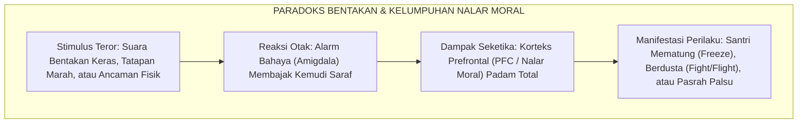
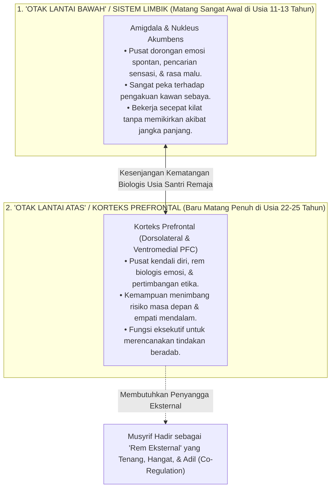
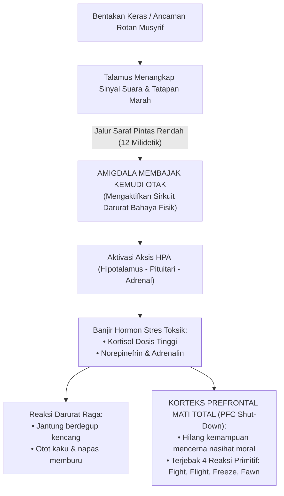
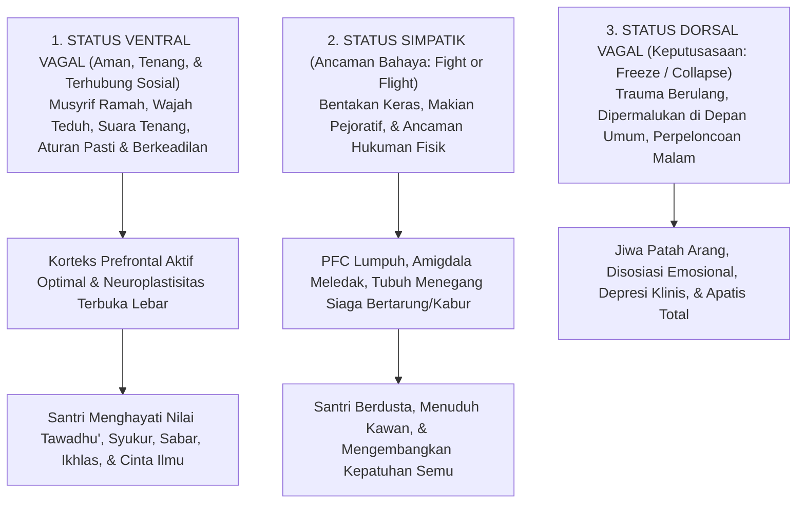
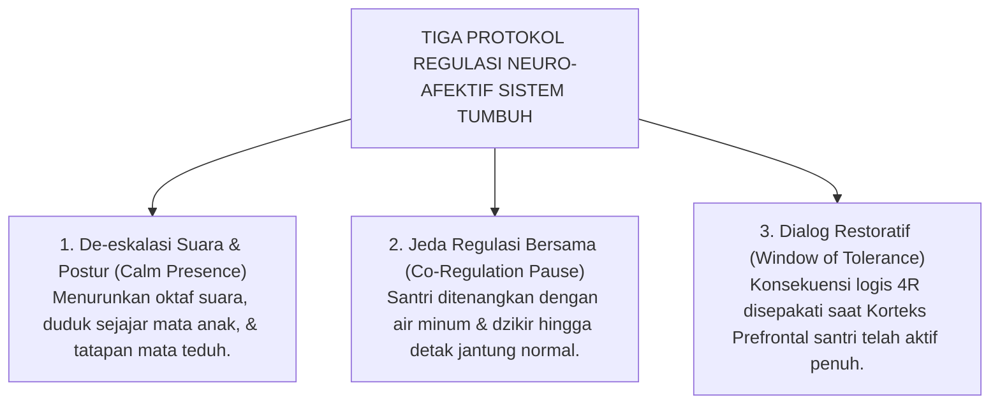

# DAMPAK NEUROBIOLOGIS TRAUMA & KELUMPUHAN PFC

---
### Paradoks Biologis Disiplin: Mengapa Kemarahan Menutup Pintu Pemahaman Anak?

Pernahkah Anda heran, mengapa seorang santri yang sedang dibentak habis-habisan atau dihukum di depan umum justru tampak membisu layaknya patung batu, tatapan matanya kosong, atau beberapa hari kemudian mengulangi kesalahan yang sama persis? 

Mengapa suara ustadz yang semakin keras dan hukuman yang semakin berat justru tidak membuat si anak semakin paham?

Banyak pengurus mengira sikap membisu itu adalah tanda anak yang "keras kepala", "bebal", atau "sengaja melawan guru". Namun, sains modern di bidang neurosains kognitif membuktikan fakta biologis yang mengejutkan:

> [!IMPORTANT]
> ### 🧠 Hukum Biologis Otak:
> Ketika seorang anak diteror dengan bentakan, ancaman rotan, atau dipermalukan di depan kawan-kawannya, bagian otak yang bertugas memahami aturan moral (**Korteks Prefrontal / PFC**) secara otomatis **padam dan terkunci rapat (*brain shut-down*)**.  
> 
> Memaksa anak mencerna nasihat adab saat ia sedang ketakutan sama mustahilnya dengan menyuruh seseorang membaca buku di dalam ruangan yang sedang terbakar hebat!

<b>Gambar 1.3.1:</b> Rantai Biologis Pembajakan Nalar Sadar Santri akibat Ancaman Disiplin Represif.

Detik saat suara bentakan menggelegar, otak santri tidak sedang memproses makna nasihat guru, melainkan sedang panik menyelamatkan diri dari ancaman bahaya fisik. Nalar sadarnya lumpuh seketika.

---

### Neuroanatomi Otak Remaja: Mesin Mobil Balap vs Rem Sepeda Ontel

Mengapa santri usia 12 hingga 18 tahun (usia MTs dan MA) sangat mudah meledak emosinya dan sering bertindak tanpa pikir panjang?

Riset pencitraan otak resonansi magnetik (*fMRI*)[^1] membongkar sebuah rahasia besar: **otak santri remaja sedang berada dalam fase konstruksi yang sangat tidak seimbang**:

<b>Gambar 1.3.2:</b> Model Dual-Systems: Kesenjangan Kematangan antara Sistem Limbik dan Korteks Prefrontal Otak Remaja.

Bayangkan seorang anak yang mengendarai mobil dengan **mesin mobil balap berkekuatan 500 tenaga kuda (Sistem Limbik yang sudah matang sempurna sejak awal pubertas), namun baru dilengkapi dengan pedal rem sepeda ontel (Korteks Prefrontal yang baru akan selesai dibangun pada usia 25 tahun)**!

Ketika seorang santri bercanda berlebihan di kamar mandi atau lupa jadwal piket, kekhilafan itu bukan karena ia anak jahat, melainkan rem biologis di otaknya memang belum selesai dibangun. Santri remaja belum memiliki rem mandiri yang kuat. Mereka sangat membutuhkan **kehadiran musyrif dewasa yang tenang dan hangat sebagai 'rem eksternal' (*External Scaffolding*)**, bukan bentakan kasar yang justru memutus kabel rem tersebut!

---

### Kaskade Neurokimia Trauma: Pembajakan Amigdala & Racun Hormon Kortisol

Apa yang sebenarnya terjadi di dalam pembuluh darah dan jaringan saraf santri saat ia dibentak ustadznya?

Pakar kecerdasan emosional Daniel Goleman[^2] menyebut peristiwa ini sebagai **Pembajakan Amigdala (*Amygdala Hijack*)**:

<b>Gambar 1.3.3:</b> Kaskade Neurokimia Pembajakan Amigdala dan Kelumpuhan Nalar Moral (*PFC Shut-Down*).

Hanya dalam tempo **12 milidetik**—sebelum santri sempat menyadari apa yang terjadi—alarm amigdala di otaknya langsung merebut kemudi tubuh. Aliran darah dibanjiri racun hormon stres (**kortisol dan adrenalin**). Jantung berdegup kencang, napas memburu, dan pintu nalar sadar di otak depan (*PFC*) padam seketika.

Santri terlempar ke dalam **Empat Respons Primitif Pertahanan Diri**:
* **Fight (Melawan)**: Santri menatap dendam atau melampiaskan amarah dengan memukul kawan yang lebih lemah.
* **Flight (Kabur)**: Santri melarikan diri dari asrama (*minggat*) atau sembunyi di toilet saat jam mengaji.
* **Freeze (Membeku)**: Santri mematung kaku, mulut terkunci, dan pikiran hampa (*seperti patung batu*).
* **Fawn (Pura-pura Patuh)**: Santri mengangguk-angguk manis semata-mata agar kemarahan guru segera berakhir.

Riset psikiatri anak[^3] membuktikan bahwa santri yang sering dibentak dan dihukum fisik mengalami **penyusutan organ memori (hipokampus) sebesar 10–15%**. Akibatnya fatal: santri kehilangan konsentrasi dan mengalami kemunduran tajam dalam menghafal Al-Qur'an dan kitab kuning!

---

### Teori Polivagal Stephen Porges: Rasa Aman adalah Pintu Masuk Adab

Penelitian neurofisiologi klinis melalui **Teori Polivagal (*Polyvagal Theory*)** oleh **Prof. Stephen Porges**[^4] membuktikan bahwa tubuh manusia memiliki saklar saraf tiga tingkat:

<b>Gambar 1.3.4:</b> Hubungan Status Sistem Saraf Polivagal terhadap Terbuka atau Tertutupnya Kapasitas Penghayatan Adab Santri.

Pesan dari tabel saraf di bawah ini sangat sederhana: **santri hanya bisa menyerap adab Ketika ia berada di Status Hijau (Ventral Vagal / Rasa Aman)**:

| Status Saraf | Kondisi Batin Santri | Manifestasi Perilaku di Pondok | Kapasitas Menyerap Adab |
| :--- | :--- | :--- | :---: |
| **1. Hijau (Ventral Vagal)** | **Aman & Diterima**: Tenang, rileks, dan percaya pada guru. | Santun, kooperatif, empati tinggi, jujur mengakui salah. | **OPTIMAL (100%)** Adab mendarah daging. |
| **2. Kuning (Simpatik)** | **Terancam Bahaya**: Panik, takut dipukul, merasa diserang. | Berdusta demi selamat, saling tuduh, atau kabur. | **TERHAMBAT (0%)** Kepatuhan palsu sesaat. |
| **3. Merah (Dorsal Vagal)** | **Putus Asa**: Jiwa mati rasa, menyerah pada kepedihan. | Wajah datar tanpa ekspresi, mengompol, depresi berat. | **LUMPUH TOTAL (-100%)** Kehancuran mental anak. |

---

### Integrasi Turats: Ketenangan Qalbu (*Thuma'ninah*) dan Cahaya Akal (*Nural Fahm*)

Temuan ilmiah ini menegaskan kaidah yang telah ditulis ulama tasawuf agung, **Imam Al-Harits al-Muhasibi (w. 857 M)** dalam kitabnya *Adab an-Nufus*:

> [!NOTE]
> ### 📜 Kaidah Emas Imam Al-Harits al-Muhasibi dalam *Adab an-Nufus*:[^5]
> 
> $$\text{إِذَا اسْتَوْلَى الْخَوْفُ الْمُفْرِطُ أَوِ الْغَضَبُ عَلَى النَّفْسِ، عَشِيَ بَصَرُ الْعَقْلِ، وَغَابَتِ الْحِكْمَةُ، وَلَمْ يَبْقَ لِلصَّاحِبِ مَسْلَكٌ إِلَى مَعْرِفَةِ حَقِيقَةِ الْأَدَبِ، وَإِنَّمَا يَنْبُتُ الْأَدَبُ فِي قَلْبٍ سَكَنَتْ رَوْعَتُهُ، وَاطْمَأَنَّتْ سَرِيرَتُهُ}$$
> 
> **Artinya:**  
> *"Ketika rasa takut yang berlebihan atau amarah telah menguasai jiwa seseorang, maka **butalah pandangan mata hatinya**, sirnalah hikmah kebijaksanaan darinya, dan tertutuplah jalannya untuk mengenali hakikat adab yang sejati.*  
> *Sesungguhnya adab itu hanyalah akan mampu bersemi dan bertumbuh di dalam **kalbu yang telah reda dari rasa takut yang mencekam dan telah tenteram batinnya (*Thuma'ninah*)**."*

Ulama salaf telah mengajarkan: **ketenteraman batin (*Thuma'ninah*) adalah syarat mutlak agar pintu akal terbuka untuk menerima ilmu dan adab.**

---

### Solusi Sistemik TUMBUH: Arsitektur Regulasi Neuro-Afektif Berbasis Rasa Aman

Berdasarkan hukum neurobiologi dan tuntunan Turats ini, **Sistem TUMBUH** menetapkan bahwa **penciptaan rasa aman (*Safety First*) adalah syarat mutlak seluruh proses pendidikan**. Sistem TUMBUH merumuskan **Tiga Protokol Regulasi Neuro-Afektif**:

<b>Gambar 1.3.5:</b> Tiga Protokol Regulasi Neuro-Afektif Ekosistem TUMBUH dalam Penanganan Pelanggaran Santri.

Penerapan protokol sistemik di lapangan:
1. **Tenangkan Nada Suara (*Calm Presence*)**: Musyrif menggunakan intonasi rendah dan posisi duduk sejajar mata anak untuk meredakan alarm amigdala santri.
2. **Beri Jeda Tenang (*Co-Regulation Pause*)**: Menghentikan interogasi saat santri panik, memberi segelas air putih, dan membimbing dzikir hingga detak jantung anak kembali normal.
3. **Bicara saat Nalar Sudah Siap (*Window of Tolerance*)**: Memulai musyawarah dan penentuan konsekuensi logis 4R hanya Ketika santri sudah tenang, sehingga nilai akhlak tersimpan abadi di memori jangka panjangnya.

---

## 📌 Catatan Kaki & Rujukan Primer

[^1]: **Jay N. Giedd et al.**, "Brain development during childhood and adolescence: a longitudinal MRI study", *Nature Neuroscience*, Vol. 2, No. 10 (1999), hlm. 861–863; **Sarah-Jayne Blakemore**, "Development of the social brain in adolescence", *Journal of the Royal Society of Medicine*, Vol. 105, No. 3 (2012), hlm. 111–116; serta **Laurence Steinberg**, "A social neuroscience perspective on adolescent risk-taking", *Developmental Review*, Vol. 28, No. 1 (2008), hlm. 78–106.
[^2]: **Daniel Goleman**, *Emotional Intelligence: Why It Can Matter More Than IQ* (New York: Bantam Books, 1995), Bab 2: "Anatomy of an Emotional Hijacking", hlm. 13–29.
[^3]: **Robert M. Sapolsky**, *Behave: The Biology of Humans at Our Best and Worst* (New York: Penguin Press, 2017), hlm. 95–136; serta **Bruce D. Perry & Maia Szalavitz**, *The Boy Who Was Raised as a Dog: And Other Stories from a Child Psychiatrist's Notebook* (New York: Basic Books, 2006), hlm. 45–78.
[^4]: **Stephen W. Porges**, *The Polyvagal Theory: Neurophysiological Foundations of Emotions, Attachment, Communication, and Self-regulation* (New York: W. W. Norton & Company, 2011), hlm. 133–164; serta *The Pocket Guide to the Polyvagal Theory: The Transformative Power of Feeling Safe* (New York: W. W. Norton, 2017).
[^5]: **Imam Al-Harits al-Muhasibi**, *Adab an-Nufus*, Tahqiq: Dr. Abdul Qadir Ahmad 'Atha (Kairo & Beirut: Dar al-Kutub al-Ilmiyyah, 1986), Bab 'Fashl fi Thuma'ninatil Qalbi wa Nuri Fahmil Aql', hlm. 48–51.
