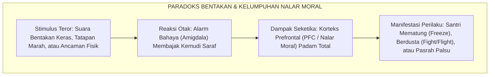
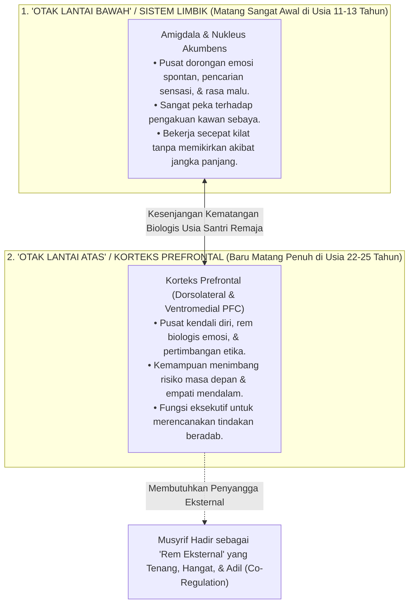
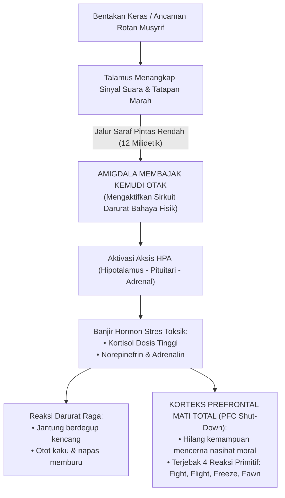
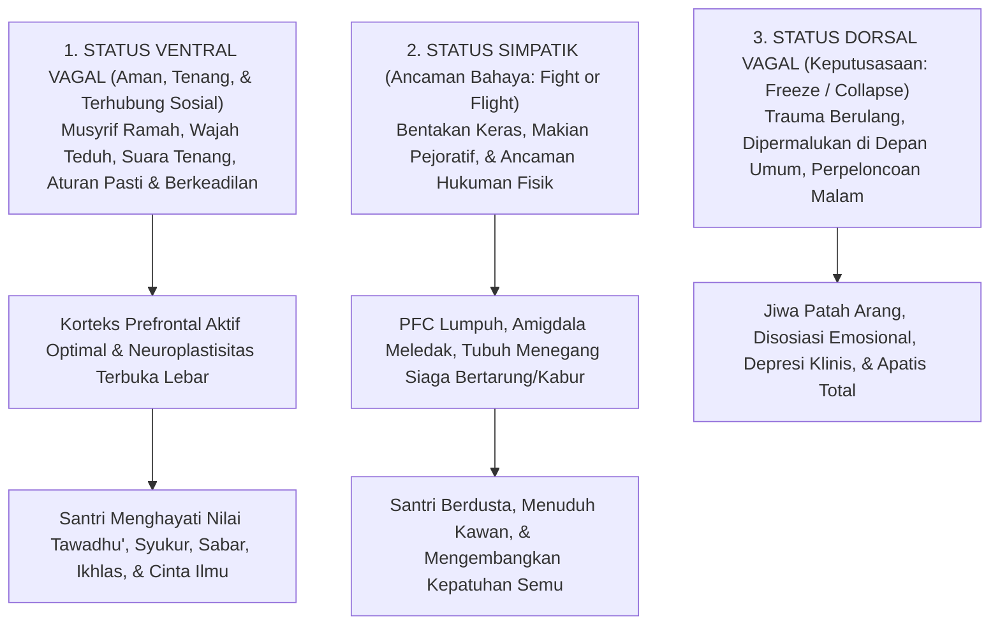
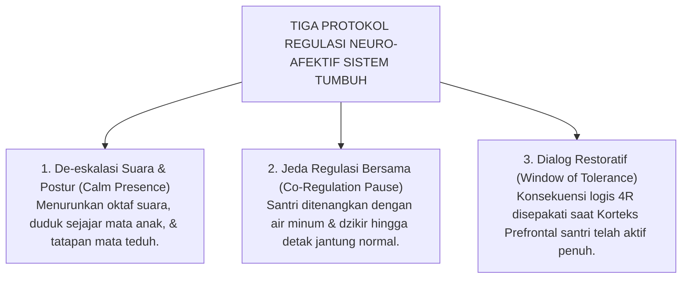

# SUB-BAB 1.3: DAMPAK NEUROBIOLOGIS TRAUMA & KELUMPUHAN PFC
## *Mekanisme Pembajakan Amigdala, Disregulasi Hormon Kortisol, dan Kerusakan Sirkuit Regulasi Moral Otak Remaja*

**Kode Klasifikasi**: `BOOK-01/BAB-01/SUB-03/MONOGRAF-MASTER-CLARITY`  
**Disiplin Ilmu**: Neurosains Kognitif Terapan, Neurobiologi Trauma, Teori Polivagal, & Epistemologi Turats  
**Penanggung Jawab Keilmuan**: Dewan Pakar Ekosistem TUMBUH (*Master Author, Pakar Neurosains Perkembangan, Disiplin Positif, & Bimbingan Konseling*)

---

### I. Paradoks Biologis Disiplin: Mengapa Kemarahan Menutup Pintu Pemahaman Anak?

Sebuah pertanyaan mendasar sering kali membingungkan para pendidik dan pengasuh asrama:  
*Mengapa seorang santri yang sedang dibentak habis-habisan atau dihukum fisik di depan umum justru tampak membisu, tatapan matanya kosong, atau beberapa hari kemudian mengulangi kesalahan yang sama persis? Mengapa suara yang semakin keras dan hukuman yang semakin berat tidak membuat anak semakin paham?*

Banyak pengurus menganggap sikap membisu tersebut sebagai tanda santri yang "keras kepala", "bebal", atau "sengaja melawan guru". Namun, temuan mutakhir dalam bidang **neurosains kognitif (*Cognitive Neuroscience*)** membuktikan sebuah fakta biologis yang mengejutkan:

> [!IMPORTANT]
> ### 🧠 Hukum Biologis Otak:
> Tatkala seorang anak diteror dengan bentakan, ancaman fisik, atau dipermalukan di depan orang banyak, bagian otak yang bertugas memahami aturan moral dan mencerna nasihat (**Korteks Prefrontal / PFC**) secara otomatis **padam dan terkunci rapat (*brain shut-down*)**.  
> 
> Memaksa anak memahami adab saat ia sedang ketakutan sama mustahilnya dengan menyuruh seseorang membaca buku di dalam ruangan yang sedang terbakar hebat!

<b>Gambar 1.3.1:</b> Rantai Biologis Pembajakan Nalar Sadar Santri akibat Ancaman Disiplin Represif.

Bagan di atas menunjukkan bahwa kekerasan verbal maupun fisik bukanlah alat pendidikan, melainkan **pemicu biologis yang melumpuhkan kemampuan berpikir anak**. Detik saat suara bentakan menggelegar, otak santri tidak sedang memproses makna nasihat ustadz, melainkan sedang berjuang mati-matian menyelamatkan diri dari ancaman bahaya.

---

### II. Neuroanatomi Otak Remaja: Memahami Kesenjangan Dua Mesin Utama

Mayoritas santri di pondok pesantren berada pada rentang usia 12 hingga 18 tahun (usia MTs dan MA). Dalam perspektif neurobiologi perkembangan (Giedd et al., 1999; Blakemore, 2012; Steinberg, 2008)[^1], usia ini adalah masa terjadinya **Ketimpangan Kematangan Otak (*The Developmental Asynchrony / Dual-Systems Model*)**:

<b>Gambar 1.3.2:</b> Model Dual-Systems: Kesenjangan Kematangan antara Sistem Limbik dan Korteks Prefrontal Otak Remaja.

Peta neuroanatomi di atas menjelaskan kondisi biologis nyata santri kita:

1. **Mesin Emosi ("Otak Lantai Bawah" / Sistem Limbik)**:  
   Telah berkembang penuh sejak awal masa pubertas. Ini adalah mesin pacu emosi yang bertenaga super cepat: memicu reaktivitas spontan, dorongan ingin diakui kawan sebaya, dan kepekaan tinggi terhadap rasa malu.
2. **Mesin Nalar & Rem Moral ("Otak Lantai Atas" / Korteks Prefrontal / PFC)**:  
   Merupakan ruang nalar logis, pusat pertimbangan moral, dan rem biologis kendali diri. Bagian rumit ini **baru akan mencapai kematangan biologis sempurna pada usia pertengahan 20-an (22–25 tahun)**.
3. **Kenyataan Lapangan Santri Remaja**:  
   Santri usia MTs dan MA ibarat seseorang yang mengendarai mobil dengan **mesin mobil balap berkekuatan 500 tenaga kuda (Sistem Limbik yang matang), namun baru dilengkapi dengan pedal rem sepeda ontel (Korteks Prefrontal yang belum matang)**!
4. **Implikasi bagi Pengasuhan**:  
   Ketika seorang santri berbuat salah (seperti bercanda berlebihan atau lupa jadwal piket), kekhilafan tersebut bukanlah bukti kejahatan watak, melainkan cerminan dari sistem rem biologisnya yang memang belum selesai dibangun. Santri membutuhkan **musyrif dewasa yang tenang dan bijak sebagai rem eksternal (*External Scaffolding*)**, bukan bentakan kasar yang justru memutus kabel rem tersebut!

---

### III. Kaskade Neurokimia Trauma: Pembajakan Amigdala & Racun Hormon Kortisol

Apa yang sebenarnya terjadi di dalam sel-sel saraf santri saat ia dibentak atau dipukul?

Pakar kecerdasan emosional Daniel Goleman (1995)[^2] menyebut peristiwa ini sebagai **Pembajakan Amigdala (*Amygdala Hijack*)**:

<b>Gambar 1.3.3:</b> Kaskade Neurokimia Pembajakan Amigdala dan Kelumpuhan Nalar Moral (*PFC Shut-Down*).

Bagan alur di atas merinci kaskade kimiawi yang melumpuhkan otak santri:

1. **Jalur Pintas 12 Milidetik (*The Low Road*)**:  
   Sinyal bentakan ustadz ditangkap telinga santri dan diteruskan ke talamus. Talamus langsung melempar sinyal bahaya tersebut ke amigdala hanya dalam tempo 12 milidetik—dua kali lebih cepat dibanding waktu yang dibutuhkan sinyal untuk mencapai otak nalar sadar (PFC). Akibatnya, amigdala merebut kemudi seluruh tubuh sebelum santri sempat berpikir!
2. **Banjir Racun Kortisol & Adrenalin**:  
   Amigdala memerintahkan kelenjar adrenal membanjiri aliran darah dengan **hormon kortisol dan adrenalin dosis tinggi**. Jantung santri berdegup kencang, tekanan darah melonjak, dan aliran darah ditarik dari otak depan menuju otot tangan dan kaki untuk bersiap menghadapi serangan fisik.
3. **Kelumpuhan Total Nalar Moral (*PFC Shut-Down*)**:  
   Kadar kortisol yang terlampau tinggi melumpuhkan sinapsis di Korteks Prefrontal. Pintu nalar sadar tertutup rapat. Santri tidak lagi mampu menyerap ayat dan hadits yang dibacakan ustadz, dan terlempar ke dalam **Empat Respons Primitif Pertahanan Diri**:
   * **Fight (Melawan)**: Santri menjadi agresif, menatap tajam dengan dendam, atau memukul kawan sekamar yang lebih lemah.
   * **Flight (Kabur)**: Santri melarikan diri dari asrama (*minggat*) atau mengunci diri di kamar mandi.
   * **Freeze (Membeku)**: Santri mematung kaku, mulut terkunci, pikiran hampa, dan tidak mampu menjawab pertanyaan.
   * **Fawn (Pura-pura Patuh)**: Santri mengangguk-angguk pasrah dan menjilat musyrif semata-mata agar kemarahan segera usai.

Sebagaimana dibuktikan oleh neurosaintis **Robert Sapolsky** (2017) dalam karyanya *Behave* dan pakar psikiatri anak **Bruce Perry** (2006)[^3], paparan stres toksik yang berulang di asrama merusak dua organ vital otak:
* **Penyusutan Volume Hipokampus**: Hormon kortisol kronis membunuh neuron di hipokampus, menyebabkan penyusutan volume memori 10–15%. Santri yang sering dibentak dan dihukum fisik mengalami kemerosotan daya ingat tajam dan kehilangan kemampuan menghafal Al-Qur'an serta matan kitab!
* **Hiper-Reaktivitas Amigdala**: Alarm bahaya anak rusak dan selalu menyala merah (*hyper-vigilance*). Santri mengalami insomnia, kecemasan kronis, mudah tersinggung, dan selalu mencurigai orang lain.

---

### IV. Teori Polivagal Stephen Porges: Rasa Aman adalah Prasyarat Mutlak Pembelajaran Adab

Penelitian mutakhir neurofisiologi klinis melalui **Teori Polivagal (*Polyvagal Theory*)** oleh **Prof. Stephen Porges** (2011; 2017)[^4] menjelaskan bahwa sistem saraf manusia beroperasi dalam tiga tingkatan hierarki:

<b>Gambar 1.3.4:</b> Hubungan Status Sistem Saraf Polivagal terhadap Terbuka atau Tertutupnya Kapasitas Penghayatan Adab Santri.

Tabel berikut memperjelas korelasi fisiologis saraf terhadap kapasitas santri dalam menyerap nilai-nilai akhlak:

| Status Saraf | Jalur Saraf Utama | Kondisi Batin Santri | Manifestasi Perilaku di Pondok | Kapasitas Menyerap Adab |
| :--- | :--- | :--- | :--- | :---: |
| **1. Ventral Vagal (VVC)** | *Myelinated Vagus Nerve* (Sistem Keterlibatan Sosial) | **Aman & Diterima (*Safe & Connected*)**: Tenang, percaya pada pembina, rileks. | Tatapan mata teduh, santun, kooperatif, empati tinggi, jujur mengakui salah. | **OPTIMAL (100%)** Adab diserap ke dalam kalbu & mendarah daging. |
| **2. Simpatik (SNS)** | *Sympathetic Chain* (Mobilisasi Pertahanan Diri) | **Terancam Bahaya (*Fight/Flight*)**: Panik, merasa diserang & terpojok. | Berdusta demi selamat, menyalahkan teman, agresif, atau kabur dari pondok. | **TERHAMBAT (0%)** Kepatuhan palsu semata demi menghindari sakit raga. |
| **3. Dorsal Vagal (DVC)** | *Unmyelinated Vagus* (Imobilisasi / Kolaps) | **Putus Asa (*Freeze/Collapse*)**: Jiwa mati rasa, menyerah pada kepedihan. | Wajah datar tanpa emosi, mengompol, menarik diri, depresi berat. | **LUMPUH TOTAL (-100%)** Kehancuran mental dan spiritual anak. |

---

### V. Integrasi Turats: Ketenangan Qalbu (*Thuma'ninah*) dan Cahaya Akal (*Nural Fahm*)

Temuan ilmiah di atas menegaskan kaidah yang telah dirumuskan secara anggun oleh ulama tasawuf agung, **Imam Al-Harits al-Muhasibi (w. 243 H / 857 M)** dalam kitabnya *Adab an-Nufus*:

> [!NOTE]
> ### 📜 Kaidah Emas Imam Al-Harits al-Muhasibi dalam *Adab an-Nufus*:[^5]
> 
> $$\text{إِذَا اسْتَوْلَى الْخَوْفُ الْمُفْرِطُ أَوِ الْغَضَبُ عَلَى النَّفْسِ، عَشِيَ بَصَرُ الْعَقْلِ، وَغَابَتِ الْحِكْمَةُ، وَلَمْ يَبْقَ لِلصَّاحِبِ مَسْلَكٌ إِلَى مَعْرِفَةِ حَقِيقَةِ الْأَدَبِ، وَإِنَّمَا يَنْبُتُ الْأَدَبُ فِي قَلْبٍ سَكَنَتْ رَوْعَتُهُ، وَاطْمَأَنَّتْ سَرِيرَتُهُ}$$
> 
> **Artinya:**  
> *"Tatkala rasa takut yang berlebihan (*al-Khawf al-Mufarith*) atau amarah telah menguasai jiwa seseorang, maka **butalah pandangan mata hatinya (*'Asyiya Basharul 'Aql*)**, sirnalah hikmah kebijaksanaan darinya, dan tertutuplah jalannya untuk mengenali hakikat adab yang sejati.*  
> *Sesungguhnya adab itu hanyalah akan mampu bersemi dan bertumbuh di dalam **kalbu yang telah reda dari rasa takut yang mencekam dan telah tenteram batinnya (*Thuma'ninah*)**."*

Prinsip Turats ini selaras sempurna dengan sains modern: **Rasa aman dan ketenteraman batin (*Thuma'ninah*) adalah syarat biologis dan spiritual mutlak agar pintu nalar akal (*PFC*) terbuka untuk menyerap kemuliaan adab.**

---

### VI. Solusi Sistemik TUMBUH: Arsitektur Regulasi Neuro-Afektif Berbasis Rasa Aman

Berdasarkan hukum neurobiologi dan tuntunan Turats ini, **Sistem TUMBUH** menetapkan bahwa **penciptaan rasa aman (*Safety First*) adalah syarat mutlak seluruh proses pendidikan karakter**. Sistem TUMBUH merumuskan **Tiga Protokol Regulasi Neuro-Afektif Pendidik**:

<b>Gambar 1.3.5:</b> Tiga Protokol Regulasi Neuro-Afektif Ekosistem TUMBUH dalam Penanganan Pelanggaran Santri.

Penerapan protokol sistemik di atas menjamin bahwa:
1. **De-eskalasi Suara & Postur (*Calm Presence*)**: Musyrif menggunakan intonasi suara rendah dan kontak mata penuh kasih (*compassionate gaze*) yang secara instan merangsang saraf vagus santri untuk meredakan amigdala.
2. **Jeda Regulasi Bersama (*Co-Regulation Pause*)**: Menghentikan interogasi saat santri panik, memberikan ruang tenang (*Calm-Down Space*), dan memandu dzikir penenteram kalbu hingga detak jantung kembali normal (di bawah 85 denyut per menit).
3. **Dialog Restoratif pada Jendela Kesiapan Otak (*Window of Tolerance*)**: Memulai muhasabah dan penyepakatan konsekuensi logis 4R hanya setelah gelombang otak santri kembali tenang, memastikan nilai adab tersimpan dalam memori episodik jangka panjang (*long-term memory*).

---

### VII. Sintesis Neuro-Edukasi Sub-Bab 1.3

Sistem TUMBUH meletakkan temuan neurosains ini sebagai pilar fundamental: **kita tidak bisa menuntut kemuliaan adab dari santri yang otaknya sedang berjuang bertahan hidup dari rasa takut**.

Dengan menjamin terciptanya lingkungan asrama yang stabil, hangat, dan menenangkan (*Ventral Vagal Safe Climate*), Sistem TUMBUH membuka gerbang neuroplastisitas santri secara maksimal, memungkinkan mereka menyerap hafalan Al-Qur'an dengan jernih, mengasah penalaran nalar moral, dan memancarkan keluhuran adab nabawi atas dasar ketenteraman batin (*Thuma'ninah*).

---

## 📌 Catatan Kaki & Rujukan Primer

[^1]: **Jay N. Giedd et al.**, "Brain development during childhood and adolescence: a longitudinal MRI study", *Nature Neuroscience*, Vol. 2, No. 10 (1999), hlm. 861–863; **Sarah-Jayne Blakemore**, "Development of the social brain in adolescence", *Journal of the Royal Society of Medicine*, Vol. 105, No. 3 (2012), hlm. 111–116; serta **Laurence Steinberg**, "A social neuroscience perspective on adolescent risk-taking", *Developmental Review*, Vol. 28, No. 1 (2008), hlm. 78–106.
[^2]: **Daniel Goleman**, *Emotional Intelligence: Why It Can Matter More Than IQ* (New York: Bantam Books, 1995), Bab 2: "Anatomy of an Emotional Hijacking", hlm. 13–29.
[^3]: **Robert M. Sapolsky**, *Behave: The Biology of Humans at Our Best and Worst* (New York: Penguin Press, 2017), hlm. 95–136; serta **Bruce D. Perry & Maia Szalavitz**, *The Boy Who Was Raised as a Dog: And Other Stories from a Child Psychiatrist's Notebook* (New York: Basic Books, 2006), hlm. 45–78.
[^4]: **Stephen W. Porges**, *The Polyvagal Theory: Neurophysiological Foundations of Emotions, Attachment, Communication, and Self-regulation* (New York: W. W. Norton & Company, 2011), hlm. 133–164; serta *The Pocket Guide to the Polyvagal Theory: The Transformative Power of Feeling Safe* (New York: W. W. Norton, 2017).
[^5]: **Imam Al-Harits al-Muhasibi**, *Adab an-Nufus*, Tahqiq: Dr. Abdul Qadir Ahmad 'Atha (Kairo & Beirut: Dar al-Kutub al-Ilmiyyah, 1986), Bab 'Fashl fi Thuma'ninatil Qalbi wa Nuri Fahmil Aql', hlm. 48–51.
