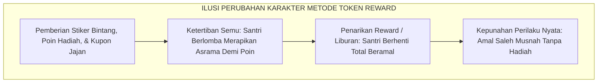
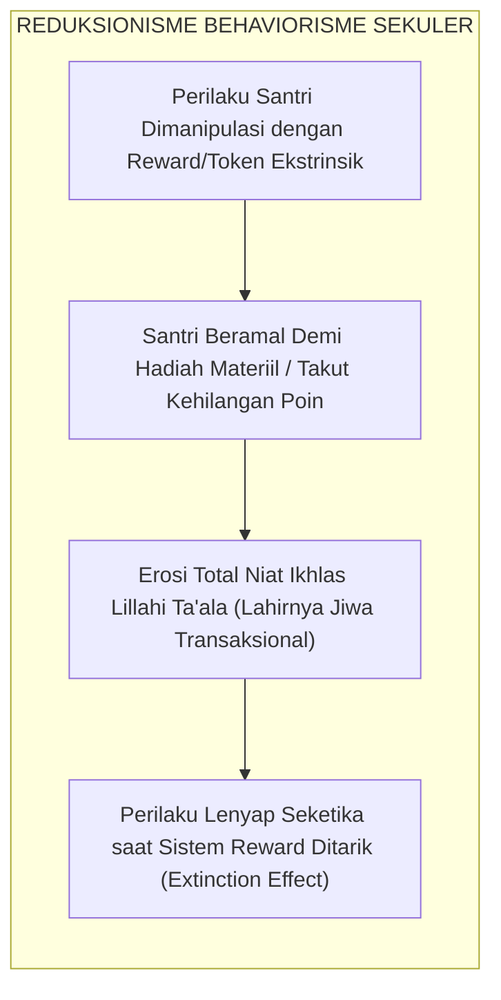
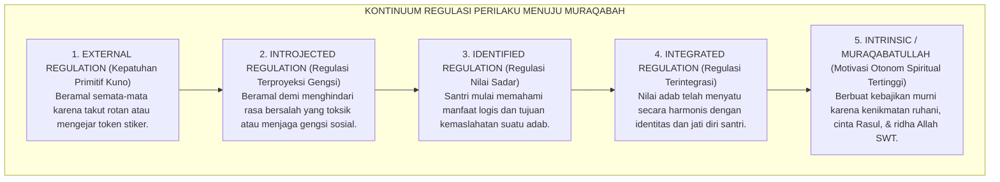
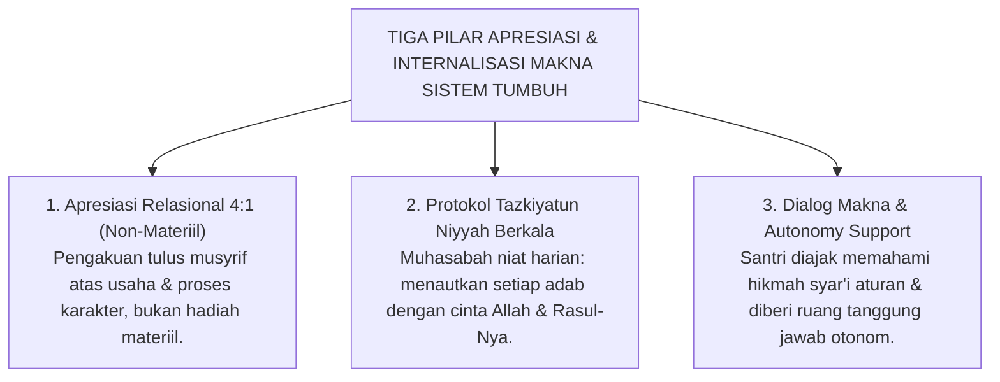

# SUB-BAB 1.4: KELEMAHAN BEHAVIORISME SEKULER & KEHAMPAAN RUHANI
## *Kritik atas Reduksionisme Hadiah-Hukuman Mekanis, Efek Overjustification, dan Erosi Keikhlasan Niat*

**Kode Klasifikasi**: `BOOK-01/BAB-01/SUB-04/MONOGRAF-MASTER`  
**Disiplin Ilmu**: Filsafat Pendidikan Islam, Psikologi Motivasi Humanistik, Self-Determination Theory, & Hermeneutika Turats  
**Penanggung Jawab Keilmuan**: Dewan Pakar Ekosistem TUMBUH (*Master Author, Pakar Filosofi TUMBUH, Epistemologi Turats, & Social Emotional Learning*)

---

### I. Pintu Masuk: Ilusi Ketertiban dan Kepunahan Amal di Asrama

Sebagai reaksi atas kegagalan metode kekerasan masa lalu, sebagian pengelola pondok pesantren modern berupaya melakukan pembaruan tata kelola disiplin dengan mengadopsi sistem modifikasi perilaku ala Barat: **Sistem Poin Pinalti dan Token Hadiah (*Token Economy System*)**.

Di atas kertas dan pada pekan-pekan awal penerapannya, metode ini tampak membawa angin segar yang sangat menjanjikan:
* Setiap santri yang merapikan kasur sebelum subuh diberikan stiker bintang emas atau token 10 poin reward.
* Santri yang datang paling awal ke saf terdepan masjid diberikan kupon jajan gratis di kantin.
* Sebaliknya, santri yang terlambat atau melanggar aturan dipotong poinnya dan diancam denda uang saku.

Seketika lorong asrama tampak luar biasa tertib. Santri berlomba-lomba bangun pagi, berebut menyapu lantai serambi, dan memenuhi saf pertama masjid. Para pengurus tersenyum puas melihat grafik disiplin santri yang melonjak tajam.

<b>Gambar 1.4.1:</b> Siklus Kepunahan Amal (*Extinction Effect*) dalam Sistem Modifikasi Perilaku Mekanis.

Namun, pemandangan semu pada bagan di atas segera runtuh tatkala ujian sesungguhnya datang:

Tatkala program reward tersebut dihentikan karena anggaran hadiah habis, atau tatkala santri pulang ke rumah selama masa liburan semester di mana tidak ada musyrif yang membagikan stiker poin—**seluruh ketertiban tersebut lenyap tanpa bekas dalam sekejap mata (*The Behavioral Extinction Phenomenon*)**.

Di rumah, anak-anak yang di pondok tampak sangat rajin itu kembali bangun kesiangan, meninggalkan shalat lima waktu, membiarkan kamar tidur mereka berantakan, dan enggan membantu orang tua kecuali jika dijanjikan imbalan uang. Orang tua mereka mengeluh dengan nada getir: *"Mengapa anak saya di pondok tampak begitu saleh, tetapi begitu sampai di rumah sifat aslinya sama sekali tidak berubah?!"*

Pertanyaan menyayat hati ini membongkar kelemahan mendasar dari sistem modifikasi perilaku mekanis: **Sistem tersebut hanya berhasil memanipulasi gerak raga lahiriah santri, namun gagal menyentuh dan menumbuhkan kesadaran batin ruhani di dalam kalbunya.**

---

### II. Menelanjangi Behaviorisme Radikal Skinner: Reduksi Manusia Menjadi Hewan Percobaan

Kegagalan sistem reward-token bukanlah kebetulan semata, melainkan konsekuensi logis dari paradigma filsafat yang mendasarinya. Sistem ini berakar dari **Behaviorisme Radikal (*Radical Behaviorism*)** yang dipelopori oleh **B.F. Skinner (1953; 1971)** dan John B. Watson (1913)[^1].

Skinner merumuskan teorinya berdasarkan eksperimen laboratorium terhadap hewan (*Skinner Box*): burung merpati yang mematuk tombol akan diberi butiran jagung (*reinforcement*), sedangkan tikus yang salah menginjak pedal dialiri sengatan listrik (*punishment*). Skinner kemudian menarik generalisasi berbahaya: manusia dianggap tidak memiliki jiwa (*mindless organism*), tidak memiliki kehendak bebas (*no free will*), dan perilakunya dapat direkayasa secara mekanistik semata-mata melalui manipulasi stimulus eksternal.

<b>Gambar 1.4.2:</b> Alur Reduksionisme Behaviorisme Sekuler dan Erosi Keikhlasan Beramal Santri.

Rantai reduksionisme pada bagan di atas menelanjangi racun pedagogis yang bekerja di balik sistem hadiah-hukuman mekanis:
1. **Manipulasi Ekstrinsik**: Santri tidak lagi diajak merenungkan hikmah ibadah, melainkan diumpani oleh hadiah duniawi sesaat.
2. **Lahirnya Mentalitas Transaksional**: Santri mengembangkan pola pikir materialistis: *"Berapa poin yang saya dapat jika menyapu halaman ini? Jika tidak ada poinnya, mengapa saya harus repot-repot mengerjakannya?"*
3. **Erosi Keikhlasan Beramal**: Nilai kesucian ibadah (*Lillahi Ta'ala*) tercemar oleh motif berburu stiker dan pujian manusia (*riya'*).
4. **Kepunahan Perilaku (*Extinction Effect*)**: Begitu stimulus imbalan dihentikan, dorongan berbuat baik mati seketika karena api motivasi di dalam jiwanya tidak pernah dinyalakan.

---

### III. Teori Self-Determination & Fenomena Overjustification Effect

Kelemahan fatal behaviorisme mekanistik ini telah dibongkar secara empiris oleh pakar psikologi motivasi dunia, **Prof. Edward L. Deci dan Prof. Richard M. Ryan (1985; 2000; 2017)**[^2] melalui **Self-Determination Theory (SDT)** serta riset monumental **Alfie Kohn (1993)**[^3] dalam bukunya yang mengguncang dunia pendidikan, *Punished by Rewards: The Trouble with Gold Stars, Incentive Plans, A's, Praise, and Other Bribes*.

Riset psikologi selama puluhan tahun menemukan fenomena destruktif yang dikenal sebagai **Efek Pembenaran Berlebih (*The Overjustification Effect*)**:

$$\text{Pemberian Hadiah Ekstrinsik Berlebihan} \Longrightarrow \text{Menghancurkan Motivasi Intrinsik Alami Secara Permanen}$$

Tatkala seorang santri yang awalnya memiliki dorongan fitrah alami untuk membantu kawan atau membaca Al-Qur'an diberikan imbalan materiil yang mencolok, otak bawah sadarnya mengalami pergeseran atribusi motif (*shift of locus of causality*): *"Aku tadinya mengaji karena hatiku merasa damai dan cinta pada firman Allah, namun sekarang aku mengaji demi mengumpulkan kupon bintang dari ustadz."*

Alfie Kohn (1993) merumuskan **Tiga Racun Pedagogis Sistem Reward-Punishment**:
1. **Rewards Punish (Hadiah adalah Hukuman yang Menyamar)**: Hadiah bersifat manipulatif dan menciptakan kecemasan performa (*performance anxiety*). Kegagalan seorang santri mendapatkan bintang reward dirasakan sama menyakitkannya dengan menerima hukuman fisik.
2. **Rewards Ruin Relationships (Hadiah Merusak Ukhuwah Persaudaraan)**: Sistem ranking poin menciptakan kompetisi tidak sehat, kecemburuan sosial di kamar asrama, dan memicu santri untuk saling menjatuhkan demi berada di puncak klasemen reward.
3. **Rewards Discourage Creativity & Honesty (Hadiah Menghancurkan Kejujuran)**: Santri yang berorientasi poin hanya akan melakukan tugas minimal yang dinilai, enggan berinisiatif dalam kebaikan tersembunyi, dan terdorong untuk memanipulasi buku mutaba'ah demi mendapatkan skor tinggi.

---

### IV. Kontinuum Regulasi Motivasi: Menuju Kesadaran Muraqabatullah

Self-Determination Theory memetakan spektrum regulasi perilaku manusia ke dalam sebuah tangga kontinuum bertingkat dari ketergantungan hewani menuju kemerdekaan jiwa:

<b>Gambar 1.4.3:</b> Kontinuum Spektrum Regulasi Motivasi: Dari Ketergantungan Eksternal Menuju Kesadaran Muraqabatullah.

Peta tingkatan motivasi di atas menjelaskan letak kekeliruan sistem pembinaan karakter tradisional dan sekuler:
* **Tingkat 1 (*External Regulation*)**: Santri patuh hanya jika ada rotan atau token reward. Ini adalah level pembinaan hewani.
* **Tingkat 2 (*Introjected Regulation*)**: Santri beramal karena takut dinilai buruk oleh kawan sekamar atau ingin dipuji pengurus. Ketaatan ini rentan melahirkan riya' dan kemunafikan.
* **Tingkat 3 & 4 (*Identified & Integrated Regulation*)**: Santri mulai menghayati nilai adab sebagai kebutuhan jati dirinya sebagai seorang penuntut ilmu mulia.
* **Tingkat 5 (*Intrinsic Motivation / Muraqabatullah*)**: Merupakan puncak kematangan adab santri, di mana ia shalat tahajjud di keheningan malam dan merapikan asrama murni karena merasakan kelezatan munajat kepada Allah SWT (*Halaawatul Iman*), tanpa peduli apakah ada manusia yang melihatnya atau tidak.

---

### V. Hermeneutika Turats: Hakikat Niat Ikhlas vs Bahaya Tersembunyi Riya' dan Sum'ah

Di sinilah letak keagungan epistemologi Islam yang melampaui seluruh teori psikologi Barat. Jauh sebelum teori motivasi modern lahir, para ulama Turats telah meletakkan **Kemurnian Niat (*Ikhlasun Niyyah*)** sebagai syarat mutlak diterimanya seluruh bangunan amal perbuatan.

Hujjatul Islam **Imam Abu Hamid Al-Ghazali** dalam *Ihya 'Ulumiddin* (Jilid IV, *Kitab an-Niyyah wal Ikhlas wash-Shidq*) menuliskan diagnosa ruhani yang sangat menggetarkan:

> [!NOTE]
> ### 📜 Hermeneutika Niat Imam Al-Ghazali dalam *Ihya 'Ulumiddin*:[^4]
> 
> $$\text{إِنَّ النِّيَّةَ هِيَ انْبِعَاثُ الْقَلْبِ إِلَى مَا يَرَاهُ مُوَافِقًا لِغَرَضٍ مِنْ أَغْرَاضِهِ، إِمَّا عَاجِلًا وَإِمَّا آجِلًا. فَالْإِخْلَاصُ هُوَ تَجْرِيدُ قَصْدِ التَّقَرُّبِ إِلَى اللَّهِ تَعَالَى عَنْ جَمِيعِ الشَّوَائِبِ. فَإِذَا امْتَزَجَ بِالْعَمَلِ غَرَضٌ دُنْيَوِيٌّ مِنْ طَلَبِ مَحْمَدَةٍ، أَوْ جَلْبِ مَنْفَعَةٍ، أَوْ دَفْعِ مَذَمَّةٍ، خَرَجَ الْعَمَلُ عَنْ حَدِّ الْإِخْلَاصِ وَصَارَ شِرْكًا خَفِيًّا يُحْبِطُ الْأَجْرَ}$$
> 
> **Artinya:**  
> *"Sesungguhnya niat itu adalah bangkitnya daya gerak kalbu menuju tujuan yang dipandangnya selaras, baik tujuan duniawi yang dekat maupun ukhrawi yang kekal.*  
> *Maka hakikat **Ikhlas adalah memurnikan motif taqarrub mendekatkan diri kepada Allah Ta'ala dari segala campuran pamrih lainnya**.*  
> *Tatkala suatu amal telah tercampur oleh pamrih duniawi—seperti mencari pujian manusia (*riya'*), mengejar keuntungan materiil (*token reward*), atau sekadar menghindari celaan (*denda*)—maka amal tersebut telah keluar dari batas keikhlasan dan berubah menjadi **syirik tersembunyi (*syirk khafiy*) yang menggugurkan seluruh pahala di sisi Allah!**"*

> [!NOTE]
> ### 📜 Tamsil Indah Ibn al-Qayyim al-Jawziyyah dalam *Al-Fawa'id*:[^5]
> 
> $$\text{الْعَمَلُ بِغَيْرِ إِخْلَاصٍ وَلَا اقْتِدَاءٍ، كَالْمُسَافِرِ يَمْلَأُ جِرَابَهُ رَمْلًا، يُثْقِلُهُ وَلَا يَنْفَعُهُ}$$
> 
> **Artinya:**  
> *"Amal yang dikerjakan tanpa keikhlasan niat dan tanpa mengikuti tuntunan sunnah nabawi, ibarat seorang musafir yang mengisi kantong bekalnya dengan pasir: pasir itu hanya memberatkannya di perjalanan namun sama sekali tidak bermanfaat mengenyangkan rasa laparnya."*

Tinjauan Turats ini menyingkap bahaya terbesar dari sistem reward-punishment sekuler: **sistem tersebut tanpa sadar melatih santri untuk menjadi ahli riya' dan pemburu pujian makhluk sejak usia belia**. Santri dibiasakan beramal demi dilihat musyrif dan demi mendapat token duniawi, yang secara sistematis mematikan sensitivitas tauhid dan keikhlasan di dalam kalbu mereka.

---

### VI. Solusi Sistemik TUMBUH: Model Apresiasi Relasional & Internalisasi Makna

Ekosistem **TUMBUH** merekayasa model pembinaan motivasi yang memadukan kemurnian niat Turats dengan prinsip pemenuhan kebutuhan dasar psikologis manusia (*Basic Psychological Needs: Autonomy, Competence, Relatedness*) melalui **Tiga Pilar Apresiasi Relasional**:

<b>Gambar 1.4.4:</b> Tiga Pilar Model Apresiasi Relasional dan Internalisasi Makna Adab Ekosistem TUMBUH.

Penerapan pilar sistemik di atas menjamin bahwa:
1. **Apresiasi Relasional 4:1**: Menolak manipulasi token materiil, dan menggantinya dengan pengakuan relasional yang tulus atas proses perjuangan santri (*"Ustadz menghargai kesabaran antum saat mengantre tadi"*), menumbuhkan rasa kompetensi dan kedekatan tanpa merusak niat ikhlas.
2. **Protokol Tazkiyatun Niyyah Berkala**: Setiap piket, belajar, dan ibadah selalu diawali dengan pelurusan niat untuk meraih ridha Allah SWT, melatih santri memiliki kewaspadaan batin (*Muraqabatullah*).
3. **Dialog Makna & Dukungan Otonomi**: Membuka ruang musyawarah kamar untuk memahami hikmah syariat di balik aturan asrama, sehingga kepatuhan lahir dari kesadaran internal otonom, bukan keterpaksaan.

---

### VII. Sintesis Aksiologis Sub-Bab 1.4

Melalui kritik aksiologis ini, Sistem TUMBUH menegaskan bahwa **tujuan akhir pendidikan karakter bukanlah sekadar keteraturan fisik yang mekanistik, melainkan terbangunnya jiwa yang merdeka dan ikhlas beramal semata-mata karena Allah Ta'ala**.

Dengan mengganti sistem token transaksional dengan Apresiasi Relasional dan Tazkiyatun Niyyah, Sistem TUMBUH membimbing santri mendaki tangga motivasi hingga mencapai puncak **Muraqabatullah**: berakhlak mulia di keramaian maupun dalam kesendirian, menjaga integritas di pondok maupun tatkala telah berbaur di tengah masyarakat luas.

---

## 📌 Catatan Kaki & Rujukan Primer

[^1]: **Burrhus Frederic Skinner**, *Science and Human Behavior* (New York: Macmillan, 1953); serta *About Behaviorism* (New York: Vintage Books, 1974).
[^2]: **Edward L. Deci & Richard M. Ryan**, *Intrinsic Motivation and Self-Determination in Human Behavior* (New York: Plenum, 1985); serta *Self-Determination Theory: Basic Psychological Needs in Motivation, Development, and Wellness* (New York: Guilford Press, 2017).
[^3]: **Alfie Kohn**, *Punished by Rewards: The Trouble with Gold Stars, Incentive Plans, A's, Praise, and Other Bribes* (Boston: Houghton Mifflin Company, 1993), hlm. 49–98.
[^4]: **Hujjatul Islam Imam Abu Hamid al-Ghazali**, *Ihya' 'Ulumiddin*, Kitab an-Niyyah wal Ikhlas wash-Shidq (Kairo & Beirut: Dar al-Ma'rifah, t.th.), Juz IV, hlm. 364–367.
[^5]: **Al-Imam Ibn al-Qayyim al-Jawziyyah**, *Al-Fawa'id*, Tahqiq: Syaikh Ali Hasan al-Halabi (Kairo: Dar al-Kutub al-Ilmiyyah, 1996), Fashl fi Ikhlasil Amal, hlm. 67–69.
