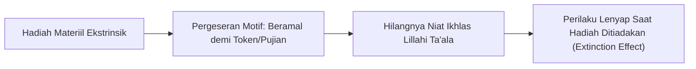

# SUB-BAB 1.4: KELEMAHAN BEHAVIORISME SEKULER & KEHAMPAAN RUHANI
## *Kritik atas Reduksionisme Hadiah-Hukuman Mekanis dan Hilangnya Dimensi Keikhlasan Niat*

**Kode Modul**: `BOOK-01/BAB-01/SUB-04`  
**Kategori**: Epistemologi Psikologi Belajar  
**Fokus Keilmuan**: Filsafat Psikologi & Hermeneutika Niat Islam

---

### 1. Jebakan Behaviorisme Radikal (Skinnerian)
Sebagai reaksi atas kegagalan disiplin represif, sebagian praktisi pendidikan mencoba mengadopsi model behaviorisme murni:
* Memberikan hadiah materiil instan (*token economy*) untuk setiap kebaikan kecil.
* Memberikan denda poin untuk setiap kesalahan.

Meskipun model ini mampu menciptakan ketertiban superfisial dalam jangka pendek, dalam konteks pendidikan pesantren ia melahirkan kelemahan mendasar: **Kehampaan Spiritual dan Erosi Keikhlasan**.

---

### 2. Kritik Teori Self-Determination & Niat Turats
1. **Perusakan Motivasi Intrinsik (*Overjustification Effect*)**: Riset Deci & Ryan (Self-Determination Theory) menunjukkan bahwa memberi imbalan ekstrinsik pada perilaku yang seharusnya menjadi kewajiban moral justru menurunkan dorongan internal santri untuk berbuat baik.
2. **Distorsi Doktrin Niat**: Dalam Islam, amal perbuatan dinilai dari niatnya (*Innamal a'malu bin niyyat*). Jika santri shalat tahajud atau membersihkan asrama semata-mata demi mengumpulkan stiker reward, nilai taqarrub ilallah tereduksi menjadi transaksi duniawi.

---

### 3. Solusi Integratif TUMBUH: Penguatan Makna & Apresiasi Relasional
Ekosistem TUMBUH mengganti reward materiil mekanistik dengan:
* **Apresiasi Relasional**: Pengakuan tulus atas usaha dan kemajuan karakter santri (*encouragement*), bukan sekadar memuji hasil akhir.
* **Tafahum Niat**: Mengajak santri merefleksikan makna ibadah dan menghubungkan setiap kebaikan dengan keridhaan Allah SWT.
