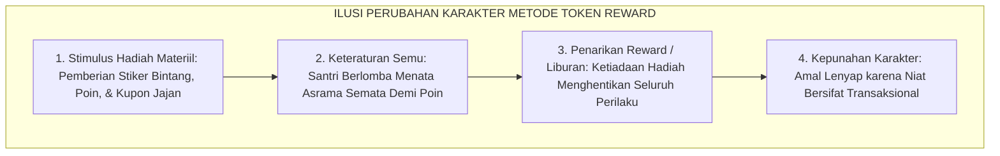
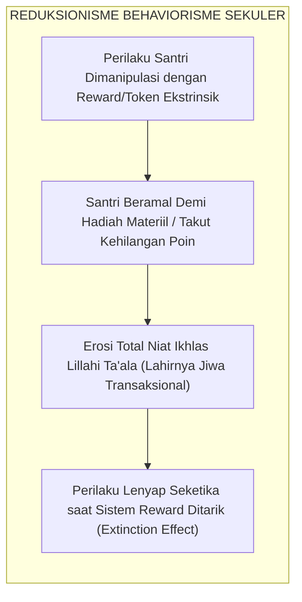
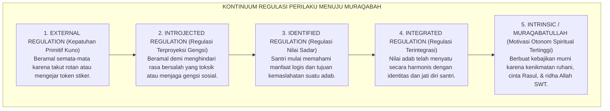
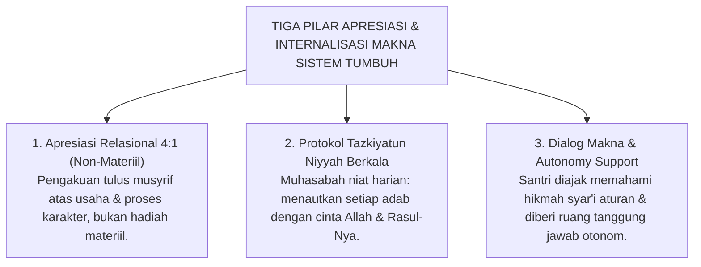

# PANDUAN OPERASIONAL 1.4: KELEMAHAN BEHAVIORISME SEKULER & KEHAMPAAN RUHANI

---

### 🧭 PETA POSISI PANDUAN DALAM SISTEM TUMBUH (DARI HULU KE HILIR)
* **Posisi Arsitektur**: `HULU EKOSISTEM (Akar Filosofis, Fitrah al-Munazzalah, & Worldview Islam)`
* **Peruntukan Pengguna**: Pimpinan Pesantren, Pengasuh Pondok, Kepala Madrasah, & Dewan Asatidz
* **Fokus Panduan**: Membangun cara pandang pengasuhan berbasis fitrah kesucian dan keteladanan nyata (Qudwah Hasanah), mengeliminasi tradisi kekerasan fisik dan feodalisme asrama.
* **Hasil Akhir yang Dituju**: Terwujudnya santri berkarakter *Insan Adabi* yang mandiri, musyrif yang mengasuh dengan kasih sayang tanpa *burnout*, dan pesantren yang aman berbasis data (*Safe Boarding School*).

---

### 🎯 Mengapa Panduan Ini Ada & Masalah Nyata yang Dipecahkan
1. **Latar Masalah di Lapangan**: Sering kali pengasuhan di pesantren berjalan tanpa SOP yang jelas atau terjebak dalam pola reaktif—menunggu santri berbuat salah baru dihukum dengan emosional.
2. **Solusi Sistem TUMBUH**: Panduan ini memberikan langkah preventif dan terstruktur agar setiap pembiasaan adab berjalan terencana, konsisten, dan terukur.
3. **Sasaran Perubahan**: Memastikan nilai-nilai Islam menyatu dalam perilaku harian santri melalui keteladanan nyata (*Qudwah Hasanah*).

---

---

### 🎯 Tujuan & Manfaat Panduan
Panduan ini dirancang sebagai petunjuk operasional terapan agar pendidik dan musyrif dapat:
1. Menjalankan pembinaan adab santri dengan pendekatan kasih sayang (*Rahmah*) dan ketegasan yang mendidik (*Firm & Kind*).
2. Menghindari cara-cara kekerasan fisik, bentakan verbal, maupun hukuman yang mempermalukan santri.
3. Menciptakan suasana asrama dan kelas yang aman, tertib, dan menumbuhkan kesadaran diri (*Bi'ah Shalihah*).

---

### 💡 Intisari Cepat (3 Menit Memahami Esensi)
* **Kunci Pengasuhan**: Karakter santri tumbuh melalui keteladanan nyata (*Qudwah Hasanah*), komunikasi empatik, dan pembiasaan terstruktur 24 jam.
* **Tindakan Utama**: Terapkan panduan langkah demi langkah di bawah ini secara konsisten, pantau perkembangan santri secara objektif, dan berikan apresiasi atas setiap perbaikan diri yang mereka capai.
* **Prinsip Disiplin**: Fokus pada pemulihan hubungan dan tanggung jawab nyata (*Restoratif*), bukan sekadar melampiaskan amarah atau menghukum.

---

### 📖 Uraian Panduan & Langkah Aksi Lapangan

---

### Ilusi Modernisasi Disiplin: Ketika Ibadah Direduksi Menjadi Perburuan Poin

Dalam beberapa dekade terakhir, banyak pesantren berupaya melakukan modernisasi disiplin dengan mengadopsi sistem modifikasi perilaku ala Barat: **Sistem Poin Pinalti dan Token Hadiah (*Token Economy System*)**.

Aturan mulai dipenuhi angka-angka:
* Merapikan kasur sebelum subuh mendapat stiker bintang emas atau +10 poin.
* Berada di saf terdepan masjid mendapat kupon jajan gratis di kantin.
* Sebaliknya, terlambat dipotong -5 poin atau didenda uang saku.

Di atas kertas, sistem ini tampak sangat rapi dan modern. Namun, di balik keteraturan fisik tersebut, para pakar pendidikan Islam dan psikolog menemukan sebuah **tragedi spiritual yang amat memprihatinkan**:

> [!CAUTION]
> ### ⚠️ Fenomena Kepunahan Perilaku (*The Behavioral Extinction Effect*):
> Santri yang terbiasa digerakkan oleh stiker bintang dan kupon jajan hanya akan berbuat baik **selama ada hadiah materiil yang dibagikan**.  
> 
> Begitu masa liburan semester tiba atau anak lulus dari pondok—di mana tidak ada lagi musyrif yang mencatat skor poin—**seluruh kebiasaan ibadah tersebut runtuh seketika**. Santri kembali bangun kesiangan dan meninggalkan shalat berjamaah, karena api motivasi di dalam kalbunya tidak pernah dinyalakan.

<b>Gambar 1.4.1:</b> Siklus Kepunahan Amal (*Extinction Effect*) dalam Sistem Modifikasi Perilaku Mekanis.

Sistem hadiah-hukuman mekanis berhasil memanipulasi gerak fisik anak untuk sementara waktu, namun **secara perlahan membunuh keikhlasan niat dan melahirkan jiwa yang transaksional**.

---

### Menelanjangi Behaviorisme Radikal Skinner: Reduksi Manusia Menjadi Organisme Refleks

Akar kesalahan sistem ini berasal dari teori **Behaviorisme Radikal** karya **B.F. Skinner**[^1]. Skinner merumuskan teorinya dari eksperimen terhadap burung merpati dan tikus: hewan diberi butiran jagung jika mematuk tombol (*reward*), dan disengat listrik jika salah menginjak tuas (*punishment*). Skinner menganggap manusia sama seperti hewan percobaan: tidak memiliki jiwa spiritual dan perilakunya dapat direkayasa sepenuhnya lewat pancingan hadiah luar.

<b>Gambar 1.4.2:</b> Alur Reduksionisme Behaviorisme Sekuler dan Erosi Keikhlasan Beramal Santri.

Ketika sistem ini diterapkan pada santri, bahayanya sangat nyata: santri dididik menjadi materialistis (*"Berapa poin yang saya dapat jika menyapu masjid ini?"*), nilai kesucian ibadah tercemar oleh riya' dan pemburuan pujian manusia, dan amal saleh akan mati seketika Ketika hadiah tidak lagi dibagikan.

---

### Teori Self-Determination & Fenomena Overjustification Effect

Pakar psikologi motivasi **Edward L. Deci dan Richard M. Ryan**[^2] bersama **Alfie Kohn**[^3] membuktikan bahwa hadiah materiil justru merusak motivasi alami anak melalui fenomena yang disebut **Efek Pembenaran Berlebih (*The Overjustification Effect*)**:

$$\text{Pemberian Hadiah Materiil Berlebihan} \Longrightarrow \text{Menghancurkan Minat Batin Alami}$$

Ketika seorang santri yang awalnya ikhlas membaca Al-Qur'an diiming-imingi kupon hadiah, otak bawah sadarnya bergeser: *"Aku mengaji bukan lagi karena cinta pada Allah, melainkan demi mengumpulkan kupon bintang dari ustadz."*

Alfie Kohn merangkum **Tiga Racun Sistem Hadiah-Hukuman**:
1. **Hadiah adalah Hukuman yang Menyamar**: Menciptakan kecemasan dan rasa tertekan pada anak.
2. **Hadiah Merusak Ukhuwah**: Memicu persaingan saling menjatuhkan dan kecemburuan antar-kawan sekamar.
3. **Hadiah Menghancurkan Kejujuran**: Anak terdorong berbuat curang demi mendapatkan skor nilai tinggi.

---

### Kontinuum Regulasi Motivasi: Menuju Kesadaran Muraqabatullah

Sains psikologi memetakan motivasi manusia ke dalam sebuah tangga lima tingkat dari kepatuhan hewani menuju kemerdekaan jiwa:

<b>Gambar 1.4.3:</b> Kontinuum Spektrum Regulasi Motivasi: Dari Ketergantungan Eksternal Menuju Kesadaran Muraqabatullah.

Tingkat 1 (takut rotan/berburu stiker) adalah level kepatuhan hewani. Puncak pembinaan karakter santri yang sesungguhnya berada di **Tingkat 5 (*Muraqabatullah*)**: yaitu Ketika santri bangun shalat tahajjud di keheningan malam dan menjaga kebersihan asrama murni karena merasakan kenikmatan beribadah kepada Allah SWT (*Halaawatul Iman*), tanpa peduli apakah ada guru yang melihatnya atau tidak.

---

### Hermeneutika Turats: Hakikat Niat Ikhlas vs Bahaya Riya'

Di sinilah letak keagungan ajaran Islam. Jauh sebelum para psikolog Barat merumuskan teori motivasi, ulama agung **Imam Abu Hamid Al-Ghazali** dalam *Ihya 'Ulumiddin* telah mengingatkan hakikat niat:

> [!NOTE]
> ### 📜 Hermeneutika Niat Imam Al-Ghazali dalam *Ihya 'Ulumiddin*:[^4]
> 
> $$\text{إِنَّ النِّيَّةَ هِيَ انْبِعَاثُ الْقَلْبِ إِلَى مَا يَرَاهُ مُوَافِقًا لِغَرَضٍ مِنْ أَغْرَاضِهِ، إِمَّا عَاجِلًا وَإِمَّا آجِلًا. فَالْإِخْلَاصُ هُوَ تَجْرِيدُ قَصْدِ التَّقَرُّبِ إِلَى اللَّهِ تَعَالَى عَنْ جَمِيعِ الشَّوَائِبِ. فَإِذَا امْتَزَجَ بِالْعَمَلِ غَرَضٌ دُنْيَوِيٌّ مِنْ طَلَبِ مَحْمَدَةٍ، أَوْ جَلْبِ مَنْفَعَةٍ، أَوْ دَفْعِ مَذَمَّةٍ، خَرَجَ الْعَمَلُ عَنْ حَدِّ الْإِخْلَاصِ وَصَارَ شِرْكًا خَفِيًّا يُحْبِطُ الْأَجْرَ}$$
> 
> **Artinya:**  
> *"Hakikat **Ikhlas adalah memurnikan niat mendekatkan diri kepada Allah dari segala campuran pamrih lain**.*  
> *Ketika suatu amal telah tercampur oleh pamrih duniawi—seperti mengejar pujian manusia (*riya'*), mengejar keuntungan materiil (*token hadiah*), atau sekadar menghindari celaan—maka amal tersebut telah keluar dari batas keikhlasan dan berubah menjadi **syirik tersembunyi yang menggugurkan seluruh pahala di sisi Allah!**"*

> [!NOTE]
> ### 📜 Tamsil Indah Ibn al-Qayyim al-Jawziyyah dalam *Al-Fawa'id*:[^5]
> 
> $$\text{الْعَمَلُ بِغَيْرِ إِخْلَاصٍ وَلَا اقْتِدَاءٍ، كَالْمُسَافِرِ يَمْلَأُ جِرَابَهُ رَمْلًا، يُثْقِلُهُ وَلَا يَنْفَعُهُ}$$
> 
> **Artinya:**  
> *"Amal yang dikerjakan tanpa keikhlasan niat ibarat seorang musafir yang mengisi kantong bekalnya dengan pasir: pasir itu hanya memberatkannya di perjalanan namun sama sekali tidak bermanfaat mengenyangkan rasa laparnya."*

Sistem reward-token materiil tanpa disadari melatih santri menjadi pemburu pujian manusia sejak belia, yang secara perlahan mematikan ketulusan tauhid di dalam dada mereka.

---

### Solusi Sistemik TUMBUH: Model Apresiasi Relasional & Internalisasi Makna

**Sistem TUMBUH** merekayasa model pembinaan motivasi yang menjaga kemurnian niat melalui **Tiga Pilar Apresiasi Relasional**:

<b>Gambar 1.4.4:</b> Tiga Pilar Model Apresiasi Relasional dan Internalisasi Makna Adab Ekosistem TUMBUH.

Penerapan pilar sistemik di lapangan:
1. **Apresiasi Relasional 4:1 (Bukan Hadiah Benda)**: Mengganti stiker materiil dengan apresiasi kata-kata tulus atas proses perjuangan santri (*"Ustadz bangga melihat antum tetap sabar mengantre tadi"*).
2. **Pembersihan Niat Berkala (*Tazkiyatun Niyyah*)**: Membiasakan santri memperbarui niat ikhlas sebelum piket, belajar, dan shalat agar terbiasa mengaitkan seluruh amalnya hanya kepada Allah SWT.
3. **Dialog Makna & Tanggung Jawab Otonom**: Mengajak santri berdiskusi memahami hikmah di balik aturan asrama, sehingga kepatuhan lahir dari kesadaran batin, bukan karena keterpaksaan.

---

## 📌 Catatan Kaki & Rujukan Primer

[^1]: **Burrhus Frederic Skinner**, *Science and Human Behavior* (New York: Macmillan, 1953); serta *About Behaviorism* (New York: Vintage Books, 1974).
[^2]: **Edward L. Deci & Richard M. Ryan**, *Intrinsic Motivation and Self-Determination in Human Behavior* (New York: Plenum, 1985); serta *Self-Determination Theory: Basic Psychological Needs in Motivation, Development, and Wellness* (New York: Guilford Press, 2017).
[^3]: **Alfie Kohn**, *Punished by Rewards: The Trouble with Gold Stars, Incentive Plans, A's, Praise, and Other Bribes* (Boston: Houghton Mifflin Company, 1993), hlm. 49–98.
[^4]: **Hujjatul Islam Imam Abu Hamid al-Ghazali**, *Ihya' 'Ulumiddin*, Kitab an-Niyyah wal Ikhlas wash-Shidq (Kairo & Beirut: Dar al-Ma'rifah, t.th.), Juz IV, hlm. 364–367.
[^5]: **Al-Imam Ibn al-Qayyim al-Jawziyyah**, *Al-Fawa'id*, Tahqiq: Syaikh Ali Hasan al-Halabi (Kairo: Dar al-Kutub al-Ilmiyyah, 1996), Fashl fi Ikhlasil Amal, hlm. 67–69.
