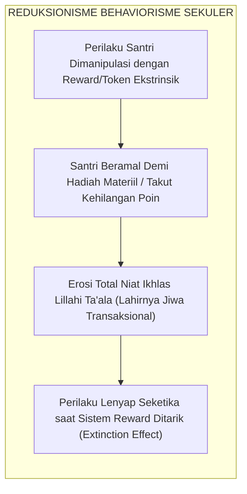
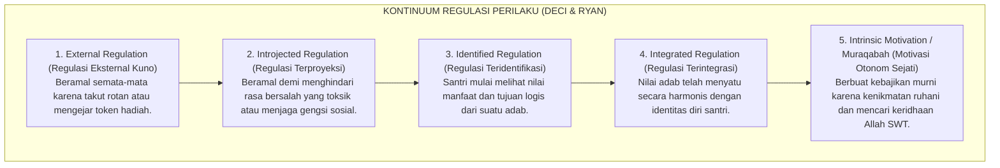
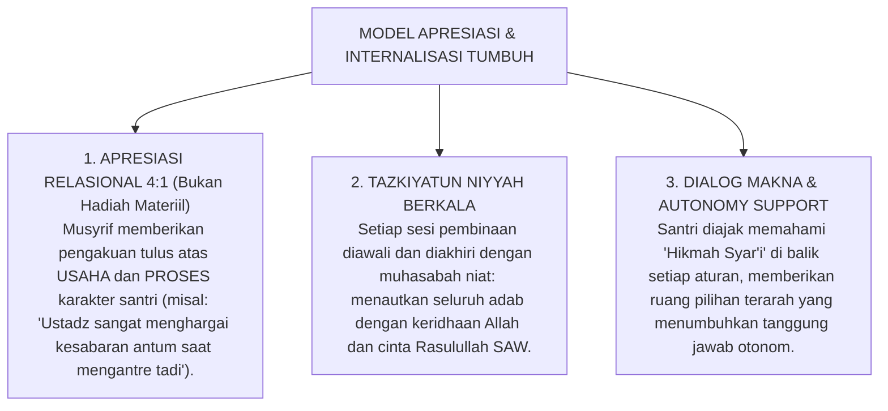

# SUB-BAB 1.4: KELEMAHAN BEHAVIORISME SEKULER & KEHAMPAAN RUHANI
## *Kritik atas Reduksionisme Hadiah-Hukuman Mekanis, Efek Overjustification, dan Erosi Keikhlasan Niat*

**Kode Klasifikasi**: `BOOK-01/BAB-01/SUB-04/MONOGRAF`  
**Disiplin Ilmu**: Filsafat Psikologi, Teori Motivasi Manusia, & Hermeneutika Niat Islam  
**Dewan Pakar**: `pakar-filosofi-tumbuh`, `pakar-social-emotional-learning`, `pakar-epistemologi-turats`

---

### 1. Jebakan Reduksionisme Behaviorisme Radikal (Skinnerian Paradigm)

Sebagai reaksi atas kegagalan metode disiplin represif masa lalu, sebagian pengelola lembaga pendidikan Islam berasrama berupaya melakukan modernisasi dengan mengimpor mentah-mentah model **Behaviorisme Radikal (*Radical Behaviorism*)** yang dipelopori oleh B.F. Skinner (1953; 1971) dan John B. Watson (1913).

Dalam pendekatan ini, pembentukan karakter disederhanakan secara mekanistik menjadi hukum pengkondisian operan (*operant conditioning*):
* Setiap santri yang melakukan tindakan positif langsung diberikan imbalan materiil atau token poin reward (*token economy system*).
* Setiap santri yang melakukan kesalahan dikenakan pengurangan poin atau denda materiil.

Secara kasat mata pada fase awal, sistem ini tampak sangat menjanjikan: suasana asrama seketika menjadi tertib, santri berlomba-lomba merapikan kasur dan datang awal ke masjid demi mengumpulkan stiker atau poin reward. Namun, di balik ketertiban permukaan tersebut, para pakar psikologi perkembangan dan ulama tasawuf menemukan sebuah **kehancuran ontologis yang sangat berbahaya**: reduksi martabat manusia berakal menjadi sekadar organisme refleks yang digerakkan oleh insentif lapar-kenyang (*stimulus-response organism*).

<b>Gambar 1.4.1:</b> Siklus Erosi Keikhlasan Akibat Manipulasi Hadiah Ekstrinsik Behaviorisme Sekuler.

---

### 2. Teori Self-Determination & Fenomena Overjustification Effect

Kelemahan fatal behaviorisme mekanistik telah dibongkar secara ilmiah oleh psikolog kontemporer Edward L. Deci dan Richard M. Ryan (1985; 2000; 2017)[^2] melalui **Self-Determination Theory (SDT)** serta riset monumental Alfie Kohn (1993)[^3] dalam bukunya yang mengguncang dunia pendidikan, *Punished by Rewards: The Trouble with Gold Stars, Incentive Plans, A's, Praise, and Other Bribes*.

Riset empiris puluhan tahun menunjukkan fenomena psikologis yang disebut **Efek Pembenaran Berlebih (*The Overjustification Effect*)**:

$$\text{Pemberian Imbalan Ekstrinsik Berlebih} \longrightarrow \text{Penurunan Motivasi Intrinsik Secara Permanen}$$

Ketika seseorang yang awalnya memiliki dorongan batin alami untuk berbuat baik diberikan imbalan eksternal yang terlampau mencolok, otak bawah sadar individu tersebut merevisi motif tindakannya: *"Aku membersihkan masjid bukan karena masjid ini rumah Allah yang suci, melainkan karena aku ingin mendapatkan kupon bintang dari musyrif."*

Kohn (1993) merumuskan tiga racun pedagogis dari sistem reward-punishment behavioristik:
1. **Rewards Punish (Hadiah adalah Hukuman Terselubung)**: Hadiah bersifat manipulatif dan menciptakan kecemasan konstan (*performance anxiety*). Kegagalan mendapatkan reward dirasakan oleh anak sama sakitnya dengan menerima hukuman.
2. **Rewards Ruin Relationships (Hadiah Merusak Relasi Sosial)**: Menghargai santri dengan sistem perankingan reward memicu kecemburuan antarsantri, kompetisi tidak sehat di asrama, dan merusak iklim persaudaraan (*Ukhuwah Islamiyyah*).
3. **Rewards Discourage Risk-Taking (Hadiah Membunuh Kreativitas & Kejujuran)**: Santri yang berorientasi poin hanya akan melakukan tugas minimal yang dipersyaratkan untuk mendapat reward, enggan mengambil inisiatif kebajikan yang tidak dinilai, dan terdorong untuk memanipulasi absensi/catatan mutaba'ah.

---

### 3. Kontinuum Motivasi: Dari Regulasi Eksternal Menuju Motivasi Otonom

Self-Determination Theory memetakan spektrum regulasi perilaku manusia ke dalam sebuah kontinuum bertingkat yang sangat relevan bagi pendidikan pesantren:

<b>Gambar 1.4.2:</b> Kontinuum Spektrum Regulasi Motivasi: Dari Ketergantungan Eksternal Menuju Kesadaran Muraqabatullah.

Behaviorisme sekuler mengunci santri selamanya pada level terendah (**Level 1: External Regulation**). Tatkala santri lulus dari pesantren dan tidak ada lagi musyrif yang membagi token reward atau mengancam denda, sistem perilaku mereka mengalami **kepunahan mendadak (*extinction effect*)**. Mereka seketika meninggalkan shalat berjamaah dan tilawah Al-Qur'an karena mereka tidak pernah dibimbing mencapai **Level 4 dan 5 (Regulasi Terintegrasi & Muraqabatullah)**.

---

### 4. Hermeneutika Turats: Hakikat Niat Ikhlas vs Penyakit Riya' & Sum'ah

Di sinilah letak superioritas epistemologi Islam. Ulama Turats telah meletakkan diskursus niat (*Ikhlasun Niyyah*) sebagai fondasi absolut diterimanya seluruh bangunan amal.

Hujjatul Islam Imam Al-Ghazali dalam *Ihya 'Ulumiddin* (Jilid IV, *Kitab an-Niyyah wal Ikhlas wash-Shidq*) menuliskan analisis psikospiritual yang sangat mendalam:

> [!NOTE]
> ### 📜 Hermeneutika Niat Imam Al-Ghazali dalam *Ihya 'Ulumiddin*:[^4]
> 
> $$\text{إِنَّ النِّيَّةَ هِيَ انْبِعَاثُ الْقَلْبِ إِلَى مَا يَرَاهُ مُوَافِقًا لِغَرَضٍ مِنْ أَغْرَاضِهِ، إِمَّا عَاجِلًا وَإِمَّا آجِلًا. فَالْإِخْلَاصُ هُوَ تَجْرِيدُ قَصْدِ التَّقَرُّبِ إِلَى اللَّهِ تَعَالَى عَنْ جَمِيعِ الشَّوَائِبِ. فَإِذَا امْتَزَجَ بِالْعَمَلِ غَرَضٌ دُنْيَوِيٌّ مِنْ طَلَبِ مَحْمَدَةٍ، أَوْ جَلْبِ مَنْفَعَةٍ، أَوْ دَفْعِ مَذَمَّةٍ، خَرَجَ الْعَمَلُ عَنْ حَدِّ الْإِخْلَاصِ وَصَارَ شِرْكًا خَفِيًّا يُحْبِطُ الْأَجْرَ}$$
> 
> **Artinya:**  
> *"Sesungguhnya niat itu adalah bangkitnya daya gerak kalbu menuju tujuan yang dipandangnya selaras, baik tujuan duniawi yang dekat maupun ukhrawi yang kekal. Maka hakikat **Ikhlas adalah memurnikan motif taqarrub mendekatkan diri kepada Allah Ta'ala dari segala campuran pamrih lainnya**.*  
> *Tatkala suatu amal telah tercampur oleh pamrih duniawi—seperti mencari pujian manusia (*riya'*), mengejar keuntungan materiil (*reward*), atau sekadar menghindari celaan (*denda*)—maka amal tersebut telah keluar dari batas keikhlasan dan berubah menjadi syirik tersembunyi (*syirk khafiy*) yang menggugurkan pahala di sisi Allah!"*

> [!NOTE]
> ### 📜 Tamsil Indah Ibn al-Qayyim al-Jawziyyah dalam *Al-Fawa'id*:[^5]
> 
> $$\text{الْعَمَلُ بِغَيْرِ إِخْلَاصٍ وَلَا اقْتِدَاءٍ، كَالْمُسَافِرِ يَمْلَأُ جِرَابَهُ رَمْلًا، يُثْقِلُهُ وَلَا يَنْفَعُهُ}$$
> 
> **Artinya:**  
> *"Amal yang dikerjakan tanpa keikhlasan niat dan tanpa mengikuti tuntunan sunnah nabawi, ibarat seorang musafir yang mengisi kantong bekalnya dengan pasir: pasir itu hanya memberatkannya di perjalanan namun sama sekali tidak bermanfaat mengenyangkan rasa laparnya."*

Tinjauan Turats ini menelanjangi bahaya terbesar dari sistem reward-punishment sekuler: **ia melatih santri untuk menjadi ahli riya' (*ostentation*) dan perburuan pujian makhluk sejak usia dini**. Santri dibiasakan beramal demi dilihat musyrif dan demi mendapat token duniawi, yang secara sistematis mematikan sensitivitas tauhid dan keikhlasan di dalam kalbu mereka.

---

### 5. Paradigma Rekonstruktif TUMBUH: Apresiasi Relasional & Internalisasi Makna

Ekosistem TUMBUH memecahkan kebuntuan antara metode represif kuno dan behaviorisme transaksional ini dengan merumuskan model **Apresiasi Relasional Terbimbing (*Relational Encouragement & Meaning Integration*)**:

<b>Gambar 1.4.3:</b> Tiga Pilar Model Apresiasi Relasional dan Internalisasi Makna Adab Ekosistem TUMBUH.

Melalui sintesis luhur ini, Ekosistem TUMBUH berhasil memelihara kemurnian **Ikhlasun Niyyah** sebagaimana diajarkan para ulama salaf, sembari memanfaatkan pemahaman sains motivasi modern untuk membimbing santri mencapai kematangan karakter yang mandiri, kokoh, dan tidak tergantung pada imbalan duniawi sesaat.

---

## 📌 Catatan Kaki & Rujukan Primer

[^1]: **Burrhus Frederic Skinner**, *Science and Human Behavior* (New York: Macmillan, 1953); serta *About Behaviorism* (New York: Vintage Books, 1974).
[^2]: **Edward L. Deci & Richard M. Ryan**, *Intrinsic Motivation and Self-Determination in Human Behavior* (New York: Plenum, 1985); serta *Self-Determination Theory: Basic Psychological Needs in Motivation, Development, and Wellness* (New York: Guilford Press, 2017).
[^3]: **Alfie Kohn**, *Punished by Rewards: The Trouble with Gold Stars, Incentive Plans, A's, Praise, and Other Bribes* (Boston: Houghton Mifflin Company, 1993), hlm. 49–98.
[^4]: **Hujjatul Islam Imam Abu Hamid al-Ghazali**, *Ihya' 'Ulumiddin*, Kitab an-Niyyah wal Ikhlas wash-Shidq (Kairo & Beirut: Dar al-Ma'rifah, t.th.), Juz IV, hlm. 364–367.
[^5]: **Al-Imam Ibn al-Qayyim al-Jawziyyah**, *Al-Fawa'id*, Tahqiq: Syaikh Ali Hasan al-Halabi (Kairo: Dar al-Kutub al-Ilmiyyah, 1996), Fashl fi Ikhlasil Amal, hlm. 67–69.
