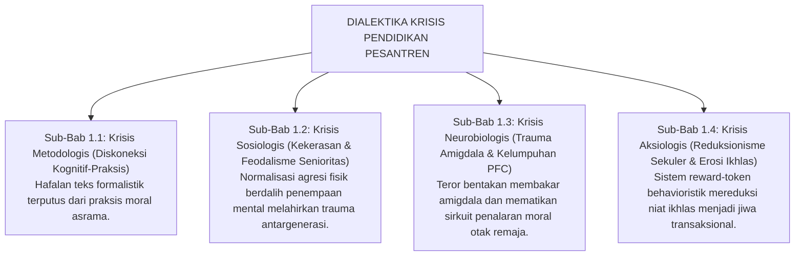
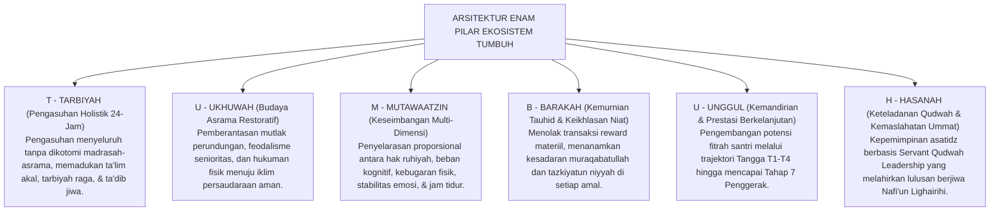
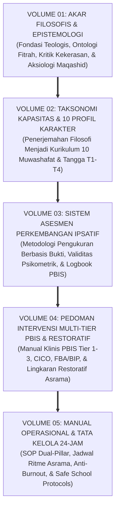

# SUB-BAB 1.5: URGENSI REKONSTRUKSI PARADIGMA MENUJU EKOSISTEM TUMBUH
## *Sintesis Filosofis-Empiris, Deklarasi Enam Dimensi Holistik, dan Peta Jalan Pembaruan Peradaban Pesantren*

**Kode Klasifikasi**: `BOOK-01/BAB-01/SUB-05/MONOGRAF`  
**Disiplin Ilmu**: Filsafat Pendidikan Islam Terapan, Rekayasa Sistem Sosial, & Teori Transformasi Kelembagaan  
**Dewan Pakar**: `pakar-filosofi-tumbuh`, `pakar-arsitektur-pbis-restoratif`, `pakar-tata-kelola-qudwah`

---

### 1. Rekapitulasi Dialektika Kritis Bab 01

Perjalanan telaah kritis sepanjang empat sub-bab terdahulu telah menyingkap anatomi krisis yang selama ini melingkupi pendidikan karakter di berbagai pesantren di Indonesia:

Dari peta dialektika di atas, menjadi sangat gamblang bahwa **krisis pendidikan karakter pesantren bukanlah persoalan kurangnya hafalan dalil atau minimnya jumlah jam pelajaran**, melainkan sebuah **kebuntuan paradigma (*paradigmatic gridlock*)**. Mempertahankan metode represif kuno adalah sebuah kezaliman syar'i dan kejahatan neurobiologis; sementara mengadopsi behaviorisme sekuler secara membabi buta adalah bunuh diri spiritual yang mencabut ruh keikhlasan dari dada para santri.

---

### 2. Deklarasi Epistemologis Ekosistem TUMBUH

Menjawab krisis peradaban tersebut, Ekosistem **TUMBUH** lahir sebagai sintesis agung (*The Grand Synthesis*) yang merekonstruksi seluruh bangunan pengasuhan pesantren di atas enam pilar epistemologis-operasional yang terpadu:

---

### 3. Matriks Transformasi Paradigma: Dari Pola Usang Menuju Ekosistem TUMBUH

Untuk memberikan gambaran perbandingan yang jernih dan tegas bagi para pemangku kebijakan pesantren, tabel berikut menyajikan kontras tajam antara paradigma lama yang problematik dengan arsitektur rekonstruktif TUMBUH:

| Dimensi Analisis | Paradigma Tradisional Usang | Paradigma Sekuler Mekanistik | Paradigma Rekonstruktif TUMBUH |
| :--- | :--- | :--- | :--- |
| **Pandangan atas Santri** | Objek pasif yang berdosa/bebal, harus ditundukkan dengan rasa takut. | Organisme refleks yang dimanipulasi dengan imbalan dan hukuman. | **Makhluk mulia berfitrah suci (*Fitrah al-Munazzalah*) yang potensinya disuburkan.** |
| **Metode Penegakan Disiplin** | Hukuman fisik (rotan/tamparan), pembentakan, dan pengadilan senioritas. | Sistem poin defisit hitam, denda materiil, dan pencabutan hak token. | **Disiplin Restoratif (*Firm & Kind*), Konsekuensi Logis 4R, dan *Ishlah al-Bain*.** |
| **Landasan Neurobiologis** | Mengabaikan biologi; mengaktifkan amigdala *fight-or-flight* secara kronis. | Memanfaatkan sistem dopamin ekstrinsik semata (*addictive reward loops*). | **Menjaga status *Ventral Vagal (Safe & Connected)* untuk optimalisasi Korteks Prefrontal.** |
| **Struktur Pengasuhan** | Terbelah (*dikotomi* madrasah vs asrama); musyrif bekerja tanpa sistem shift. | Pengasuhan administratif formal yang kaku tanpa sentuhan spiritual. | **Dual-Pillar Caretaking (Walas + Musyrif) terintegrasi via Handover 15-Menit & Bebas Burnout.** |
| **Pusat Motivasi Moral** | Ketakutan akan ancaman sanksi fisik eksternal (*External Regulation*). | Perburuan stiker reward dan pujian duniawi (*Introjected Regulation*). | **Internalisasi nilai adab berakar dari kesadaran *Muraqabatullah* & Ikhlas.** |
| **Posisi Pelanggaran Adab** | Aib memalukan yang harus dibalas dan distigmatisasi di depan umum. | Pengurangan skor angka semata pada buku catatan pelanggaran. | **Peluang pembelajaran moral (*Learning Opportunity*) melalui muhasabah & restitusi.** |

---

### 4. Peta Jalan Implementasi Menuju Volume-Volume Berikutnya

Rekonstruksi filosofis dan epistemologis yang telah tuntas diletakkan pada Bab 01 ini bukanlah sekadar wacana teoritis di atas menara gading akademis, melainkan **fondasi penuntun bagi seluruh arsitektur praktis pada volume-volume berikutnya dalam Seri Buku Master TUMBUH**:

---

### 5. Epilog Bab 01: Menghidupkan Kembali Ruh Kejayaan Pesantren

Kita berdiri di sebuah persimpangan sejarah yang sangat menentukan. Pesantren-pesantren di Nusantara memiliki modalitas spiritual, kultural, dan sosial yang tiada tandingannya di dunia. Tatkala khazanah emas **Turats Islam** yang sarat keberkahan ini dibersihkan dari residu feodalisme kekerasan dan dipadukan secara presisi dengan metodologi **Sains Perkembangan Berbasis Bukti**, maka pesantren tidak hanya akan mampu menyelesaikan krisis internalnya, melainkan akan bangkit memimpin peradaban dunia: mencetak generasi santri yang kokoh tauhidnya, luhur adabnya, cemerlang intelektualnya, merdeka jiwanya, dan memancarkan rahmat bagi semesta alam (*Rahmatan lil 'Alamin*).

---

## 📌 Catatan Kaki & Rujukan Primer

[^1]: **George Sugai & Robert H. Horner**, "The evolution of discipline practices: School-wide positive behavior supports", *Child & Family Behavior Therapy*, Vol. 24, No. 1–2 (2002), hlm. 23–50.
[^2]: **Howard Zehr**, *The Little Book of Restorative Justice* (Intercourse: Good Books, 2002; Revised Edition, Skyhorse Publishing, 2015).
[^3]: **Prof. Dr. Syed Muhammad Naquib al-Attas**, *Islam and Secularism* (Kuala Lumpur: Muslim Youth Movement of Malaysia / ABIM, 1978; ISTAC, 1993), Bab 4: "The De-Westernization of Knowledge".
[^4]: **Dewan Pakar Ekosistem TUMBUH**, *Master Design Arsitektur Karakter Pesantren Terpadu 24-Jam: Buku Seri Monograf 5 Volume* (Bandung & Jombang: Konsorsium Riset TUMBUH, 2026).
