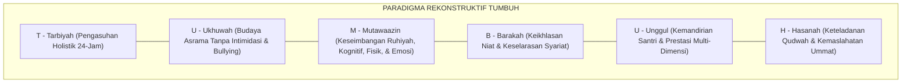

# SUB-BAB 1.5: URGENSI REKONSTRUKSI PARADIGMA MENUJU EKOSISTEM TUMBUH
## *Menuju Sintesis Keberkahan Turats dan Ketepatan Metodologi Sains Berbasis Bukti*

**Kode Modul**: `BOOK-01/BAB-01/SUB-05`  
**Kategori**: Sintesis Teoretis Bab 1  
**Fokus Keilmuan**: Manajemen Transformasi Pendidikan Islam

---

### 1. Titik Temu Transformasi: Menyatukan Keberkahan & Metodologi
Setelah membedah anomali pengajaran verbalistik, patologi kekerasan feodal, trauma neurobiologis, dan reduksionisme sekuler, muncul kebutuhan mendesak akan sebuah **paradigma baru yang kokoh, integratif, dan teruji secara ilmiah**:

---

### 2. Lima Komitmen Rekonstruksi TUMBUH
1. **Komitmen Kesucian Fitrah**: Memandang setiap santri sebagai amanah mulia yang memiliki potensi kebaikan tak terbatas.
2. **Komitmen Keamanan Neurobiologis**: Menciptakan asrama yang bebas ancaman teror agar otak santri dapat bertumbuh secara optimal.
3. **Komitmen Keteladanan Pendidik (*Qudwah*)**: Menegakkan disiplin bukan dengan kekerasan fisik, melainkan dengan kekuatan wibawa akhlak pendidik.
4. **Komitmen Keadilan Restoratif**: Menyelesaikan perselisihan santri dengan cara memulihkan hubungan (*Ishlah al-Bain*), bukan dengan mempermalukan.
5. **Komitmen Berbasis Bukti (*Evidence-Based*)**: Menggunakan data logbook perilaku terpadu untuk mendeteksi kebutuhan santri sejak dini (*PBIS Multi-Tier*).
