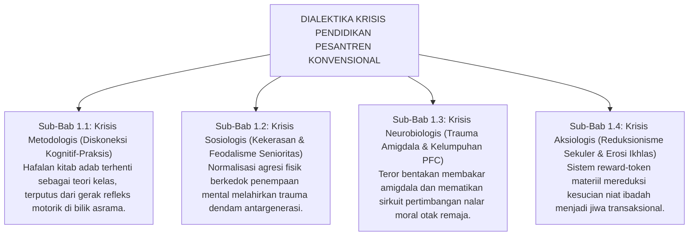
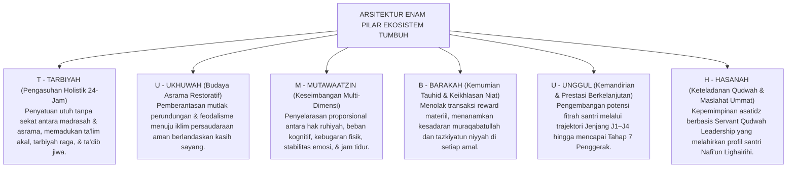
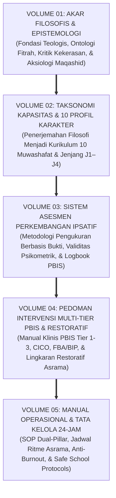

# URGENSI REKONSTRUKSI PARADIGMA MENUJU EKOSISTEM TUMBUH

---
### Berdiri di Persimpangan Sejarah Peradaban Pesantren

Perjalanan panjang penelusuran kritis sepanjang empat sub-bab terdahulu menuntun kita pada satu kesimpulan yang terang benderang: **dunia pendidikan pesantren sedang berdiri di sebuah persimpangan sejarah yang amat menentukan**.

Di satu sisi, kita bersyukur atas warisan luhur nilai-nilai *Turats*, keberkahan sanad keilmuan para ulama, dan keikhlasan para pendiri pondok yang telah menjadi paku bumi moral Nusantara selama berabad-abad. Namun di sisi lain, kita tidak boleh lagi menutup mata dari kenyataan bahwa sistem pengasuhan yang berjalan hari ini kerap kali terperangkap di antara dua kutub kegagalan:

<b>Gambar 1.5.1:</b> Peta Empat Dimensi Dialektika Krisis Pendidikan Karakter Pesantren Konvensional.

Peta dialektika di atas menunjukkan bahwa masalah yang kita hadapi bukanlah persoalan sepele:
* Bertahan pada metode kekerasan dan feodalisme masa lalu adalah sebuah kezaliman syar'i dan kejahatan neurobiologis yang menghancurkan fitrah anak.
* Mengadopsi sistem hadiah-hukuman mekanis secara membabi buta adalah bunuh diri spiritual yang memadamkan api keikhlasan di dalam dada santri.

Kita membutuhkan sebuah lompatan peradaban baru: sebuah rekonstruksi pengasuhan yang berakar kokoh pada **Turats Islam Nabawi** dan ditopang secara presisi oleh **Sains Perkembangan Manusia Terkini**.

---

### Deklarasi Epistemologis Arsitektur Enam Pilar Ekosistem TUMBUH

Menjawab panggilan sejarah ini, Ekosistem **TUMBUH** lahir sebagai sintesis agung (*The Grand Synthesis*) yang menyatukan seluruh denyut kehidupan pesantren di atas **Enam Pilar Terpadu**:

<b>Gambar 1.5.2:</b> Arsitektur Enam Pilar Filosofis-Operasional Ekosistem TUMBUH.

Enam pilar yang terangkum dalam akronim **T-U-M-B-U-H** di atas merefleksikan arah pembaruan total:
1. **T - TARBIYAH (Pengasuhan Holistik 24-Jam)**: Menghubungkan guru madrasah dan musyrif asrama ke dalam satu sistem pertukaran data harian 15 menit.
2. **U - UKHUWAH (Budaya Asrama Restoratif)**: Menegakkan kebijakan nol kekerasan (*Zero Violence*) dan mengganti balas dendam dengan pemulihan persaudaraan (*Ishlah al-Bain*).
3. **M - MUTAWAATZIN (Keseimbangan Multi-Dimensi)**: Menjaga hak biologis santri—makanan bergizi, olahraga, dan tidur 7–8 jam yang cukup—agar otak santri berada dalam kondisi prima untuk menyerap adab.
4. **B - BARAKAH (Kemurnian Tauhid & Keikhlasan Niat)**: Menjaga ketulusan amal melalui apresiasi relasional 4:1 dan pembersihan niat berkala, bebas dari manipulasi reward materiil.
5. **U - UNGGUL (Kemandirian & Prestasi Berkelanjutan)**: Membimbing santri menaiki tangga perkembangan karakter (T1 Tahu Adab, T2 Mau Beradab, T3 Mampu Beradab Mandiri, hingga T4 Menjadi Teladan Penggerak).
6. **H - HASANAH (Keteladanan Qudwah & Maslahat Ummat)**: Menjadikan asatidz dan musyrif sebagai sumber keteladanan hidup (*Qudwah Hasanah*) yang melahirkan santri berjiwa pelayan umat (*Nafi'un Lighairihi*).

---

### Matriks Transformasi Paradigma: Perbandingan Tiga Pendekatan

Tabel berikut menyajikan komparasi jernih antara paradigma lama yang problematik, behaviorisme sekuler, dan arsitektur rekonstruktif TUMBUH:

| Dimensi Pembinaan | Paradigma Tradisional Usang | Paradigma Sekuler Mekanistik | Paradigma Rekonstruktif TUMBUH |
| :--- | :--- | :--- | :--- |
| **Pandangan atas Santri** | Objek pasif yang bebal, harus ditundukkan dengan teror rasa takut. | Organisme refleks yang dimanipulasi dengan imbalan dan hukuman. | **Makhluk mulia berfitrah suci (*Fitrah al-Munazzalah*) yang potensinya disuburkan.** |
| **Metode Disiplin** | Hukuman fisik (rotan/tamparan), pembentakan massal, dan sidang senior. | Sistem poin defisit hitam, denda uang saku, dan pemotongan hak token. | **Disiplin Restoratif[^2] (*Firm & Kind*), Konsekuensi Logis 4R, dan *Ishlah al-Bain*.** |
| **Landasan Saraf Otak** | Mengabaikan biologi; mengaktifkan amigdala *fight-or-flight* secara kronis. | Memanfaatkan sistem dopamin ekstrinsik semata (*addictive reward loops*). | **Menjaga status *Ventral Vagal (Safe & Connected)* untuk optimalisasi Korteks Prefrontal.** |
| **Struktur Pengasuhan** | Terbelah (madrasah jalan sendiri, asrama tanpa pendampingan pembina). | Pengasuhan administratif formal yang kaku tanpa sentuhan hati. | **Dual-Pillar Caretaking terintegrasi via Handover 15-Menit & Sistem PBIS Multi-Tier[^1].** |
| **Motivasi Moral** | Ketakutan akan ancaman sanksi fisik (*External Regulation*). | Perburuan stiker hadiah dan pujian duniawi (*Introjected Regulation*). | **Internalisasi nilai adab berakar dari kesadaran *Muraqabatullah* & Ikhlas.** |
| **Posisi Pelanggaran** | Aib memalukan yang harus dibalas dan dipermalukan di depan umum. | Pengurangan skor angka semata pada buku catatan pelanggaran. | **Peluang pembelajaran moral (*Learning Opportunity*) melalui muhasabah & restitusi.** |

---

### Peta Jalan Implementasi Menuju Seri Buku Master TUMBUH

Rekonstruksi filosofis pada Bab 01 ini berakar pada de-sekularisasi ilmu Prof. Naquib al-Attas[^3] dan khazanah kepengasuhan adab Hadhratusy Syaikh KH. M. Hasyim Asy'ari[^4], yang menjadi pintu pembuka bagi seluruh arsitektur praktis pada volume-volume berikutnya dalam Seri Buku Master TUMBUH:

<b>Gambar 1.5.3:</b> Peta Jalan Transmisi Kurikulum Master 5 Volume Seri Buku Ekosistem TUMBUH.

Peta jalan 5 volume ini menjamin setiap pilar filosofis diterjemahkan ke dalam tata kelola harian yang nyata:
* **Volume 01** meletakkan fondasi teologis, ontologis, dan kritik epistemologis.
* **Volume 02** merumuskan Taksonomi 10 Kapasitas Karakter (*Muwashafat*) dan Tangga Capaian J1–J4.
* **Volume 03** menyediakan metodologi pengukuran perkembangan karakter berbasis bukti melalui Logbook PBIS Digital.
* **Volume 04** menyajikan panduan intervensi multi-tier (Tier 1 Universal, Tier 2 Targeted CICO, dan Tier 3 Intensive FBA/BIP) serta protokol disiplin restoratif.
* **Volume 05** menyusun SOP manajemen pengasuhan 24 jam, perlindungan anak (*Safe School Protocols*), dan tata kelola musyrif anti-burnout.

---

### Epilog Bab 01: Menghidupkan Kembali Ruh Kejayaan Peradaban Pesantren

Wahai para kiai, pengasuh, asatidz, dan pejuang pendidikan Islam di seluruh Nusantara...

Pesantren bukanlah sekadar tempat penitipan anak, bukan pula pabrik penghafal teks yang dingin. Pesantren adalah rahim peradaban Islam—tempat di mana mutiara-mutiara fitrah anak titipan umat diasuh dengan kelembutan kasih sayang, ditempa dengan keteladanan akhlak nabawi, dan dipersiapkan untuk memimpin umat di masa depan.

Krisis karakter yang kita hadapi hari ini adalah panggilan suci untuk berbenah. Mari kita tinggalkan kekerasan yang melukai raga anak; mari kita bersihkan pengasuhan kita dari transaksi hadiah materiil yang merusak keikhlasan; dan mari kita satukan tekad untuk membangun **Ekosistem TUMBUH**: sebuah taman peradaban Islam yang aman, hangat, berkeadilan, dan sarat keberkahan Ilahi.

Dari bilik-bilik asrama yang penuh cinta inilah, kelak akan bangkit generasi santri paripurna: mereka yang kokoh aqidahnya, luas wawasan keilmuannya, lembut tutur katanya, luhur budi pekertinya, dan mendedikasikan seluruh hidupnya sebagai rahmat bagi semesta alam (*Rahmatan lil 'Alamin*).

---

## 📌 Catatan Kaki & Rujukan Primer

[^1]: **George Sugai & Robert H. Horner**, "The evolution of discipline practices: School-wide positive behavior supports", *Child & Family Behavior Therapy*, Vol. 24, No. 1–2 (2002), hlm. 23–50.
[^2]: **Howard Zehr**, *The Little Book of Restorative Justice* (Intercourse: Good Books, 2002; Revised Edition, Skyhorse Publishing, 2015).
[^3]: **Prof. Dr. Syed Muhammad Naquib al-Attas**, *Islam and Secularism* (Kuala Lumpur: Muslim Youth Movement of Malaysia / ABIM, 1978; ISTAC, 1993), Bab 4: "The De-Westernization of Knowledge".
[^4]: **Hadhratusy Syaikh KH. M. Hasyim Asy'ari**, *Adab al-'Alim wal Muta'allim fi ma Yahtaju Ilayhi al-Muta'allim fi Ahwal Ta'allumihi wa ma Yatawaqqafu 'alayhi al-Mu'allim fi Maqamat Ta'limihi* (Jombang: Maktabah at-Turats al-Islami, 1415 H), hlm. 15–28.
