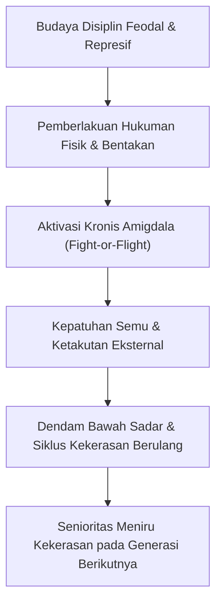
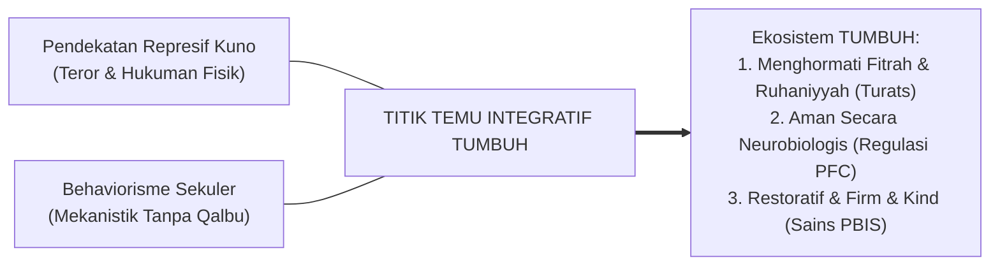

# BAB 1: KRISIS KARAKTER, PATOLOGI PENDIDIKAN, & URGENSI REKONSTRUKSI EKOSISTEM PESANTREN
## *Dekonstruksi Kepatuhan Semu Berbasis Teror, Trauma Amigdala, dan Keterbatasan Behaviorisme Sekuler*

**Nomor Identifikasi**: `BOOK-01/BAB-01/KRISIS-DAN-REKONSTRUKSI/2026`  
**Volume**: Buku 01 — *Akar Filosofis & Epistemologi Pendidikan Karakter Pesantren*  
**Dewan Pakar**: `pakar-filosofi-tumbuh`, `pakar-neurosains-perkembangan`, `pakar-disiplin-positif`

---

## 📑 DAFTAR ISI SUB-BAB 1

1. [1.1 Anomali Pendidikan Karakter Tradisional: Diskoneksi antara Ritual dan Realisasi Adab](#11-anomali-pendidikan-karakter-tradisional-diskoneksi-antara-ritual-dan-realisasi-adab)
2. [1.2 Fenomenologi Kekerasan dan Senioritas Feodal di Balik Doktrin Kepatuhan Buta](#12-fenomenologi-kekerasan-dan-senioritas-feodal-di-balik-doktrin-kepatuhan-buta)
3. [1.3 Dampak Neurobiologis Trauma: Pembajakan Amigdala dan Kelumpuhan Korteks Prefrontal](#13-dampak-neurobiologis-trauma-pembajakan-amigdala-dan-kelumpuhan-korteks-prefrontal)
4. [1.4 Kelemahan Reduksionisme Behaviorisme Sekuler dan Kehampaan Dimensi Ruhani](#14-kelemahan-reduksionisme-behaviorisme-sekuler-dan-kehampaan-dimensi-ruhani)
5. [1.5 Urgensi Rekonstruksi Paradigma Menuju Ekosistem Terpadu TUMBUH](#15-urgensi-rekonstruksi-paradigma-menuju-ekosistem-terpadu-tumbuh)

---

## 1.1 Anomali Pendidikan Karakter Tradisional: Diskoneksi Ritual dan Realisasi Adab

Pendidikan karakter di lingkungan pesantren sering kali menghadapi anomali yang mencolok: santri mampu menghafal matan kitab akhlak secara fasih di dalam kelas, namun mengalami kegagalan penerapan adab (*disconnect of praxis*) dalam kehidupan nyata di asrama. Ibadah harian seperti shalat berjamaah, tilawah Qur'an, dan wirid terkadang terjebak menjadi sekadar rutinitas mekanis tanpa penghayatan qalb (*habituasi tanpa internalisasi*).

Anomali ini bersumber dari metodologi pengajaran yang bersifat transmisi satu arah (*one-way didactic transmission*). Santri diposisikan sebagai wadah pasif yang diisi teks hafalan tanpa diajak memahami rasionalitas syar'i dan makna eksistensial dari adab yang dipelajari. Ketika santri tidak memahami *al-hikmah* di balik suatu aturan, kedisiplinan hanya bertahan selama mata musyrif mengawasi.

---

## 1.2 Fenomenologi Kekerasan dan Senioritas Feodal di Balik Doktrin Kepatuhan Buta

Salah satu patologi paling destruktif dalam dinamika kehidupan asrama adalah normalisasi kekerasan fisik dan verbal yang dibungkus dengan doktrin "ta'dib keras" atau "pembentukan mental baja". Praktik-praktik seperti pemukulan dengan dalih keterlambatan shalat, pembentakan massal oleh pengurus santri senior, razia tengah malam yang mempermalukan santri, hingga perpeloncoan santri baru merupakan bentuk penyelewengan terhadap amanah pengasuhan nabawi.

Siklus ini menciptakan **patologi trauma antargenerasi** (*intergenerational trauma cycle*): santri yang diperlakukan dengan kekerasan saat junior akan mereproduksi kekerasan yang sama ketika mereka menjadi santri senior, dengan keyakinan keliru bahwa itulah cara mendidik yang benar.

---

## 1.3 Dampak Neurobiologis Trauma: Pembajakan Amigdala & Kelumpuhan PFC

Neurosains modern membuktikan secara empiris bahwa otak manusia merespons ancaman fisik dan verbal dengan mengaktifkan aksis HPA (*Hypothalamic-Pituitary-Adrenal axis*) yang membanjiri tubuh dengan hormon kortisol dan adrenalin:

1. **Pembajakan Amigdala (*Amygdala Hijack*)**: Ketika santri dibentak atau dipukul, sistem deteksi bahaya di otak limbik mengambil alih seluruh kendali perilaku. Respon yang muncul hanyalah *fight* (melawan/berbohong), *flight* (kabur/menarik diri), atau *freeze* (membeku/pasrah ketakutan).
2. **Kelumpuhan Korteks Prefrontal (PFC)**: Suplai energi dan aliran darah terputus dari *Dorsolateral Prefrontal Cortex* (DLPFC) dan *Anterior Cingulate Cortex* (ACC). Akibatnya, santri kehilangan kapasitas untuk berpikir logis, membedakan benar-salah secara mandiri, dan merasakan empati.
3. **Pelepasan Kontrol Moral (*Moral Disengagement*)**: Kepatuhan yang didorong oleh teror tidak pernah membentuk struktur mielin pembiasaan karakter di otak atas. Santri hanya belajar cara untuk tidak tertangkap, menjadi manipulatif, atau melepaskan seluruh komitmen moral begitu berada di luar pagar pesantren.

---

## 1.4 Kelemahan Reduksionisme Behaviorisme Sekuler & Kehampaan Spiritual

Di sisi lain, upaya reformasi disiplin yang mengadopsi psikologi sekuler barat beraliran behaviorisme murni (*operant conditioning* berbasis *token economy* / hadiah-hukuman mekanis semata) juga terbukti gagal di pesantren karena:
* **Mengabaikan Hakikat Qalbu**: Menyamakan pembinaan manusia berakal dengan pengkondisian hewan coba (Skinnerian).
* **Menghilangkan Niat Ikhlas**: Santri berbuat baik semata-mata demi mengejar token reward duniawi, merusak nilai tauhid dan kemurnian niat (*Ikhlasun Niyyah*).
* **Kerapuhan Karakter Jangka Panjang**: Ketika insentif eksternal ditarik, perilaku positif seketika runtuh (*extinction effect*).

---

## 1.5 Urgensi Rekonstruksi Paradigma Menuju Ekosistem Terpadu TUMBUH

Menjawab dua kelemahan kutub ekstrem di atas (represif-feodal vs mekanis-sekuler), Ekosistem **TUMBUH** merekonstruksi tata kelola pengasuhan melalui:

Rekonstruksi ini menjamin bahwa setiap santri belajar dalam lingkungan yang aman secara psikologis (*psychological safety*), di mana adab dipahami maknanya, diulang latihannya dengan sabar, dan dihidupkan melalui keteladanan nyata para pengasuh (*Qudwah Hasanah*).
