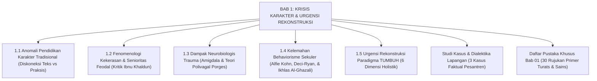

# BAB 1: KRISIS KARAKTER, PATOLOGI PENDIDIKAN, & URGENSI REKONSTRUKSI EKOSISTEM PESANTREN
## *Sitemap Induk & Peta Navigasi Monograf Bab 01*

**Nomor Identifikasi**: `BOOK-01/BAB-01/INDEX/2026`  
**Volume**: Buku 01 — *Akar Filosofis & Epistemologi Pendidikan Karakter Pesantren*  
**Klasifikasi**: Folder Bab 01 Monograf Riset & Analisis Kritis

---

## 🏛️ SITEMAP & NAVIGASI SELURUH BERKAS BAB 01

Bab 1 membedah secara radikal krisis metodologis, sosiologis, neurobiologis, dan aksiologis di dunia pesantren, serta menyusun landasan rekonstruksi menuju Ekosistem TUMBUH:

---

## 📑 DAFTAR BERKAS MODULAR BAB 01

| No | Berkas Monograf | Judul Sub-Bab & Konten | Fokus Analisis & Dalil Ilmiah |
| :---: | :--- | :--- | :--- |
| **1.1** | [**`01-Anomali-Pendidikan-Karakter-Tradisional.md`**](./01-Anomali-Pendidikan-Karakter-Tradisional.md) | Anomali Pendidikan Karakter Tradisional | Diskoneksi memori deklaratif vs prosedural; kritik Al-Ghazali (*Ayyuhal Walad*) & KH. Hasyim Asy'ari. |
| **1.2** | [**`02-Fenomenologi-Kekerasan-dan-Senioritas-Feodal.md`**](./02-Fenomenologi-Kekerasan-dan-Senioritas-Feodal.md) | Fenomenologi Kekerasan & Senioritas Feodal | Kritik Ibnu Khaldun (*Al-Muqaddimah*), teori modeling Bandura, trauma transmisi antargenerasi, & UU Perlindungan Anak. |
| **1.3** | [**`03-Dampak-Neurobiologis-Trauma-dan-Kelumpuhan-PFC.md`**](./03-Dampak-Neurobiologis-Trauma-dan-Kelumpuhan-PFC.md) | Dampak Neurobiologis Trauma & Kelumpuhan PFC | Pembajakan amigdala, aksis HPA kortisol, Teori Polivagal Stephen Porges (*Ventral Vagal*), & Al-Muhasibi. |
| **1.4** | [**`04-Kelemahan-Behaviorisme-Sekuler-dan-Kehampaan-Ruhani.md`**](./04-Kelemahan-Behaviorisme-Sekuler-dan-Kehampaan-Ruhani.md) | Kelemahan Behaviorisme Sekuler & Kehampaan Ruhani | Kritik B.F. Skinner, *Overjustification Effect* Deci-Ryan, Alfie Kohn, & hermeneutika Ikhlas Al-Ghazali. |
| **1.5** | [**`05-Urgensi-Rekonstruksi-Paradigma-Menuju-TUMBUH.md`**](./05-Urgensi-Rekonstruksi-Paradigma-Menuju-TUMBUH.md) | Urgensi Rekonstruksi Paradigma Menuju TUMBUH | Sintesis 6 dimensi holistik TUMBUH, matriks komparasi 3 paradigma, & peta jalan 5 Volume. |
| **KASUS**| [**`Studi-Kasus-Dialektika-Bab-01.md`**](./Studi-Kasus-Dialektika-Bab-01.md) | Studi Kasus & Dialektika Kritis Lapangan | Tiga analisis kasus empiris: Sidang Kamar Malam Jumat, Santri Tahfizh Ghashab, & Runtuhnya Poin Hitam. |
| **PUSTAKA**| [**`Daftar-Pustaka-Bab-01.md`**](./Daftar-Pustaka-Bab-01.md) | Daftar Pustaka Khusus Bab 01 | 30 rujukan primer Turats klasik, jurnal bereputasi Q1/Q2 Scopus, buku neurosains, & regulasi hukum RI. |
