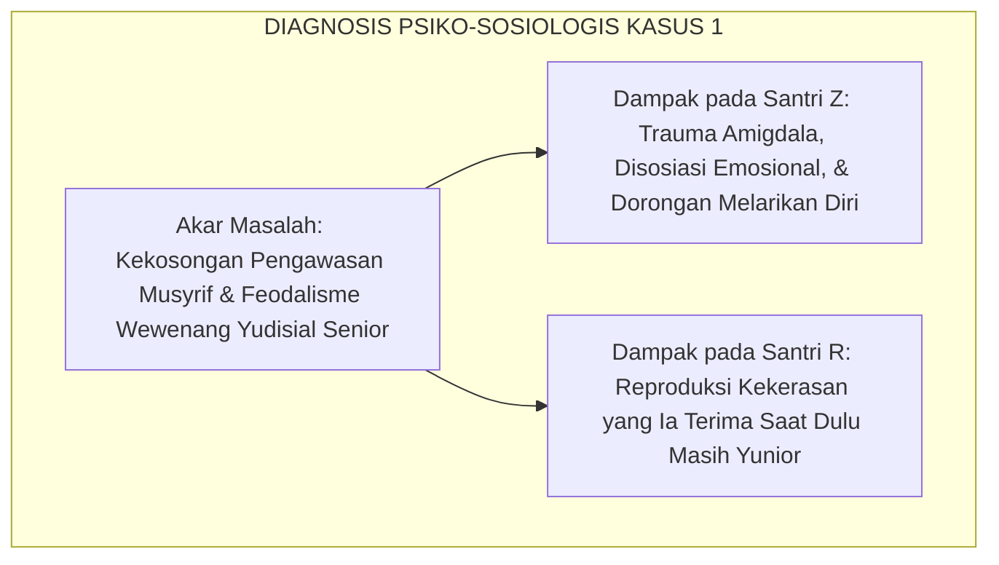
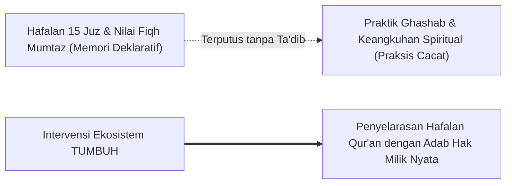
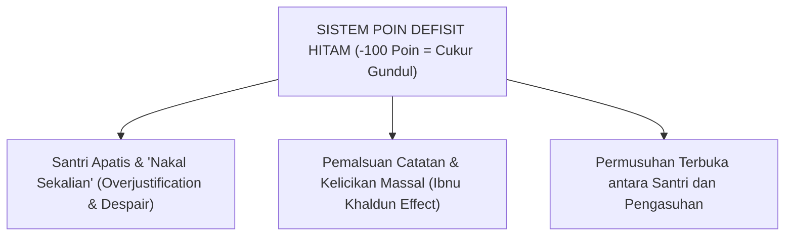

# STUDI KASUS & DIALEKTIKA KRITIS KHUSUS BAB 01

---

### 🧭 PETA POSISI PANDUAN DALAM SISTEM TUMBUH (DARI HULU KE HILIR)
* **Posisi Arsitektur**: `HULU EKOSISTEM (Akar Filosofis, Fitrah al-Munazzalah, & Worldview Islam)`
* **Peruntukan Pengguna**: Pimpinan Pesantren, Pengasuh Pondok, Kepala Madrasah, & Dewan Asatidz
* **Fokus Panduan**: Membangun cara pandang pengasuhan berbasis fitrah kesucian dan keteladanan nyata (Qudwah Hasanah), mengeliminasi tradisi kekerasan fisik dan feodalisme asrama.
* **Hasil Akhir yang Dituju**: Terwujudnya santri berkarakter *Insan Adabi* yang mandiri, musyrif yang mengasuh dengan kasih sayang tanpa *burnout*, dan pesantren yang aman berbasis data (*Safe Boarding School*).

---

### 🎯 Mengapa Panduan Ini Ada & Masalah Nyata yang Dipecahkan
1. **Latar Masalah di Lapangan**: Sering kali pengasuhan di pesantren berjalan tanpa SOP yang jelas atau terjebak dalam pola reaktif—menunggu santri berbuat salah baru dihukum dengan emosional.
2. **Solusi Sistem TUMBUH**: Panduan ini memberikan langkah preventif dan terstruktur agar setiap pembiasaan adab berjalan terencana, konsisten, dan terukur.
3. **Sasaran Perubahan**: Memastikan nilai-nilai Islam menyatu dalam perilaku harian santri melalui keteladanan nyata (*Qudwah Hasanah*).

---
### 🎯 Tujuan & Manfaat Panduan
Panduan ini dirancang sebagai petunjuk operasional terapan agar pendidik dan musyrif dapat:
1. Menjalankan pembinaan adab santri dengan pendekatan kasih sayang (*Rahmah*) dan ketegasan yang mendidik (*Firm & Kind*).
2. Menghindari cara-cara kekerasan fisik, bentakan verbal, maupun hukuman yang mempermalukan santri.
3. Menciptakan suasana asrama dan kelas yang aman, tertib, dan menumbuhkan kesadaran diri (*Bi'ah Shalihah*).

---

### 💡 Intisari Cepat (3 Menit Memahami Esensi)
* **Kunci Pengasuhan**: Karakter santri tumbuh melalui keteladanan nyata (*Qudwah Hasanah*), komunikasi empatik, dan pembiasaan terstruktur 24 jam.
* **Tindakan Utama**: Terapkan panduan langkah demi langkah di bawah ini secara konsisten, pantau perkembangan santri secara objektif, dan berikan apresiasi atas setiap perbaikan diri yang mereka capai.
* **Prinsip Disiplin**: Fokus pada pemulihan hubungan dan tanggung jawab nyata (*Restoratif*), bukan sekadar melampiaskan amarah atau menghukum.

---

### 📖 Uraian Panduan & Langkah Aksi Lapangan

**Nomor Identifikasi**: `BOOK-01/BAB-01/STUDI-KASUS/MASTER`  
**Volume**: Buku 01 — *Akar Filosofis & Epistemologi Pendidikan Karakter Pesantren*  
**Fokus Keilmuan**: Analisis Kasus Lapangan, Diagnosis Psiko-Sosiologis, & Protokol Restoratif  

---

## 🔍 KASUS 1: Tragedi 'Sidang Kamar Malam Jumat' & Siklus Agresi Senioritas

### Deskripsi Peristiwa (Fakta Lapangan)
Di sebuah pesantren berasrama tradisional di Jawa Timur, santri kelas 7 (Santri Z, usia 12 tahun) sering kali terlambat hadir pada saat apel malam karena mencuci pakaian. Pengurus kamar yang merupakan santri kelas 11 (Santri Senior R, usia 16 tahun) merasa wibawanya direndahkan. Pada malam Jumat pukul 23.30 setelah lampu kamar dipadamkan, Santri R menggelar "sidang kamar rahasia" tanpa sepengetahuan musyrif. Santri Z dipaksa melakukan *push-up* dengan bertumpu pada ujung jari selama 30 menit sambil dibentak di hadapan seluruh rekan sekamarnya. Ketika Santri Z terjatuh karena kelelahan otot, Santri R menendang punggungnya. Santri Z mengalami trauma akut, menangis histeris, menolak makan, dan mencoba melarikan diri dari pondok pada dini hari berikutnya.

<b>Gambar 1.S.1:</b> Diagnosis Psiko-Sosiologis dan Rantai Trauma pada Kasus Kekerasan Sidang Malam Santri.

Bagan diagnosis di atas memetakan bagaimana kekosongan pengawasan musyrif dewasa pada malam hari secara langsung melahirkan ruang anarki feodal: Santri Z terdorong ke dalam status panik trauma (*Sympathetic/Dorsal Vagal*), sementara Santri R mereproduksi siklus kekerasan yang pernah dialaminya di masa lalu.

### Bedah Diagnostik: Turats & Neurosains
* **Analisis Turats (Ibnu Khaldun)**: Peristiwa ini adalah manifestasi konkret dari *Al-Qahr wal Qasr* (pemaksaan dan penindasan). Santri R meniru pola kekerasan yang pernah dialaminya saat menjadi santri baru tiga tahun silam (*Intergenerational Transmission of Violence / Bandura 1973*).
* **Analisis Neurosains (Sapolsky & Porges)**: Sistem saraf Santri Z terdorong ke dalam status *Dorsal Vagal Shutdown* (kolaps trauma) dan *Sympathetic Panic* (melarikan diri), melumpuhkan seluruh minat belajarnya.

### Solusi Rekonstruktif Ekosistem TUMBUH
1. **Penarikan Mutlak Wewenang Yudisial**: Organisasi santri dilarang mengadakan sidang malam atau menjatuhkan sanksi fisik apapun.
2. **Protokol De-eskalasi & Pemulihan Korban**: Santri Z diberikan pendampingan psikologis oleh Guru BK (*Trauma-Informed Care*), dipindahkan ke lingkungan kamar yang aman, dan hak fisiknya dipulihkan.
3. **Proses Restoratif bagi Santri R**: Santri R tidak diusir secara stigmatif, melainkan diwajibkan mengikuti *Restorative Conference* bersama orang tuanya, mengakui kezalimannya, meminta maaf kepada Santri Z, dan menjalani program reedukasi empati selama 6 bulan di bawah pengawasan konselor.

---

## 🔍 KASUS 2: Santri Juara Tahfizh yang Terjebak dalam Budaya 'Ghashab'

### Deskripsi Peristiwa (Fakta Lapangan)
Santri A (usia 15 tahun, kelas 9) adalah santri berprestasi tinggi yang telah menghafal 15 Juz Al-Qur'an dan meraih nilai tertinggi dalam ujian kitab fiqh. Namun, di dalam asrama, Santri A terbiasa mengambil sandal, gayung, dan sajadah santri lain tanpa izin (*ghashab*), dengan alasan bahwa "di pondok semuanya milik bersama". Ketika ditegur oleh temannya, Santri A berdalih dengan mengutip potongan kaidah fiqh secara keliru dan merasa dirinya tidak bersalah karena prestasinya yang tinggi diakui oleh para ustadz.

<b>Gambar 1.S.2:</b> Jurang Diskoneksi Hafalan Kognitif dengan Praksis Adab dan Solusi Intervensi TUMBUH.

Diagram di atas menyingkap ironi diskoneksi kognitif: tingginya hafalan ayat suci di memori deklaratif tidak menjamin terbebasnya santri dari kezaliman ghashab, kecuali jika dijembatani oleh pembiasaan ta'dib nyata di asrama.

### Bedah Diagnostik: Diskoneksi Kognitif & Moral Disengagement
* **Analisis Al-Ghazali**: Terjadinya penyakit *Ghurur* (tertipu oleh amal sendiri) dan formalisme teks tanpa *Tazkiyatun Nafs*. Santri A memiliki ilmu deklaratif (*'ilm nazhari*) namun kalbunya buta dari hakikat wara' (*wara' al-muwashafat*).
* **Analisis Bandura**: Santri A melakukan *Moral Justification* (membenarkan perbuatan buruk dengan dalih kebersamaan semu).

### Solusi Rekonstruktif Ekosistem TUMBUH
1. **Asesmen Ipsatif Terpadu (Non-Ranking)**: Nilai raport santri tidak hanya dinilai dari jumlah juz hafalan, melainkan mengintegrasikan skor observasi harian 10 Muwashafat (*Pilar Qadirun 'alal Kasbi & Salimul Aqidah*).
2. **Konsekuensi Logis Restoratif (4R)**: Santri A diberikan tugas restitusi berupa menjadi penanggung jawab inventarisasi dan perawatan sandal/fasilitas wudhu masjid selama 3 pekan, melatih rasa empati terhadap hak milik orang lain.
3. **Halaqah Tazkiyatun Niyyah**: Musyrif membimbing Santri A merenungkan hakikat hadits tentang bahaya *Ghashab* dan mengikis kebanggaan diri (*Kibr*).

---

## 🔍 KASUS 3: Runtuhnya Kedisiplinan Sistem Poin Defisit Hitam di Pondok X

### Deskripsi Peristiwa (Fakta Lapangan)
Pondok Pesantren X menerapkan sistem "Buku Saku Poin Hitam": setiap pelanggaran diberi poin minus (terlambat = -5 poin, kamar berantakan = -10 poin). Jika santri mencapai -100 poin, santri akan digundul dan dipajang di panggung aula. Setelah 2 tahun berjalan, sistem ini mengalami kolaps total:
* Santri yang sudah mengumpulkan -80 poin menjadi putus asa (*apatis*) dan sengaja melakukan pelanggaran berat sekalian (*"sudah terlanjur basah"*).
* Terjadi pemalsuan paraf pengurus secara massal oleh santri (*black market signature*).
* Hubungan antara santri dan bagian pengasuhan berubah menjadi relasi penuh permusuhan dan kecurigaan.

<b>Gambar 1.S.3:</b> Tiga Dampak Destruktif Runtuhnya Sistem Poin Defisit Hitam di Pesantren.

Alur reaksi pada bagan di atas memperlihatkan kegagalan sistem kontrol punitive sekuler: ancaman hukuman di panggung justru memicu keputusasaan, melatih santri memalsukan catatan pelanggaran, dan merusak relasi ukhuwah antarsantri dan pengasuh.

### Bedah Diagnostik: Kerapuhan Behaviorisme Punitive
* **Analisis Alfie Kohn & Deci-Ryan**: Sistem poin hitam adalah bentuk *Extrinsic Punitive Control* yang menghancurkan seluruh motivasi intrinsik santri. Sistem ini menciptakan budaya *cops-and-robbers* (kucing-kucingan), melatih santri menjadi penipu ulung demi menghindari pemotongan poin.
* **Analisis Al-Attas**: Sistem ini kehilangan dimensi *Ta'dib* karena hanya menghitung angka kesalahan tanpa pernah mendidik kalbu santri untuk mencintai kebajikan.

### Solusi Rekonstruktif Ekosistem TUMBUH
1. **Penghapusan Sistem Poin Defisit**: Mengganti buku dosa dengan **Logbook Portofolio Pertumbuhan Adab** yang berfokus pada pelacakan kemajuan (*Growth Tracking*).
2. **Penerapan Rasio Penguatan Positif 4:1**: Setiap musyrif diwajibkan memberikan 4 kalimat apresiasi tulus atas perilaku adab santri sebelum melayangkan 1 koreksi edukatif.
3. **Penerapan Multi-Tier PBIS**: Mengelompokkan santri ke dalam Tier 1 (Universal 80%), Tier 2 (Targeted CICO 15%), dan Tier 3 (Intensif Konseling BK 5%), sehingga santri yang mengalami kesulitan kedisiplinan didampingi secara personal (*mentoring*), bukan dipermalukan di atas panggung.
