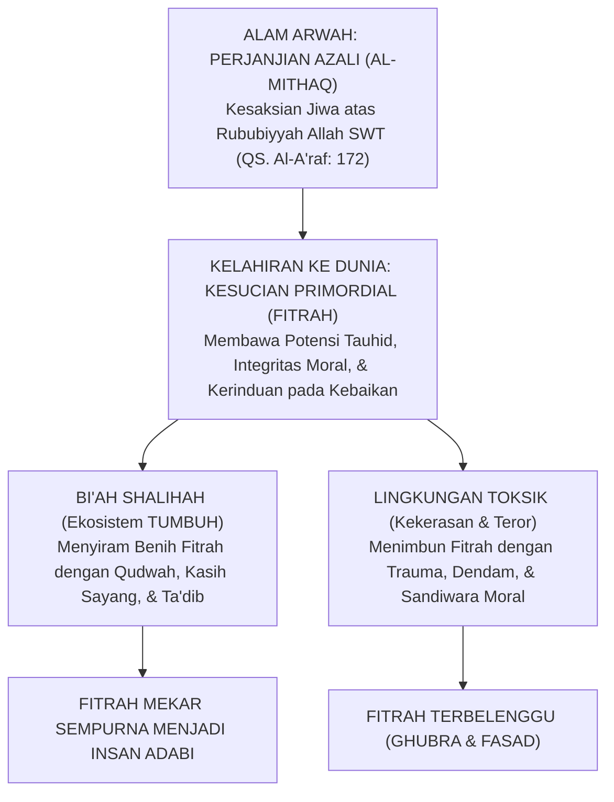
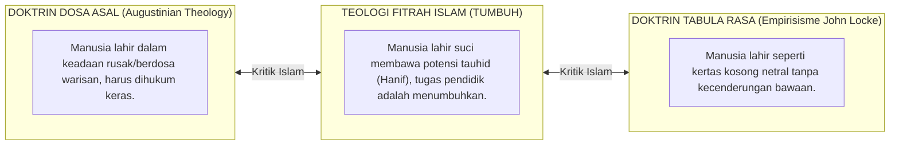
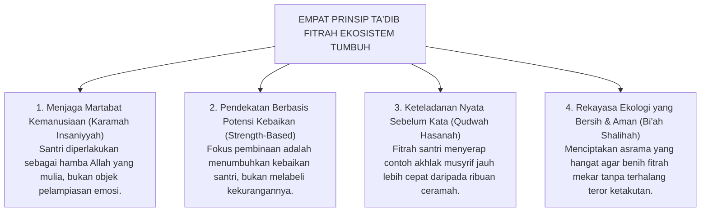

# KONSEP FITRAH AL-MUNAZZALAH & KESUCIAN PRIMORDIAL

---

### 🧭 PETA POSISI PANDUAN DALAM SISTEM TUMBUH (DARI HULU KE HILIR)
* **Posisi Arsitektur**: `HULU EKOSISTEM (Akar Filosofis, Fitrah al-Munazzalah, & Worldview Islam)`
* **Peruntukan Pengguna**: Pimpinan Pesantren, Pengasuh Pondok, Kepala Madrasah, & Dewan Asatidz
* **Fokus Panduan**: Membangun cara pandang pengasuhan berbasis fitrah kesucian dan keteladanan nyata (Qudwah Hasanah), mengeliminasi tradisi kekerasan fisik dan feodalisme asrama.
* **Hasil Akhir yang Dituju**: Terwujudnya santri berkarakter *Insan Adabi* yang mandiri, musyrif yang mengasuh dengan kasih sayang tanpa *burnout*, dan pesantren yang aman berbasis data (*Safe Boarding School*).

---

### 🎯 Mengapa Panduan Ini Ada & Masalah Nyata yang Dipecahkan
1. **Latar Masalah di Lapangan**: Sering kali pengasuhan di pesantren berjalan tanpa SOP yang jelas atau terjebak dalam pola reaktif—menunggu santri berbuat salah baru dihukum dengan emosional.
2. **Solusi Sistem TUMBUH**: Panduan ini memberikan langkah preventif dan terstruktur agar setiap pembiasaan adab berjalan terencana, konsisten, dan terukur.
3. **Sasaran Perubahan**: Memastikan nilai-nilai Islam menyatu dalam perilaku harian santri melalui keteladanan nyata (*Qudwah Hasanah*).

---
### 🎯 Tujuan & Manfaat Panduan
Panduan ini dirancang sebagai petunjuk operasional terapan agar pendidik dan musyrif dapat:
1. Menjalankan pembinaan adab santri dengan pendekatan kasih sayang (*Rahmah*) dan ketegasan yang mendidik (*Firm & Kind*).
2. Menghindari cara-cara kekerasan fisik, bentakan verbal, maupun hukuman yang mempermalukan santri.
3. Menciptakan suasana asrama dan kelas yang aman, tertib, dan menumbuhkan kesadaran diri (*Bi'ah Shalihah*).

---

### 💡 Intisari Cepat (3 Menit Memahami Esensi)
* **Kunci Pengasuhan**: Karakter santri tumbuh melalui keteladanan nyata (*Qudwah Hasanah*), komunikasi empatik, dan pembiasaan terstruktur 24 jam.
* **Tindakan Utama**: Terapkan panduan langkah demi langkah di bawah ini secara konsisten, pantau perkembangan santri secara objektif, dan berikan apresiasi atas setiap perbaikan diri yang mereka capai.
* **Prinsip Disiplin**: Fokus pada pemulihan hubungan dan tanggung jawab nyata (*Restoratif*), bukan sekadar melampiaskan amarah atau menghukum.

---

### 📖 Uraian Panduan & Langkah Aksi Lapangan

---

### Jejak Cahaya di Lubuk Jiwa Setiap Santri

Pernahkah kita merenungkan sebuah keajaiban batin yang terjadi Ketika seorang santri baru melangkah melewati pintu gerbang pondok?

Di dalam dadanya, anak itu tidak datang dengan kekosongan mutlak tanpa arah. Jauh di kedalaman jiwanya yang paling hening, tersimpan sebuah kompas batin yang tak kasat mata: kerinduan alami kepada kebenaran, rasa kagum pada kebaikan, rasa bersalah Ketika berbuat zalim, dan getaran cinta kepada Sang Pencipta.

Pendidikan Islam tidak pernah memandang santri sebagai "kertas putih kosong" yang pasif, apalagi memandangnya sebagai "makhluk kotor pembawa dosa warisan" yang harus ditaklukkan dengan pentungan. Di dalam pandangan teologi Islam, setiap anak manusia lahir membawa **Kesucian Primordial (*Fitrah al-Munazzalah*)**—sebuah cetak biru keluhuran moral yang telah dipatri langsung oleh Allah SWT sejak di alam arwah.

<b>Gambar 2.1.1:</b> Trajektori Perjalanan Fitrah dari Perjanjian Azali Menuju Mekarnya Insan Adabi dalam Ekosistem TUMBUH.

Bagan di atas merangkum perjalanan eksistensial fitrah manusia: benih kesucian yang dibawa sejak alam arwah akan mekar menjadi pribadi santri paripurna jika disiram oleh lingkungan yang hangat (*Bi'ah Shalihah*), atau sebaliknya akan tertimbun debu kepalsuan jika dirusak oleh pola asuh kekerasan.

---

### Prolegomena Teologis: Perjanjian Azali (*Al-Mithaq*) sebagai Akar Eksistensial

Al-Qur'an mengabadikan dialog agung yang mendasari eksistensi ruhani setiap manusia:

> [!NOTE]
> ### 📜 Firman Allah SWT tentang Kesaksian Primordial Jiwa Manusia:
> 
> $$\text{وَإِذْ أَخَذَ رَبُّكَ مِن بَنِي آدَمَ مِن ظُهُورِهِمْ ذُرِّيَّتَهُمْ وَأَشْهَدَهُمْ عَلَىٰ أَنفُسِهِمْ أَلَسْتُ بِرَبِّكُمْ ۖ قَالُوا بَلَىٰ ۛ شَهِدْنَا ۛ أَن تَقُولُوا يَوْمَ الْقِيَامَةِ إِنَّا كُنَّا عَنْ هَٰذَا غَافِلِينَ}$$
> 
> **Artinya:**  
> *"Dan (ingatlah) ketika Tuhanmu mengeluarkan keturunan anak-anak Adam dari sulbi mereka dan Allah mengambil kesaksian terhadap jiwa mereka (seraya berfirman): 'Bukankah Aku ini Tuhanmu?' Mereka menjawab: 'Benar (Engkau Tuhan kami), kami menjadi saksi.' (Kami lakukan yang demikian itu) agar di hari kiamat kamu tidak mengatakan: 'Sesungguhnya kami adalah orang-orang yang lengah terhadap ini.' "*  
> *(QS. Al-A'raf: 172)*

Perjanjian azali (*Al-Mithaq*) ini membuktikan bahwa fitrah santri pada dasarnya sudah mengenal Allah dan mencintai keadilan. Santri yang datang ke pondok bukanlah makhluk asing yang harus "dibuatkan moral baru dari nol", melainkan **jiwa yang perlu diingatkan kembali (*Tadzkir*) dan dibangunkan potensi fitrahnya yang tertidur (*Inma'ul Fitrah*)**.

---

### Bantahan Epistemologis atas Tabula Rasa Sekuler dan Doktrin Dosa Asal

Pandangan teologi Islam mengenai fitrah berdiri tegak menolak dua kutub ekstrem filsafat Barat yang keliru:

<b>Gambar 2.1.2:</b> Distingsi Epistemologis antara Teologi Fitrah Islam, Doktrin Dosa Asal, dan Tabula Rasa.

Dua kekeliruan besar filsafat Barat yang dibantah secara tuntas oleh Islam:

1. **Bantahan atas Doktrin Dosa Asal (*Original Sin*)**:  
   Teologi Abad Pertengahan Barat memandang anak lahir membawa kutukan dosa nenek moyang, sehingga mendidik anak diartikan sebagai "menghancurkan kedagingan yang kotor" lewat siksaan fisik. Islam menolak keras paham ini: setiap anak terlahir suci (*thahir*), bersih tanpa dosa, dan tidak memikul kesalahan orang lain (QS. Al-An'am: 164).
2. **Bantahan atas Doktrin Tabula Rasa (*The Blank Slate*)**:  
   Filsuf John Locke[^1] menganggap jiwa anak ibarat kertas putih kosong yang pasif tanpa potensi bawaan. Pandangan ini keliru karena mereduksi manusia menjadi benda mati yang dibentuk semata-mata oleh indoktrinasi lingkungan luar.

Islam menegaskan sabda abadi Rasulullah SAW:
$$\text{كُلُّ مَوْلُودٍ يُولَدُ عَلَى الْفِطْرَةِ، فَأَبَوَاهُ يُهَوِّدَانِهِ أَوْ يُنَصِّرَانِهِ أَوْ يُمَجِّسَانِهِ}$$
*"Setiap anak dilahirkan di atas fitrah kesucian; maka kedua orang tuanyalah (lingkungannyalah) yang menjadikannya Yahudi, Nasrani, atau Majusi."* (HR. Al-Bukhari no. 1358 dan Muslim no. 2658).

---

### Analisis Turats Ibn Taimiyyah & Al-Ghazali tentang Sifat Fitrah

Syaikhul Islam **Ibnu Taimiyyah** dalam karyanya *Dar' Ta'arudh al-'Aql wan-Naql*[^2] memberikan perumpamaan yang sangat cemerlang tentang bagaimana fitrah manusia bekerja:

> [!NOTE]
> ### 📜 Mutiara Ibnu Taimiyyah tentang Daya Tarik Fitrah Menuju Kebaikan:
> 
> $$\text{إِنَّ الْفِطْرَةَ سَلِيمَةٌ تَقْتَضِي مَعْرِفَةَ الْحَقِّ وَمَحَبَّتَهُ، وَلَكِنْ قَدْ يَعْرِضُ لَهَا مَا يُفْسِدُهَا مِنَ الشُّبُهَاتِ وَالشَّهَوَاتِ، كَمَا أَنَّ الْعَيْنَ الصَّحِيحَةَ تَقْتَضِي رُؤْيَةَ الشَّمْسِ إِلَّا أَنْ يَحُولَ بَيْنَهَا وَبَيْنَهَا حِجَابٌ}$$
> 
> **Artinya:**  
> *"Sesungguhnya fitrah manusia pada dasarnya sehat dan selamat; ia secara alami menuntut untuk mengenal kebenaran dan mencintainya. Namun terkadang menimpa kepadanya hal-hal yang mengotorinya berupa kerancuan pemikiran (*syubhat*) dan hawa nafsu primitif (*syahwat*)—**sebagaimana mata yang sehat secara alami menuntut untuk melihat cahaya matahari, kecuali jika ada tabir tebal yang menghalanginya**."*

Senada dengan itu, **Imam Abu Hamid Al-Ghazali** dalam *Ihya 'Ulumiddin*[^3] menggambarkan kalbu anak ibarat permata murni:

> [!NOTE]
> ### 📜 Pesan Imam Al-Ghazali tentang Hati Anak:
> 
> $$\text{الصَّبِيُّ أَمَانَةٌ عِنْدَ وَالِدَيْهِ، وَقَلْبُهُ الطَّاهِرُ جَوْهَرَةٌ نَفِيسَةٌ سَاذَجَةٌ خَالِيَةٌ عَنْ كُلِّ نَقْشٍ وَصُورَةٍ، وَهُوَ قَابِلٌ لِكُلِّ مَا نُقِشَ، وَمَائِلٌ إِلَى كُلِّ مَا يُمَالُ بِهِ إِلَيْهِ}$$
> 
> **Artinya:**  
> *"Anak adalah amanah suci di tangan kedua orang tua dan para pendidiknya. Kalbunya yang bersih adalah permata yang amat berharga, murni, dan siap menerima ukiran kebaikan yang digoreskan padanya."*

---

### Temuan Sains Modern: Bukti Moral Bawaan Sejak Bayi

Kebenaran konsep fitrah Islam kini divalidasi secara menakjubkan oleh riset sains perkembangan anak mutakhir:
* **Riset Yale University oleh Prof. Paul Bloom**[^4] dalam *Just Babies: The Origins of Good and Evil* membuktikan bahwa bayi manusia usia 3–6 bulan secara konsisten memilih karakter yang suka menolong dibanding karakter yang jahat. Ini adalah bukti empiris bahwa rasa keadilan dan empati bukanlah buatan manusia, melainkan perangkat lunak bawaan (*innate moral sense*) yang sudah terpasang sejak lahir.
* **Teori Moral Foundations oleh Jonathan Haidt**[^5] dalam *The Righteous Mind* membuktikan manusia lahir dengan intuisi kebaikan universal (kepedulian, keadilan, dan kesucian) sebelum mereka belajar membaca teori moral.

Ketika seorang santri melakukan kesalahan di asrama, kesalahan itu bukanlah bukti bahwa jiwanya cacat, melainkan karena benih fitrahnya sedang terhalang oleh debu kebiasaan buruk atau rasa takut yang belum dibimbing dengan benar.

---

### Solusi Sistemik TUMBUH: Empat Prinsip Ta'dib Berbasis Fitrah

Berpijak pada ontologi fitrah ini, **Sistem TUMBUH** merumuskan **Empat Prinsip Ta'dib Fitrah**:

<b>Gambar 2.1.3:</b> Empat Prinsip Ta'dib Fitrah Ekosistem TUMBUH dalam Membimbing Santri.

Penerapan prinsip fitrah ini di pesantren:
1. **Karamah Insaniyyah**: Tidak ada lagi hukuman fisik, caci maki, atau pembentakan, karena tubuh dan kehormatan santri adalah amanah suci Allah SWT.
2. **Strength-Based Approach**: Guru fokus mencari percikan kebaikan pada setiap anak—bahkan pada anak yang paling sering melanggar—lalu membesarkan percikan tersebut menjadi api karakter yang kuat.
3. **Qudwah Hasanah**: Para asatidz dan musyrif menampilkan akhlak sabar, jujur, dan disiplin dalam kehidupan nyata di hadapan santri.
4. **Bi'ah Shalihah**: Menjaga lingkungan asrama selalu aman dan penuh kasih sayang, sehingga fitrah santri bertumbuh mekar dengan subur.

---

## 📌 Catatan Kaki & Rujukan Primer

[^1]: **John Locke**, *An Essay Concerning Human Understanding*, Ed. Peter H. Nidditch (Oxford: Clarendon Press, 1975; cetak ulang dari edisi orisinal 1690), Buku II, Bab I, hlm. 104.
[^2]: **Syaikhul Islam Ibnu Taimiyyah**, *Dar' Ta'arudh al-'Aql wan-Naql*, Tahqiq: Dr. Muhammad Rasyad Salim (Riyadh: Jami'ah al-Imam Muhammad bin Su'ud al-Islamiyyah, 1411 H), Jilid VIII, hlm. 446–450.
[^3]: **Hujjatul Islam Imam Abu Hamid al-Ghazali**, *Ihya' 'Ulumiddin*, Kitab Riyadhatin Nafs wa Tahdzibil Akhlaq (Kairo & Beirut: Dar al-Ma'rifah, t.th.), Jilid III, hlm. 72–75.
[^4]: **Paul Bloom**, *Just Babies: The Origins of Good and Evil* (New York: Crown Publishers / Random House, 2013), hlm. 19–45.
[^5]: **Jonathan Haidt**, *The Righteous Mind: Why Good People Are Divided by Politics and Religion* (New York: Pantheon Books, 2012), Bab 6: "Taste Buds of the Righteous Mind", hlm. 111–134.
