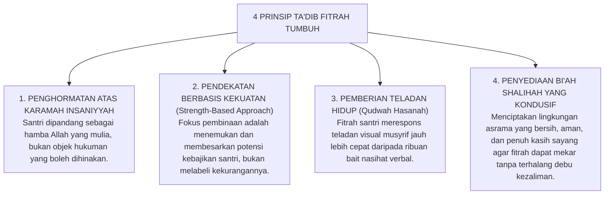

# SUB-BAB 2.1: KONSEP FITRAH AL-MUNAZZALAH & KESUCIAN PRIMORDIAL
## *Hakikat Insan Pembelajar dalam Pandangan Teologi Islam, Hermeneutika Perjanjian Azali, dan Bantahan atas Tabula Rasa Sekuler*

**Kode Klasifikasi**: `BOOK-01/BAB-02/SUB-01/MONOGRAF`  
**Disiplin Ilmu**: Teologi Islam (*Ilmul Kalam*), Antropologi Filosofis, & Psikologi Perkembangan Fitrah  
**Dewan Pakar**: `pakar-epistemologi-turats`, `pakar-filosofi-tumbuh`, `pakar-desain-kurikulum-adab`

---

### 1. Prolegomena Teologis: Perjanjian Azali (*Al-Mithaq*) sebagai Akar Eksistensial

Pendidikan karakter dalam peradaban Islam tidak pernah bermula dari kehampaan biologis, melainkan berakar pada peristiwa metafisik-eksistensial yang terjadi sebelum manusia diturunkan ke alam fana: **Perjanjian Primordial (*Al-Mithaq al-Awwal*)** di alam arwah. Allah SWT mengabadikan dialog ontologis ini dalam Al-Qur'an:

> $$\text{وَإِذْ أَخَذَ رَبُّكَ مِن بَنِي آدَمَ مِن ظُهُورِهِمْ ذُرِّيَّتَهُمْ وَأَشْهَدَهُمْ عَلَىٰ أَنفُسِهِمْ أَلَسْتُ بِرَبِّكُمْ ۖ قَالُوا بَلَىٰ ۛ شَهِدْنَا ۛ أَن تَقُولُوا يَوْمَ الْقِيَامَةِ إِنَّا كُنَّا عَنْ هَٰذَا غَافِلِينَ}$$
> 
> *"Dan (ingatlah) ketika Tuhanmu mengeluarkan keturunan anak-anak Adam dari sulbi mereka dan Allah mengambil kesaksian terhadap jiwa mereka (seraya berfirman): 'Bukankah Aku ini Tuhanmu?' Mereka menjawab: 'Benar (Engkau Tuhan kami), kami menjadi saksi.' (Kami lakukan yang demikian itu) agar di hari kiamat kamu tidak mengatakan: 'Sesungguhnya kami adalah orang-orang yang lengah terhadap ini.' "* (QS. Al-A'raf: 172).

Perjanjian azali ini membuktikan bahwa setiap jiwa manusia—termasuk setiap santri yang menginjakkan kaki di gerbang pesantren—bukanlah makhluk yang asing dari kebenaran. Di dalam kedalaman struktur ruhaninya telah tertanam **kesadaran primordial akan ketuhanan (*God-consciousness*)**, kerinduan pada keadilan, dan kompas moral intrinsik yang condong kepada kebaikan (*hanifiyyah*). 


---

### 2. Bantahan Epistemologis atas Tabula Rasa Sekuler dan Dosa Asal

Pandangan teologi Islam mengenai fitrah berdiri kokoh di tengah-tengah dua kutub ekstrem filsafat Barat yang keliru:

```mermaid
graph LR
    subgraph Barat1["DOKTRIN DOSA ASAL (Augustinian Christian Theology)"]
        D1["Manusia lahir dalam keadaan rusak/berdosa, harus ditekan dan ditaklukkan secara keras."]
    end

    subgraph Islam["TEOLOGI FITRAH ISLAM (TUMBUH)"]
        I1["Manusia lahir suci membawa potensi ilahiah (Hanif), tugas pendidikan adalah menumbuhkan."]
    end

    subgraph Barat2["DOKTRIN TABULA RASA (Empirisisme John Locke)"]
        D2["Manusia lahir seperti kertas kosong netral tanpa kecenderungan bawaan apapun."]
    end

    Barat1 <---|KRITIK ISLAM|---> Islam <---|KRITIK ISLAM|---> Barat2
```

1. **Bantahan atas Doktrin Dosa Asal (*Original Sin*)**:  
   Teologi Augustinian memandang anak lahir dengan kodrat rusak yang membawa warisan kutukan dosa, sehingga disiplin dipahami sebagai upaya "menghukum kedagingan" yang liar. Paradigma inilah yang secara historis melahirkan tradisi hukuman fisik kejam di sekolah-sekolah biara Eropa abad pertengahan. Islam menolak mutlak konsep ini: setiap bayi lahir suci (*thahir*) dan tidak memikul dosa orang lain (QS. Al-An'am: 164).
2. **Bantahan atas Doktrin Tabula Rasa (*The Blank Slate*)**:  
   Filsuf empirisisme John Locke (1690) dalam *An Essay Concerning Human Understanding* menyatakan jiwa manusia adalah kertas putih kosong (*tabula rasa*) yang sepenuhnya dibentuk oleh impresi sensorik luar. Pandangan reduksionis ini menafikan keberadaan intuisi moral bawaan dan dimensi transendental ruhani, mereduksi proses pendidikan menjadi sekadar indoktrinasi mekanik dari luar (*social conditioning*).

Islam menegaskan konsep **Fitrah al-Munazzalah**: manusia lahir membawa cetak biru kebaikan (*divine moral blueprint*). Rasulullah SAW bersabda:
$$\text{كُلُّ مَوْلُودٍ يُولَدُ عَلَى الْفِطْرَةِ}$$
*"Setiap anak dilahirkan di atas fitrah."* (HR. Al-Bukhari no. 1358).

Tugas esensial pendidikan pesantren bukanlah "menciptakan karakter dari nol" seolah-olah santri adalah benda mati, melainkan **membangunkan potensi fitrah yang tertidur (*Tazkiyah wa Inma'*)** dan melindunginya dari polusi lingkungan yang merusak.

---

### 3. Analisis Turats Ibn Taimiyyah & Al-Ghazali tentang Dinamika Fitrah

Syaikhul Islam Ibnu Taimiyyah (w. 728 H) dalam risalah terkenalnya *Dar' Ta'arudh al-'Aql wan-Naql* (Jilid VIII) menguraikan bahwa fitrah manusia memiliki afinitas alami terhadap kebenaran dan kebaikan, sebagaimana mata memiliki afinitas alami untuk melihat cahaya:

> $$\text{إِنَّ الْفِطْرَةَ سَلِيمَةٌ تَقْتَضِي مَعْرِفَةَ الْحَقِّ وَمَحَبَّتَهُ، وَلَكِنْ قَدْ يَعْرِضُ لَهَا مَا يُفْسِدُهَا مِنَ الشُّبُهَاتِ وَالشَّهَوَاتِ، كَمَا أَنَّ الْعَيْنَ الصَّحِيحَةَ تَقْتَضِي رُؤْيَةَ الشَّمْسِ إِلَّا أَنْ يَحُولَ بَيْنَهَا وَبَيْنَهَا حِجَابٌ}$$
> 
> *"Sesungguhnya fitrah manusia itu pada dasarnya selamat dan sehat; ia menuntut untuk mengenal kebenaran dan mencintainya. Namun, terkadang menimpa kepadanya hal-hal yang merusaknya berupa racun syubhat (kerancuan pemikiran) dan syahwat (hawa nafsu primitif)—sebagaimana halnya mata yang sehat secara alami menuntut untuk melihat cahaya matahari, kecuali jika ada penghalang tebal yang merintangi antara mata tersebut dengan cahaya."* (Ibn Taimiyyah, *Dar' Ta'arudh*, VIII: 446).

Senada dengan itu, Imam Al-Ghazali dalam *Ihya 'Ulumiddin* (Jilid III, *Kitab Riyadhatin Nafs*) memberikan perumpamaan agung tentang hati anak:

> $$\text{الصَّبِيُّ أَمَانَةٌ عِنْدَ وَالِدَيْهِ، وَقَلْبُهُ الطَّاهِرُ جَوْهَرَةٌ نَفِيسَةٌ سَاذَجَةٌ خَالِيَةٌ عَنْ كُلِّ نَقْشٍ وَصُورَةٍ، وَهُوَ قَابِلٌ لِكُلِّ مَا نُقِشَ، وَمَائِلٌ إِلَى كُلِّ مَا يُمَالُ بِهِ إِلَيْهِ. فَإِنْ عُوِّدَ الْخَيْرَ وَعُلِّمَهُ نَشَأَ عَلَيْهِ وَسَعِدَ فِي الدُّنْيَا وَالْآخِرَةِ، وَشَارَكَهُ فِي ثَوَابِهِ أَبَوَاهُ وَكُلُّ مُعَلِّمٍ لَهُ وَمُؤَدِّبٍ}$$
> 
> *"Seorang anak adalah amanah suci di tangan kedua orang tuanya dan para pendidiknya. Kalbunya yang bersih adalah permata yang amat berharga, murni, dan menerima segala ukiran yang digoreskan padanya. Jika ia dibiasakan dengan kebaikan dan diajarkan adab, niscaya ia akan tumbuh di atas kebaikan tersebut dan berbahagia di dunia maupun akhirat, serta kedua orang tua dan para gurunya akan bersekutu mendapatkan pahala kebaikannya."* (Al-Ghazali, *Ihya 'Ulumiddin*, III: 72).

---

### 4. Hermeneutika Sains Modern: Konsensus Moral Bawaan (*Innate Morality*)

Temuan mutakhir dalam sains perkembangan anak di universitas-universitas terkemuka dunia kini memvalidasi kebenaran konsepsi fitrah Islam:
* **The Infant Cognition Center di Yale University (Paul Bloom, 2013)** dalam bukunya *Just Babies: The Origins of Good and Evil* membuktikan melalui serangkaian eksperimen perilaku bahwa bayi manusia sejak usia 3–6 bulan telah memiliki kepekaan moral bawaan (*innate moral sense*): mereka secara konsisten memilih boneka yang suka menolong dibandingkan boneka yang berbuat jahat, serta menunjukkan respons empati spontan terhadap penderitaan sesamanya.
* **Teori Fondasi Moral (*Moral Foundations Theory* oleh Jonathan Haidt, 2012)** dalam *The Righteous Mind* membuktikan bahwa manusia lahir dengan intuisi moral universal (keadilan, kepedulian terhadap yang lemah, kesucian, dan loyalitas) yang mendahului proses penalaran rasional formal.

Penemuan ini menegaskan kepastian ilmiah bahwa santri yang datang ke pesantren **sudah memiliki benih kepekaan moral fitrah**. Ketika santri melakukan pelanggaran, tindakan tersebut merupakan anomali akibat stimulasi lingkungan yang salah atau distorsi trauma masa lalu, bukan karena ketiadaan kapasitas moral dalam jiwanya.

---

### 5. Implikasi Pedagogis Ekosistem TUMBUH

Dari fondasi ontologi fitrah ini, Ekosistem TUMBUH merumuskan **Empat Prinsip Ta'dib Fitrah**:



Dengan meletakkan ontologi fitrah sebagai batu pertama pembinaan, ekosistem TUMBUH mengembalikan pendidikan pesantren kepada fitrah penciptaan manusia itu sendiri: memuliakan jiwa pembelajar untuk mengabdi seutuhnya kepada Sang Khaliq.
