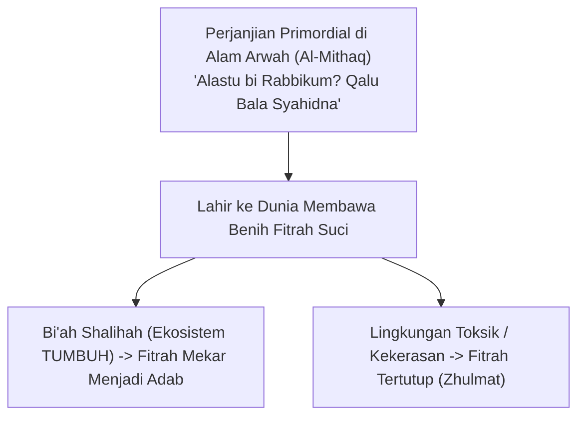

# SUB-BAB 2.1: KONSEP FITRAH AL-MUNAZZALAH & KESUCIAN PRIMORDIAL
## *Hakikat Insan Pembelajar dalam Pandangan Teologi Islam dan Bantahan atas Tabula Rasa Sekuler*

**Kode Modul**: `BOOK-01/BAB-02/SUB-01`  
**Kategori**: Ontologi Fitrah  
**Fokus Keilmuan**: Epistemologi Turats & Filsafat Manusia Islam

---

### 1. Teologi Fitrah: Kesucian Bawaan yang Mengandung Potensi Ilahiah
Dalam pandangan Islam, manusia tidak lahir dalam keadaan noda atau dosa asal (*original sin*), dan bukan pula lembaran kertas putih kosong tanpa kecenderungan bawaan (*tabula rasa* ala John Locke). Rasulullah SAW bersabda:
$$\text{كُلُّ مَوْلُودٍ يُولَدُ عَلَى الْفِطْرَةِ فَأَبَوَاهُ يُهَوِّدَانِهِ أَوْ يُنَصِّرَانِهِ أَوْ يُمَجِّسَانِهِ}$$
*"Setiap anak dilahirkan di atas fitrah, maka kedua orang tuanyalah yang menjadikannya Yahudi, Nasrani, atau Majusi."* (HR. Bukhari & Muslim).

Fitrah adalah **orientasi spiritual primordial (*al-Mithaq*)** yang mengikat manusia dengan Allah SWT sejak di alam arwah (QS. Al-A'raf: 172). Di dalam fitrah terpatri kecenderungan alami menuju tauhid, cinta keadilan, kerinduan pada kebenaran (*hanif*), dan kepekaan estetika moral.

---

### 2. Konsep Fitrah al-Munazzalah
Ekosistem TUMBUH merumuskan konsep **Fitrah al-Munazzalah** (fitrah yang diturunkan ke alam dunia). Konsep ini menegaskan bahwa:
1. Setiap santri yang masuk ke pesantren memiliki **potensi kebaikan bawaan** yang siap ditumbuhkan.
2. Tugas pendidik bukanlah menjejalkan adab dari luar secara paksa, melainkan **membangunkan dan menyuburkan fitrah** yang telah ada di dalam jiwa santri.
3. Perilaku menyimpang bukan sifat permanen santri, melainkan debu kotoran (*ghubra*) yang menutupi fitrahnya akibat salah asuh atau pengaruh buruk lingkungan masa lalu.
