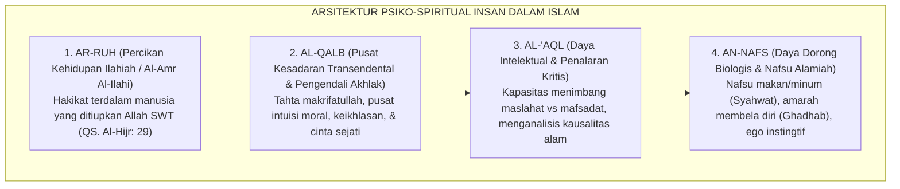
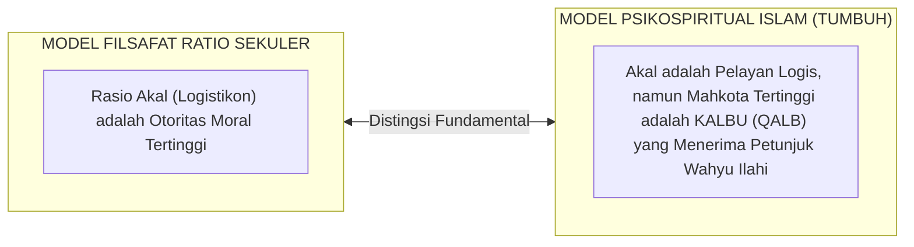
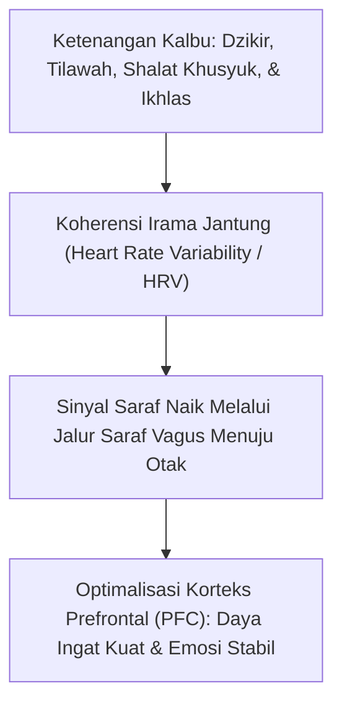
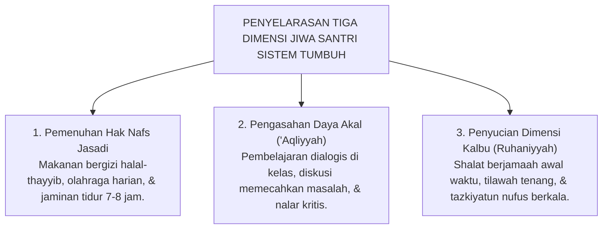

# STRUKTUR PSIKO-SPIRITUAL: DINAMIKA NAFS, AQL, & QALB

---

### 🧭 PETA POSISI PANDUAN DALAM SISTEM TUMBUH (DARI HULU KE HILIR)
* **Posisi Arsitektur**: `HULU EKOSISTEM (Akar Filosofis, Fitrah al-Munazzalah, & Worldview Islam)`
* **Peruntukan Pengguna**: Pimpinan Pesantren, Pengasuh Pondok, Kepala Madrasah, & Dewan Asatidz
* **Fokus Panduan**: Membangun cara pandang pengasuhan berbasis fitrah kesucian dan keteladanan nyata (Qudwah Hasanah), mengeliminasi tradisi kekerasan fisik dan feodalisme asrama.
* **Hasil Akhir yang Dituju**: Terwujudnya santri berkarakter *Insan Adabi* yang mandiri, musyrif yang mengasuh dengan kasih sayang tanpa *burnout*, dan pesantren yang aman berbasis data (*Safe Boarding School*).

---

### 🎯 Mengapa Panduan Ini Ada & Masalah Nyata yang Dipecahkan
1. **Latar Masalah di Lapangan**: Sering kali pengasuhan di pesantren berjalan tanpa SOP yang jelas atau terjebak dalam pola reaktif—menunggu santri berbuat salah baru dihukum dengan emosional.
2. **Solusi Sistem TUMBUH**: Panduan ini memberikan langkah preventif dan terstruktur agar setiap pembiasaan adab berjalan terencana, konsisten, dan terukur.
3. **Sasaran Perubahan**: Memastikan nilai-nilai Islam menyatu dalam perilaku harian santri melalui keteladanan nyata (*Qudwah Hasanah*).

---
### 🎯 Tujuan & Manfaat Panduan
Panduan ini dirancang sebagai petunjuk operasional terapan agar pendidik dan musyrif dapat:
1. Menjalankan pembinaan adab santri dengan pendekatan kasih sayang (*Rahmah*) dan ketegasan yang mendidik (*Firm & Kind*).
2. Menghindari cara-cara kekerasan fisik, bentakan verbal, maupun hukuman yang mempermalukan santri.
3. Menciptakan suasana asrama dan kelas yang aman, tertib, dan menumbuhkan kesadaran diri (*Bi'ah Shalihah*).

---

### 💡 Intisari Cepat (3 Menit Memahami Esensi)
* **Kunci Pengasuhan**: Karakter santri tumbuh melalui keteladanan nyata (*Qudwah Hasanah*), komunikasi empatik, dan pembiasaan terstruktur 24 jam.
* **Tindakan Utama**: Terapkan panduan langkah demi langkah di bawah ini secara konsisten, pantau perkembangan santri secara objektif, dan berikan apresiasi atas setiap perbaikan diri yang mereka capai.
* **Prinsip Disiplin**: Fokus pada pemulihan hubungan dan tanggung jawab nyata (*Restoratif*), bukan sekadar melampiaskan amarah atau menghukum.

---

### 📖 Uraian Panduan & Langkah Aksi Lapangan

---

### Metafora Kerajaan di Dalam Diri Manusia

Bayangkan sebuah negeri kerajaan yang megah di dalam diri setiap santri:

Di singgasana istana, duduk **Sang Raja (Al-Qalb / Kalbu)** yang memegang tongkat kepemimpinan. Di sampingnya berdiri **Perdana Menteri yang bijaksana (Al-'Aql / Akal)** yang bertugas menimbang maslahat dan memberi pertimbangan nalar. Di luar istana, bertugas **Panglima Kepolisian (Al-Ghadhab / Daya Amarah)** yang bertugas menjaga kedaulatan dan membela kebenaran, serta **Pelayan Logistik (Asy-Syahwah / Daya Keinginan Biologis)** yang bertugas mendatangkan makanan dan memenuhi kebutuhan hidup.

Perumpamaan agung yang ditulis oleh **Imam Abu Hamid Al-Ghazali** dalam *Ihya 'Ulumiddin*[^1] ini menjelaskan rahasia keseimbangan jiwa manusia:

> [!NOTE]
> ### 📜 Tamsil Kerajaan Jiwa Imam Al-Ghazali:
> 
> $$\text{إِذَا اسْتَعَانَ الْمَلِكُ بِوَزِيرِهِ، وَقَهَرَ الْعَبْدَ وَصَاحِبَ الشُّرْطَةِ وَجَعَلَهُمَا تَحْتَ إِشَارَةِ الْوَزِيرِ، صَلَحَتْ أَحْوَالُ الْمَمْلَكَةِ وَعَمَّ الْعَدْلُ}$$
> 
> **Artinya:**  
> *"Ketika sang Raja (Kalbu) senantiasa meminta nasihat kepada Perdana Menterinya (Akal), serta menundukkan sang Pelayan (Syahwat) dan Panglima Polisi (Amarah) di bawah arahan sang Perdana Menteri, niscaya makmurlah negeri jiwa itu dan tegaklah keadilan.*  
> *Namun, apabila sang Pelayan atau sang Polisi memberontak dan menawan sang Raja, niscaya hancurlah negeri jiwa itu dan binasalah seluruh rakyatnya!"*

<b>Gambar 2.2.1:</b> Struktur Hirarki Empat Dimensi Psiko-Spiritual Manusia dalam Khazanah Islam.

Pendidikan karakter dalam Islam **tidak pernah bertujuan membunuh nafsu atau mematikan amarah**. Tanpa nafsu makan santri akan mati kelaparan, dan tanpa daya amarah santri tidak akan punya keberanian membela kebenaran. Tujuan adab adalah **mendidik nafsu dan amarah agar tunduk di bawah kendali akal yang disinari oleh cahaya kalbu**.

---

### Empat Dimensi Jiwa Manusia dalam Khazanah Islam

Khazanah Islam memetakan kepribadian insan ke dalam empat dimensi yang saling melengkapi:

1. **Ar-Ruh (الرُّوح)**: Percikan kehidupan ilahiah (*Al-Amr al-Ilahi*) yang ditiupkan Allah ke dalam jasad janin (QS. Al-Hijr: 29). Dimensi inilah yang membuat manusia selalu haus akan makna hidup dan rindu bersujud kepada Allah.
2. **Al-Qalb (القَلْب)**: Pusat kesadaran spiritual dan kompas moral manusia. Dinamakan *Qalb* (yang berbolak-balik) karena sifatnya yang sangat dinamis. Kalbulah yang menjadi tempat bersemayamnya keikhlasan, cinta, dan iman.
3. **Al-'Aql (العَقْل)**: Daya nalar dan instrumen analitis untuk menimbang sebab-akibat, membedakan mana yang bermanfaat dan mana yang membahayakan.
4. **An-Nafs (النَّفْس)**: Daya dorong biologis hayati yang mencakup nafsu makan (*syahwat*) dan dorongan membela diri (*ghadhab*).

---

### Distingsi Epistemologis: Model Jiwa Islam vs Plato

Secara historis, filsuf Yunani Plato merumuskan konsep tiga jiwa (*The Tripartite Soul*): *Epithymia* (nafsu), *Thymos* (emosi), dan *Logistikon* (rasio). Namun terdapat perbedaan mendasar antara pandangan sekuler Barat dan Islam:

<b>Gambar 2.2.2:</b> Perbedaan Ontologis antara Rasionalisme Sekuler dan Psikospiritual Islam.

Bagi filsafat Barat, akal rasional adalah penguasa tertinggi. Namun Islam membuktikan bahwa akal yang cerdas bisa saja berubah menjadi alat kelicikan (*cunning intellect*) jika kalbunya buta dari iman. Oleh karena itu, dalam Islam, mahkota tertinggi yang memimpin hidup manusia adalah **Qalb**—organ spiritual yang memiliki mata batin (*Bashirah*) untuk menyaksikan kebenaran (QS. Al-Hajj: 46).

---

### Integrasi Neurosains: Sumbu Jantung-Otak (*The Brain-Heart Axis*)

Kajian mutakhir dalam neurobiologi klinis oleh *HeartMath Institute*[^2] kini membuktikan secara empiris bahwa kedudukan kalbu bukanlah sekadar bahasa kiasan, melainkan memiliki dasar biologis yang sangat nyata:

<b>Gambar 2.2.3:</b> Sumbu Jantung-Otak (Brain-Heart Axis): Dampak Ketenangan Kalbu terhadap Fungsi Kognitif Otak.

Fakta ilmiah membuktikan:
1. **Otak Kecil di Jantung (*The Little Brain in the Heart*)**: Jantung manusia memiliki lebih dari 40.000 sel neuron sensorik yang mampu memproses emosi dan menghasilkan hormon independen dari otak kepala.
2. **Sinyal dari Jantung ke Otak**: Terdapat lebih banyak kabel saraf yang mengirimkan sinyal dari jantung menuju otak dibanding sebaliknya.
3. **Koherensi Jantung-Otak**: Ketika santri berdzikir dengan khusyuk dan merasakan keikhlasan (*Qalb Salim*), detak jantung membentuk gelombang ritmis yang sangat halus (koheren). Sinyal ketenangan ini dikirim ke otak depan (*PFC*), yang seketika meningkatkan daya konsentrasi menghafal Al-Qur'an dan menstabilkan emosi santri.

---

### Solusi Sistemik TUMBUH: Penyelarasan Hak Triad Jiwa Santri

Berdasarkan struktur psiko-spiritual ini, **Sistem TUMBUH** mewajibkan pemenuhan hak tiga dimensi secara seimbang dalam jadwal harian pesantren:

<b>Gambar 2.2.4:</b> Tiga Pilar Penyelarasan Hak Psiko-Spiritual Santri dalam Ritme Keseharian TUMBUH.

1. **Hak Nafs Jasadi**: Santri dijamin mendapat asupan gizi yang baik, sarana olahraga, dan tidur yang manusiawi, sehingga nafsu biologisnya tenang dan tidak memberontak.
2. **Hak Akal 'Aqliyyah**: Pembelajaran kitab kuning disajikan secara interaktif agar akal santri terbiasa berpikir kritis dan memahami hikmah syariat.
3. **Hak Kalbu Ruhaniyyah**: Menjadikan masjid sebagai oase ketenangan batin melalui shalat khusyuk dan dzikir, menyiram dahaga spiritual santri setiap hari.

---

## 📌 Catatan Kaki & Rujukan Primer

[^1]: **Hujjatul Islam Imam Abu Hamid al-Ghazali**, *Ihya' 'Ulumiddin*, Kitab 'Aja'ibil Qalb (Kairo & Beirut: Dar al-Ma'rifah, t.th.), Jilid III, hlm. 6–10.
[^2]: **Rollin McCraty et al.**, "The coherent heart: Heart-brain interactions, psychophysiological coherence, and the emergence of system-wide order", *Integral Review*, Vol. 5, No. 2 (2009), hlm. 10–115; serta **J. Andrew Armour**, *Neurocardiology: Anatomical and Functional Principles* (New York: Oxford University Press, 1991).
