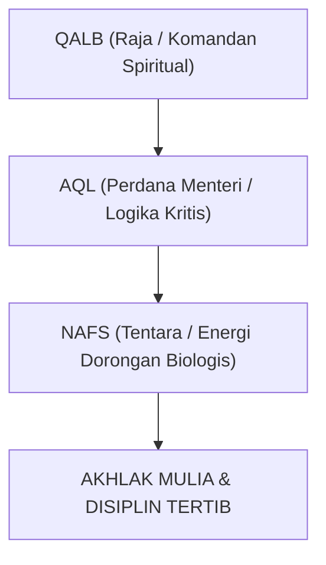

# SUB-BAB 2.2: STRUKTUR PSIKO-SPIRITUAL: DINAMIKA NAFS, AQL, & QALB
## *Anatomi Jiwa Manusia dalam Turats Imam Al-Ghazali dan Ibn al-Qayyim*

**Kode Modul**: `BOOK-01/BAB-02/SUB-02`  
**Kategori**: Psikologi Spiritual Islam  
**Fokus Keilmuan**: Tasawuf Falsafi & Psikologi Perkembangan Islam

---

### 1. Tiga Daya Pembentuk Kepribadian Insan
Sebagaimana dirumuskan oleh Hujjatul Islam Imam Al-Ghazali dalam *Ma'arij al-Quds fi Madarij Ma'rifat an-Nafs*, arsitektur kejiwaan manusia terdiri dari tiga daya yang saling berkorelasi:

| Daya Jiwa | Dimensi / Fungsi Utama | Padanan Neurosains Modern | Peran dalam Pendidikan Adab |
| :--- | :--- | :--- | :--- |
| **Qalb** | Pusat kesadaran spiritual, intuisi iman, dan keikhlasan niat. | Sistem Nilai Inti & Afeksi Mendalam | Mengarahkan seluruh motif tindakan menuju ridha Allah. |
| **Aql** | Daya nalar kritis, kemampuan membedakan maslahat vs mafsadat. | Korteks Prefrontal (*Prefrontal Cortex*) | Menimbang konsekuensi dan merumuskan strategi kepatuhan syar'i. |
| **Nafs** | Daya dorong biologis, syahwat makanan/tidur, dan amarah (*ghadhab*). | Sistem Limbik & Batang Otak (*Limbic System*) | Energi biologis yang harus didisiplinkan agar tidak merusak diri. |

---

### 2. Harmoni Psiko-Spiritual sebagai Tujuan Ta'dib
Pendidikan yang cacat adalah pendidikan yang hanya melatih *Aql* (intelektual) sembari membiarkan *Nafs* liar atau menekan *Nafs* dengan teror hingga melumpuhkan *Qalb*. 

Ekosistem TUMBUH merancang ritme asrama 24 jam agar ketiga daya ini berada dalam keselarasan:
* *Nafs* dipenuhi hak biologisnya secara halal-thayyib (makan bergizi, olahraga sunnah, tidur cukup 6 jam).
* *Aql* diasah melalui nalar kritis kajian kitab dan sains.
* *Qalb* disucikan melalui wirid, tilawah, dan muraqabah.
