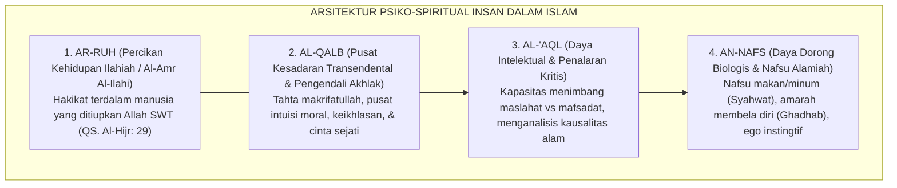
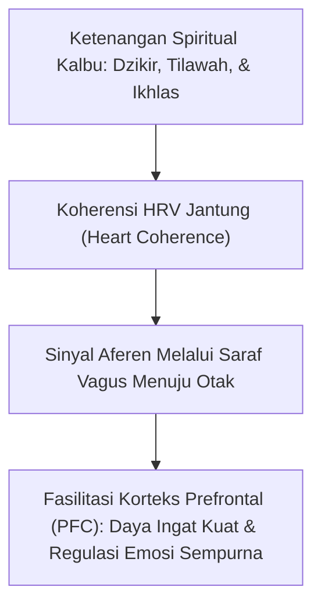

# SUB-BAB 2.2: STRUKTUR PSIKO-SPIRITUAL: DINAMIKA NAFS, AQL, & QALB
## *Anatomi Kejiwaan Manusia dalam Turats Imam Al-Ghazali dan Ibn al-Qayyim serta Integrasinya dengan Neurosains Kognitif Kontemporer*

**Kode Klasifikasi**: `BOOK-01/BAB-02/SUB-02/MONOGRAF`  
**Disiplin Ilmu**: Psikologi Spiritual Islam (*Ilm an-Nafs al-Islami*), Tasawuf Falsafi, & Neurokardiologi  
**Dewan Pakar**: `pakar-epistemologi-turats`, `pakar-filosofi-tumbuh`, `pakar-neurosains-perkembangan`

---

### 1. Anatomi Psiko-Spiritual dalam Khazanah Turats Islam

Salah satu sumbangan teragung peradaban Islam terhadap ilmu pengetahuan manusia adalah perumusan arsitektur kejiwaan yang utuh dan multi-dimensional. Berbeda dengan psikologi materialistik sekuler yang mereduksi kesadaran manusia semata-mata menjadi reaksi elektro-kimiawi di otak, para ulama *muhaqqiqin* seperti Hujjatul Islam Imam Abu Hamid al-Ghazali (w. 505 H) dalam *Ihya 'Ulumiddin* (khususnya *Kitab 'Aja'ib al-Qalb*) dan Al-Imam Ibn al-Qayyim al-Jawziyyah (w. 751 H) dalam *Ighatsat al-Lahfan* memetakan kepribadian insan ke dalam empat entitas psiko-spiritual yang saling berkelindan: **an-Nafs, al-'Aql, al-Qalb, dan ar-Ruh**.



---

### 2. Metafora Al-Ghazali: Kerajaan Jiwa Manusia

Imam Al-Ghazali dalam *Ihya 'Ulumiddin* (Jilid III, hlm. 6–10) menyajikan metafora peradaban yang sangat indah untuk menjelaskan bagaimana keempat daya kejiwaan ini seharusnya berinteraksi dalam diri seorang pembelajar:

> $$\text{اعْلَمْ أَنَّ مَثَلَ الْقَلْبِ فِي عِلَاقَتِهِ بِقُوَى النَّفْسِ كَمَثَلِ مَلِكٍ فِي مَدِينَتِهِ؛ وَالْعَقْلُ بِمَنْزِلَةِ وَزِيرِهِ النَّاصِحِ، وَالشَّهْوَةُ بِمَنْزِلَةِ عَبْدِهِ الَّذِي يَجْلِبُ الْمِيرَةَ إِلَى بَلَدِهِ، وَالْغَضَبُ بِمَنْزِلَةِ صَاحِبِ شُرْطَتِهِ الَّذِي يَقْمَعُ أَعْدَاءَهُ. فَإِذَا اسْتَعَانَ الْمَلِكُ بِوَزِيرِهِ وَاسْتَشَارَهُ، وَقَهَرَ الْعَبْدَ وَصَاحِبَ الشُّرْطَةِ وَجَعَلَهُمَا تَحْتَ إِشَارَةِ الْوَزِيرِ، صَلَحَتْ أَحْوَالُ الْمَمْلَكَةِ وَعَمَّ الْعَدْلُ. وَإِنْ غَلَبَ الْعَبْدُ أَوِ الشُّرْطِيُّ عَلَى الْمَلِكِ، خَرِبَتِ الْمَدِينَةُ وَهَلَكَ الرَّعَايَا}$$
> 
> *"Ketahuilah, sesungguhnya perumpamaan kalbu dalam hubungannya dengan daya-daya jiwa adalah laksana **seorang raja di dalam kerajaannya**. Akal berkedudukan sebagai **perdana menteri yang bijaksana**, syahwat biologis berkedudukan sebagai **pelayan yang bertugas mendatangkan suplai makanan**, dan amarah (*ghadhab*) berkedudukan sebagai **panglima kepolisian yang bertugas menumpas musuh**. Tatkala sang raja (Kalbu) senantiasa meminta nasihat kepada perdana menterinya (Akal), serta menundukkan sang pelayan (Syahwat) dan panglima polisi (Amarah) di bawah komando sang perdana menteri, niscaya makmurlah kerajaan jiwa tersebut dan tegaklah keadilan. Namun, apabila sang pelayan atau sang polisi memberontak dan menawan sang raja, niscaya hancurlah negeri jiwa itu dan binasalah seluruh rakyatnya!"* (Al-Ghazali, *Ihya 'Ulumiddin*, III: 7).

Metafora ini menegaskan prinsip fundamental pendidikan adab: **Islam tidak pernah bertujuan membunuh syahwat atau mematikan amarah**, karena tanpa syahwat manusia akan mati kelaparan dan tanpa amarah manusia tidak akan memiliki daya juang membela kebenaran. Tujuan pendidikan adab adalah **menundukkan daya nafsu dan amarah di bawah kendali akal yang dibimbing oleh cahaya kalbu**.

---

### 3. Komparasi Filosofis: Plato vs Tripartit Islam

Secara historis, filsuf Yunani Kuno Plato dalam dialog *Politeia (The Republic)* juga merumuskan konsep jiwa tripartit (*The Tripartite Soul*): *Epithymia* (nafsu biologis), *Thymos* (keberanian/emosi), dan *Logistikon* (rasio nalar). Namun, terdapat perbedaan ontologis yang sangat fundamental antara model Platonik dan epistemologi Islam:

```mermaid
graph LR
    subgraph ModelPlato["MODEL PLATONIK SEKULER"]
        P1["Rasio Akal (Logistikon) adalah Otoritas Tertinggi Manusia"]
    end

    subgraph ModelIslam["MODEL ISLAMIC PSYCHOSPIRITUAL (TUMBUH)"]
        I1["Akal ('Aql) adalah Instrumen Analitis, namun Mahkota Tertinggi adalah KALBU (QALB) yang Menerima Cahaya Wahyu Ilahi"]
    end

    ModelPlato <---|DISTINGSI ONTOLOGIS|---> ModelIslam
```

Dalam Islam, akal (*'Aql*) bukanlah entitas yang berdiri sendiri secara otonom-absolut. Akal dapat tergelincir menjadi alat rasionalisasi kejahatan (*cunning intellect*) jika kalbunya buta dari keimanan. Oleh karena itu, pusat kendali tertinggi kepribadian insan dalam Islam adalah **Qalb**—organ spiritual yang memiliki mata batin (*Bashirah*) untuk menyaksikan hakikat ketuhanan (QS. Al-Hajj: 46).

---

### 4. Integrasi Neurosains Kontemporer: Sumbu Otak-Kalbu (*Brain-Heart Axis*)

Kajian mutakhir dalam neurobiologi dan neurokardiologi klinis (Armour, 1991; McCraty et al., 2009 dari *HeartMath Institute*) kini membuktikan secara empiris bahwa pemahaman Islam tentang kedudukan kalbu bukanlah sekadar bahasa kiasan (*metaforis*), melainkan memiliki basis biologis yang sangat nyata:

1. **The Little Brain in the Heart (Otak Intrinsik Jantung)**:  
   Jantung manusia memiliki jaringan saraf intrinsik kompleks yang terdiri dari sekitar 40.000 neuron sensorik (*intrinsic cardiac nervous system*). Jantung mampu memproses informasi sensorik, mengingat pola, dan menghasilkan neurotransmiter (seperti oksitosin dan dopamin) secara independen dari otak kepala.
2. **Komunikasi Aferen Jantung ke Otak (*Afferent Pathways*)**:  
   Secara anatomis, terdapat lebih banyak serabut saraf aferen yang mengirimkan sinyal dari jantung menuju otak (*Ascending Cardiovascular Pathways* ke amigdala, talamus, dan korteks prefrontal) daripada serabut eferen dari otak ke jantung.
3. **Koherensi Jantung-Otak (*Heart-Brain Coherence*)**:  
   Tatkala seseorang berada dalam kondisi keikhlasan, syukur, dan cinta kasih (kondisi *Qalb Salim*), variabilitas detak jantung (*Heart Rate Variability / HRV*) membentuk gelombang sinus yang sangat teratur (koheren). Pola koheren ini secara langsung memfasilitasi optimalisasi fungsi korteks prefrontal (*dlPFC*), meningkatkan konsentrasi kognitif, ketenangan emosi, dan kejernihan intuisi moral santri.



---

### 5. Implikasi Operasional bagi Ekosistem TUMBUH

Dari pemahaman struktur psiko-spiritual yang terintegrasi ini, Ekosistem TUMBUH menetapkan **Tiga Standar Pengasuhan Harian**:

1. **Pemenuhan Hak Biologis Nafs (*Jasadiyyah*)**:  
   Menjamin santri mendapatkan nutrisi halal-thayyib seimbang, sarana olahraga sunnah harian, dan kepastian istirahat tidur 6 jam tanpa interupsi, sehingga daya *nafs* biologis santri berada dalam kondisi stabil dan tidak memberontak.
2. **Pengasahan Daya Akal (*Aqliyyah*)**:  
   Menerapkan metode pembelajaran dialogis interaktif dalam sorogan kitab dan sains modern, merangsang daya nalar kritis santri untuk memahami sebab-akibat syariat secara logis.
3. **Penyucian Kalbu (*Ruhaniyyah*)**:  
   Menjadikan masjid sebagai jantung kehidupan pesantren melalui shalat berjamaah awal waktu, melazimi dzikir Al-Ma'tsurat pagi-petang, dan membiasakan muhasabah diri harian sebelum tidur.

Dengan menjaga keseimbangan ketiga daya ini di bawah bimbingan kalbu yang suci, ekosistem TUMBUH memastikan lahirnya generasi santri yang utuh: tajam akalnya, sehat raganya, dan bersih hatinya.
