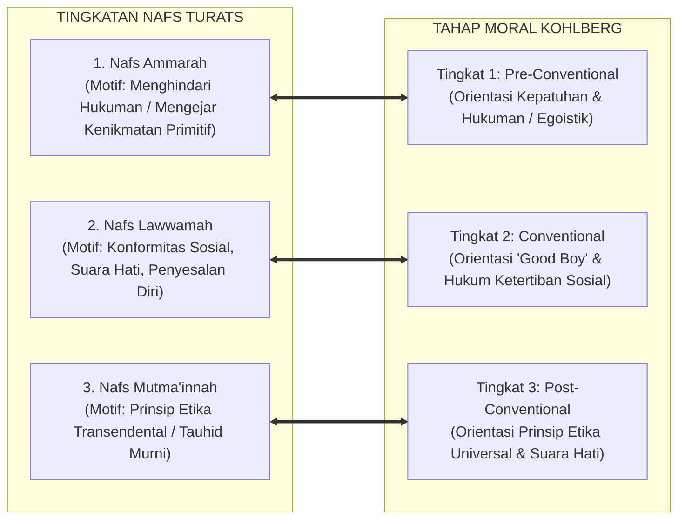

# SUB-BAB 2.3: TINGKATAN NAFS: DARI AMMARAH MENUJU MUTMA'INNAH
## *Tahapan Gradasi Moral Santri, Dinamika Muhasabah Diri, dan Komparasi Tahap Perkembangan Ego-Moral Kontemporer*

**Kode Klasifikasi**: `BOOK-01/BAB-02/SUB-03/MONOGRAF`  
**Disiplin Ilmu**: Psikologi Perkembangan Islam (*Tazkiyatun Nafs*), Tasawuf 'Amali, & Teori Perkembangan Moral  
**Dewan Pakar**: `pakar-filosofi-tumbuh`, `pakar-epistemologi-turats`, `pakar-desain-kurikulum-adab`

---

### 1. Hierarki Tiga Tingkat Nafs dalam Al-Qur'an

Pertumbuhan karakter santri di pesantren bukanlah fenomena biner yang terjadi dalam semalam (dari "anak nakal" tiba-tiba menjadi "wali"). Al-Qur'an dan khazanah tasawuf klasik memandang pembentukan adab sebagai perjalanan spiritual-psikologis dinamis (*as-Sayr wa as-Suluk*) yang melintasi gradasi kualitas jiwa (*Thabaqat an-Nafs*):

```mermaid
graph TD
    subgraph TingkatanNafs["GRADASI DINAMIS NAFS DALAM AL-QUR'AN"]
        Ammarah["1. NAFS AMMARAH BI AS-SU' (QS. Yusuf: 53)<br/>• Karakteristik: Tunduk total pada nafsu biologis, impulsif, mementingkan diri sendiri.<br/>• Respon Aturan: Melanggar saat bebas dari pengawasan, tidak merasa bersalah."]
        
        Lawwamah["2. NAFS LAWWAMAH (QS. Al-Qiyamah: 2)<br/>• Karakteristik: Mulai bangkit suara hati nurani (*Muhasabah*), mengalami pergulatan batin.<br/>• Respon Aturan: Kadang tergelincir, namun segera menyesal dan ingin memperbaiki diri."]
        
        Mutmainnah["3. NAFS MUTMA'INNAH (QS. Al-Fajr: 27-28)<br/>• Karakteristik: Jiwa yang tenang, istiqamah, merasakan manisnya iman (*Halawatul Iman*).<br/>• Respon Aturan: Ketaatan adab menjadi refleks otomatis yang dicintai (*Muraqabah*)."]
        
        Ammarah -->|Etape 1: Ta'aruf & Adaptasi (T1)| Lawwamah
        Lawwamah -->|Etape 2: Habituasi & Internalisasi (T2-T3)| Mutmainnah
    end
```

---

### 2. Hermeneutika Turats: Ibn al-Qayyim tentang Pergulatan Nafs

Al-Imam Ibn al-Qayyim al-Jawziyyah (w. 751 H) dalam kitab monumental *Madarij as-Salikin bayna Manazil Iyyaka Na'budu wa Iyyaka Nasta'in* (Jilid I, hlm. 308) menguraikan bahwa hakikatnya jiwa manusia itu satu, namun ia menyandang tiga sifat yang silih berganti sesuai dominasi keadaan ruhaninya:

> $$\text{النَّفْسُ وَاحِدَةٌ، وَلَهَا صِفَاتٌ ثَلَاثَةٌ؛ فَتُسَمَّى أَمَّارَةً بِالسُّوءِ إِذَا غَلَبَتْ عَلَيْهَا الشَّهْوَةُ وَالْهَوَى، وَأَطَاعَتِ الشَّيْطَانَ. فَإِذَا اسْتَيْقَظَتْ مِنْ غَفْلَتِهَا وَلَامَتْ صَاحِبَهَا عَلَى التَّفْرِيطِ، وَتَرَدَّدَتْ بَيْنَ الطَّاعَةِ وَالْمَعْصِيَةِ، سُمِّيَتْ لَوَّامَةً. فَإِذَا رَضِيَتْ بِاللَّهِ رَبًّا، وَاطْمَأَنَّتْ إِلَى ذِكْرِهِ وَمَحَبَّتِهِ، وَصَارَتِ الطَّاعَةُ لَهَا غِذَاءً وَقُرَّةَ عَيْنٍ، سُمِّيَتْ مُطْمَئِنَّةً}$$
> 
> *"Jiwa manusia itu pada hakikatnya satu, namun ia memiliki tiga sifat yang silih berganti: ia dinamakan **Ammarah bi as-Su'** tatkala syahwat dan hawa nafsu menguasainya serta ia tunduk pada bisikan setan. Tatkala jiwa itu terbangun dari kelalaiannya, lalu mencela dirinya sendiri atas kelalaiannya dalam berbuat taat, serta terombang-ambing di antara ketaatan dan maksiat, maka ia dinamakan **Lawwamah**. Dan tatkala ia telah ridha kepada Allah sebagai Rabbnya, tenang tenteram dalam mengingat dan mencintai-Nya, serta ketaatan telah menjadi santapan ruh dan penyejuk matanya, maka ia dinamakan **Mutma'innah**."* (Ibn al-Qayyim, *Madarij as-Salikin*, I: 308).

Uraian Ibn al-Qayyim memberikan panduan diagnostik yang sangat jernih bagi para musyrif: **kesalahan yang dilakukan santri bukanlah bukti kegagalan permanen**, melainkan tanda bahwa santri sedang berada dalam kancah perjuangan di level *Nafs Lawwamah*.

---

### 3. Komparasi Teori Perkembangan Moral: Kohlberg, Loevinger, & Turats

Gradasi *Nafs* dalam Islam memiliki kesejajaran epistemologis yang menakjubkan dengan teori perkembangan moral dan ego modern:



Kohlberg (1984) membuktikan bahwa perkembangan moral seseorang bergerak dari orientasi egosentris primitif (*Pre-conventional*) menuju kesadaran sosial (*Conventional*) hingga kematangan prinsip universal (*Post-conventional*). 

Namun, peradaban Islam melangkah jauh melampaui Kohlberg: Islam tidak hanya menyandarkan kematangan moral pada prinsip rasional universal abstrak, melainkan menautkannya dengan **penyucian batin (*Tazkiyah*) dan hubungan cinta hamba dengan Sang Pencipta (*Ma'rifatullah*)** yang melahirkan ketenangan sejati (*Nafs Mutma'innah*).

---

### 4. Pendekatan Diferensial Musyrif Berdasarkan Tingkat Nafs Santri

Ekosistem TUMBUH melarang penggunaan satu metode seragam (*one-size-fits-all approach*) untuk seluruh santri. Musyrif dilatih untuk melakukan asesmen diagnostik terhadap maqam nafs santri:

| Tingkatan Nafs Santri | Gejala Perilaku Faktual di Asrama | Strategi Pendampingan Musyrif (*Intervention Protocol*) | Target Capaian Adab |
| :--- | :--- | :--- | :--- |
| **Nafs Ammarah (Fase Awal / T1)** | Sering terlambat bangun, menyembunyikan makanan di lemari, impulsif membantah saat ditegur. | **Struktur & Batasan Pasti (*Firm Scaffolding*)**: Penjelasan aturan eksplisit, penataan rutinitas visual, pendampingan melekat tanpa bentakan. | Menumbuhkan rasa aman dan ketaatan dasar terhadap ritme pondok. |
| **Nafs Lawwamah (Fase Transisi / T2–T3)** | Mengetahui aturan dengan baik, namun sesekali tergelincir karena pengaruh teman sekamar; merasa bersalah setelahnya. | **Percakapan Restoratif (*Restorative Inquiry*)**: Mengajak santri merefleksikan dampak kesalahannya, memvalidasi penyesalan batin, menyepakati restitusi logis. | Menguatkan *Inhibitory Control* dan kesadaran muhasabah mandiri. |
| **Nafs Mutma'innah (Fase Matang / T4)** | Mandiri dalam ibadah, menjadi inisiator kebersihan kamar, merawat adik kelas dengan penuh kasih sayang. | **Pemberdayaan Kepemimpinan (*Empowerment*)**: Diberikan amanah sebagai *Peer Mentor*, asisten musyrif, dan duta perdamaian asrama (**Tahap 7 Penggerak**). | Mentransformasi kesalehan individual menjadi kemaslahatan umat (*Nafi'un Lighairihi*). |

---

### 5. Sintesis Operasional: Dari Penghakiman Menuju Pendampingan Spiritual

Dengan memahami gradasi tingkatan nafs ini, musyrif tidak lagi memandang santri yang melanggar sebagai "musuh yang harus dihancurkan", melainkan sebagai **jiwa pembelajar yang sedang berjuang menapaki tangga kemuliaan**. Tugas musyrif adalah memegang tangan santri tersebut dengan penuh kelembutan yang tegas, menuntunnya keluar dari kegelapan *Ammarah*, menemaninya melintasi pergulatan *Lawwamah*, hingga ia berlabuh dengan selamat di samudera ketenangan *Mutma'innah*.
