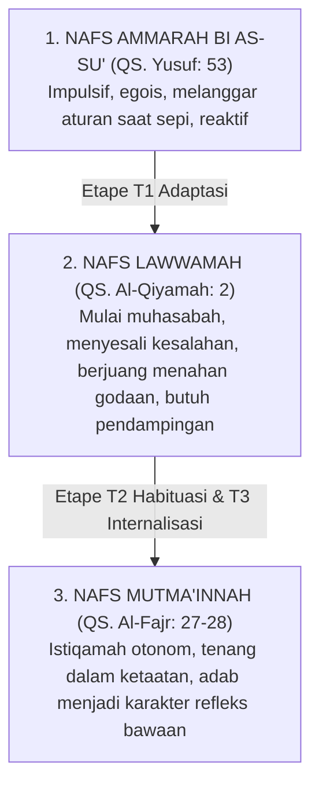

# SUB-BAB 2.3: TINGKATAN NAFS: DARI AMMARAH MENUJU MUTMA'INNAH
## *Tahapan Gradasi Moral Santri dari Dorongan Impulsif Menuju Ketenangan Ruhani Istiqamah*

**Kode Modul**: `BOOK-01/BAB-02/SUB-03`  
**Kategori**: Trajektori Psiko-Spiritual  
**Fokus Keilmuan**: Tazkiyatun Nafs & Tahapan Perkembangan Karakter

---

### 1. Tiga Maqam Jiwa dalam Al-Qur'an
Perkembangan kepribadian santri selama di pesantren adalah proses *Tazkiyatun Nafs* (penyucian jiwa) yang bertahap melintasi tiga etape:

---

### 2. Membaca Kesalahan Santri dengan Kacamata Tingkatan Nafs
* **Kesalahan di Tahap Nafs Ammarah**: Santri baru melanggar aturan karena belum memahami norma atau terbawa kebiasaan rumah yang bebas. Respon musyrif: mengajarkan aturan secara eksplisit (*direct teaching*) dan mendampingi secara konsisten tanpa mencela.
* **Fase Transisi Nafs Lawwamah**: Santri tahu aturan tetapi sesekali tergelincir karena pengaruh teman sebaya. Respon musyrif: memfasilitasi muhasabah pribadi (*restorative reflection*) agar rasa penyesalannya berbuah perbaikan konkret, bukan rasa malu yang merusak.
* **Pencapaian Nafs Mutma'innah**: Santri telah matang adabnya dan siap diangkat menjadi **Tahap 7 PENGGERAK** (mentor adik kelas).
