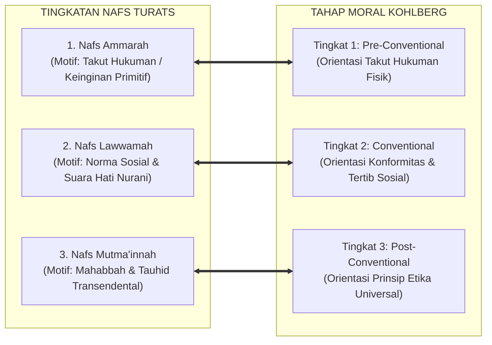

# SUB-BAB 2.3: TINGKATAN NAFS: DARI AMMARAH MENUJU MUTMA'INNAH
## *Tahapan Gradasi Moral Santri, Dinamika Muhasabah Diri, dan Komparasi Tahap Perkembangan Ego-Moral Kontemporer*

**Kode Klasifikasi**: `BOOK-01/BAB-02/SUB-03/MONOGRAF-MASTER-VIBRANT`  
**Disiplin Ilmu**: Psikologi Perkembangan Islam (*Tazkiyatun Nafs*), Tasawuf 'Amali, Teori Perkembangan Moral, & Epistemologi Turats  
**Penanggung Jawab Keilmuan**: Dewan Pakar Ekosistem TUMBUH (*Master Author, Pakar Filosofi TUMBUH, & Pakar Desain Kurikulum Adab*)

---

### Memahami Tangga Pendakian Karakter Santri

Banyak pembina asrama sering kali kecewa dan putus asa Ketika melihat santri baru yang kemarin tampak bertobat, hari ini kembali mengulangi kesalahannya. 

Muncul prasangka keliru: *"Anak ini memang tidak berniat berubah!", "Percuma dinasihati!"*

Padahal, pertumbuhan karakter seorang anak manusia bukanlah peristiwa sulap yang terjadi dalam semalam. Jiwa manusia tidak berubah secara biner (dari "santri jahat" langsung menjadi "wali suci"). Al-Qur'an dan khazanah Islam memandang pembentukan akhlak sebagai sebuah **perjalanan pendakian spiritual (*As-Sayr was-Suluk*)** yang melintasi tiga etape kualitas jiwa:

```mermaid
graph TD
    subgraph TingkatanNafs["GRADASI DINAMIS NAFS DALAM AL-QUR'AN"]
        Ammarah["1. NAFS AMMARAH BI AS-SU' (QS. Yusuf: 53)<br/>• Tunduk pada dorongan nafsu impulsif & mementingkan diri sendiri.<br/>• Melanggar aturan saat tidak diawasi, belum peka rasa bersalah."]
        
        Lawwamah["2. NAFS LAWWAMAH (QS. Al-Qiyamah: 2)<br/>• Mulai bangkit suara hati nurani (*Muhasabah*) & pergulatan batin.<br/>• Kadang tergelincir, namun segera menyesal dan ingin memperbaiki diri."]
        
        Mutmainnah["3. NAFS MUTMA'INNAH (QS. Al-Fajr: 27-28)<br/>• Jiwa yang tenang, istiqamah, merasakan manisnya iman (*Halawatul Iman*).<br/>• Ketaatan adab menjadi refleks otomatis yang dicintai (*Muraqabah*)."]
        
        Ammarah -->|Etape 1: Ta'aruf & Adaptasi (T1)| Lawwamah
        Lawwamah -->|Etape 2: Habituasi & Internalisasi (T2-T3)| Mutmainnah
    end
```
<div align="center"><sub><b>Gambar 2.3.1:</b> Tiga Tingkatan Nafs dalam Al-Qur'an dan Tangga Metamorfosis Karakter Santri.</sub></div>

Peta tingkatan jiwa di atas mengajarkan kesabaran pedagogis: kekhilafan seorang santri bukanlah bukti kegagalan permanen, melainkan tanda bahwa ia sedang berjuang di tengah kancah pendakian jiwa.

---

### Tiga Tingkatan Nafs dalam Khazanah Islam

Al-Qur'an menguraikan tiga kualitas jiwa manusia:

1. **Nafs Ammarah bi as-Su' (النَّفْس الأمَّارَة بالسُّوء)**:  
   Jiwa yang masih dikuasai dorongan biologis dan hawa nafsu primitif (QS. Yusuf: 53). Santri pada level ini bertindak impulsif, mementingkan diri sendiri (misal: menyerobot antrean makanan), dan hanya patuh jika ada pengawasan fisik ketat.
2. **Nafs Lawwamah (النَّفْس اللَّوَّامَة)**:  
   Jiwa yang telah terbangun suara hatinya (*Muhasabah*) dan mencela dirinya sendiri Ketika berbuat salah (QS. Al-Qiyamah: 2). Santri di level ini mengalami pergulatan batin: ia tahu mana yang benar dan salah, kadang masih tergelincir karena godaan kawan, namun segera merasa menyesal dan ingin berbenah.
3. **Nafs Mutma'innah (النَّفْس المُطْمَئِنَّة)**:  
   Puncak kematangan jiwa yang telah tenteram dan damai bersama Allah (QS. Al-Fajr: 27–28). Santri di level ini berakhlak mulia secara mandiri, merasakan kenikmatan dalam ibadah, dan tulus melayani sesamanya.

---

### Mutiara Turats: Penjelasan Ibn al-Qayyim tentang Pergulatan Jiwa

Pakar jiwa Islam agung, **Imam Ibn al-Qayyim al-Jawziyyah** dalam *Madarij as-Salikin*[^1] menuliskan syarah yang amat mencerahkan:

> [!NOTE]
> ### 📜 Syarah Ibn al-Qayyim tentang Tiga Sifat Jiwa yang Silih Berganti:
> 
> $$\text{النَّفْسُ وَاحِدَةٌ، وَلَهَا صِفَاتٌ ثَلَاثَةٌ؛ فَتُسَمَّى أَمَّارَةً بِالسُّوءِ إِذَا غَلَبَتْ عَلَيْهَا الشَّهْوَةُ وَالْهَوَى، وَأَطَاعَتِ الشَّيْطَانَ. فَإِذَا اسْتَيْقَظَتْ مِنْ غَفْلَتِهَا وَلَامَتْ صَاحِبَهَا عَلَى التَّفْرِيطِ، وَتَرَدَّدَتْ بَيْنَ الطَّاعَةِ وَالْمَعْصِيَةِ، سُمِّيَتْ لَوَّامَةً. فَإِذَا رَضِيَتْ بِاللَّهِ رَبًّا، وَاطْمَأَنَّتْ إِلَى ذِكْرِهِ وَمَحَبَّتِهِ، وَصَارَتِ الطَّاعَةُ لَهَا غِذَاءً وَقُرَّةَ عَيْنٍ، سُمِّيَتْ مُطْمَئِنَّةً}$$
> 
> **Artinya:**  
> *"Jiwa manusia itu pada hakikatnya satu, namun ia memiliki tiga sifat yang silih berganti: ia dinamakan **Ammarah** Ketika hawa nafsu menguasainya. Ketika jiwa itu terbangun dari kelalaiannya lalu mencela dirinya sendiri atas kesalahannya, maka ia dinamakan **Lawwamah**. Dan Ketika ia telah tenteram bersama Allah, mencintai ketaatan, serta ibadah telah menjadi santapan ruh dan penyejuk matanya, maka ia dinamakan **Mutma'innah**."*

Uraian ini menyadarkan kita bahwa masa remaja santri adalah kancah pergulatan di level *Nafs Lawwamah*. Tugas pembina adalah menemani pergulatan tersebut dengan penuh kasih sayang, bukan memvonis dan mencampakkannya.

---

### Komparasi Sains: Tahap Perkembangan Moral Kohlberg vs Islam

Teori psikologi perkembangan moral barat oleh **Lawrence Kohlberg**[^2] menemukan keselarasan yang luar biasa dengan konsep *Nafs* Islam:


<div align="center"><sub><b>Gambar 2.3.2:</b> Komparasi Tingkatan Nafs dalam Turats dengan Tahap Perkembangan Moral Kohlberg.</sub></div>

Kohlberg membuktikan bahwa anak bergerak dari kepatuhan takut dihukum (*Pre-conventional*), menuju kepatuhan menjaga hubungan sosial (*Conventional*), hingga kesadaran prinsip etika mandiri (*Post-conventional*). 

Islam menyempurnakan teori Kohlberg: kematangan moral tertinggi tidak berhenti pada teori etika abstrak, melainkan bermuara pada **penyucian batin (*Tazkiyatun Nafs*) dan cinta tulus kepada Allah SWT** yang melahirkan kedamaian jiwa sejati (*Nafs Mutma'innah*).

---

### Solusi Sistemik TUMBUH: Pendekatan Berbasis Maqam Jiwa Santri

Ekosistem **TUMBUH** melarang pendekatan seragam yang memukul rata seluruh santri. Musyrif dibekali panduan pendampingan sesuai maqam jiwa santri:

| Tingkat Nafs Santri | Karakteristik Perilaku di Asrama | Strategi Pendampingan Sistem TUMBUH | Target Jenjang Kemandirian TUMBUH (J1–J4) |
| :--- | :--- | :--- | :---: |
| **1. Nafs Ammarah** | Sering lupa aturan, terburu-buru, impulsif membantah saat ditegur. | **Pendampingan Melekat (*Firm Scaffolding*)**: Jadwal harian yang terstruktur rapi, bimbingan langsung musyrif tanpa bentakan. | **Jenjang J1**<br/>(Tahu & Paham Adab) |
| **2. Nafs Lawwamah** | Sudah paham aturan, kadang khilaf ikut kawan sekamar, namun merasa menyesal. | **Dialog Restoratif (*Restorative Inquiry*)**: Membimbing muhasabah batin, menyepakati ganti rugi/restitusi logis 4R. | **Jenjang J2 & T3**<br/>(Mau & Mampu Beradab) |
| **3. Nafs Mutma'innah** | Mandiri dalam ibadah, pelopor kebersihan kamar, menyayangi adik kelas. | **Pemberdayaan Teladan (*Peer Mentorship*)**: Diberikan amanah sebagai Kakak Asuh dan duta teladan asrama. | **Jenjang J4**<br/>(**Tahap 7 Penggerak**) |

---

## 📌 Catatan Kaki & Rujukan Primer

[^1]: **Al-Imam Ibn al-Qayyim al-Jawziyyah**, *Madarij as-Salikin bayna Manazil Iyyaka Na'budu wa Iyyaka Nasta'in*, Tahqiq: Muhammad al-Mu'tashim Billah al-Baghdadi (Beirut: Dar al-Kitab al-Arabi, 1416 H), Jilid I, hlm. 308–312.
[^2]: **Lawrence Kohlberg**, *The Psychology of Moral Development: The Nature and Validity of Moral Stages* (San Francisco: Harper & Row, 1984), Bab 3: "Synopses of Moral Stages", hlm. 170–211.
