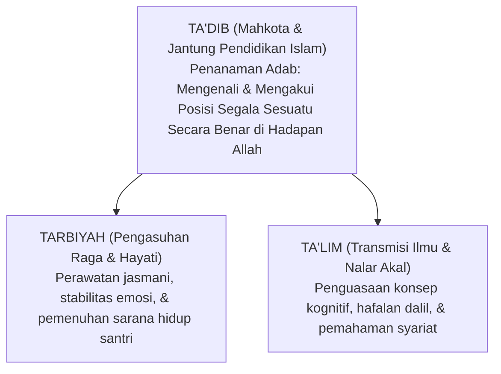
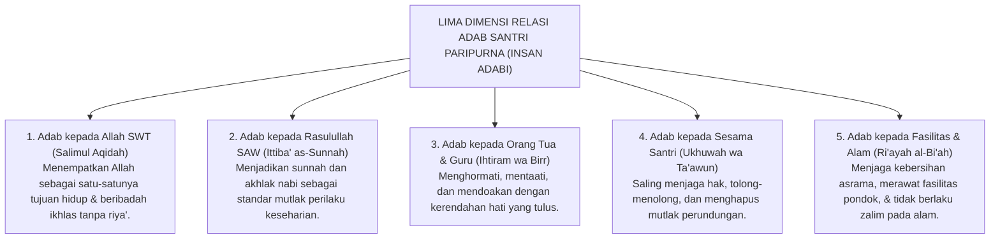

# SUB-BAB 2.4: REKONSTRUKSI TA'DIB, TARBIYAH, & TA'LIM
## *Sintesis Filosofis Gagasan Syed Muhammad Naquib Al-Attas, Imam Al-Ghazali, dan Abdurrahman an-Nahlawi*

**Kode Klasifikasi**: `BOOK-01/BAB-02/SUB-04/MONOGRAF-MASTER-VIBRANT`  
**Disiplin Ilmu**: Epistemologi Pendidikan Islam, Filsafat Bahasa Arab Terapan, & Rekayasa Kurikulum Pesantren  
**Penanggung Jawab Keilmuan**: Dewan Pakar Ekosistem TUMBUH (*Master Author, Pakar Filosofi TUMBUH, & Pakar Desain Kurikulum Adab*)

---

### Kerancuan Istilah yang Berujung pada Kelumpuhan Karakter

Banyak kegagalan kurikulum pendidikan di pesantren berakar dari satu hal mendasar: **kerancuan dalam memahami istilah (*The Confusion of Concepts*)**[^1].

Selama puluhan tahun, kata *Tarbiyah*, *Ta'lim*, dan *Ta'dib* sering kali diucapkan secara campur aduk seolah-olah ketiganya bermakna sama persis. Akibatnya sangat fatal: ketika sebuah lembaga mengklaim sedang menyelenggarakan "pendidikan Islam", yang sebenarnya mereka lakukan hanyalah *Ta'lim* (mengisi kepala anak dengan hafalan teks) dan *Tarbiyah* (membangun gedung asrama dan memberi makan fisik anak), sementara proses inti yang bernama **Ta'dib (penanaman adab ke dalam jiwa)** justru terabaikan.

<b>Gambar 2.4.1:</b> Struktur Hirarki Integratif Trilogi Pendidikan Islam: Ta'dib sebagai Mahkota, Ditopang oleh Tarbiyah dan Ta'lim.

Bagan di atas merumuskan tata letak ontologis yang benar: **Ta'dib adalah mahkota dan tujuan tertinggi seluruh pendidikan Islam**, sedangkan Tarbiyah dan Ta'lim adalah sayap penopang yang mengantarkan jiwa santri mencapai kemuliaan adab.

---

### Bedah Semantik & Filosofis Tiga Istilah Kunci

Mari kita telusuri akar bahasa dan makna filosofis dari ketiga pilar ini:

1. **Ta'lim (تَعْلِيم)**:  
   Berakar dari kata *'allama-yu'allimu* (mengajarkan ilmu). Fokusnya adalah pengasahan daya nalar (*al-Aql*). Ta'lim membekali santri dengan fakta, dalil Al-Qur'an, hadits, dan kaidah fiqih. Tanpa Ta'lim, santri akan hidup dalam kebodohan (*jahl*). Namun jika hanya berhenti pada Ta'lim, ilmu tersebut hanya menjadi beban hafalan di kepala tanpa pernah berbuah akhlak.
2. **Tarbiyah (تَرْبِيَة)**:  
   Berakar dari kata *rabaa-yarbuu* (menumbuhkan, merawat, dan memelihara). Istilah ini mencakup perawatan kebutuhan raga (*al-Jasad*) dan emosi anak: asrama yang nyaman, nutrisi bergizi, sarana olahraga, dan waktu istirahat yang cukup. Tarbiyah memastikan wadah jasmani santri sehat dan siap memikul amanah ilmu.
3. **Ta'dib (تَأْدِيب)**:  
   Berakar dari kata *aduba-ya'dubu* yang bermakna disiplin spiritual, kehalusan budi pekerti, dan penempatan segala sesuatu secara adil (*'Adl*). Pakar filsafat Islam **Prof. Dr. Syed Muhammad Naquib al-Attas** menegaskan bahwa Rasulullah SAW bersabda:
   $$\text{أَدَّبَنِي رَبِّي فَأَحْسَنَ تَأْدِيبِي}$$
   *"Tuhanku telah mendidik adabku (Ta'dib), maka Dia menjadikan adabku sebaik-baik adab."* (Al-Attas, 1980)[^1].  
   Ta'dib adalah proses memasukkan adab ke dalam kalbu agar santri mengenali dan menaati hak Allah, hak Rasul, hak guru, hak sesama saudaranya, dan hak alam sekitarnya.

---

### Definisi Operasional Adab dalam Sistem TUMBUH

Dalam Ekosistem **TUMBUH**, adab bukanlah sekadar sopan santun lahiriah atau etiket basa-basi, melainkan:

$$\text{Adab} = \text{Disiplin Ruhani, Aqli, dan Jasadi untuk Menempatkan Segala Sesuatu pada Posisi yang Hak di Hadapan Allah dan Makhluk}$$

Santri yang beradab (*Insan Adabi*) dalam Sistem TUMBUH menampilkan lima wujud karakter nyata:

<b>Gambar 2.4.2:</b> Lima Dimensi Relasi Adab Santri Paripurna dalam Ekosistem TUMBUH.

---

### Integrasi Kurikulum 24-Jam: Dari Ruang Madrasah ke Bilik Asrama

Bagaimana Sistem TUMBUH mengintegrasikan Ta'lim, Tarbiyah, dan Ta'dib dalam keseharian santri?

| Ranah Pendidikan | Lokasi Ekologis | Waktu Pelaksanaan | Praktik Integratif Sistem TUMBUH |
| :--- | :--- | :--- | :--- |
| **Ta'lim (Akal)** | Ruang Madrasah & Kelas Kitab | Pagi (07.00–15.00 WIB) | Membedah makna teks syariat melalui metode *Case-Based Learning*, simulasi dilema adab, dan diskusi kritis. |
| **Tarbiyah (Raga)** | Ruang Makan, Lapangan, Asrama | Sore & Malam (15.00–21.00 WIB) | Penyediaan nutrisi thayyib, olahraga sunnah memanah/futsal, dan jaminan istirahat tidur malam yang manusiawi. |
| **Ta'dib (Kalbu)** | Masjid, Bilik Kamar, & Area Publik | 24 Jam Penuh | Pendampingan melekat musyrif, muhasabah niat (*Tazkiyatun Niyyah*), habituasi adab 66 hari, dan keteladanan *Qudwah*. |

---

## 📌 Catatan Kaki & Rujukan Primer

[^1]: **Prof. Dr. Syed Muhammad Naquib al-Attas**, *The Concept of Education in Islam: A Framework for an Islamic Philosophy of Education* (Kuala Lumpur: International Institute of Islamic Thought and Civilization / ISTAC, 1980), hlm. 15–35.
[^2]: **Dr. Abdurrahman an-Nahlawi**, *Ushulut Tarbiyah al-Islamiyyah wa Asalibuha fil Bayti wal Madrasati wal Mujtama'* (Damaskus: Dar al-Fikr, 1983), hlm. 20–42.
