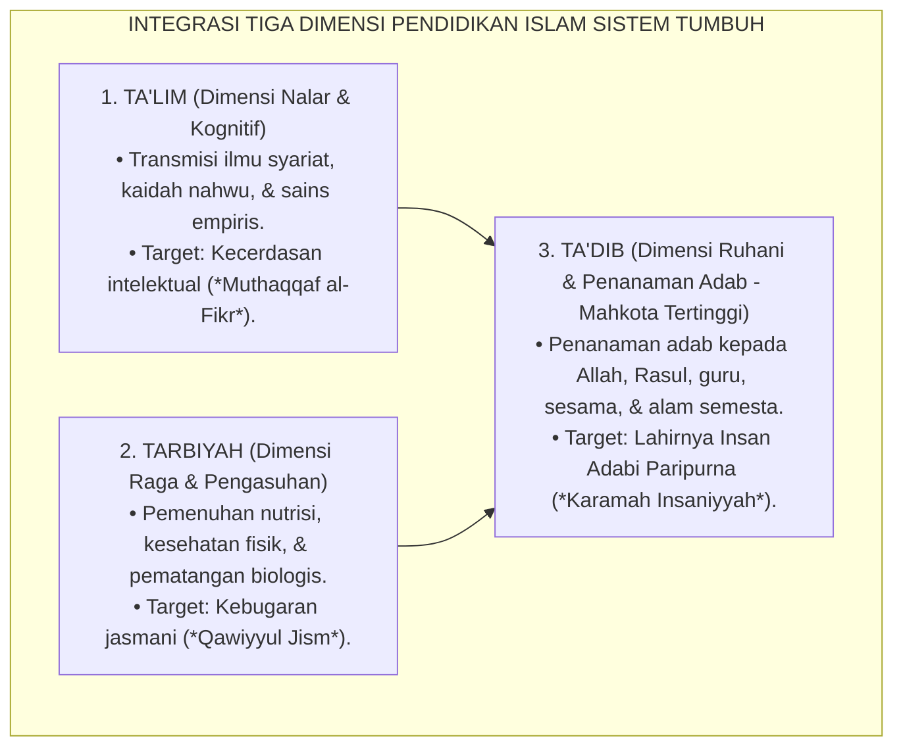
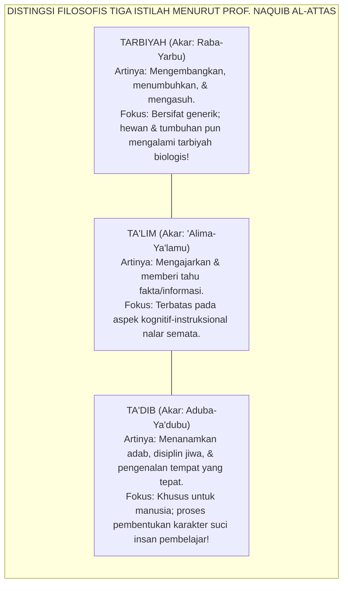
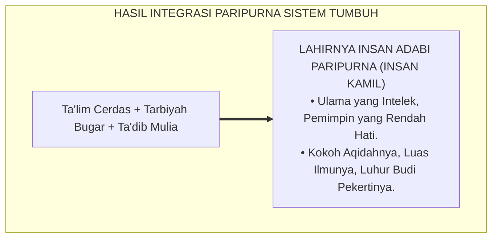

# SUB-BAB 2.4: REKONSTRUKSI TA'DIB, TARBIYAH, & TA'LIM
## *Analisis Semantik Prof. Dr. Syed Muhammad Naquib al-Attas, Integrasi Tiga Dimensi Pendidikan Islam, dan Penanaman Adab Paripurna*

**Kode Klasifikasi**: `BOOK-01/BAB-02/SUB-04/MONOGRAF-MASTER-VIBRANT`  
**Disiplin Ilmu**: Filsafat Bahasa Pendidikan Islam, Epistemologi Tarbiyah, & Teori Kurikulum Adab  
**Penanggung Jawab Keilmuan**: Dewan Pakar Ekosistem TUMBUH (*Master Author, Pakar Epistemologi Turats, & Pakar Desain Kurikulum Adab*)

---

### Mencari Ruh yang Hilang dalam Pendidikan Islam

Dalam khazanah bahasa Arab dan literatur Islam klasik, kita mengenal tiga istilah utama yang kerap digunakan silih berganti untuk menerjemahkan kata "pendidikan": **Ta'lim**, **Tarbiyah**, dan **Ta'dib**[^1].

Namun, di era modern saat ini, sebagian besar institusi pendidikan—termasuk kementerian, madrasah, dan banyak pesantren—secara luas mengadopsi istilah *Tarbiyah* atau *Ta'lim*, sementara istilah *Ta'dib* perlahan-lahan terpinggirkan dari wacana arus utama.

Apakah pergeseran istilah ini hanya sekadar masalah preferensi linguistik yang sepele? **Sama sekali tidak!**

Pakar filsafat pendidikan Islam terkemuka dunia, **Prof. Dr. Syed Muhammad Naquib al-Attas**[^1], membongkar bahwa reduksi istilah pendidikan menjadi sekadar *Ta'lim* atau *Tarbiyah* tanpa *Ta'dib* adalah salah satu akar penyebab terjadinya **Krisis Kehancuran Adab (*The Loss of Adab*)** di dunia Islam modern:
* Pendidikan tereduksi menjadi sekadar pabrik transfer informasi hafalan (*Ta'lim semata*), atau sekadar proses penggemukan raga dan pengasuhan fisik biologis layaknya merawat hewan ternak (*Tarbiyah tanpa Ta'dib*).
* Santri menjadi pintar secara nalar hafalan kitab, namun kehilangan kehalusan budi pekerti, sombong kepada gurunya, dan kasar kepada sesamanya.

Sistem **TUMBUH** merekonstruksi dan mengintegrasikan ketiga dimensi ini secara proporsional, dengan menempatkan **Ta'dib sebagai Mahkota Tertinggi Pendidikan Pesantren**:

<b>Gambar 2.4.1:</b> Integrasi Tiga Dimensi Ta'lim, Tarbiyah, dan Ta'dib dalam Ekosistem TUMBUH.

---

### Analisis Semantik Al-Attas: Mengapa Ta'dib adalah Hakikat Pendidikan Islam?

Prof. Naquib al-Attas dalam karya monumentalnya *The Concept of Education in Islam*[^1] membedah akar kata ketiga istilah ini secara etimologis dan filosofis yang sangat mendalam:

<b>Gambar 2.4.2:</b> Distingsi Filosofis dan Semantik Istilah Tarbiyah, Ta'lim, dan Ta'dib Menurut Prof. Naquib al-Attas.

Rasulullah SAW secara eksplisit menggunakan kata *Adab* dan *Ta'dib* untuk menggambarkan bagaimana Allah SWT mendidik pribadi agung beliau:

$$\text{أَدَّبَنِي رَبِّي فَأَحْسَنَ تَأْدِيبِي}$$
*"Tuhanku telah mendidik adabku (*Addabani Rabbi*), maka Dia menjadikan pendidikanku sebagai pendidikan adab yang paling sempurna dan paling indah (*fa ahsana ta'dibi*)."* (HR. As-Sam'ani dan Ibnu Hibban).

Al-Attas mendefinisikan **Adab** sebagai:
> *"Pengenalan dan pengakuan tentang hakikat bahwa ilmu dan segala wujud di alam semesta ini memiliki hierarki dan kedudukan yang tepat sesuai ketentuan Allah SWT; dan kesediaan jiwa manusia untuk menempatkan dirinya secara adil dan terhormat pada posisinya yang benar di hadapan Khalik dan sesama makhluk."*

---

### Integrasi Praktis Tiga Pilar dalam Keseharian Santri dalam sistem TUMBUH

Bagaimana Sistem TUMBUH mengoperasionalkan integrasi *Ta'lim*, *Tarbiyah*, dan *Ta'dib* ke dalam kurikulum asrama 24 jam?

| Dimensi | Wadah Pembinaan di Pesantren | Penanggung Jawab | Manifestasi Perilaku Nyata Santri |
| :--- | :--- | :--- | :--- |
| **Ta'lim (Nalar)** | Ruang kelas madrasah, kajian kitab sorogan, dan halaqah tahfizh. | Dewan Guru & Asatidz Madrasah. | Santri menguasai kaidah nahwu, hafal Al-Qur'an mutqin, dan tajam nalar logikanya. |
| **Tarbiyah (Fisik)** | Pos kesehatan, dapur gizi santri, lapangan olahraga, & asrama. | Tim Dapur Gizi, Musyrif, & Poskestren. | Santri memiliki tubuh sehat bugar, cukup tidur 7 jam, dan terjaga higienitasnya. |
| **Ta'dib (Karakter)** | Bilik kamar asrama, antrean wudhu, shalat jamaah, & seluruh interaksi. | Musyrif Asrama, Pengasuh, & Seluruh Ekosistem. | Santri tawadhu', santun bicaranya, jujur, pemaaf, dan berani menegakkan keadilan. |

<b>Gambar 2.4.3:</b> Lahirnya Insan Adabi Paripurna Melalui Integrasi Ta'lim, Tarbiyah, dan Ta'dib.

Pendidikan pesantren tidak boleh pincang. Jika kita hanya menekankan *Ta'lim*, kita akan mencetak generasi yang pintar namun culas. Jika kita hanya menekankan *Tarbiyah*, kita hanya merawat fisik tanpa menyentuh kalbu.

Dengan merekonstruksi dan memahkotai seluruh proses pendidikan dengan **Ta'dib Nabawi**, Sistem TUMBUH memastikan santri bertumbuh menjadi Insan Adabi sejati yang memancarkan keagungan akhlak Rasulullah SAW di setiap langkah kehidupannya.

---

## 📌 Catatan Kaki & Rujukan Primer

[^1]: **Prof. Dr. Syed Muhammad Naquib al-Attas**, *The Concept of Education in Islam: A Framework for an Islamic Philosophy of Education* (Kuala Lumpur: ISTAC, 1980), hlm. 15–38.
[^2]: **Wan Mohd Nor Wan Daud**, *The Educational Philosophy and Practice of Syed Muhammad Naquib al-Attas: An Exposition of the Original Concept of Islamization* (Kuala Lumpur: ISTAC, 1998), Bab 4, hlm. 132–175.
