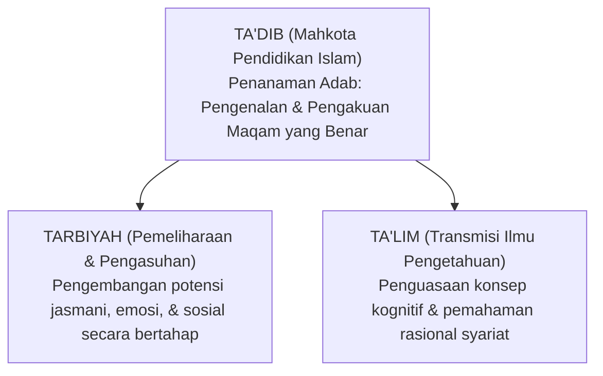

# SUB-BAB 2.4: REKONSTRUKSI TA'DIB, TARBIYAH, & TA'LIM
## *Sintesis Filosofis Gagasan Syed Muhammad Naquib Al-Attas, Imam Al-Ghazali, dan Abdurrahman an-Nahlawi*

**Kode Modul**: `BOOK-01/BAB-02/SUB-04`  
**Kategori**: Epistemologi Pendidikan Islam  
**Fokus Keilmuan**: Filsafat Pendidikan Islam Komparatif

---

### 1. Problematika Terminologis dalam Pendidikan Islam
Banyak kegagalan kurikulum pendidikan Islam berakar dari kerancuan istilah. Sering kali kata *tarbiyah*, *ta'lim*, dan *ta'dib* digunakan secara tumpang tindih tanpa kejelasan hierarki ontologis dan aksiologisnya.

Prof. Syed Muhammad Naquib Al-Attas menegaskan bahwa istilah yang paling tepat dan komprehensif untuk merepresentasikan hakikat pendidikan Islam adalah **Ta'dib**, karena di dalamnya telah mencakup unsur ilmu (*'ilm*), pengajaran (*ta'lim*), dan pengasuhan bertahap (*tarbiyah*), yang seluruhnya bermuara pada penanaman adab.

---

### 2. Definisi Operasional Adab dalam Ekosistem TUMBUH
Adab didefinisikan sebagai:
$$\text{Adab} = \text{Disiplin Ruhani, Aqli, dan Jasadi untuk menempatkan segala sesuatu pada posisi yang adil di hadapan Allah dan Makhluk.}$$

Santri yang beradab adalah santri yang:
1. Menempatkan Allah sebagai satu-satunya sesembahan dan tujuan (*Salimul Aqidah*).
2. Menempatkan Rasulullah SAW sebagai satu-satunya teladan mutlak (*Qudwah*).
3. Menempatkan orang tua dan guru pada posisi penghormatan dan ketaatan yang tulus (*Ihtiram*).
4. Menempatkan sesama santri pada posisi ukhuwah dan tolong-menolong (*Ta'awun*).
5. Menempatkan alam sekitar dan fasilitas pondok pada posisi amanah penjagaan (*Ri'ayah*).
