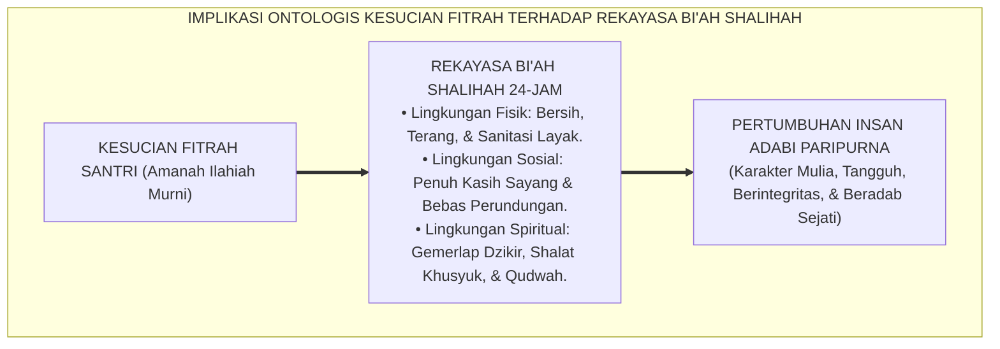
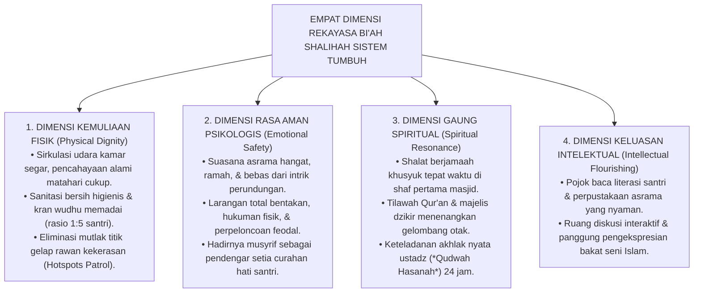

# IMPLIKASI ONTOLOGIS RANCANGAN BI'AH SHALIHAH

---
### Menghidupkan Ekologi yang Menumbuhkan Jiwa

Tatkala kita telah menyepakati bahwa setiap santri lahir membawa kesucian fitrah ketuhanan (*Fitrah al-Munazzalah*), maka konsekuensi ontologis paling mendasar bagi para pengasuh dan pengelola pesantren adalah:

* **Kita tidak bisa mendidik benih fitrah yang suci di dalam lingkungan yang kumuh, gelap, penuh teror, dan tidak manusiawi!**

Ibarat sebuah benih pohon kurma yang unggul: betapa pun hebatnya potensi genetik di dalam benih tersebut, ia hanya akan mampu bertunas, tumbuh kokoh, dan berbuah lebat jika ditanam di atas tanah yang subur, disirami air yang jernih, dan dinaungi sinar matahari yang cukup. Jika benih unggul itu dilempar ke atas tanah tandus yang beracun, benih itu akan membusuk dan mati.

Begitu pula dengan jiwa anak santri. Lingkungan asrama pesantren—atau yang dalam khazanah Islam disebut sebagai **Bi'ah Shalihah (Lingkungan yang Saleh)**[^1]—bukanlah sekadar latar belakang pasif, melainkan **reaktor aktif yang membentuk sirkuit saraf, emosi, dan adab santri selama 24 jam sehari**.

<b>Gambar 2.5.1:</b> Alur Implikasi Ontologis Kesucian Fitrah Menuju Rekayasa Lingkungan Bi'ah Shalihah.

---

### Empat Dimensi Rekayasa Lingkungan Asrama Berbasis Fitrah

Sistem TUMBUH merumuskan **Empat Dimensi Desain Bi'ah Shalihah** yang selaras dengan kemuliaan martabat manusia (*Karamah Insaniyyah*):

<b>Gambar 2.5.2:</b> Empat Dimensi Rekayasa Ekologi Bi'ah Shalihah Ekosistem TUMBUH.

#### 1. Dimensi Kemuliaan Fisik (*Physical Dignity & Safe Environment*)
Sistem TUMBUH memandang kebersihan dan penataan fisik sebagai bagian dari ibadah:
* **Penghapusan Titik Rawan (*Hotspots Elimination*)**: Area-area gelap di belakang asrama, kamar mandi usang, atau gudang tua yang kerap dijadikan tempat pemalakan atau perpeloncoan malam dipasangi lampu penerangan terang dan dijaga oleh patroli musyrif.
* **Standar Higienitas & Sanitasi**: Menjaga kamar mandi selalu harum dan bersih, serta menyediakan air bersih berlimpah agar antrean mandi dan wudhu berlangsung tenang tanpa gesekan emosi.

#### 2. Dimensi Rasa Aman Psikologis (*Emotional Safety & Baituna Jannatuna*)
* **Menjadikan Asrama sebagai Rumah Kedua yang Hangat**: Santri disambut dengan senyuman dan sapaan santun setiap kali pulang dari madrasah (*"Kaifa Halukum ya Bunayya?"*).
* **Mendampingi Santri yang Rentan**: Santri baru yang menangis rindu keluarga (*homesick*) didampingi dengan pelukan hangat dan diajak beraktivitas bersama Kakak Asuh, meredam kecemasan perpisahan (*Separation Anxiety*).

#### 3. Dimensi Gaung Spiritual (*Spiritual Resonance & Muraqabah*)
* **Menciptakan Atmosfer Kesyahduan Ibadah**: Setengah jam sebelum adzan berkumandang, lantunan murottal Al-Qur'an dan dzikir penyejuk jiwa diperdengarkan secara lembut di seluruh lorong pondok, mengondisikan gelombang otak santri memasuki frekuensi alfa yang tenang.
* **Shalat Berjamaah sebagai Puncak Kebersamaan**: Kiai, dewan guru, musyrif, dan santri berdiri sejajar merapatkan shaf shalat, memperkuat ikatan batin ukhuwah islamiyyah.

#### 4. Dimensi Keluasan Intelektual & Kreativitas (*Intellectual Flourishing*)
* **Pojok Literasi Bilik Asrama**: Setiap blok kamar asrama dilengkapi lemari buku mini berisi kitab-kitab adab, kisah teladan sahabat, dan buku sains populer, menumbuhkan kecintaan membaca secara mandiri.

---

### Transformasi Menuju Oase Peradaban Santri

Ketika seluruh elemen fisik, sosial, emosional, dan spiritual ini dirajut dalam satu kesatuan sistemik yang kokoh, pesantren bertransformasi menjadi **Oase Bi'ah Shalihah yang Memuliakan Insan Pembelajar**.

Santri merasa bahagia, aman, dicintai, dan dihargai. Dari lingkungan yang penuh berkah inilah, benih-benih fitrah kesucian santri akan mekar sempurna, melahirkan generasi muttaqin yang kokoh imannya, mulia akhlaknya, dan siap memancarkan cahaya peradaban bagi kejayaan umat dan bangsa.

---

## 📌 Catatan Kaki & Rujukan Primer

[^1]: **K.H. Imam Zarkasyi**, *Pondok Pesantren sebagai Lembaga Pendidikan Karakter dan Pencetak Kader Umat* (Ponorogo: Gontor Press, 1988), hlm. 20–55.
[^2]: **Gary W. Evans**, "The built environment and children's development", *Annual Review of Public Health*, Vol. 27 (2006), hlm. 423–441.

---

### IV. Eksplanasi Filosofis Lanjutan & Hermeneutika Nilai Implikasi Ontologis Rancangan Bi'Ah Shalihah

Penyelidikan mendalam terhadap tema **IMPLIKASI ONTOLOGIS RANCANGAN BI'AH SHALIHAH** menuntut pemahaman integral atas relasi antara *Ontologi Fitrah* dan *Sosiologi Pembelajaran Pesantren*. Ketika seorang santri memasuki ekosistem pendidikan, ia membawa amanah perjanjian primordial (*Mithaq*) yang menuntut ruang tumbuh yang aman dari distorsi psikologis.

1. **Dialektika Keikhlasan (*Shidq an-Niyyah*) vs Formalisme Perilaku**:
   Dalam pandangan *Hujjatul Islam* Al-Imam Al-Ghazali dalam *Ihya 'Ulumiddin*, pembentukan karakter yang sejati bermula dari pembersihan batin (*Thaharatul Batin*). Ketika sebuah institusi mereduksi adab menjadi kepatuhan semu di hadapan figur otoritas, yang sesungguhnya terjadi adalah pelemahan integritas diri (*Nifaq Tarbawi*). Sistem TUMBUH menegaskan bahwa kesalehan sejati harus lahir dari kemerdekaan batin yang disinari oleh cinta kepada Allah (*Mahabbatullah*) dan kesadaran pengawasan-Nya (*Muraqabatullah*).

2. **Dinamika Neuroplastisitas & Internalisasi Nilai Ruhiyyah**:
   Sains kognitif kontemporer membuktikan bahwa pembiasaan nilai yang disertai rasa takut ekstrem mengaktifkan poros *HPA (Hypothalamic-Pituitary-Adrenal)* dan membanjiri otak dengan hormon kortisol. Kondisi ini membekukan kemampuan *Prefrontal Cortex* untuk merefleksikan nilai secara mandiri. Sebaliknya, ketika nilai **IMPLIKASI ONTOLOGIS RANCANGAN BI'AH SHALIHAH** disampaikan dalam suasana pengasuhan yang hangat (*Warm Presence*), otak santri melepaskan *oksitosin* dan *dopamin* yang mempercepat konsolidasi sinaptik dan pembentukan memori jangka panjang (*Long-Term Potentiation*).

3. **Matriks Transformasi Praksis Pembinaan**:

| Dimensi Pengasuhan | Pola Lama (Mekanistis-Punitif) | Pola Rekonstruksi Ekosistem TUMBUH |
| :--- | :--- | :--- |
| **Sumber Motivasi** | Tekanan eksternal dan rasa takut akan sanksi fisik. | Kesadaran fitrah internal dan kerinduan pada rida ilahi. |
| **Relasi Musyrif-Santri** | Pengawasan hierarkis intimidatif (panoptikon). | Keteladanan hidup (*Qudwah Hasanah*) dan pendampingan empatik. |
| **Ketahanan Karakter** | Runtuh ketika pengawasan ditiadakan (liburan/lulus). | Melekat kokoh sebagai kompas moral seumur hidup (*Insan Adabi*). |

---

### V. Refleksi Pedagogis & Rekomendasi Aksi Lembaga

Penerapan prinsip **IMPLIKASI ONTOLOGIS RANCANGAN BI'AH SHALIHAH** di lingkungan pesantren menuntut komitmen kelembagaan yang terstruktur:
* **Audit Budaya Pengasuhan**: Pimpinan pesantren wajib melakukan refleksi berkala atas seluruh interaksi antara asatidz, musyrif, dan santri guna memastikan tidak ada celah bagi masuknya feodalisme atau kekerasan terselubung.
* **Penguatan Kapasitas Pendidik**: Setiap pembina asrama difasilitasi dengan pelatihan literasi psikologi perkembangan dan konseling Islam agar memiliki kematangan emosi dalam menghadapi dinamika santri.
* **Integrasi Ruhiyyah 24 Jam**: Memastikan bahwa setiap detik kehidupan santri di pondok—mulai dari bangun tidur, halaqah Qur'an, mudzakarah ilmu, hingga istirahat malam—selalu dinaungi oleh nilai keikhlasan dan ukhuwah yang tulus.
