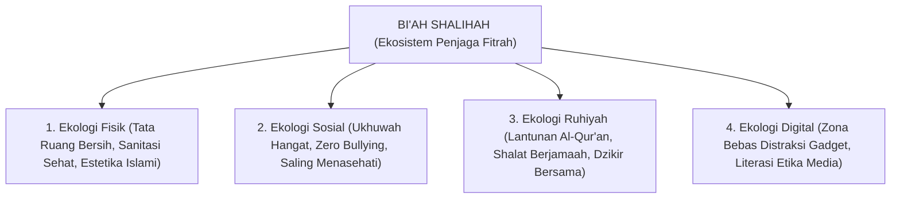

# SUB-BAB 2.5: IMPLIKASI ONTOLOGIS RANCANGAN BI'AH SHALIHAH
## *Menerjemahkan Pandangan Fitrah Menjadi Tata Ruang, Iklim Sosial, dan Ekologi Asrama Pesantren*

**Kode Modul**: `BOOK-01/BAB-02/SUB-05`  
**Kategori**: Desain Ekologi Pesantren  
**Fokus Keilmuan**: Ekologi Pendidikan & Rekayasa Lingkungan Sosial

---

### 1. Prinsip Ekologis: Lingkungan Menentukan Aktualisasi Fitrah
Pandangan ontologis bahwa manusia adalah makhluk berfitrah suci membawa implikasi langsung terhadap perancangan **Bi'ah Shalihah** (lingkungan shalih terpadu). Pesantren bukan sekadar kumpulan gedung asrama dan kelas, melainkan ekosistem terpadu yang memancarkan stimulasi adab 24 jam.

---

### 2. Lima Standar Keunggulan Bi'ah Shalihah TUMBUH
1. **Keamanan Psikologis (*Psychological Safety*)**: Santri tidak merasa terancam saat bertanya, mengemukakan kesulitan, atau mengakui kekeliruan.
2. **Keteraturan Ritme Hidup**: Pergantian waktu belajar, ibadah, makan, olahraga, dan istirahat berjalan tepat waktu tanpa ketergesa-gesaan.
3. **Estetika Kebersihan (*An-Nazhafah*)**: Kamar tidur, lemari, dan sanitasi terpelihara higienis sebagai cerminan kesucian batin.
4. **Keberadaan Teladan Hidup (*Living Models*)**: Musyrif dan dewan guru tinggal berdampingan dan hidup bersama santri dalam satu lingkungan terpadu.
5. **Kekayaan Sumber Belajar**: Perpustakaan terbuka, mushaf, dan sarana pengembangan bakat mudah diakses oleh santri.
