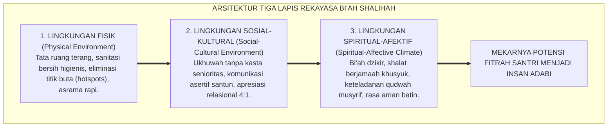
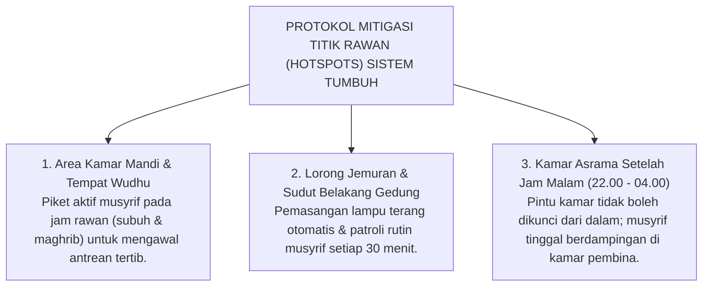

# SUB-BAB 2.5: IMPLIKASI ONTOLOGIS RANCANGAN BI'AH SHALIHAH
## *Rekayasa Ekologi Pesantren sebagai Ekosistem Pendukung Pertumbuhan Fitrah Santri 24-Jam*

**Kode Klasifikasi**: `BOOK-01/BAB-02/SUB-05/MONOGRAF-MASTER-VIBRANT`  
**Disiplin Ilmu**: Ekologi Sosial Pendidikan, Rekayasa Lingkungan Pesantren, Psikologi Lingkungan, & Epistemologi Turats  
**Penanggung Jawab Keilmuan**: Dewan Pakar Ekosistem TUMBUH (*Master Author, Pakar Intervensi Preventif, & Pakar Pengasuhan Asrama*)

---

### Benih Unggul Membutuhkan Tanah yang Subur

Bayangkan sebuah benih kurma ajwa terbaik yang sangat unggul. Jika benih mulia tersebut dilemparkan ke atas batu cadas yang tandus di bawah terik matahari tanpa air, apakah benih tersebut akan mampu bertumbuh menjadi pohon yang rindang dan berbuah lebat? **Tentu tidak.**

Hal yang persis sama berlaku bagi fitrah santri. Betapapun suci dan mulianya fitrah yang dibawa santri sejak lahir, **ia tidak akan pernah mampu mekar jika ditanam di dalam lingkungan asrama yang toksik, kotor, penuh perundungan, dan sarat rasa takut**.

Oleh karena itu, tugas utama pengelola pesantren bukanlah sibuk menghakimi santri yang bermasalah, melainkan **merekayasa tanah lingkungan pesantren (*Bi'ah Shalihah*) agar menjadi ekosistem yang subur, aman, dan menyejukkan bagi mekarnya fitrah anak**.

<b>Gambar 2.5.1:</b> Arsitektur Tiga Lapis Rekayasa Ekologi Bi'ah Shalihah Ekosistem TUMBUH.

---

### Tiga Dimensi Rekayasa Bi'ah Shalihah dalam Sistem TUMBUH

Ekosistem TUMBUH merekayasa lingkungan pesantren melalui tiga lapisan terpadu:

#### Lingkungan Fisik & Sanitasi (*Physical Environment*)
Banyak pelanggaran adab (seperti perkelahian dan saling serobot) bermula dari sarana fisik yang tidak memadai. Teori psikologi lingkungan *Broken Windows Theory*[^1] membuktikan bahwa lingkungan yang kumuh, gelap, dan kotor memicu lonjakan perilaku kriminal dan agresi sosial. 

Sistem TUMBUH mewajibkan:
* Rasio kran wudhu dan kamar mandi yang memadai (minimal 1:5 santri) untuk mencegah perebutan fasilitas.
* Penerangan terang benderang di seluruh lorong jemuran dan sudut asrama untuk menghilangkan titik rawan (*Hotspots Patrol*).
* Standar kebersihan kamar mandi dan loker pakaian sebagai manifestasi nyata keimanan (*An-Nazhafatu minal Iman*).

#### Lingkungan Sosial-Kultural (*Social Climate*)
Membangun budaya pergaulan asrama yang bebas dari perundungan (*zero bullying*):
* Menghapus seluruh tradisi perpeloncoan malam dan sidang kamar senior.
* Membiasakan salam, senyum, dan panggilan kehormatan antar-santri (*Ya Akhi / Ya Ukhti*).
* Menumbuhkan tradisi saling tolong (*Ta'awun*) saat ada kawan sekamar yang sakit atau rindu keluarga (*homesick*).

#### Lingkungan Spiritual-Afektif (*Spiritual Climate*)
Menjadikan seluruh area pondok sebagai medan dzikrullah:
* Menghidupkan lantunan Al-Qur'an dan sholawat yang menyejukkan hati sebelum adzan berkumandang.
* Kehadiran musyrif dewasa yang murah senyum, mengayomi, dan menjadi pendengar setia curahan hati santri (*Co-Regulation Presence*).
* Menciptakan suasana batin yang aman (*Ventral Vagal Safe State*) di mana santri merasa dicintai dan dihargai.

---

### Mitigasi Titik Rawan: Protokol Eliminasi Hotspots Asrama

Riset perilaku membuktikan bahwa 80% kasus pelanggaran adab dan perundungan di asrama terjadi di area yang minim pengawasan (*blind spots / hotspots*)[^2]. Sistem TUMBUH menerapkan **Peta Mitigasi Hotspots**:

<b>Gambar 2.5.2:</b> Protokol Mitigasi Titik Rawan (Hotspots) Asrama Ekosistem TUMBUH.

---

### Solusi Sistemik TUMBUH: Transformasi Asrama Menjadi Rumah Kedua

Melalui rekayasa ekologi Bi'ah Shalihah, Sistem TUMBUH mentransformasikan asrama pesantren dari "barak penampungan yang dingin" menjadi **Baituna Jannatuna (Rumah Keduaku yang Penuh Cinta)**. 

Setiap sudut kamar, serambi masjid, dan pelataran kelas dirancang secara sadar untuk memancarkan aura kasih sayang, keteraturan, dan ketenteraman batin, sehingga seluruh potensi fitrah santri dapat bertumbuh mekar mencapai puncak kemuliaannya.

---

## 📌 Catatan Kaki & Rujukan Primer

[^1]: **James Q. Wilson & George L. Kelling**, "Broken windows: The police and neighborhood safety", *The Atlantic Monthly*, Vol. 249, No. 3 (1982), hlm. 29–38.
[^2]: **George Sugai & Robert H. Horner**, *School-Wide Positive Behavioral Interventions and Supports: Implementers' Blueprint and Self-Assessment* (Eugene: OSEP Center on PBIS, University of Oregon, 2005), hlm. 45–68.
