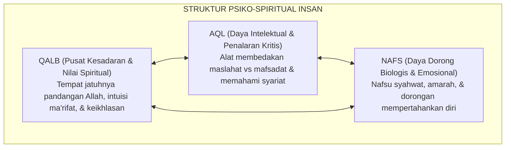

# BAB 2: ONTOLOGI FITRAH & HAKIKAT INSAN PEMBELAJAR DALAM KHAZANAH ISLAM
## *Konsep Fitrah al-Munazzalah, Dinamika Psiko-Spiritual Nafs-Aql-Qalb, dan Rekonstruksi Ta'dib-Tarbiyah-Ta'lim*

**Nomor Identifikasi**: `BOOK-01/BAB-02/ONTOLOGI-FITRAH/2026`  
**Volume**: Buku 01 — *Akar Filosofis & Epistemologi Pendidikan Karakter Pesantren*  
**Dewan Pakar**: `pakar-epistemologi-turats`, `pakar-filosofi-tumbuh`, `pakar-desain-kurikulum-adab`

---

## 📑 DAFTAR ISI SUB-BAB 2

1. [2.1 Konsep Fitrah al-Munazzalah: Hakikat Insan dan Kesucian Primordial](#21-konsep-fitrah-al-munazzalah-hakikat-insan-dan-kesucian-primordial)
2. [2.2 Struktur Psiko-Spiritual Manusia: Dinamika Nafs, Aql, dan Qalb](#22-struktur-psiko-spiritual-manusia-dinamika-nafs-aql-dan-qalb)
3. [2.3 Tingkatan Nafs: Dari Ammarah Menuju Lawwamah dan Mutma'innah](#23-tingkatan-nafs-dari-ammarah-menuju-lawwamah-dan-mutmainnah)
4. [2.4 Rekonstruksi Terminologis: Ta'dib, Tarbiyah, dan Ta'lim (Al-Attas & Al-Ghazali)](#24-rekonstruksi-terminologis-tadib-tarbiyah-dan-talim-al-attas--al-ghazali)
5. [2.5 Implikasi Ontologis bagi Rancangan Bi'ah Shalihah Pesantren](#25-implikasi-ontologis-bagi-rancangan-biah-shalihah-pesantren)

---

## 2.1 Konsep Fitrah al-Munazzalah: Hakikat Insan dan Kesucian Primordial

Pandangan Islam mengenai kodrat manusia bertolak dari konsep **Fitrah** (QS. Ar-Rum: 30). Manusia diciptakan dengan orientasi bawaan (*innate disposition*) yang mencintai kebaikan, mencari kebenaran tauhid, dan memiliki potensi moral ilahiah. Manusia bukan makhluk yang lahir dengan dosa asal (*original sin*), bukan pula lembaran kertas putih kosong yang pasif (*tabula rasa*).

Dalam kerangka TUMBUH, fitrah dipahami sebagai **benih potensi suci (*Fitrah al-Munazzalah*)** yang membutuhkan ekosistem yang kondusif untuk dapat mekar sempurna. Benih kurma unggul tidak akan tumbuh menjadi pohon yang berbuah manis jika ditanam di tanah berbatu yang tercemar racun. Demikian pula fitrah santri: ia membutuhkan *Bi'ah Shalihah* (lingkungan ekologis yang shalih dan sehat) agar potensi adabnya mekar tanpa terdistorsi.

---

## 2.2 Struktur Psiko-Spiritual Manusia: Dinamika Nafs, Aql, dan Qalb

Turats Islam, sebagaimana diuraikan oleh Imam Al-Ghazali dalam *Ihya 'Ulumiddin* dan Ibn al-Qayyim dalam *Ighatsat al-Lahfan*, membagi arsitektur kejiwaan manusia ke dalam tiga daya utama yang saling berinteraksi:

Pendidikan adab bukanlah upaya membunuh daya *nafs* (karena dorongan biologis dan emosi diperlukan untuk kelangsungan hidup), melainkan mendisiplinkan dan menyelaraskan daya *nafs* di bawah komando *aql* yang diterangi oleh cahaya *qalb*.

---

## 2.3 Tingkatan Nafs: Dari Ammarah Menuju Lawwamah dan Mutma'innah

Pertumbuhan santri di pesantren adalah perjalanan dinamis (*suluk*) menaikkan kualitas nafs melintasi tiga etape:

1. **Nafs Ammarah bi as-Su'** (QS. Yusuf: 53): Jiwa yang tunduk pada hawa nafsu primitif, impulsif, mementingkan diri sendiri, dan enggan taat pada aturan.
2. **Nafs Lawwamah** (QS. Al-Qiyamah: 2): Jiwa yang telah memiliki kesadaran moral (*muhasabah*). Ketika ia melakukan kesalahan atau tergelincir melanggar adab, ia merasakan penyesalan batin, mencela perbuatannya, dan berikhtiar memperbaiki diri.
3. **Nafs Mutma'innah** (QS. Al-Fajr: 27–28): Jiwa yang telah mencapai ketenangan, istiqamah dalam kebajikan, dan merasakan kenikmatan dalam ketaatan kepada Allah.

Dalam ekosistem TUMBUH, pelanggaran yang dilakukan santri baru dipahami sebagai ekspresi dari pergulatan nafs ammarah menuju nafs lawwamah. Musyrif bertindak sebagai fasilitator kesadaran muhasabah, bukan algojo penjatuh hukuman.

---

## 2.4 Rekonstruksi Terminologis: Ta'dib, Tarbiyah, dan Ta'lim

Integrasi konsep pendidikan Islam menuntut ketegasan definisi:

| Istilah | Makna Filosofis | Fokus Ranah Pembinaan | Tokoh Rujukan Utama |
| :--- | :--- | :--- | :--- |
| **Ta'lim** | Pengajaran ilmu, transmisi pengetahuan kognitif, dan konsep rasional. | Kognitif (*Aqliyyah*) | Syekh Az-Zarnuji |
| **Tarbiyah** | Pengasuhan, pemeliharaan fisik, emosi, dan perkembangan bertahap. | Fisik & Emosi (*Jasadiyyah & Wijdaniyyah*) | Prof. Abdullah Nasih Ulwan |
| **Ta'dib** | Penanaman adab, disiplin moral, dan penempatan segala sesuatu pada tempatnya yang benar. | Spiritual & Karakter (*Ruhaniyyah & Khuluqiyyah*) | Prof. Syed Muhammad Naquib Al-Attas |

Ekosistem TUMBUH memosisikan **Ta'dib** sebagai mahkota dan payung tertinggi yang menaungi seluruh aktivitas *ta'lim* dan *tarbiyah* di pesantren.

---

## 2.5 Implikasi Ontologis bagi Rancangan Bi'ah Shalihah Pesantren

Pemahaman ontologi fitrah melahirkan imperatif praktis bagi manajemen pesantren:
* Setiap santri harus diperlakukan dengan penghormatan mendalam atas martabat kemanusiaannya (*karamah insaniyyah*).
* Kegagalan santri dalam berdisiplin tidak boleh direspons dengan pelabelan permanen (misal: mencap santri sebagai "anak nakal" atau "sampah pondok"), melainkan ditangani sebagai disfungsi lingkungan atau keterbatasan keterampilan sosial yang harus dipulihkan bersama.
