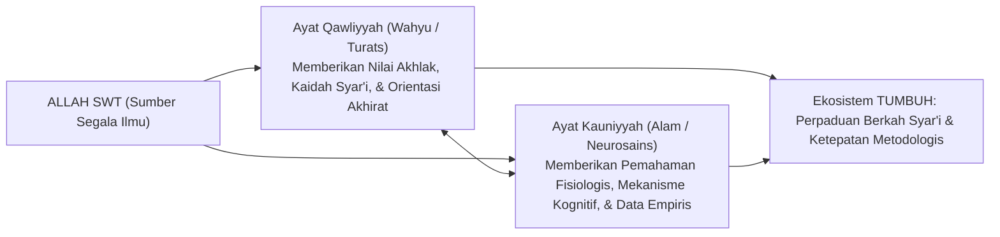

# SUB-BAB 3.1: INTEGRASI AYAT QAWLIYYAH & KAUNIYYAH
## *Menyulam Kebenaran Transendental Wahyu dan Konsensus Empiris Sains Perkembangan*

**Kode Modul**: `BOOK-01/BAB-03/SUB-01`  
**Kategori**: Epistemologi Integratif  
**Fokus Keilmuan**: Filsafat Ilmu Islam & Hermeneutika Sains

---

### 1. Rekonsiliasi Dua Sumber Pengetahuan
Islam memandang seluruh pengetahuan bersumber dari satu Dzat yang Maha Mengetahui, Allah SWT. Pengetahuan diturunkan melalui dua saluran utama yang saling menyempurnakan:

---

### 2. Kritik atas Sekularisasi Sains dan Penolakan Terhadap 'Ashabiyyah Tekstual
* **Bahaya Sekularisasi**: Sains pendidikan sekuler sering kali membuang dimensi ruhiyah dan tauhid, mereduksi manusia menjadi sekadar organisme biologis mekanis.
* **Bahaya 'Ashabiyyah Tekstual Kaku**: Mengabaikan data sains perkembangan dan memaksakan metode lama yang terbukti melukai otak anak dengan dalih "menjaga tradisi".

Ekosistem TUMBUH berdiri di atas jalan tengah: menjunjung tinggi teks wahyu dan khazanah turats ulama salaf, sembari memanfaatkan teknologi pedagogi dan penemuan neurosains kognitif terkini untuk memuliakan santri.
