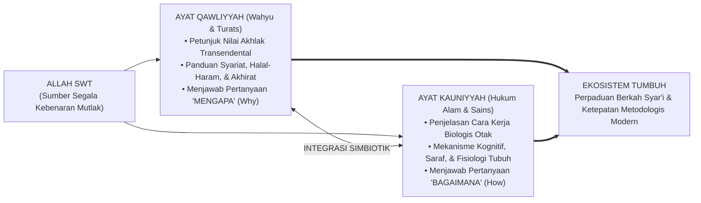
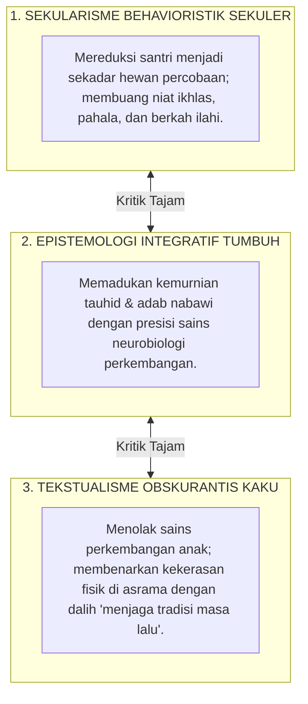

# INTEGRASI AYAT QAWLIYYAH & KAUNIYYAH

---

### 🧭 PETA POSISI PANDUAN DALAM SISTEM TUMBUH (DARI HULU KE HILIR)
* **Posisi Arsitektur**: `HULU EKOSISTEM (Akar Filosofis, Fitrah al-Munazzalah, & Worldview Islam)`
* **Peruntukan Pengguna**: Pimpinan Pesantren, Pengasuh Pondok, Kepala Madrasah, & Dewan Asatidz
* **Fokus Panduan**: Membangun cara pandang pengasuhan berbasis fitrah kesucian dan keteladanan nyata (Qudwah Hasanah), mengeliminasi tradisi kekerasan fisik dan feodalisme asrama.
* **Hasil Akhir yang Dituju**: Terwujudnya santri berkarakter *Insan Adabi* yang mandiri, musyrif yang mengasuh dengan kasih sayang tanpa *burnout*, dan pesantren yang aman berbasis data (*Safe Boarding School*).

---

### 🎯 Mengapa Panduan Ini Ada & Masalah Nyata yang Dipecahkan
1. **Latar Masalah di Lapangan**: Sering kali pengasuhan di pesantren berjalan tanpa SOP yang jelas atau terjebak dalam pola reaktif—menunggu santri berbuat salah baru dihukum dengan emosional.
2. **Solusi Sistem TUMBUH**: Panduan ini memberikan langkah preventif dan terstruktur agar setiap pembiasaan adab berjalan terencana, konsisten, dan terukur.
3. **Sasaran Perubahan**: Memastikan nilai-nilai Islam menyatu dalam perilaku harian santri melalui keteladanan nyata (*Qudwah Hasanah*).

---
### 🎯 Tujuan & Manfaat Panduan
Panduan ini dirancang sebagai petunjuk operasional terapan agar pendidik dan musyrif dapat:
1. Menjalankan pembinaan adab santri dengan pendekatan kasih sayang (*Rahmah*) dan ketegasan yang mendidik (*Firm & Kind*).
2. Menghindari cara-cara kekerasan fisik, bentakan verbal, maupun hukuman yang mempermalukan santri.
3. Menciptakan suasana asrama dan kelas yang aman, tertib, dan menumbuhkan kesadaran diri (*Bi'ah Shalihah*).

---

### 💡 Intisari Cepat (3 Menit Memahami Esensi)
* **Kunci Pengasuhan**: Karakter santri tumbuh melalui keteladanan nyata (*Qudwah Hasanah*), komunikasi empatik, dan pembiasaan terstruktur 24 jam.
* **Tindakan Utama**: Terapkan panduan langkah demi langkah di bawah ini secara konsisten, pantau perkembangan santri secara objektif, dan berikan apresiasi atas setiap perbaikan diri yang mereka capai.
* **Prinsip Disiplin**: Fokus pada pemulihan hubungan dan tanggung jawab nyata (*Restoratif*), bukan sekadar melampiaskan amarah atau menghukum.

---

---

### 💬 ILUSTRASI NYATA & ANALOGI SEDERHANA
Bayangkan sebuah skenario yang sering kita lihat sehari-hari di asrama:
* Ketika seorang santri baru melakukan kekeliruan (misalnya terlambat bangun Subuh atau kasurnya berantakan), respon pertama yang sering muncul adalah bentakan keras atau hukuman fisik (seperti push-up atau jemur di lapangan).
* **Hasilnya?** Santri tersebut mungkin tampak patuh seketika karena takut, tetapi di dalam hatinya tumbuh rasa dongkol, dendam tersembunyi, atau kebiasaan "bersandiwara"—hanya tertib ketika ada pengawas di dekatnya.

Dalam Sistem TUMBUH, kita menggunakan cara yang jauh lebih cerdas, sejuk, dan membumi:
1. **Analogi "Rem dan Pedal Gas Otak"**: Santri usia remaja (usia MTs dan Aliyah) memiliki bagian otak emosi (*Sistem Limbik*) yang sudah menyala sangat kuat seperti *pedal gas mobil sport*, namun otak pengendali logikanya (*Prefrontal Cortex*) masih dalam proses tumbuh seperti *sistem rem yang baru dipasang*. Tugas guru dan musyrif bukan memarahi mobilnya, melainkan menjadi **"Sopir Teladan & Sabuk Pengaman"** yang mendampingi santri belajar menginjak rem dengan bijak.
2. **Kekuatan Contoh Nyata (*Qudwah Hasanah*)**: Santri jauh lebih cepat meniru apa yang mereka **lihat** setiap hari daripada apa yang mereka **dengar** dari ribuan nasihat panjang. Jika musyrif datang tepat waktu, tersenyum ramah, dan kamarnya rapi, santri akan menirunya dengan sukarela.

---

### 🛠️ PANDUAN LANGKAH PRAKTIS LAPANGAN (BISA LANGSUNG DIPRAKTIKKAN HARI INI)

| Tahapan Aksi | Tindakan Nyata Musyrif / Guru di Lapangan | Hal yang Harus Diperhatikan |
| :--- | :--- | :--- |
| **1. Langkah Persiapan (Sebelum Kejadian)** | Sepakati aturan bersama santri di awal pekan dengan kalimat positif (contoh: *"Kamar rapi membuat istirahat kita berkah"*). | Buat poster visual sederhana yang mudah dibaca di dinding kamar. |
| **2. Langkah Respon (Saat Terjadi Masalah)** | Tarik napas, tenangkan diri, ajak santri berbicara empat mata tanpa mempermalukannya di depan teman-temannya. | Gunakan nada bicara yang tenang namun tegas (*Firm & Kind*). |
| **3. Langkah Perbaikan (Tanggung Jawab Nyata)** | Minta santri memperbaiki kesalahannya secara langsung (contoh: merapikan kembali barang yang berantakan atau meminta maaf). | Berikan apresiasi seketika santri telah menuntaskan perbaikannya. |

---

### 🗣️ CONTOH DIALOG LAPANGAN (YANG HARUS DIUCAPKAN VS DIHINDARI)

* ❌ **JANGAN UCAPKAN (Membuat Santri Menutup Diri & Dendam)**:
  > *"Kamu ini pemalas sekali ya, sudah dibilangi berkali-kali masih saja kasur berantakan! Push-up 50 kali sekarang!"*
* ✅ **UCAPKAN INI (Mendidik Tanggung Jawab & Kesadaran Diri)**:
  > *"Akhi, antum tahu kesepakatan kamar kita tentang kerapian tempat tidur setelah Subuh. Coba lihat kasur antum sekarang, apa yang perlu disempurnakan? Mari rapikan bersama sekarang agar kamar kita nyaman dan berkah."*

---

### 📋 3 POIN EMAS RANGKUMAN (UNTUK SANTRI SENIOR & MUSYRIF MUDA)
1. **Didik dengan Kasih Sayang, Tegakkan Batas dengan Adil**: Jangan pernah mencampuradukkan ketegasan aturan dengan pelampiasan amarah pribadi.
2. **Apresiasi 4x Lebih Banyak daripada Teguran (*Magic Ratio 4:1*)**: Jangan hanya bersuara ketika santri berbuat salah. Saat mereka berbuat baik (salat di shaf depan, menolong kawan, membaca Al-Qur'an), segera berikan pujian tulus.
3. **Fokus pada Perbaikan Hubungan (*Restoratif*)**: Masalah perilaku adalah peluang emas untuk mendidik santri menjadi pribadi yang lebih dewasa dan bertanggung jawab.

---

### 📖 Uraian Lengkap Landasan & Rujukan Sistem

---

### Runtuhnya Tembok Pemisah Dua Kitab Allah

Selama berabad-abad lamanya, dunia pendidikan Islam terbelenggu oleh sebuah ilusi perpecahan: **pemisahan kaku antara "Ilmu Agama" di satu sisi dan "Ilmu Sains Modern" di sisi lain**.

Di sebagian pondok pesantren, muncul sikap curiga terhadap penemuan sains kontemporer—seperti psikologi perkembangan atau neurosains otak—karena dianggap berasal dari Barat yang sekuler. Akibatnya, metode pengasuhan santri tetap dipertahankan secara turun-temurun tanpa evaluasi, bahkan Ketika metode tersebut terbukti secara medis merusak saraf otak anak.

Sebaliknya, sains modern sekuler kerap membuang dimensi wahyu dan tauhid, memandang manusia hanya sebagai organisme biologis tanpa jiwa spiritual.

Ekosistem **TUMBUH** meruntuhkan sekat dikotomi semu ini dengan menegaskan sebuah kebenaran fundamental sebagaimana dirumuskan oleh Prof. Syed Muhammad Naquib al-Attas[^2], **Wahyu (*Ayat Qawliyyah*) dan Alam Semesta (*Ayat Kauniyyah*) berasal dari satu Dzat yang sama, yaitu Allah SWT**.

<b>Gambar 3.1.1:</b> Integrasi Epistemologis Dua Jalur Wahyu (Qawliyyah) dan Sains (Kauniyyah) dalam Ekosistem TUMBUH.

---

### Dua Kitab Terbuka: Harmoni Tanpa Kontradiksi

Pakar filsafat Islam klasik seperti **Ibnu Rusyd (Averroes)** dalam karyanya *Fashl al-Maqal fima bayna al-Hikmati wash-Syari'ati min al-Ittishal*[^1] menegaskan bahwa:

$$\text{الْحَقُّ لَا يُضَادُّ الْحَقَّ، بَلْ يُوَافِقُهُ وَيَشْهَدُ لَهُ}$$
*"Kebenaran sejati (Wahyu) tidak akan pernah bertentangan dengan kebenaran nyata (Sains dan Akal Sehat), melainkan keduanya akan saling menguatkan dan saling bersaksi satu sama lain."*

1. **Ayat Qawliyyah (Al-Qur'an, Hadits, & Turats Ulama)**:  
   Memberikan kompas moral, landasan tauhid, dan tujuan akhir kehidupan (*Ghayah al-Wujud*). Wahyu memberi tahu kita **mengapa** adab harus ditegakkan dan **ke mana** jiwa santri harus diarahkan.
2. **Ayat Kauniyyah (Hukum Biologi, Psikologi, & Neurosains)**:  
   Memberikan pemahaman empiris tentang mekanisme biologis tubuh dan otak yang diciptakan Allah. Sains memberi tahu kita **bagaimana** otak santri merespons rasa takut, **bagaimana** memori hafalan terbentuk, dan **bagaimana** kebiasaan adab mendarah daging secara fisik.

Ketika seorang ustadz memahami kedua ayat ini secara terpadu, ia tidak akan lagi mendidik santri dengan emosi buta. Ia menghafal firman Allah tentang kelembutan akhlak, sekaligus memahami bahwa secara biologis, suara bentakan keras membanjiri otak santri dengan racun hormon kortisol yang mematikan nalar.

---

### Kritik atas Dua Ekstrem: Sekularisme Kering vs Tekstualisme Kaku

Epistemologi TUMBUH berdiri kokoh di jalan tengah (*Wasathiyyah*), menolak dua jebakan ekstrem:

<b>Gambar 3.1.2:</b> Posisi Wasathiyyah Epistemologi Integratif TUMBUH di Antara Dua Ekstrem Pendidikan.

* **Kritik atas Sekularisme**: Sains tanpa bimbingan wahyu melahirkan sistem pendidikan yang dingin, mekanis, dan mematikan keikhlasan beramal.
* **Kritik atas Tekstualisme Kaku**: Beragama tanpa memahami sunnatullah biologis anak melahirkan pola asuh yang zalim dan merusak masa depan generasi santri.

---

### Solusi Sistemik TUMBUH: Arsitektur Pedagogi Berbasis Dua Cahaya

Dalam Ekosistem TUMBUH, sains bukanlah "tuan" yang mengatur wahyu, dan wahyu bukanlah "musuh" dari ilmu pengetahuan. Sains adalah alat bantu teknis untuk menjalankan amanah wahyu secara lebih presisi dan penuh kasih sayang.

Setiap SOP pengasuhan di asrama TUMBUH selalu memenuhi dua syarat mutlak:
1. **Shahih secara Syar'i**: Selaras dengan Al-Qur'an, Sunnah Nabawiyyah, dan panduan ulama Turats mu'tabar.
2. **Shahih secara Saintifik**: Terbukti secara neurobiologis tidak merusak kesehatan mental dan perkembangan otak anak.

---

## 📌 Catatan Kaki & Rujukan Primer

[^1]: **Al-Qadhi Abu al-Walid Muhammad Ibnu Rusyd (Averroes)**, *Fashl al-Maqal fima bayna al-Hikmati wash-Syari'ati min al-Ittishal*, Tahqiq: Dr. Muhammad Imarah (Kairo: Dar al-Ma'arif, 1999), hlm. 31–35.
[^2]: **Prof. Dr. Syed Muhammad Naquib al-Attas**, *Prolegomena to the Metaphysics of Islam: An Exposition of the Underlying Foundations of Islam and Modernity* (Kuala Lumpur: ISTAC, 1995), Bab 1: "Islam: The Concept of Religion and the Foundation of Ethics and Morality", hlm. 1–40.
